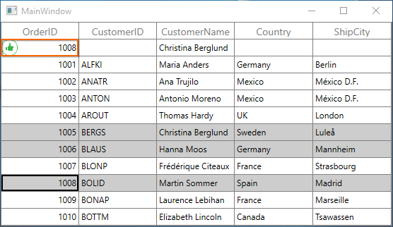
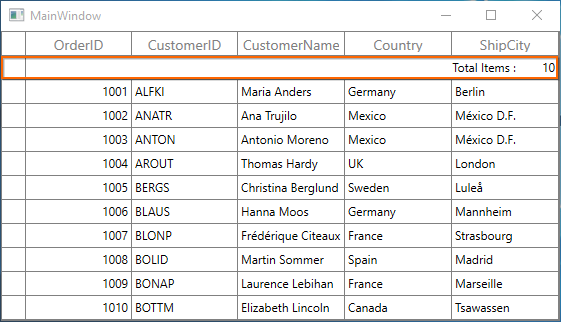
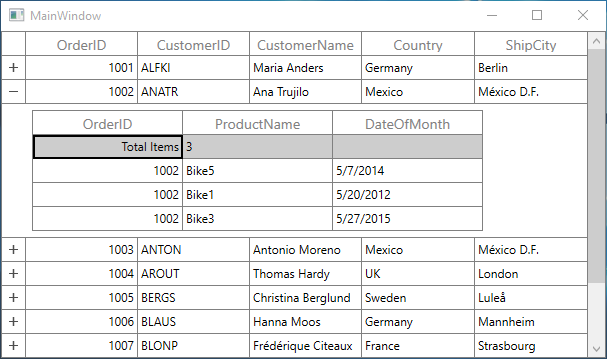

# Unbound Rows in WPF DataGrid (SfDataGrid)

SfDataGrid allows you to add **additional rows** at top and also bottom of the SfDataGrid which are **not bound with data object** from underlying data source. You can add unbound rows using [SfDataGrid.UnBoundRows](https://help.syncfusion.com/cr/wpf/Syncfusion.UI.Xaml.Grid.SfDataGrid.html#Syncfusion_UI_Xaml_Grid_SfDataGrid_UnBoundRows) collection property. You can add any no of unbound rows to SfDataGrid. Unbound rows can be exported and printed.



<syncfusion:SfDataGrid x:Name="dataGrid"  ItemsSource="{Binding Orders}">
    <syncfusion:SfDataGrid.UnBoundRows>
        <syncfusion:GridUnBoundRow  Position="Top"/>
    </syncfusion:SfDataGrid.UnBoundRows>
</syncfusion:SfDataGrid>


this.dataGrid.UnBoundRows.Add(new GridUnBoundRow() {Position = UnBoundRowsPosition.Top});



N> [AllowFrozenGroupHeaders](https://help.syncfusion.com/cr/wpf/Syncfusion.UI.Xaml.Grid.SfDataGrid.html#Syncfusion_UI_Xaml_Grid_SfDataGrid_AllowFrozenGroupHeaders) is not supported with unbound rows.

## Positioning unbound rows

Unbound row can be placed in top or bottom of the SfDataGrid. Unbound row positioned based on [GridUnBoundRow.Position](https://help.syncfusion.com/cr/wpf/Syncfusion.UI.Xaml.Grid.GridUnBoundRow.html#Syncfusion_UI_Xaml_Grid_GridUnBoundRow_Position) and [GridUnBoundRow.ShowBelowSummary](https://help.syncfusion.com/cr/wpf/Syncfusion.UI.Xaml.Grid.GridUnBoundRow.html#Syncfusion_UI_Xaml_Grid_GridUnBoundRow_ShowBelowSummary) properties.

Below table shows the unbound row positioning based on property settings of `Position` and `ShowBelowSummary`.

<table>
<tr>
<th>
UnBoundRowPosition
</th>
<th>
ShowBelowSummary
</th>
<th>
Position in DataGrid
</th>
</tr>
<tr>
<td>
Top
</td>
<td>
True
</td>
<td>
Unbound row placed at top, right above the record rows. In this position, unbound row is selectable and <b>editable</b>. 
</td>
</tr>
<tr>
<td>
Top
</td>
<td>
False
</td>
<td>
Unbound row placed at top, right next to Header row. In this position, unbound row is not selectable, <b>not editable</b> and <b>frozen</b> when scrolling.
</td>
</tr>
<tr>
<td>
Bottom
</td>
<td>
True
</td>
<td>
Unbound row placed at bottom of SfDataGrid. In this position, unbound row is not selectable, <b>not editable</b> and <b>frozen</b> when scrolling.
</td>
</tr>
<tr>
<td>
Bottom
</td>
<td>
False
</td>
<td>
Unbound row placed at bottom, right below record rows. In this position, unbound row is selectable and <b>editable</b>.
</td>
</tr>
</table>

Below screen shot shows different unbound rows placed in all possible positions.

## Populating data for unbound rows

You can populate data for the unbound row by handling [QueryUnBoundRow](https://help.syncfusion.com/cr/wpf/Syncfusion.UI.Xaml.Grid.SfDataGrid.html) event of SfDataGrid. This event occurs for each cell in unbound row whenever the row gets refreshed. 
[GridUnBoundRowEventsArgs](http://help.syncfusion.com/cr/wpf/Syncfusion.UI.Xaml.Grid.GridUnBoundRowEventsArgs.html) of the `QueryUnBoundRow` event provides information about the cell triggered this event. [GridUnBoundRowEventsArgs.OriginalSender](https://help.syncfusion.com/cr/wpf/Syncfusion.UI.Xaml.Grid.GridEventArgs.html#Syncfusion_UI_Xaml_Grid_GridEventArgs_OriginalSender) returns the DataGrid fired this event for DetailsView. 

You can get or set the [GridUnBoundRowEventsArgs.Value](https://help.syncfusion.com/cr/wpf/Syncfusion.UI.Xaml.Grid.GridUnBoundRowEventsArgs.html#Syncfusion_UI_Xaml_Grid_GridUnBoundRowEventsArgs_Value) property based on the [UnBoundAction](https://help.syncfusion.com/cr/wpf/Syncfusion.UI.Xaml.Grid.GridUnBoundRowEventsArgs.html#Syncfusion_UI_Xaml_Grid_GridUnBoundRowEventsArgs_UnBoundAction). If `UnBoundAction` is `QueryData` then you can set the value for display. If the `UnBoundAction` is `CommitData` then you can get the edited value.



<syncfusion:SfDataGrid x:Name="dataGrid" 
                       ItemsSource="{Binding Orders}"                            
                       SelectionMode="Multiple" >                        
    <syncfusion:SfDataGrid.UnBoundRows>
        <syncfusion:GridUnBoundRow  Position="Top"/>
    </syncfusion:SfDataGrid.UnBoundRows>                        
</syncfusion:SfDataGrid>



For example, now unbound row populated based on selected items in SfDataGrid.



this.dataGrid.SelectedItems.Add(collection[4]);
this.dataGrid.SelectedItems.Add(collection[5]);
this.dataGrid.SelectedItems.Add(collection[7]);
dataGrid.QueryUnBoundRow += dataGrid_QueryUnBoundRow;

void dataGrid_QueryUnBoundRow(object sender, GridUnBoundRowEventsArgs e)
{

    if (e.UnBoundAction == UnBoundActions.QueryData)
    {        

        if(e.RowColumnIndex.ColumnIndex == 0)
        {
            e.Value = (dataGrid.SelectedItems.OrderBy(item => (item as OrderInfo).OrderID).Last() as OrderInfo).OrderID;
            e.Handled = true;
        }        

        else if(e.RowColumnIndex.ColumnIndex == 2)
        {
            e.Value = (dataGrid.SelectedItems.First(item => (item as OrderInfo).CustomerName.Contains("g")) as OrderInfo).CustomerName;
            e.Handled = true;
        }
    }
}



## Refreshing the Unbound Rows at runtime

### Add/Remove unbound rows

You can add or remove unbound rows using [SfDataGrid.UnBoundRows](https://help.syncfusion.com/cr/wpf/Syncfusion.UI.Xaml.Grid.SfDataGrid.html#Syncfusion_UI_Xaml_Grid_SfDataGrid_UnBoundRows) property which reflects in UI immediately.
 
### Trigger QueryUnBoundRow event programmatically
 
You can trigger the [QueryUnBoundRow](https://help.syncfusion.com/cr/wpf/Syncfusion.UI.Xaml.Grid.SfDataGrid.html) event for the unbound row cells at runtime by invalidating the unbound row by calling [SfDataGrid.InValidateUnBoundRow](https://help.syncfusion.com/cr/wpf/Syncfusion.UI.Xaml.Grid.SfDataGrid.html#Syncfusion_UI_Xaml_Grid_SfDataGrid_InValidateUnBoundRow_Syncfusion_UI_Xaml_Grid_GridUnBoundRow_System_Boolean_) method and invalidating the [VisualContainer](http://help.syncfusion.com/cr/wpf/Syncfusion.UI.Xaml.Grid.VisualContainer.html) by calling [InvalidateMeasureInfo](https://help.syncfusion.com/cr/wpf/Syncfusion.UI.Xaml.Grid.VisualContainer.html#Syncfusion_UI_Xaml_Grid_VisualContainer_InvalidateMeasureInfo) method.



using Syncfusion.UI.Xaml.Grid.Helpers;
dataGrid.InValidateUnBoundRow(dataGrid.UnBoundRows[0]);    
dataGrid.GetVisualContainer().InvalidateMeasureInfo();



## Editing in unbound rows

### Cancel the editing for unbound row cell

You can cancel the editing of unbound row cell by handling the [SfDataGrid.CurrentCellBeginEdit](https://help.syncfusion.com/cr/wpf/Syncfusion.UI.Xaml.Grid.SfDataGrid.html) event with the help of [SfDataGrid.GetUnBoundRow](https://help.syncfusion.com/cr/wpf/Syncfusion.UI.Xaml.Grid.GridIndexResolver.html#Syncfusion_UI_Xaml_Grid_GridIndexResolver_GetUnBoundRow_Syncfusion_UI_Xaml_Grid_SfDataGrid_System_Int32_) method and row index.



using Syncfusion.UI.Xaml.Grid;
dataGrid.CurrentCellBeginEdit += dataGrid_CurrentCellBeginEdit;

void dataGrid_CurrentCellBeginEdit(object sender, CurrentCellBeginEditEventArgs args)
{            
    var unboundRow = dataGrid.GetUnBoundRow(args.RowColumnIndex.RowIndex);

    if (unboundRow == null)
        return;
    args.Cancel = true;    
}



### Saving edited unbound row cell value to external source

You can get the edited value of unbound row cell from [GridUnBoundRowEventsArgs.Value](https://help.syncfusion.com/cr/wpf/Syncfusion.UI.Xaml.Grid.GridUnBoundRowEventsArgs.html#Syncfusion_UI_Xaml_Grid_GridUnBoundRowEventsArgs_Value) property of [QueryUnBoundRow](https://help.syncfusion.com/cr/wpf/Syncfusion.UI.Xaml.Grid.SfDataGrid.html) event when `UnBoundAction` is `CommitData`.



void dataGrid_QueryUnBoundRow(object sender, GridUnBoundRowEventsArgs e)
{

    if (e.UnBoundAction == UnBoundActions.CommitData)
    {
        var editedValue = e.Value;
    }
}



## Styling in Unbound rows

### Unbound row style

You can customize the style of unbound row by writing style of TargetType [UnBoundRowControl](http://help.syncfusion.com/cr/wpf/Syncfusion.UI.Xaml.Grid.UnBoundRowControl.html) or setting [SfDataGrid.UnBoundRowStyle](https://help.syncfusion.com/cr/wpf/Syncfusion.UI.Xaml.Grid.SfDataGrid.html#Syncfusion_UI_Xaml_Grid_SfDataGrid_UnBoundRowStyle) property.



<Window.Resources>    
            
</Window.Resources>

<syncfusion:SfDataGrid x:Name="dataGrid" 
                       ItemsSource="{Binding Orders}"    
                       SelectionMode="Multiple">            
    <syncfusion:SfDataGrid.UnBoundRows>
        <syncfusion:GridUnBoundRow  Position="Top"/>
    </syncfusion:SfDataGrid.UnBoundRows>                        
</syncfusion:SfDataGrid>



### Unbound row cell’s style

You can customize the style of unbound row cell by writing style of TargetType [GridUnBoundRowCell](http://help.syncfusion.com/cr/wpf/Syncfusion.UI.Xaml.Grid.GridUnBoundRowCell.html) or setting [SfDataGrid.UnBoundRowCellStyle](https://help.syncfusion.com/cr/wpf/Syncfusion.UI.Xaml.Grid.SfDataGrid.html#Syncfusion_UI_Xaml_Grid_SfDataGrid_UnBoundRowCellStyle) property.



<Window.Resources>
    <local:UnboundCellStyleConverter x:Key="unboundRowCellStyleConverter"/>
            
</Window.Resources>

<syncfusion:SfDataGrid x:Name="dataGrid" 
                        ItemsSource="{Binding Orders}"
                        SelectionMode="Multiple">
    <syncfusion:SfDataGrid.UnBoundRows>
        <syncfusion:GridUnBoundRow  Position="Top"/>
    </syncfusion:SfDataGrid.UnBoundRows>                        
</syncfusion:SfDataGrid>


public class UnboundCellStyleConverter : IValueConverter
{

    public object Convert(object value, Type targetType, object parameter, System.Globalization.CultureInfo culture)
    {
        var unboundRowCell = value as GridUnBoundRowCell;

        if (unboundRowCell == null || unboundRowCell.ColumnBase.GridUnBoundRowEventsArgs.Value == null) return null;

        if(unboundRowCell.ColumnBase.GridUnBoundRowEventsArgs.Value.ToString().Contains("g"))
            return new SolidColorBrush(Colors.Red);
                  
        return new SolidColorBrush(Colors.Black);
    }

    public object ConvertBack(object value, Type targetType, object parameter, System.Globalization.CultureInfo culture)
    {
        return value;
    }
}



## Customize the Unbound Row’s behavior

SfDataGrid allows you to customize the operations like key navigation and UI related interactions by overriding the corresponding renderer associated with the unbound row cell.  Each renderer have set of virtual methods for handling the behaviors. Creating new renderers also supported.

Below table lists the available cell types for unbound row and its renderers.

<table>
<tr>
<th>
Cell Type
</th>
<th>
Renderer
</th>
</tr>
<tr>
<td>
UnBoundTemplateColumn
</td>
<td>
{{'[GridUnBoundRowCellTemplateRenderer](http://help.syncfusion.com/cr/wpf/Syncfusion.UI.Xaml.Grid.Cells.GridUnBoundRowCellTemplateRenderer.html)'| markdownify }}
</td>
</tr>
<tr>
<td>
UnBoundTextColumn
</td>
<td>
{{'[GridUnBoundRowCellTextBoxRenderer](http://help.syncfusion.com/cr/wpf/Syncfusion.UI.Xaml.Grid.Cells.GridUnBoundRowCellTextBoxRenderer.html)'| markdownify }}
</td>
</tr>
</table>

The renderer of unbound row cell defined by [GridUnBoundRowEventsArgs.CellType](https://help.syncfusion.com/cr/wpf/Syncfusion.UI.Xaml.Grid.GridUnBoundRowEventsArgs.html#Syncfusion_UI_Xaml_Grid_GridUnBoundRowEventsArgs_CellType) property in the [QueryUnBoundRow](https://help.syncfusion.com/cr/wpf/Syncfusion.UI.Xaml.Grid.SfDataGrid.html) event. If the `GridUnBoundRowEventsArgs.CellType` not defined then the `UnboundTextColumn` set as default cell type of [GridUnBoundRowCell](http://help.syncfusion.com/cr/wpf/Syncfusion.UI.Xaml.Grid.GridUnBoundRowCell.html).
 
If [GridUnBoundRowEventsArgs.CellTemplate](https://help.syncfusion.com/cr/wpf/Syncfusion.UI.Xaml.Grid.GridUnBoundRowEventsArgs.html#Syncfusion_UI_Xaml_Grid_GridUnBoundRowEventsArgs_CellTemplate) and [GridUnBoundRowEventsArgs.EditTemplate](https://help.syncfusion.com/cr/wpf/Syncfusion.UI.Xaml.Grid.GridUnBoundRowEventsArgs.html#Syncfusion_UI_Xaml_Grid_GridUnBoundRowEventsArgs_EditTemplate) properties defined then `UnBoundTemplateColumn` set as cell type of  [GridUnBoundRowCell](http://help.syncfusion.com/cr/wpf/Syncfusion.UI.Xaml.Grid.GridUnBoundRowCell.html).

### Overriding Existing CellType

You can customize the unbound row cell behavior by overriding existing renderer and replace the default one in [SfDataGrid.UnBoundRowCellRenderers](https://help.syncfusion.com/cr/wpf/Syncfusion.UI.Xaml.Grid.SfDataGrid.html#Syncfusion_UI_Xaml_Grid_SfDataGrid_UnBoundRowCellRenderers).

Below [GridUnBoundRowCellTextBoxRenderer](http://help.syncfusion.com/cr/wpf/Syncfusion.UI.Xaml.Grid.Cells.GridUnBoundRowCellTextBoxRenderer.html) is customized to change the foreground.



public  class GridUnBoundRowCellTextBoxRendererExt : GridUnBoundRowCellTextBoxRenderer
{

    public override void OnInitializeDisplayElement(DataColumnBase dataColumn, TextBlock uiElement, object dataContext)
    {
        base.OnInitializeDisplayElement(dataColumn, uiElement, dataContext);            
        var cellValue = dataColumn.GridUnBoundRowEventsArgs != null && dataColumn.GridUnBoundRowEventsArgs.Value != null ? 
            dataColumn.GridUnBoundRowEventsArgs.Value.ToString() : 
            string.Empty;
        uiElement.Text = cellValue;
        uiElement.Foreground = new SolidColorBrush(Colors.Orange);
    }

    public override void OnInitializeEditElement(DataColumnBase dataColumn, TextBox uiElement, object dataContext)
    {
        base.OnInitializeEditElement(dataColumn, uiElement, dataContext);

        var cellValue = (dataColumn.GridUnBoundRowEventsArgs != null && dataColumn.GridUnBoundRowEventsArgs.Value != null) ?
                            dataColumn.GridUnBoundRowEventsArgs.Value.ToString() :
                            string.Empty;

        uiElement.Text = cellValue.ToString();
    }
}



In the below code default renderer replaced using the above custom renderer in [SfDataGrid.UnBoundRowCellRenderers](https://help.syncfusion.com/cr/wpf/Syncfusion.UI.Xaml.Grid.SfDataGrid.html#Syncfusion_UI_Xaml_Grid_SfDataGrid_UnBoundRowCellRenderers).



dataGrid.UnBoundRowCellRenderers.Remove("UnBoundTextColumn");
dataGrid.UnBoundRowCellRenderers.Add("UnBoundTextColumn", new GridUnBoundRowCellTextBoxRendererExt());



### Custom Renderer

You can customize the unbound row cell by creating new renderer, deriving from [GridUnBoundRowCellRenderer](http://help.syncfusion.com/cr/wpf/Syncfusion.UI.Xaml.Grid.Cells.GridUnBoundRowCellRenderer%602.html) and setting the [GridUnBoundRowEventsArgs.CellType](https://help.syncfusion.com/cr/wpf/Syncfusion.UI.Xaml.Grid.GridUnBoundRowEventsArgs.html#Syncfusion_UI_Xaml_Grid_GridUnBoundRowEventsArgs_CellType) property.

Below code creates `DatePickerRenderer` to load the [DatePicker](https://msdn.microsoft.com/en-in/library/system.windows.controls.datepicker.aspx) as editor element in the first cell of unbound row.



public class DatePickerRenderer : GridUnBoundRowCellRenderer<TextBlock, DatePicker>
{
    /// 

    /// Constructor of the renderer.
    /// 

 
    public DatePickerRenderer()
    {

    }

    /// 

    /// Display element creation.
    /// 

    /// <returns></returns>
 
    protected override TextBlock OnCreateDisplayUIElement()
    {
        return new TextBlock();
    }

    /// 

    /// Edit Element creation.
    /// 

    /// <returns></returns>

    protected override DatePicker OnCreateEditUIElement()
    {
        return new DatePicker();
    }

    /// 

    /// Initialize the value for display element.
    /// 

    /// <param name="dataColumn"></param>
    /// <param name="uiElement"></param>
    /// <param name="dataContext"></param>

    public override void OnInitializeDisplayElement(DataColumnBase dataColumn, TextBlock uiElement, object dataContext)
    {
        uiElement.Text = dataColumn.GridUnBoundRowEventsArgs.Value.ToString();
    }

    /// 

    /// Updates the value for display element.
    /// 

    /// <param name="dataColumn"></param>
    /// <param name="uiElement"></param>
    /// <param name="dataContext"></param>

    public override void OnUpdateDisplayBinding(DataColumnBase dataColumn, TextBlock uiElement, object dataContext)
    {
        uiElement.Text = dataColumn.GridUnBoundRowEventsArgs.Value.ToString();        
    }

     #region Edit Element

    /// 

    /// Initialize the value for edit element.
    /// 

    /// <param name="dataColumn"></param>
    /// <param name="uiElement"></param>
    /// <param name="dataContext"></param>
 
    public override void OnInitializeEditElement(DataColumnBase dataColumn, DatePicker uiElement, object dataContext)
    {
        uiElement.SelectedDate = (DateTime?)dataColumn.GridUnBoundRowEventsArgs.Value;
        uiElement.Tag = dataColumn;
    }

    /// 

    /// Updates the value for edit element.
    /// 

    /// <param name="dataColumn"></param>
    /// <param name="element"></param>
    /// <param name="dataContext"></param>
 
    public override void OnUpdateEditBinding(DataColumnBase dataColumn, DatePicker element, object dataContext)
    {
        element.SelectedDate = (DateTime?)dataColumn.GridUnBoundRowEventsArgs.Value;             
        element.Tag = dataColumn;
    }

    /// 

    /// Method to wire the Selection Changed event
    /// 

    /// <param name="uiElement"></param>
 
    protected override void OnWireEditUIElement(DatePicker uiElement)
    {
        base.OnWireEditUIElement(uiElement);
        uiElement.SelectedDateChanged += uiElement_SelectedDateChanged;
    }

    /// 

    /// Method to un wire the Selection Changed event.
    /// 

    /// <param name="uiElement"></param>

    protected override void OnUnwireEditUIElement(DatePicker uiElement)
    {
        base.OnUnwireEditUIElement(uiElement);
        uiElement.SelectedDateChanged -= uiElement_SelectedDateChanged;
    }

    /// 

    /// Method to raise the CurrentCellValueChangedEvent.
    /// 

    /// <param name="sender"></param>
    /// <param name="e"></param>
  
    public void uiElement_SelectedDateChanged(object sender, System.Windows.Controls.SelectionChangedEventArgs e)
    {
        var datePicker = sender as DatePicker;
   
        if (datePicker.Tag is DataColumn)
        {
            var dataColumn = datePicker.Tag as DataColumn;
            dataColumn.GridUnBoundRowEventsArgs.Value = (sender as DatePicker).SelectedDate;
            DataGrid.RaiseQueryUnBoundRow(dataColumn.GridUnBoundRowEventsArgs.GridUnboundRow, UnBoundActions.CommitData, dataColumn.GridUnBoundRowEventsArgs.Value, dataColumn.GridColumn, dataColumn.GridUnBoundRowEventsArgs.CellType, new Syncfusion.UI.Xaml.ScrollAxis.RowColumnIndex(dataColumn.RowIndex, dataColumn.ColumnIndex));
        }
    }
    #endregion

    #region Update

    /// 

    /// Update display value and raise event
    /// 

    /// <param name="dataColumn"></param>
    /// <param name="currentRendererElement"></param>

    protected override void OnEditingComplete(DataColumnBase dataColumn, FrameworkElement currentRendererElement)
    {
        dataColumn.GridUnBoundRowEventsArgs.Value = (currentRendererElement as DatePicker).Text;
        DataGrid.RaiseQueryUnBoundRow(dataColumn.GridUnBoundRowEventsArgs.GridUnboundRow, UnBoundActions.CommitData, dataColumn.GridUnBoundRowEventsArgs.Value, dataColumn.GridColumn, dataColumn.GridUnBoundRowEventsArgs.CellType, new Syncfusion.UI.Xaml.ScrollAxis.RowColumnIndex(dataColumn.RowIndex, dataColumn.ColumnIndex));
    }    
    #endregion
}



In the below code newly created renderer added in [SfDataGrid.UnBoundRowCellRenderers](https://help.syncfusion.com/cr/wpf/Syncfusion.UI.Xaml.Grid.SfDataGrid.html#Syncfusion_UI_Xaml_Grid_SfDataGrid_UnBoundRowCellRenderers).



dataGrid.UnBoundRowCellRenderers.Add("DatePickerRenderer", new DatePickerRenderer());



Below code sets the [CellType](https://help.syncfusion.com/cr/wpf/Syncfusion.UI.Xaml.Grid.GridUnBoundRowEventsArgs.html#Syncfusion_UI_Xaml_Grid_GridUnBoundRowEventsArgs_CellType) as `DatePickerRenderer`.



void dataGrid_QueryUnBoundRow(object sender, GridUnBoundRowEventsArgs e)
{

    if (e.UnBoundAction == UnBoundActions.QueryData)
    {        

        if(e.RowColumnIndex.ColumnIndex == 0)
        {
            e.CellType = "DatePickerRenderer";                        
            e.Value =  DateTime.Now;
            e.Handled = true;
        }        

        else if(e.RowColumnIndex.ColumnIndex == 2)
        {
            e.Value = (dataGrid.SelectedItems.First(item => (item as OrderInfo).CustomerName.Contains("g")) as OrderInfo).CustomerName;
            e.Handled = true;
        }
    }
    
    if (e.UnBoundAction == UnBoundActions.CommitData)
        date = (DateTime)e.Value;
}



## Templating unbound row cells

You can customize the unbound row cells using [GridUnBoundRowEventsArgs.CellTemplate](https://help.syncfusion.com/cr/wpf/Syncfusion.UI.Xaml.Grid.GridUnBoundRowEventsArgs.html#Syncfusion_UI_Xaml_Grid_GridUnBoundRowEventsArgs_CellTemplate) property.



<DataTemplate x:Key="UnBoundRowCellTemplate">
    <Grid>
        <Grid.ColumnDefinitions>
            <ColumnDefinition Width="*"/>
            <ColumnDefinition Width="*"/>
        </Grid.ColumnDefinitions>
        <TextBlock Text="{Binding Path=.}" 
                   Grid.Column="1" Margin="0,0,3,0" 
                   TextWrapping="Wrap"  
                   VerticalAlignment="Center"  
                   HorizontalAlignment="Right" />
        <Image Source="\Images\thumb_yes.png" HorizontalAlignment="Left"/>
    </Grid>
</DataTemplate>


 



void dataGrid_QueryUnBoundRow(object sender, GridUnBoundRowEventsArgs e)
{
 
    if (e.UnBoundAction == UnBoundActions.QueryData)
    {        
 
        if(e.RowColumnIndex.ColumnIndex == 0)
        {
            e.CellType = "UnBoundTemplateColumn";
            e.CellTemplate = App.Current.Resources["UnBoundRowCellTemplate"] as DataTemplate;
            e.Value = (dataGrid.SelectedItems.OrderBy(item => (item as OrderInfo).OrderID).Last() as OrderInfo).OrderID;
            e.Handled = true;
        }        
 
        else if(e.RowColumnIndex.ColumnIndex == 2)
        {
            e.Value = (dataGrid.SelectedItems.First(item => (item as OrderInfo).CustomerName.Contains("g")) as OrderInfo).CustomerName;
            e.Handled = true;
        }
    }
}



## Changing unbound row height

You can change the height of unbound row using [SfDataGrid.QueryRowHeight](https://help.syncfusion.com/cr/wpf/Syncfusion.UI.Xaml.Grid.SfDataGrid.html) event.



using Syncfusion.UI.Xaml.Grid;
dataGrid.QueryRowHeight += dataGrid_QueryRowHeight;        

void dataGrid_QueryRowHeight(object sender, QueryRowHeightEventArgs e)
{

    if(dataGrid.IsUnBoundRow(e.RowIndex))
    {
        e.Height = 40;
        e.Handled = true;
    }
}



## Exporting Unbound rows

### Export unbound rows to Excel

You can export the unbound rows to excel by setting the [ExcelExportingOptions.ExportUnBoundRows](https://help.syncfusion.com/cr/wpf/Syncfusion.UI.Xaml.Grid.Converter.ExcelExportingOptions.html#Syncfusion_UI_Xaml_Grid_Converter_ExcelExportingOptions_ExportUnBoundRows) property.



ExcelExportingOptions excelExportingOption = new ExcelExportingOptions();
excelExportingOption.ExportUnBoundRows = true;



### Export unbound rows to PDF

You can export the unbound rows to PDF by setting the [PdfExportingOptions.ExportUnBoundRows](https://help.syncfusion.com/cr/wpf/Syncfusion.UI.Xaml.Grid.Converter.PdfExportingOptions.html#Syncfusion_UI_Xaml_Grid_Converter_PdfExportingOptions_ExportUnBoundRows) property.



PdfExportingOptions pdfExportingOption = new PdfExportingOptions();
pdfExportingOption.ExportUnBoundRows = true;



## Get unbound rows

You can get the unbound row of specified row index using [GetUnBoundRow](https://help.syncfusion.com/cr/wpf/Syncfusion.UI.Xaml.Grid.GridIndexResolver.html#Syncfusion_UI_Xaml_Grid_GridIndexResolver_GetUnBoundRow_Syncfusion_UI_Xaml_Grid_SfDataGrid_System_Int32_) method.



using Syncfusion.UI.Xaml.Grid;
var unboundRow = dataGrid.GetUnBoundRow(1);



## Merging with Unbound rows

You can merge the unbound row cell by setting the Left, Right, Top and Bottom properties of [CoveredCellInfo](http://help.syncfusion.com/cr/wpf/Syncfusion.UI.Xaml.Grid.CoveredCellInfo.html) with the help of [GetUnBoundRow](https://help.syncfusion.com/cr/wpf/Syncfusion.UI.Xaml.Grid.GridIndexResolver.html#Syncfusion_UI_Xaml_Grid_GridIndexResolver_GetUnBoundRow_Syncfusion_UI_Xaml_Grid_SfDataGrid_System_Int32_) method and RowIndex.



using Syncfusion.UI.Xaml.Grid;
dataGrid.QueryCoveredRange += dataGrid_QueryCoveredRange;

void dataGrid_QueryCoveredRange(object sender, GridQueryCoveredRangeEventArgs e)
{
    var unboundRow = this.dataGrid.GetUnBoundRow(e.RowColumnIndex.RowIndex);

    if(unboundRow == null)
        return;            
           
    if(e.RowColumnIndex.ColumnIndex == 1)
    {
        e.Range = new CoveredCellInfo(e.RowColumnIndex.ColumnIndex, (e.OriginalSender as SfDataGrid).Columns.Count, e.RowColumnIndex.RowIndex, e.RowColumnIndex.RowIndex);
        e.Handled = true;
    } 
}   



## Unbound row for Master-details view
Master-details view also allows you to add [additional rows](#_Unbound_Rows) to [ViewDefinition.DataGrid](https://help.syncfusion.com/cr/wpf/Syncfusion.UI.Xaml.Grid.GridViewDefinition.html#Syncfusion_UI_Xaml_Grid_GridViewDefinition_DataGrid) which are **not bound with data object** from underlying data source. 

You can get the DetailsViewDataGrid using [GridUnBoundRowEventsArgs.OriginalSender](https://help.syncfusion.com/cr/wpf/Syncfusion.UI.Xaml.Grid.GridEventArgs.html#Syncfusion_UI_Xaml_Grid_GridEventArgs_OriginalSender) of the [QueryUnBoundRow](https://help.syncfusion.com/cr/wpf/Syncfusion.UI.Xaml.Grid.SfDataGrid.html) event, which fired the event and rendered in UI.



<syncfusion:SfDataGrid x:Name="dataGrid"                                  
                       NavigationMode="Cell"
                       AutoGenerateColumns="True"                              
                       ItemsSource="{Binding Orders}">
    <syncfusion:SfDataGrid.DetailsViewDefinition>
        <syncfusion:GridViewDefinition RelationalColumn="ProductDetails">
            <syncfusion:GridViewDefinition.DataGrid>
                <syncfusion:SfDataGrid x:Name="FirstLevelNestedGrid"                                                                                                                                                                                
                                       AutoGenerateColumns="True">                                                                                  
                    <syncfusion:SfDataGrid.UnBoundRows>
                        <syncfusion:GridUnBoundRow Position="Top" 
                                                   ShowBelowSummary="True"/>
                    </syncfusion:SfDataGrid.UnBoundRows>
                </syncfusion:SfDataGrid>
            </syncfusion:GridViewDefinition.DataGrid>
        </syncfusion:GridViewDefinition>
    </syncfusion:SfDataGrid.DetailsViewDefinition>
</syncfusion:SfDataGrid>





this.FirstLevelNestedGrid.QueryUnBoundRow += FirstLevelNestedGrid_QueryUnBoundRow;

void FirstLevelNestedGrid_QueryUnBoundRow(object sender, GridUnBoundRowEventsArgs e)
{

    if (e.UnBoundAction == UnBoundActions.QueryData)
    {

        if (e.RowColumnIndex.ColumnIndex == 0)
        {
            e.Value = "Total Items";
            e.Handled = true;
        }

        else if(e.RowColumnIndex.ColumnIndex == 1)
        {
            e.Value = (e.OriginalSender as SfDataGrid).View.Records.Count();
            e.Handled = true;
        }
    }
}



