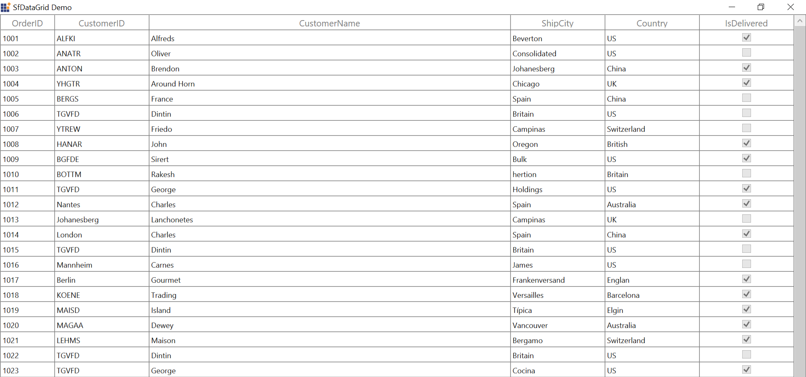

# AutoSize Columns in WPF DataGrid (SfDataGrid)

DataGrid allows you to set the column widths based on certain logic using [SfDataGrid.ColumnSizer](https://help.syncfusion.com/cr/wpf/Syncfusion.UI.Xaml.Grid.SfDataGrid.html#Syncfusion_UI_Xaml_Grid_SfDataGrid_ColumnSizer) or [GridColumn.ColumnSizer](https://help.syncfusion.com/cr/wpf/Syncfusion.UI.Xaml.Grid.GridColumn.html#Syncfusion_UI_Xaml_Grid_GridColumn_ColumnSizer) property. Below is the list of predefined column sizing options available.

<table>
<tr>
<th>
Type
</th>
<th>
Column width
</th>
</tr>
<tr>
<td>
<code>Star</code>
</td>
<td>
Divides the total width equally for columns. 
</td>
</tr>
<tr>
<td>
<code>Auto</code>
</td>
<td>
Calculates the width of column based on header and cell contents. So that header and cell content’s are not truncated.  
</td>
</tr>
<tr>
<td>
<code>AutoWithLastColumnFill</code>
</td>
<td>
Applies <code>GridLengthUnitType.Auto</code> width to all the columns except last column which is visible and the remaining width from total width of SfDataGird is set to last column.
</td>
</tr>
<tr>
<td>
<code>AutoLastColumnFill</code>
</td>
<td>
Applies <code>GridLengthUnitType.Auto</code> width to all the columns except last column which is visible and sets the maximum between last column auto spacing width and remaining width to last column.
</td>
</tr>
<tr>
<td>
<code>SizeToCells</code>
</td>
<td>
Calculates the width of column based on cell contents. So that cell content’s are not truncated.  
</td>
</tr>
<tr>
<td>
<code>SizeToHeader</code>
</td>
<td>
Calculates the width of column based on header content. So that header content is not truncated.  
</td>
</tr>
<tr>
<td>
<code>None</code>
</td>
<td>
Default column width or defined width set to column.
</td>
</tr>
</table>

N> ColumnSizer will not work when the column width defined explicitly. ColumnSizer calculates column width based on `MinWidth` and `MaxWidth` properties.

Below code, applies `GridLengthUnitType.Star` to equally set width for `SfDataGrid.Columns`.



<syncfusion:SfDataGrid  x:Name="dataGrid"
                        AutoGenerateColumns="True"
                        ColumnSizer="Star"
                        ItemsSource="{Binding Orders}" />



N> The `GridColumn.ColumnSizer` takes higher priority than the `SfDataGrid.ColumnSizer`.

## Fill remaining width for any column instead of last column when ColumnSizer is AutoLastColumnFill or AutoWithLastColumnFill 

In SfDataGrid while setting `SfDataGrid.ColumnSizer` as `AutoLastColumnFill` or `AutoWithLastColumnFill` remaining width is applied to last column. You can apply the remaining width to specific column by setting [GridColumn.ColumnSizer](https://help.syncfusion.com/cr/wpf/Syncfusion.UI.Xaml.Grid.GridColumn.html#Syncfusion_UI_Xaml_Grid_GridColumn_ColumnSizer) property as like below.



<Syncfusion:SfDataGrid x:Name="datagrid"                                      
                       ColumnSizer="AutoWithLastColumnFill"
                       ItemsSource="{Binding OrderInfoCollection }">
            <Syncfusion:SfDataGrid.Columns>
                <Syncfusion:GridTextColumn MappingName="OrderID" HeaderText="OrderID" ColumnSizer="AutoLastColumnFill"/>
                <Syncfusion:GridTextColumn MappingName="CustomerID" HeaderText="CustomerID" />
                <Syncfusion:GridTextColumn MappingName="CustomerName" HeaderText="CustomerName"/>
                <Syncfusion:GridTextColumn MappingName="Country" HeaderText="Country"/>
                <Syncfusion:GridTextColumn MappingName="ShipCity" HeaderText="ShipCity"/>
            </Syncfusion:SfDataGrid.Columns>
</Syncfusion:SfDataGrid>


this.datagrid.ColumnSizer = GridLengthUnitType.AutoLastColumnFill;
this.datagrid.Columns["OrderID"].ColumnSizer = GridLengthUnitType.AutoWithLastColumnFill;



## Refreshing autosize calculation at runtime

You can refresh the autosize calculation at runtime by calling [SfDataGrid.GridColumnSizer.Refresh](https://help.syncfusion.com/cr/wpf/Syncfusion.UI.Xaml.Grid.GridColumnSizer.html#Syncfusion_UI_Xaml_Grid_GridColumnSizer_Refresh().html) method.
DataGrid support to recalculates the column auto width by calling reset methods of `GridColumnSizer`. [GridColumnSizer.ResetAutoCalculationforAllColumns](https://help.syncfusion.com/cr/wpf/Syncfusion.UI.Xaml.Grid.ColumnSizerBase-1.html#Syncfusion_UI_Xaml_Grid_ColumnSizerBase_1_ResetAutoCalculationforAllColumns) method reset widths to all columns. [GridColumnSizer.ResetAutoCalculation](https://help.syncfusion.com/cr/wpf/Syncfusion.UI.Xaml.Grid.ColumnSizerBase-1.html#Syncfusion_UI_Xaml_Grid_ColumnSizerBase_1_ResetAutoCalculation_Syncfusion_UI_Xaml_Grid_GridColumnBase_) method reset the width to particular column.

N> The `GridColumnSizer.ResetAutoCalculationforAllColumns` or `GridColumnSizer.ResetAutoCalculation` methods applicable for Auto, AutoWithLastColumnFill, AutoLastColumnFill, SizeToCells types.

For example, you can refresh all the column’s width based on the cell contents of newly added records at runtime. 



var viewModel = this.dataGrid.DataContext as ViewModel;
viewModel.Orders.Add(new OrderInfo(11, "BLFKI", "Maria Joseph Anders"));

this.dataGrid.GridColumnSizer.ResetAutoCalculationforAllColumns();
this.dataGrid.GridColumnSizer.Refresh();             



## Resetting column width to apply autosize calculation

When the width of the column is explicitly defined or column is resized, then column width is not changed based on `GridColumnSizer`. You can reset [GridColumn.Width](https://help.syncfusion.com/cr/wpf/Syncfusion.UI.Xaml.Grid.GridColumnBase.html#Syncfusion_UI_Xaml_Grid_GridColumnBase_Width) by setting `double.NaN` to apply column width based on column sizer.



foreach (var column in dataGrid.Columns)
{

    if (!double.IsNaN(column.Width))
        column.Width = double.NaN;
}
this.dataGrid.GridColumnSizer.Refresh();             



## Customizing built-in column auto-sizing logic

SfDataGrid process column sizing operations in [GridColumnSizer](http://help.syncfusion.com/cr/wpf/Syncfusion.UI.Xaml.Grid.GridColumnSizer.html) class. You can customize the column sizing operations by overriding `GridColumnSizer` and set it to `SfDataGrid.GridColumnSizer`.



this.dataGrid.GridColumnSizer = new GridColumnSizerExt(dataGrid);

public class GridColumnSizerExt:GridColumnSizer
{

    public GridColumnSizerExt(SfDataGrid dataGrid)
        :base(dataGrid)
    {

    }        

    // Calculate Width for column when ColumnSizer is SizeToCells.        

    protected override double CalculateCellWidth(GridColumn column, bool setWidth = true)
    {
        return base.CalculateCellWidth(column, setWidth);
    }

    //Calculate Width for the column when ColumnSizer is SizeToHeader

    protected override double CalculateHeaderWidth(GridColumn column, bool setWidth = true)
    {
        return base.CalculateHeaderWidth(column, setWidth);
    }
}



## Auto width calculation based on font settings

By default, the ColumnSizer calculates column’s width based on fixed `FontSize`, `FontFamily`, `Margin`,`SortIconWidth`, `FilterIconWidth`. You can change the calculation by customized settings.

### Changing Sort and Filter Icon width

You can change the filter icon and sort icon widths for column width calculation by setting [GridColumnSizer.SortIconWidth](https://help.syncfusion.com/cr/wpf/Syncfusion.UI.Xaml.Grid.ColumnSizerBase-1.html#Syncfusion_UI_Xaml_Grid_ColumnSizerBase_1_SortIconWidth) and [GridColumnSizer.FilterIconWidth](https://help.syncfusion.com/cr/wpf/Syncfusion.UI.Xaml.Grid.GridColumnSizer.html#Syncfusion_UI_Xaml_Grid_GridColumnSizer_FilterIconWidth) properties.



dataGrid.GridColumnSizer.SortIconWidth = 20;
dataGrid.GridColumnSizer.FilterIconWidth = 20;



### Changing Font settings for DataGrid

You can change the `font settings` for column width calculation by setting [GridColumnSizer.FontSize](https://help.syncfusion.com/cr/wpf/Syncfusion.UI.Xaml.Grid.ColumnSizerBase-1.html#Syncfusion_UI_Xaml_Grid_ColumnSizerBase_1_FontSize), [GridColumnSizer.FontFamily](https://help.syncfusion.com/cr/wpf/Syncfusion.UI.Xaml.Grid.ColumnSizerBase-1.html#Syncfusion_UI_Xaml_Grid_ColumnSizerBase_1_FontFamily) and [GridColumnSizer.Margin](https://help.syncfusion.com/cr/wpf/Syncfusion.UI.Xaml.Grid.ColumnSizerBase-1.html#Syncfusion_UI_Xaml_Grid_ColumnSizerBase_1_Margin) properties.  This settings will be considered for all columns.



this.dataGrid.GridColumnSizer.FontSize = 10.0;
this.dataGrid.GridColumnSizer.FontFamily = new FontFamily("TimesNewRoman");
this.dataGrid.GridColumnSizer.Margin = new Thickness(9, 3, 1, 3);



### Changing Font settings for one Column

You can change the `font setting` for one column width calculation using [GridColumnSizer.SetFontFamily](https://help.syncfusion.com/cr/wpf/Syncfusion.UI.Xaml.Grid.ColumnSizerBase-1.html#Syncfusion_UI_Xaml_Grid_ColumnSizerBase_1_SetFontFamily_Syncfusion_UI_Xaml_Grid_GridColumnBase_System_Windows_Media_FontFamily_), [GridColumnSizer.SetFontSize](https://help.syncfusion.com/cr/wpf/Syncfusion.UI.Xaml.Grid.ColumnSizerBase-1.html#Syncfusion_UI_Xaml_Grid_ColumnSizerBase_1_SetFontSize_Syncfusion_UI_Xaml_Grid_GridColumnBase_System_Double_) and [GridColumnSizer.SetMargin](https://help.syncfusion.com/cr/wpf/Syncfusion.UI.Xaml.Grid.ColumnSizerBase-1.html#Syncfusion_UI_Xaml_Grid_ColumnSizerBase_1_SetMargin_Syncfusion_UI_Xaml_Grid_GridColumnBase_System_Windows_Thickness_) static methods of `GridColumnSizer` to `GridColumn`. 



var gridColumn = this.dataGrid.Columns[0];
GridColumnSizer.SetFontFamily(gridColumn, new FontFamily("TimesNewRoman"));
GridColumnSizer.SetFontSize(gridColumn, 10.0);
GridColumnSizer.SetMargin(gridColumn, new Thickness(9, 3, 1, 3));



You can also change the `font setting` for one column width calculation using [GetFormattedText](https://help.syncfusion.com/cr/wpf/Syncfusion.UI.Xaml.Grid.GridColumnSizer.html#Syncfusion_UI_Xaml_Grid_GridColumnSizer_GetFormattedText_Syncfusion_UI_Xaml_Grid_GridColumn_System_Object_System_String_) method.



this.dataGrid.GridColumnSizer = new ColumnSizerExt(this.dataGrid);

public class ColumnSizerExt : GridColumnSizer
{
    public ColumnSizerExt(SfDataGrid grid) : base(grid)
    {
    }

    protected override FormattedText GetFormattedText(GridColumn column, object record, string displayText)
    {
        var formattedText = base.GetFormattedText(column, record, displayText);

        if (column.MappingName.Equals("OrderID"))
        {            
            formattedText.SetFontFamily(new FontFamily("TimesNewRoman"));
            formattedText.SetFontSize(10);
        }
        return formattedText;
    }
}



## Star column sizer ratio support

You can customize the `ColumnSizer.Star` width calculation logic by overriding [SetStarWidth](https://help.syncfusion.com/cr/wpf/Syncfusion.UI.Xaml.Grid.GridColumnSizer.html#Syncfusion_UI_Xaml_Grid_GridColumnSizer_SetStarWidth_System_Double_System_Collections_Generic_IEnumerable_Syncfusion_UI_Xaml_Grid_GridColumn__) method of [GridColumnSizer](http://help.syncfusion.com/cr/wpf/Syncfusion.UI.Xaml.Grid.GridColumnSizer.html).

For example, you can calculate the column width, with specified ratios instead of dividing equal width for all columns in Star calculation using `ColumnRatio` attached property.



public static class StarRatio
{

    public static int GetColumnRatio(DependencyObject obj)
    {
        return (int)obj.GetValue(ColumnRatioProperty);
    }

    public static void SetColumnRatio(DependencyObject obj, int value)
    {
        obj.SetValue(ColumnRatioProperty, value);
    }

    public static readonly DependencyProperty ColumnRatioProperty = DependencyProperty.RegisterAttached("ColumnRatio", typeof(int), typeof(StarRatio), new PropertyMetadata(1, null));
}



Below code to define the star width calculation based on the `ColumnRatio`.



//Assign the customized GridColumnSizerExt to SfDataGrid.GridColumnSizer
this.dataGrid.GridColumnSizer = new GridColumnSizerExt(dataGrid);

public class GridColumnSizerExt : GridColumnSizer
{

    public GridColumnSizerExt(SfDataGrid grid)
        : base(grid)
    {

    }

    protected override void SetStarWidth(double remainingColumnWidth, IEnumerable<GridColumn> remainingColumns)
    {
        var removedColumn = new List<GridColumn>();
        var columns = remainingColumns.ToList();
        var totalRemainingStarValue = remainingColumnWidth;
        double removedWidth = 0;
        bool isRemoved;

        while (columns.Count > 0)
        {
            isRemoved = false;
            removedWidth = 0;
            var columnsCount = 0;

            columns.ForEach((col) =>
            {
                columnsCount += StarRatio.GetColumnRatio(col);
            });

            double starWidth = Math.Floor((totalRemainingStarValue / columnsCount));
            var column = columns.First();
            starWidth *= StarRatio.GetColumnRatio(column);
            double computedWidth = SetColumnWidth(column, starWidth);

            if (starWidth != computedWidth && starWidth > 0)
            {
                isRemoved = true;
                columns.Remove(column);

                foreach (var remColumn in removedColumn)
                {

                    if (!columns.Contains(remColumn))
                    {
                        removedWidth += remColumn.ActualWidth;
                        columns.Add(remColumn);
                    }
                }
                removedColumn.Clear();
                totalRemainingStarValue += removedWidth;
            }

            totalRemainingStarValue = totalRemainingStarValue - computedWidth;

            if (!isRemoved)
            {
                columns.Remove(column);

                if (!removedColumn.Contains(column))
                    removedColumn.Add(column);
            }
        }
    }
}}



Below code uses the `ColumnRatio` to apply the defined star width for each column.



<syncfusion:SfDataGrid x:Name="dataGrid"
                       ItemsSource="{Binding Orders}"  
                       ColumnSizer="Star"
                       AutoGenerateColumns="False">
  <syncfusion:SfDataGrid.Columns>;
        <syncfusion:GridTextColumn  HeaderText="Order ID"
                                    MappingName="OrderID"
                                    local:StarRatio.ColumnRatio="1" />
        <syncfusion:GridTextColumn  HeaderText="Customer ID"
                                    MappingName="CustomerID"
                                    local:StarRatio.ColumnRatio="2" />
        <syncfusion:GridTextColumn  HeaderText="Customer Name"
                                    MappingName="CustomerName"
                                    local:StarRatio.ColumnRatio="3" />
   </syncfusion:SfDataGrid.Columns>
</syncfusion:SfDataGrid>



## Change the width of DataGrid ComboBoxColumn based on it’s ItemsSource

By default, the `ColumnSizer` calculates auto width based on the column content. You can change the auto width calculation for [GridComboBoxColumn](http://help.syncfusion.com/cr/wpf/Syncfusion.UI.Xaml.Grid.GridComboBoxColumn.html) based on its items source by overriding the [CalculateCellWidth](https://help.syncfusion.com/cr/wpf/Syncfusion.UI.Xaml.Grid.GridColumnSizer.html#Syncfusion_UI_Xaml_Grid_GridColumnSizer_CalculateCellWidth_Syncfusion_UI_Xaml_Grid_GridColumn_System_Boolean_) virtual method.

Below code creates `CustomColumnSizer` to change the width of `GridComboboxColumn` and set to `SfDataGrid.GridColumnSizer`.



this.dataGrid.GridColumnSizer = new CustomColumnSizer(this.dataGrid);

public class CustomColumnSizer:GridColumnSizer
{

    public CustomColumnSizer(SfDataGrid grid)
        : base(grid)
    {
    }
       
    protected override double CalculateCellWidth(GridColumn column, bool setWidth = true)
    {            

        if (column is GridComboBoxColumn)
        {                                
            double colWidth = double.MaxValue;                               
            var source = (column as GridComboBoxColumn).ItemsSource;                
            string maximumComboItemsText = string.Empty;                
            var clientSize = new Size(colWidth, DataGrid.RowHeight);                

            foreach (var comboItems in source)
           {
                string comboItemText = (string)comboItems;

                if (maximumComboItemsText.Length < comboItemText.Length)
                    maximumComboItemsText = comboItemText;                   
            }                
            var measureSize= MeasureText(clientSize,maximumComboItemsText,column,null,GridQueryBounds.Width);
            return measureSize.Width + SystemParameters.ScrollWidth;
        }                

        else
            return base.CalculateCellWidth(column, setWidth);
    }      
}      


