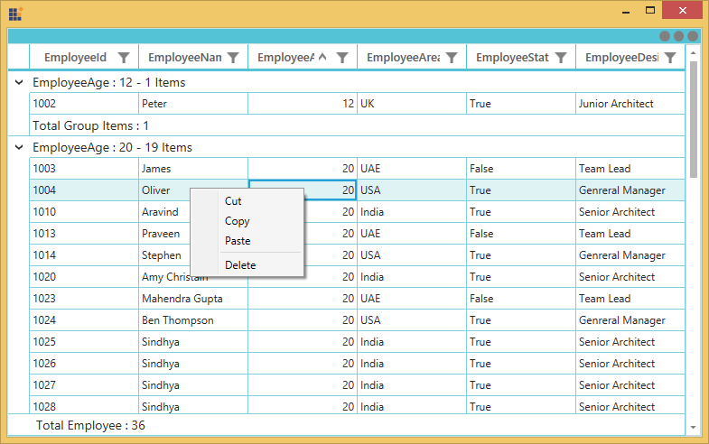
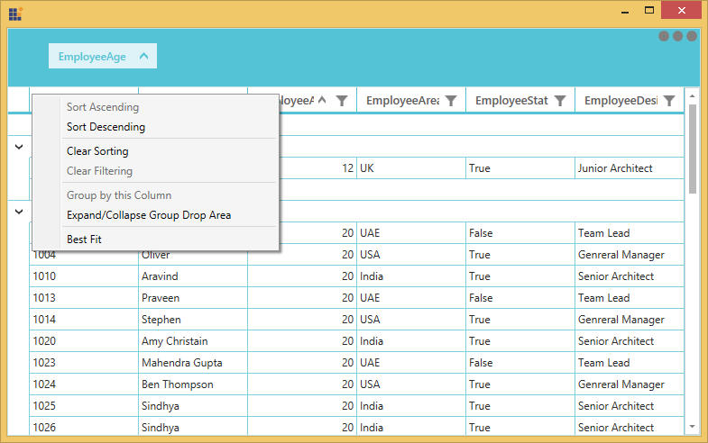
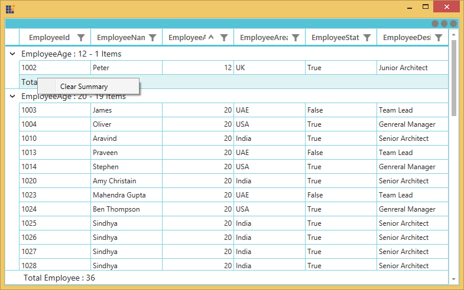

# Context Menu in WPF DataGrid (SfDataGrid)

DataGrid provides an entirely customizable context menu to expose the functionality on user interface. You can create context menu for different rows in an efficient manner. 

The below code example shows the context menu with command bindings.




<ContextMenu Style="{x:Null}">
    <MenuItem Command="{Binding CopyCommand,Source={StaticResource employeeInfoViewModel}}" 
          CommandParameter="{Binding}" Header="Copy">
    </MenuItem>
</ContextMenu>






public class BaseCommand : ICommand
{

    #region Fields
    readonly Action<object> _execute;
    readonly Predicate<object> _canExecute;
    #endregion

    #region Constructors
    /// 

    /// Creates a new command that can always execute.
    /// 

    /// <param name="execute">The execution logic.</param>

    public BaseCommand(Action<object> execute)
        : this(execute, null)
    {
    }

    /// 

    /// Creates a new command.
    /// 

    /// <param name="execute">The execution logic.</param>
    /// <param name="canExecute">The execution status logic.</param>

    public BaseCommand(Action<object> execute, Predicate<object> canExecute)
    {

        if (execute == null)
        throw new ArgumentNullException("execute");
        _execute = execute;
        _canExecute = canExecute;
    }
    #endregion
    
    #region ICommand Members

    public bool CanExecute(object parameter)
    {
        return _canExecute == null ? true : _canExecute(parameter);
    }
    
    public event EventHandler CanExecuteChanged
    {
        add { CommandManager.RequerySuggested += value; }
        remove { CommandManager.RequerySuggested -= value; }
    }

    public void Execute(object parameter)
    {
        _execute(parameter);
    }
    
    #endregion
}

public class EmployeeInfoViewModel : INotifyPropertyChanged
{

    public EmployeeInfoViewModel()
    {
        CopyCommand = new ContextMenuDemo.BaseCommand(ShowMessage);
    }
    
    private ICommand copyCommand

    public ICommand CopyCommand
    {
        get
        {
            return copyCommand;
        }
        set
        {
            copyCommand = value;
        }
    }
    
    public void ShowMessage(object obj)
    {

        if (obj is GridRecordContextMenuInfo)
        {
            var grid = (obj as GridRecordContextMenuInfo).DataGrid;
            grid.GridCopyPaste.Copy();
        }
    }
}




## Context menu for record rows

You can set the context menu for the data rows by using [SfDataGrid.RecordContextMenu](https://help.syncfusion.com/cr/wpf/Syncfusion.UI.Xaml.Grid.SfGridBase.html#Syncfusion_UI_Xaml_Grid_SfGridBase_RecordContextMenu) property. 




<syncfusion:SfDataGrid.RecordContextMenu>
    <ContextMenu>
        <MenuItem x:Name="Cut" Header="Cut" />
        <MenuItem x:Name="Copy" Header="Copy"  />
        <MenuItem x:Name="Paste" Header="Paste" />
        <MenuItem x:Name="Delete" Header="Delete" />
    </ContextMenu>
</syncfusion:SfDataGrid.RecordContextMenu>





this.dataGrid.RecordContextMenu = new ContextMenu();
this.dataGrid.RecordContextMenu.Items.Add(new MenuItem() { Header = "Cut" });
this.dataGrid.RecordContextMenu.Items.Add(new MenuItem() { Header = "Copy" });
this.dataGrid.RecordContextMenu.Items.Add(new MenuItem() { Header = "Paste" });
this.dataGrid.RecordContextMenu.Items.Add(new MenuItem() { Header = "Delete" });




While binding the menu item using CommandBinding you can get the command parameter as `GridRecordContextMenuInfo` which contains the record of the corresponding row.




<syncfusion:SfDataGrid.RecordContextMenu>
    <MenuItem Command="{Binding Source={x:Static Member=local:ContextMenuCommands.Copy}}"
              CommandParameter="{Binding}"
              Header="Copy">
    </MenuItem>
</syncfusion:SfDataGrid.RecordContextMenu>





private static void OnCopyClicked(object obj)
{

    if (obj is GridRecordContextMenuInfo)
    {
        var grid = (obj as GridRecordContextMenuInfo).DataGrid;
        var record = (obj as GridRecordContextMenuInfo).Record;
        grid.GridCopyPaste.Copy();
    }
}




## Context menu for column header

You can set the context menu for the header by using [SfDataGrid.HeaderContextMenu](https://help.syncfusion.com/cr/wpf/Syncfusion.UI.Xaml.Grid.SfGridBase.html#Syncfusion_UI_Xaml_Grid_SfGridBase_HeaderContextMenu) property. 



<syncfusion:SfDataGrid.HeaderContextMenu>
    <ContextMenu>
        <MenuItem x:Name=" SortAscending " Header="SortAscending" />
        <MenuItem x:Name=" SortDescending " Header="SortDescending" />
        <MenuItem x:Name=" ClearSorting " Header="ClearSorting" />
        <MenuItem x:Name=" ClearFiltering " Header="ClearFiltering" />
        <MenuItem x:Name=" Group by this column " Header="Group by this column" />
        <MenuItem x:Name=" Expand/Collapse Group Drop Area " Header="Expand/Collapse Group Drop Area" />
        <MenuItem x:Name=" BestFit " Header="BestFit" />
    </ContextMenu>
</syncfusion:SfDataGrid.HeaderContextMenu>





this.dataGrid.HeaderContextMenu = new ContextMenu();
this.dataGrid.HeaderContextMenu.Items.Add(new MenuItem() { Header = "SortAscending" });
this.dataGrid.HeaderContextMenu.Items.Add(new MenuItem() { Header = "SortDescending" });
this.dataGrid.HeaderContextMenu.Items.Add(new MenuItem() { Header = "ClearSorting" });
this.dataGrid.HeaderContextMenu.Items.Add(new MenuItem() { Header = " ClearFiltering " });
this.dataGrid.HeaderContextMenu.Items.Add(new MenuItem() { Header = "Group by this column" });
this.dataGrid.HeaderContextMenu.Items.Add(new MenuItem() { Header = "Expand/Collapse Group Drop Area" });
this.dataGrid.HeaderContextMenu.Items.Add(new MenuItem() { Header = "BestFit" });




While binding the menu item using CommandBinding you can get the parameter as `GridColumnContextMenuInfo` which contains the particular GridColumn.




<syncfusion:SfDataGrid.HeaderContextMenu>
    <MenuItem Command="{Binding Source={x:Static Member=local:ContextMenuCommands.SortAscending}}"
              CommandParameter="{Binding}"
              Header="Sort Ascending">
    </MenuItem>
</syncfusion:SfDataGrid.HeaderContextMenu>





private static void OnSortAscendingClicked(object obj)
{

    if (obj is GridColumnContextMenuInfo)
    {
        var grid = (obj as GridContextMenuInfo).DataGrid;
        var column = (obj as GridColumnContextMenuInfo).Column;
        grid.SortColumnDescriptions.Clear();
        grid.SortColumnDescriptions.Add(new SortColumnDescription() { ColumnName = column.MappingName, SortDirection = ListSortDirection.Ascending });
    }
}




## Context menu for group drop area

You can set the context menu for the GroupDropArea by using [SfDataGrid.GroupDropAreaContextMenu](https://help.syncfusion.com/cr/wpf/Syncfusion.UI.Xaml.Grid.SfDataGrid.html#Syncfusion_UI_Xaml_Grid_SfDataGrid_GroupDropAreaContextMenu) property. 




<syncfusion:SfDataGrid.GroupDropAreaContextMenu>
    <ContextMenu>
        <MenuItem x:Name=" ExpandAll " Header="ExpandAll" />
        <MenuItem x:Name=" CollapseAll " Header="CollapseAll" />
        <MenuItem x:Name=" ClearGroups " Header="ClearGroups" />
    </ContextMenu>
</syncfusion:SfDataGrid.GroupDropAreaContextMenu>





this.dataGrid.GroupDropAreaContextMenu = new ContextMenu();
this.dataGrid.GroupDropAreaContextMenu.Items.Add(new MenuItem() { Header = "ExpandAll" });
this.dataGrid.GroupDropAreaContextMenu.Items.Add(new MenuItem() { Header = "CollapseAll" });
this.dataGrid.GroupDropAreaContextMenu.Items.Add(new MenuItem() { Header = "ClearGroups" });




While binding the menu item using CommandBinding you can get the parameter as `GroupDropAreaContextMenuInfo`. 




<syncfusion:SfDataGrid.GroupDropAreaContextMenu>
    <MenuItem Command="{Binding Source={x:Static Member=local:ContextMenuCommands.ExpandAll}}"
              CommandParameter="{Binding}"
              Header="Expand All">
    </MenuItem>
</syncfusion:SfDataGrid.GroupDropAreaContextMenu>





private static void OnFullExpandClicked(object obj)
{
 
    if (obj is Syncfusion.UI.Xaml.Grid.GridContextMenuInfo)
    {
        var grid = (obj as Syncfusion.UI.Xaml.Grid.GridContextMenuInfo).DataGrid;
        grid.ExpandAllGroup();
    }
}




## Context menu for group item

You can set the context menu for the group drop item by using [SfDataGrid.GroupDropItemContextMenu](https://help.syncfusion.com/cr/wpf/Syncfusion.UI.Xaml.Grid.SfDataGrid.html#Syncfusion_UI_Xaml_Grid_SfDataGrid_GroupDropItemContextMenu) property. 




<syncfusion:SfDataGrid.GroupDropItemContextMenu>
    <ContextMenu>
        <MenuItem x:Name=" ExpandAll " Header="ExpandAll" />
        <MenuItem x:Name=" CollapseAll " Header="CollapseAll" />
        <MenuItem x:Name=" SortAscending " Header="SortAscending" />
        <MenuItem x:Name=" SortDescending " Header="SortDescending" />
        <MenuItem x:Name=" ClearGroup " Header="ClearGroup" />
        <MenuItem x:Name=" ClearSorting " Header="ClearSorting" />
    </ContextMenu>
</syncfusion:SfDataGrid.GroupDropItemContextMenu>





this.dataGrid.GroupDropItemContextMenu = new ContextMenu();
this.dataGrid.GroupDropItemContextMenu.Items.Add(new MenuItem() { Header = "ExpandAll" });
this.dataGrid.GroupDropItemContextMenu.Items.Add(new MenuItem() { Header = "CollapseAll" });
this.dataGrid.GroupDropItemContextMenu.Items.Add(new MenuItem() { Header = "SortAscending" });
this.dataGrid.GroupDropItemContextMenu.Items.Add(new MenuItem() { Header = "SortDescending" });
this.dataGrid.GroupDropItemContextMenu.Items.Add(new MenuItem() { Header = "ClearGroup" });
this.dataGrid.GroupDropItemContextMenu.Items.Add(new MenuItem() { Header = "ClearSorting" });




While binding the menu item using CommandBinding you can get the parameter as `GridColumnContextMenuInfo` which contains the particular GridColumn.




<syncfusion:SfDataGrid.GroupDropItemContextMenu>                            
    <MenuItem Command="{Binding Source={x:Static Member=local:ContextMenuCommands.CollapseAll}}"
              CommandParameter="{Binding}"
              Header="Collapse All">
    </MenuItem>
</syncfusion:SfDataGrid.GroupDropItemContextMenu>





private static void OnFullCollapseClicked(object obj)
{

    if (obj is GridContextMenuInfo)
    {
        var grid = (obj as GridContextMenuInfo).DataGrid;
        grid.CollapseAllGroup();
    }
}




## Context menu for caption summary wow

You can set the context menu for the group caption by using [SfDataGrid.GroupCaptionContextMenu](https://help.syncfusion.com/cr/wpf/Syncfusion.UI.Xaml.Grid.SfDataGrid.html#Syncfusion_UI_Xaml_Grid_SfDataGrid_GroupCaptionContextMenu) property. 




<syncfusion:SfDataGrid.GroupCaptionContextMenu>
    <ContextMenu>
        <MenuItem x:Name=" Expand " Header="Expand" />
        <MenuItem x:Name=" Collapse " Header="Collapse" />
    </ContextMenu>
</syncfusion:SfDataGrid.GroupCaptionContextMenu>





this.dataGrid.GroupCaptionContextMenu = new ContextMenu();
this.dataGrid.GroupCaptionContextMenu.Items.Add(new MenuItem() { Header = "Expand" });
this.dataGrid.GroupCaptionContextMenu.Items.Add(new MenuItem() { Header = "Collapse" });




While binding the menu item using CommandBinding you can get the command parameter as `GridRecordContextMenuInfo` which contains the record of the corresponding row.




<syncfusion:SfDataGrid.GroupCaptionContextMenu>
    <MenuItem Command="{Binding Source={x:Static Member=local:ContextMenuCommands.Expand}}"
              CommandParameter="{Binding}"
              Header="Expand" />
</syncfusion:SfDataGrid.GroupCaptionContextMenu>





private static void OnExpandClicked(object obj)
{
 
    if (obj is GridRecordContextMenuInfo)
    {   
        var grid = (obj as GridRecordContextMenuInfo).DataGrid;
        var group = (obj as GridRecordContextMenuInfo).Record as Group;
        grid.ExpandGroup(group);
    }
}




## Context menu for group summary row

You can set the context menu for the group summary by using [SfDataGrid.GroupSummaryContextMenu](https://help.syncfusion.com/cr/wpf/Syncfusion.UI.Xaml.Grid.SfDataGrid.html#Syncfusion_UI_Xaml_Grid_SfDataGrid_GroupSummaryContextMenu) property. 




<syncfusion:SfDataGrid.GroupSummaryContextMenu>
    <ContextMenu>
        <MenuItem x:Name="ClearSummary" Header="ClearSummary" />
    </ContextMenu>
</syncfusion:SfDataGrid.GroupSummaryContextMenu>





this.dataGrid.GroupSummaryContextMenu = new ContextMenu();
this.dataGrid.GroupSummaryContextMenu.Items.Add(new MenuItem() { Header = "ClearSummary" });




While binding the menu item using CommandBinding you can get the command parameter as `GridRecordContextMenuInfo` which contains the record of the corresponding row.




<syncfusion:SfDataGrid.GroupSummaryContextMenu>
    <MenuItem Command="{Binding Source={x:Static Member=local:ContextMenuCommands.ClearSummary}}"
              CommandParameter="{Binding}"
              Header="Clear Summary">
    </MenuItem>
</syncfusion:SfDataGrid.GroupSummaryContextMenu>





private static void OnClearSummaryClicked(object obj)
{
 
    if (obj is GridRecordContextMenuInfo)
    {
        var grid = (obj as GridRecordContextMenuInfo).DataGrid;
  
        if (grid.GroupSummaryRows.Any())
        grid.GroupSummaryRows.Clear();
    }
}




## Context menu for table summary row

You can set the context menu for the table summary by using [SfDataGrid.TableSummaryContextMenu](https://help.syncfusion.com/cr/wpf/Syncfusion.UI.Xaml.Grid.SfDataGrid.html#Syncfusion_UI_Xaml_Grid_SfDataGrid_TableSummaryContextMenu) property. 




<syncfusion:SfDataGrid.TableSummaryContextMenu>
    <ContextMenu>
        <MenuItem x:Name="TableSummaryCount" Header="Count" />
        <MenuItem x:Name="TableSummaryMax" Header="Max" />
        <MenuItem x:Name="TableSummaryMin" Header="Min" />
        <MenuItem x:Name="TableSummaryMin" Header="Average" />
        <MenuItem x:Name="TableSummaryMin" Header="Sum" />
    </ContextMenu>
</syncfusion:SfDataGrid.TableSummaryContextMenu>





this.dataGrid.TableSummaryContextMenu = new ContextMenu();
this.dataGrid.TableSummaryContextMenu.Items.Add(new MenuItem() { Header = "Count" });
this.dataGrid.TableSummaryContextMenu.Items.Add(new MenuItem() { Header = "Max" });
this.dataGrid.TableSummaryContextMenu.Items.Add(new MenuItem() { Header = "Min" });
this.dataGrid.TableSummaryContextMenu.Items.Add(new MenuItem() { Header = "Average" });
this.dataGrid.TableSummaryContextMenu.Items.Add(new MenuItem() { Header = "Sum" });




While binding the menu item using CommandBinding you can get the command parameter as `GridRecordContextMenuInfo` which contains the record of the corresponding row.




<syncfusion:SfDataGrid.TableSummaryContextMenu>
    <MenuItem Command="{Binding Source={x:Static Member=local:ContextMenuCommands.TotalSummaryCount}}"
              CommandParameter="{Binding}"
              Header="Count">
    </MenuItem>
</syncfusion:SfDataGrid.TableSummaryContextMenu>





private static void OnTotalSummaryCountClicked(object obj)
{

    if (obj is GridRecordContextMenuInfo)
    {
        var grid = (obj as GridRecordContextMenuInfo).DataGrid;
        var record = (obj as GridRecordContextMenuInfo).Record as SummaryRecordEntry;

        if (record != null)
        {
            var summaryRow = new GridSummaryRow() { Name = "totalGroupSummaryRow", Title = "{totalSummary}", ShowSummaryInRow = true };
            summaryRow.SummaryColumns.Add(new GridSummaryColumn() { Name = "totalSummary", MappingName = "EmployeeId", SummaryType = SummaryType.CountAggregate, Format = "Total Employee Count : {Count}" });
            grid.TableSummaryRows.Clear();
            grid.TableSummaryRows.Add(summaryRow);
        }
    }
}




## Events

### GridContextMenuOpening

[GridContextMenuOpening](https://help.syncfusion.com/cr/wpf/Syncfusion.UI.Xaml.Grid.SfDataGrid.html) event occurs while opening the context menu in SfDataGrid. 

[GridContextMenuEventArgs](http://help.syncfusion.com/cr/wpf/Syncfusion.UI.Xaml.Grid.GridContextMenuEventArgs.html) has the following members which provides the information about `GridContextMenuOpening` event.

* [ContextMenu](https://help.syncfusion.com/cr/wpf/Syncfusion.UI.Xaml.Grid.GridContextMenuEventArgs.html#Syncfusion_UI_Xaml_Grid_GridContextMenuEventArgs__ctor_System_Windows_Controls_ContextMenu_System_Object_Syncfusion_UI_Xaml_ScrollAxis_RowColumnIndex_Syncfusion_UI_Xaml_Grid_ContextMenuType_System_Object_) – Gets the corresponding context menu.

* [ContextMenuInfo](https://help.syncfusion.com/cr/wpf/Syncfusion.UI.Xaml.Grid.GridContextMenuEventArgs.html#Syncfusion_UI_Xaml_Grid_GridContextMenuEventArgs_ContextMenuInfo) – Returns the context menu info based on the row which opens the context menu.

* [ContextMenuType](https://help.syncfusion.com/cr/wpf/Syncfusion.UI.Xaml.Grid.GridContextMenuEventArgs.html#Syncfusion_UI_Xaml_Grid_GridContextMenuEventArgs__ctor_System_Windows_Controls_ContextMenu_System_Object_Syncfusion_UI_Xaml_ScrollAxis_RowColumnIndex_Syncfusion_UI_Xaml_Grid_ContextMenuType_System_Object_) – Returns the type of context menu.

* [RowColumnIndex](https://help.syncfusion.com/cr/wpf/Syncfusion.UI.Xaml.Grid.GridContextMenuEventArgs.html#Syncfusion_UI_Xaml_Grid_GridContextMenuEventArgs__ctor_System_Windows_Controls_ContextMenu_System_Object_Syncfusion_UI_Xaml_ScrollAxis_RowColumnIndex_Syncfusion_UI_Xaml_Grid_ContextMenuType_System_Object_) – `RowColumnIndex` of the context menu which is currently going to open. `RowColumnIndex` is updated only for the `RecordContextMenu` and remains left empty.

* [Handled](https://help.syncfusion.com/cr/wpf/Syncfusion.UI.Xaml.Grid.GridHandledEventArgs.html#Syncfusion_UI_Xaml_Grid_GridHandledEventArgs_Handled) – Indicates whether the `GridContextMenuOpening` event is handled or not.

## Customization of context menu

### Change the menu item when the context menu opening.

You can use the `GridContextMenuOpening` event to change the menu item when the context menu opening.




<syncfusion:SfDataGrid.RecordContextMenu>
    <ContextMenu>
        <MenuItem Command="{Binding Source={x:Static Member=local:ContextMenuCommands.Cut}}"
                  CommandParameter="{Binding}"
                  Header="Cut">
        </MenuItem>
        <MenuItem Command="{Binding Source={x:Static Member=local:ContextMenuCommands.Copy}}"
                  CommandParameter="{Binding}"
                  Header="Copy">
        </MenuItem>
        <MenuItem Command="{Binding Source={x:Static Member=local:ContextMenuCommands.Paste}}"
                  CommandParameter="{Binding}"
        Header="Paste">
        </MenuItem>
    </ContextMenu>
</syncfusion:SfDataGrid.RecordContextMenu>





this.dataGrid.GridContextMenuOpening += dataGrid_GridContextMenuOpening;

void dataGrid_GridContextMenuOpening(object sender, GridContextMenuEventArgs e)
{
    e.ContextMenu.Items.Clear();

    if(e.ContextMenuType == ContextMenuType.RecordCell)
    {
        e.ContextMenu.Items.Add(new MenuItem() { Header="Record"});
        e.ContextMenu.Items.Add(new MenuItem() { Header = "Data" });
    }
}



       

### Changing background of Context menu

You can change the appearance of the context menu by customizing the style with TargetType as ContextMenu.




<ContextMenu>
    <MenuItem x:Name="Cut" Header="Cut" />
    <MenuItem x:Name="Copy" Header="Copy" />
    <MenuItem x:Name="Paste" Header="Paste" />
</ContextMenu>




