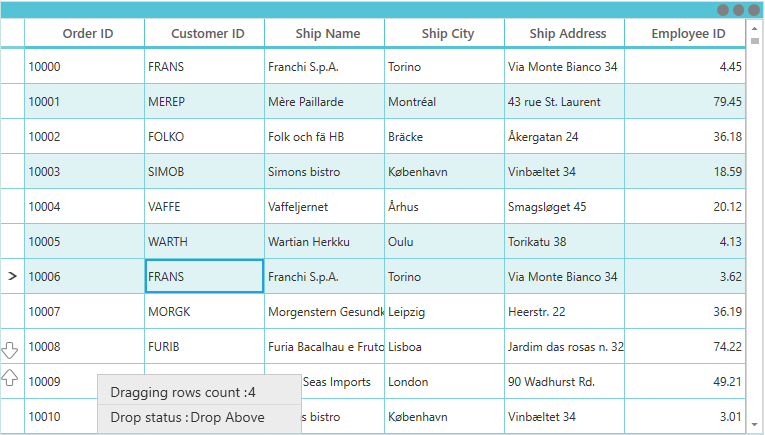
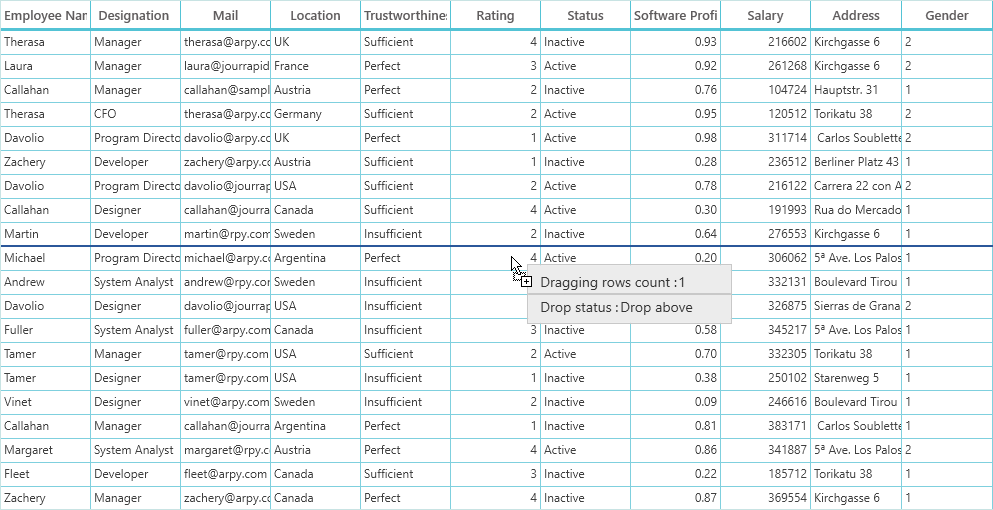
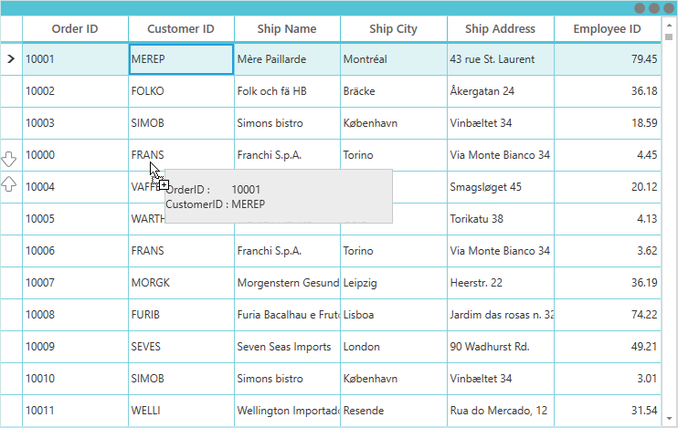
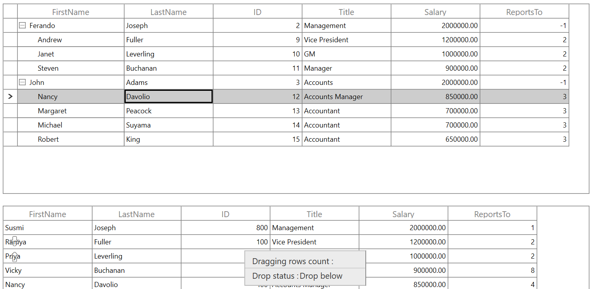

# Row drag and drop in WPF DataGrid (SfDataGrid)

DataGrid allows drag and drop the rows within and between controls by setting the [AllowDraggingRows](https://help.syncfusion.com/cr/wpf/Syncfusion.UI.Xaml.Grid.SfDataGrid.html#Syncfusion_UI_Xaml_Grid_SfDataGrid_AllowDraggingRows) and [AllowDrop](https://docs.microsoft.com/en-us/dotnet/api/system.windows.uielement.allowdrop) property as `true`. It is also possible to drag and drop the rows between datagrid and other controls such as `ListView` and `SfTreeGrid`. SfDataGrid allows dropping rows when `AllowDrop` is `true` and allows dragging when `AllowDraggingRows` is `true`.



<Syncfusion:SfDataGrid x:Name="datagrid" 
                               AllowDraggingRows="True"
                               AllowDrop="True"
                               ItemsSource="{Binding Source}"/>



this.datagrid.AllowDraggingRows = true;
this.datagrid.AllowDrop = true;



While dropping, the dragged records can be added above or below to the target record based on its drop position

For example, if you dropped record at the bottom of the targeted record, it will be added below the targeted record.

If you drop above the targeted record, it will be added above the targeted record

## Dragging multiple rows

SfDataGrid allows to drag multiple selected rows. To enable multiple selection, set the [SfDataGrid.SelectionMode](https://help.syncfusion.com/cr/wpf/Syncfusion.UI.Xaml.Grid.SfGridBase.html#Syncfusion_UI_Xaml_Grid_SfGridBase_SelectionMode) as `Multiple` or `Extended`. 

N> The drag selection cannot be performed while the [AllowDraggingRows](https://help.syncfusion.com/cr/wpf/Syncfusion.UI.Xaml.Grid.SfDataGrid.html#Syncfusion_UI_Xaml_Grid_SfDataGrid_AllowDraggingRows) enabled as `true` in the SfDataGrid.

## Drag and drop events

SfDataGrid triggers the following events when drag and drop:

### Drag start event

[DragStart](https://help.syncfusion.com/cr/wpf/Syncfusion.UI.Xaml.Grid.GridRowDragDropController.html)  event occurs when you start to drag the records in datagrid. The [GridRowDragStartEventArgs](https://help.syncfusion.com/cr/wpf/Syncfusion.UI.Xaml.Grid.GridRowDragStartEventArgs.html)  has the following member, which provides information for the `DragStart` event.
* [DraggingRecords](https://help.syncfusion.com/cr/wpf/Syncfusion.UI.Xaml.Grid.GridRowDragStartEventArgs.html#Syncfusion_UI_Xaml_Grid_GridRowDragStartEventArgs_DraggingRecords) : Gets the Records which contains the data associated while dragging the rows. 



this.sfDataGrid.RowDragDropController.DragStart += RowDragDropController_DragStart;

private void RowDragDropController_DragStart(object sender, GridRowDragStartEventArgs e)
{

}




### Drag over event

[DragOver](https://help.syncfusion.com/cr/wpf/Syncfusion.UI.Xaml.Grid.GridRowDragDropController.html) event occurs continuously while record is dragged within the target SfDataGrid. The [GridRowDragOverEventArgs](https://help.syncfusion.com/cr/wpf/Syncfusion.UI.Xaml.Grid.GridRowDragOverEventArgs.html) has the following members, which provide information for the `DragOver` event.
* [Data](https://help.syncfusion.com/cr/wpf/Syncfusion.UI.Xaml.Grid.GridRowDragDropEventArgsBase.html#Syncfusion_UI_Xaml_Grid_GridRowDragDropEventArgsBase_Data) : Gets a data object that contains the data associated while dragging the rows. 
* [DropPosition](https://help.syncfusion.com/cr/wpf/Syncfusion.UI.Xaml.Grid.GridRowDragDropEventArgsBase.html#Syncfusion_UI_Xaml_Grid_GridRowDragDropEventArgsBase_DropPosition) : Gets a value indicating the drop position which is based on dropped location 
* [IsFromOutSideSource](https://help.syncfusion.com/cr/wpf/Syncfusion.UI.Xaml.Grid.GridRowDragDropEventArgsBase.html#Syncfusion_UI_Xaml_Grid_GridRowDragDropEventArgsBase_IsFromOutSideSource) **:** Gets a value indicating whether the dragging item is from same DataGrid or not.
*[ShowDragUI](https://help.syncfusion.com/cr/wpf/Syncfusion.UI.Xaml.Grid.GridRowDragOverEventArgs.html#Syncfusion_UI_Xaml_Grid_GridRowDragOverEventArgs_ShowDragUI) : Gets or sets a value indicating the default Dragging UI.  
* [TargetRecord](https://help.syncfusion.com/cr/wpf/Syncfusion.UI.Xaml.Grid.GridRowDragDropEventArgsBase.html#Syncfusion_UI_Xaml_Grid_GridRowDragDropEventArgsBase_TargetRecord) : Gets a value indicating the target record which is going to drop.



this.sfDataGrid.RowDragDropController.DragOver += RowDragDropController_DragOver;

private void RowDragDropController_DragOver(object sender, GridRowDragOverEventArgs e)
{
            
}




### Drag leave event

[DragLeave](https://help.syncfusion.com/cr/wpf/Syncfusion.UI.Xaml.Grid.GridRowDragDropController.html) event occurs when leave a drag-and-drop operation.The [GridRowDragLeaveEventArgs](https://help.syncfusion.com/cr/wpf/Syncfusion.UI.Xaml.Grid.GridRowDragLeaveEventArgs.html) has the following members, which provide information for the `DragLeave` event.
* [Data](https://help.syncfusion.com/cr/wpf/Syncfusion.UI.Xaml.Grid.GridRowDragDropEventArgsBase.html#Syncfusion_UI_Xaml_Grid_GridRowDragDropEventArgsBase_Data) : Gets a data object that contains the data associated while dragging the rows. 
* [DropPosition](https://help.syncfusion.com/cr/wpf/Syncfusion.UI.Xaml.Grid.GridRowDragDropEventArgsBase.html#Syncfusion_UI_Xaml_Grid_GridRowDragDropEventArgsBase_DropPosition) : Gets a value indicating the drop position which is based on dropped location 
* [IsFromOutSideSource](https://help.syncfusion.com/cr/wpf/Syncfusion.UI.Xaml.Grid.GridRowDragDropEventArgsBase.html#Syncfusion_UI_Xaml_Grid_GridRowDragDropEventArgsBase_IsFromOutSideSource) : Gets a value indicating whether the dragging item is from same DataGrid or not.
* [TargetRecord](https://help.syncfusion.com/cr/wpf/Syncfusion.UI.Xaml.Grid.GridRowDragDropEventArgsBase.html#Syncfusion_UI_Xaml_Grid_GridRowDragDropEventArgsBase_TargetRecord) : Gets a value indicating the target record which is going to drop.



this.sfDataGrid.RowDragDropController.DragLeave += RowDragDropController_DragLeave;

private void RowDragDropController_DragLeave(object sender, GridRowDragLeaveEventArgs e)
{
            
}




### Drop event

[Drop](https://help.syncfusion.com/cr/wpf/Syncfusion.UI.Xaml.Grid.GridRowDragDropController.html) event occurs when a record is dropping within the target SfDataGrid.The  [GridRowDropEventArgs](https://help.syncfusion.com/cr/wpf/Syncfusion.UI.Xaml.Grid.GridRowDropEventArgs.html) has the following members, which provide information for the `Drop` event.
* [Data](https://help.syncfusion.com/cr/wpf/Syncfusion.UI.Xaml.Grid.GridRowDragDropEventArgsBase.html#Syncfusion_UI_Xaml_Grid_GridRowDragDropEventArgsBase_Data) : Gets a data object that contains the data associated while dragging the rows. 
* [DraggingRecords](https://help.syncfusion.com/cr/wpf/Syncfusion.UI.Xaml.Grid.GridRowDragStartEventArgs.html#Syncfusion_UI_Xaml_Grid_GridRowDragStartEventArgs_DraggingRecords) : Gets the Records which contains the data associated while dragging the rows. 
* [DropPosition](https://help.syncfusion.com/cr/wpf/Syncfusion.UI.Xaml.Grid.GridRowDragDropEventArgsBase.html#Syncfusion_UI_Xaml_Grid_GridRowDragDropEventArgsBase_DropPosition) : Gets a value indicating the drop position which is based on dropped location 
* [IsFromOutSideSource](https://help.syncfusion.com/cr/wpf/Syncfusion.UI.Xaml.Grid.GridRowDragDropEventArgsBase.html#Syncfusion_UI_Xaml_Grid_GridRowDragDropEventArgsBase_IsFromOutSideSource) : Gets a value indicating whether the dragging item is from same DataGrid or not.
* [TargetRecord](https://help.syncfusion.com/cr/wpf/Syncfusion.UI.Xaml.Grid.GridRowDragDropEventArgsBase.html#Syncfusion_UI_Xaml_Grid_GridRowDragDropEventArgsBase_TargetRecord) : Gets a value indicating the target record which is going to drop.



this.sfDataGrid.RowDragDropController.Drop += RowDragDropController_Drop;

private void RowDragDropController_Drop(object sender, GridRowDropEventArgs e)
{
            
}




### Dropped event

[Dropped](https://help.syncfusion.com/cr/wpf/Syncfusion.UI.Xaml.Grid.GridRowDragDropController.html) event occurs when a record is dropping within the target SfDataGrid.The [GridRowDroppedEventArgs](https://help.syncfusion.com/cr/wpf/Syncfusion.UI.Xaml.Grid.GridRowDroppedEventArgs.html) has the following members, which provide information for the `Drop` event.
* [Data](https://help.syncfusion.com/cr/wpf/Syncfusion.UI.Xaml.Grid.GridRowDragDropEventArgsBase.html#Syncfusion_UI_Xaml_Grid_GridRowDragDropEventArgsBase_Data) : Gets a data object that contains the data associated while dragging the rows. 
* [DropPosition](https://help.syncfusion.com/cr/wpf/Syncfusion.UI.Xaml.Grid.GridRowDragDropEventArgsBase.html#Syncfusion_UI_Xaml_Grid_GridRowDragDropEventArgsBase_DropPosition) : Gets a value indicating the drop position which is based on dropped location 
* [IsFromOutSideSource](https://help.syncfusion.com/cr/wpf/Syncfusion.UI.Xaml.Grid.GridRowDragDropEventArgsBase.html#Syncfusion_UI_Xaml_Grid_GridRowDragDropEventArgsBase_IsFromOutSideSource) : Gets a value indicating whether the dragging item is from same DataGrid or not.
* [TargetRecord](https://help.syncfusion.com/cr/wpf/Syncfusion.UI.Xaml.Grid.GridRowDragDropEventArgsBase.html#Syncfusion_UI_Xaml_Grid_GridRowDragDropEventArgsBase_TargetRecord) : Gets a value indicating the target record which is going to drop.



this.sfDataGrid.RowDragDropController.Dropped += RowDragDropController_Dropped;

private void RowDragDropController_Dropped(object sender, GridRowDroppedEventArgs e)
{

}




## Changing the row drop indicator

By default, the drop position will be indicated with arrows. To change the drop indicator as line, then set the [sfDataGrid.RowDropIndicatorMode](https://help.syncfusion.com/cr/wpf/Syncfusion.UI.Xaml.Grid.SfDataGrid.html#Syncfusion_UI_Xaml_Grid_SfDataGrid_RowDropIndicatorMode) as `Line`.



<syncfusion:SfDataGrid Name="dataGrid"
                       ItemsSource="{Binding OrdersListDetails}"
                       AllowDrop="True"
                       AllowDraggingRows="True"
                       RowDropIndicatorMode="Line" />



this.dataGrid.RowDropIndicatorMode = Syncfusion.UI.Xaml.Grid.DropIndicatorMode.Line;




## Customizing row drag and drop operation

### Disable dragging of certain rows in WPF DataGrid

You can restrict the dragging of certain rows in SfDataGrid by using the  [GridRowDragDropController.DragStart](https://help.syncfusion.com/cr/wpf/Syncfusion.UI.Xaml.Grid.GridRowDragDropController.html) event.



this.sfDataGrid.RowDragDropController.DragStart += RowDragDropController_DragStart;

private void RowDragDropController_DragStart(object sender, Syncfusion.UI.Xaml.Grid.GridRowDragStartEventArgs e)
{
    var records = e.DraggingRecords;
    var orders = records[0] as Orders;
    // You can restrict the dragging for certain rows based on the record value also. 
    var rowIndex = this.sfDataGrid.ResolveToRowIndex(orders);
    var recordIndex = this.sfDataGrid.ResolveToRecordIndex(rowIndex);
    if (recordIndex > 5)
        e.Handled = true;
}




### Disable dropping over certain rows in WPF DataGrid

You can restrict the dropping the records in certain rows in SfDataGrid by using the [GridRowDragDropController.Drop](https://help.syncfusion.com/cr/wpf/Syncfusion.UI.Xaml.Grid.GridRowDragDropController.html) event.



this.sfDataGrid.RowDragDropController.Drop += RowDragDropController_Drop;

private void RowDragDropController_Drop(object sender, GridRowDropEventArgs e)
{
    var record = e.TargetRecord;
    if (record == null)
        return;
    var orders = (record as RecordEntry).Data as Orders;
    // You can restrict the dropping for certain rows based on the target record value also. 
    var rowIndex = this.sfDataGrid.ResolveToRowIndex(orders);
    var recordIndex = this.sfDataGrid.ResolveToRecordIndex(rowIndex);
    if (recordIndex > 5)
        e.Handled = true;
}




### Disable the default drag UI

You can disable the draggable popup by setting the [ShowDragUI](https://help.syncfusion.com/cr/wpf/Syncfusion.UI.Xaml.Grid.GridRowDragOverEventArgs.html#Syncfusion_UI_Xaml_Grid_GridRowDragOverEventArgs_ShowDragUI) as `false` in the [DragOver](https://help.syncfusion.com/cr/wpf/Syncfusion.UI.Xaml.Grid.GridRowDragDropController.html) event of  [GridRowDragDropController.DragOver](https://help.syncfusion.com/cr/wpf/Syncfusion.UI.Xaml.Grid.GridRowDragDropController.html) event .



this.sfDataGrid.RowDragDropController.DragOver += RowDragDropController_DragOver;

private void RowDragDropController_DragOver(object sender, GridRowDragOverEventArgs e)
{
    e.ShowDragUI = false;
}




### Customizing draggable Popup

To customize draggable popup, use the [RowDragDropTemplate](https://help.syncfusion.com/cr/wpf/Syncfusion.UI.Xaml.Grid.SfDataGrid.html#Syncfusion_UI_Xaml_Grid_SfDataGrid_RowDragDropTemplate) property in the SfDataGrid.



<DataTemplate x:Key="template">
            <Border x:Name="border" Width="250"  
                            Background="#ececec" 
                            BorderBrush="#c8c8c8"  Height="60"
                            BorderThickness="1.2">

                <Grid  VerticalAlignment="Center" 
                          HorizontalAlignment="Left">
                    <Grid.RowDefinitions>
                        <RowDefinition Height="Auto"/>
                        <RowDefinition Height="Auto"/>
                        <RowDefinition Height="Auto"/>
                    </Grid.RowDefinitions>
                    <Grid.ColumnDefinitions>
                        <ColumnDefinition Width="Auto"/>
                        <ColumnDefinition Width="Auto"/>
                    </Grid.ColumnDefinitions>

                    <TextBlock Padding="12,0,0,0" Text="Dragging rows count :" FontSize="14" FontFamily="Segoe UI" 
                                       Foreground="#333333" FontWeight="Regular" Background="SkyBlue" />

                    <TextBlock Text="{Binding DraggingRecords.Count}" FontSize="14" 
                                       FontFamily="Segoe UI"
                                       FontWeight="Regular" 
                                       Foreground="#333333" 
                                       Grid.Column="1" Margin="-100,0,0,0"/>

                    <Separator  Grid.Row="1" Height="2" BorderBrush="#c8c8c8"
                                        HorizontalAlignment="Stretch"  BorderThickness="1"
                                        VerticalAlignment="Stretch"  Width="250"/>

                    <TextBlock Text="Drop status:" 
                                       Foreground="#333333"
                                       Padding="12,0,0,0" Background="SkyBlue"
                                       FontFamily="Segoe UI" 
                                       FontWeight="Regular" 
                                       FontSize="14"
                                       Grid.Row="2"/>

                    <TextBlock Text="{Binding DragStatus}" 
                                       FontSize="14"
                                       FontFamily="Segoe UI"
                                       FontWeight="Regular"
                                       Foreground="#333333" 
                                       Margin="-163,0,0,0"
                                       Grid.Row="2" 
                                       Grid.Column="1"/>
                </Grid>
            </Border>
 </DataTemplate>

<Syncfusion:SfDataGrid x:Name="datagrid" 
                               AllowDraggingRows="True"
                               AllowDrop="True"
                               RowDragDropTemplate="{StaticResource template}"
                               ItemsSource="{Binding Source}"/>




### Customizing draggable popup to show corresponding dragging row data 

You can customize the dragging popup to show the corresponding drag row data by customizing the `RowDragDropTemplate` with binding the data from the `DraggingRecords` property.



<DataTemplate x:Key="dragdroptemplate">
        <Border x:Name="border" Width="250"    
                    Background="#ececec"   
                    BorderBrush="#c8c8c8"  Height="60"  
                    BorderThickness="1.2">
                 <Grid  VerticalAlignment="Center" HorizontalAlignment="Left">
                    <Grid.RowDefinitions>
                        <RowDefinition Height="Auto"/>
                        <RowDefinition Height="Auto"/>
                    </Grid.RowDefinitions>
                    <Grid.ColumnDefinitions>
                        <ColumnDefinition Width="Auto"/>
                        <ColumnDefinition Width="Auto"/>
                    </Grid.ColumnDefinitions>
                    <TextBlock Text="OrderID : " Grid.Row="0" Grid.Column="0" />
                    <TextBlock Text="{Binding DraggingRecords[0].OrderID}" Grid.Row="0" Grid.Column="1"/>
                    <TextBlock Text="CustomerID : " Grid.Row="1" Grid.Column="0"/>
                    <TextBlock Text="{Binding DraggingRecords[0].CustomerID}" Grid.Row="1" Grid.Column="1"/>
                </Grid>
        </Border>
</DataTemplate>

<Syncfusion:SfDataGrid x:Name="datagrid" 
                               AllowDraggingRows="True"
                               AllowDrop="True"
                               RowDragDropTemplate="{StaticResource dragdroptemplate}"
                               ItemsSource="{Binding OrderDetails}"/>




### Reorder the source collection while drag and drop the rows

You can reorder the source collection after drag and drop the row by handling [RowDragDropController.Dropped](https://help.syncfusion.com/cr/wpf/Syncfusion.UI.Xaml.Grid.SfDataGrid.html#Syncfusion_UI_Xaml_Grid_SfDataGrid_RowDragDropController) event.



sfGrid.RowDragDropController.Dropped += OnRowDropped;

private void OnRowDropped(object sender, GridRowDroppedEventArgs e)
{
    if (e.DropPosition != DropPosition.None)
    {
        // Get Dragging records
        ObservableCollection<object> draggingRecords = e.Data.GetData("Records") as ObservableCollection<object>;

        // Gets the TargetRecord from the underlying collection using record index of the TargetRecord (e.TargetRecord)
        ViewModel model = sfGrid.DataContext as ViewModel;
        OrderInfo targetRecord = model.OrdersFirstGrid[(int)e.TargetRecord];

        // Use Batch update to avoid data operatons in SfDataGrid during records removing and inserting
        sfGrid.BeginInit();

        // Removes the dragging records from the underlying collection
        foreach (OrderInfo item in draggingRecords)
        {
            model.OrdersFirstGrid.Remove(item);
        }

        // Find the target record index after removing the records
        int targetIndex = model.OrdersFirstGrid.IndexOf(targetRecord);
        int insertionIndex = e.DropPosition == DropPosition.DropAbove ? targetIndex : targetIndex + 1;
        insertionIndex = insertionIndex < 0 ? 0 : insertionIndex;

        // Insert dragging records to the target position
        for (int i = draggingRecords.Count - 1; i >= 0; i--)
        {
            model.OrdersFirstGrid.Insert(insertionIndex, draggingRecords[i] as OrderInfo);
        }
        sfGrid.EndInit();
    }
}




## Row drag and drop between DataGrid and ListView

To perform dragging between the `ListView` and `SfDataGrid`, by using the [GridRowDragDropController.DragStart](https://help.syncfusion.com/cr/wpf/Syncfusion.UI.Xaml.Grid.GridRowDragDropController.html) and [GridRowDragDropController.Drop](https://help.syncfusion.com/cr/wpf/Syncfusion.UI.Xaml.Grid.GridRowDragDropController.html) events. And you must set the `AllowDrop` property as `true` in the `ListView` while doing the drag and drop operation from `SfDataGrid` with `ListView` control.



this.dataGrid.RowDragDropController.DragStart += sfGrid_DragStart;
this.dataGrid.RowDragDropController.Drop += sfGrid_Drop;
this.listView.PreviewMouseMove += ListView_PreviewMouseMove;
this.listView.Drop += ListView_Drop;

/// 

/// customize the DragStart event.Restrict the certain record from dragging.
/// 

/// <param name="sender"></param>
/// <param name="e"></param>
private void sfGrid_DragStart(object sender, GridRowDragStartEventArgs e)
{
    var draggingRecords = e.DraggingRecords[0] as OrderInfo;
    if (draggingRecords.CustomerName == "Martin")
    {
        e.Handled = true;
    }

}
       

/// 

/// Customize the Drop event.restrict the certain record and Drop position from drop.
/// 

/// <param name="sender"></param>
/// <param name="e"></param>
private void sfGrid_Drop(object sender, GridRowDropEventArgs e)
{
    if (e.IsFromOutSideSource)
    {
        ObservableCollection<object> DraggingRecords = new ObservableCollection<object>();
        if (e.Data.GetDataPresent("ListViewRecords"))
            DraggingRecords = e.Data.GetData("ListViewRecords") as ObservableCollection<object>;
        else
            DraggingRecords = e.Data.GetData("Records") as ObservableCollection<object>;

        var draggingRecords = DraggingRecords[0] as OrderInfo;

        int dropIndex = (int)e.TargetRecord;

        var dropPosition = e.DropPosition.ToString();
               
        IList collection = AssociatedObject.sfGrid.View.SourceCollection as IList;

        if (dropPosition == "DropAbove")
        {
            dropIndex--;
            collection.Insert(dropIndex, draggingRecords);
        }
        else
        {
            dropIndex++;
            collection.Insert(dropIndex, draggingRecords);
        }

    (AssociatedObject.listView.ItemsSource as ObservableCollection<OrderInfo>).Remove(draggingRecords as OrderInfo);
        e.Handled = true;

    }
}

/// 

/// List view initiates the DragDrop operation
/// 

/// <param name="sender"></param>
/// <param name="e"></param>
private void ListView_PreviewMouseMove(object sender, MouseEventArgs e)
{
    if (e.LeftButton == MouseButtonState.Pressed)
    {
        ListBox dragSource = null;

                
        var records = new ObservableCollection<object>();
                
        ListBox parent = (ListBox)sender;

        dragSource = parent;

        object data = GetDataFromListBox(dragSource, e.GetPosition(parent));

        records.Add(data);

        var dataObject = new DataObject();
        dataObject.SetData("ListViewRecords", records);
        dataObject.SetData("ListView", AssociatedObject.listView);

        if (data != null)
        {
            DragDrop.DoDragDrop(parent, dataObject, DragDropEffects.Move);
        }

    }
    e.Handled = true;
}

/// 

/// Get the data from list box control
/// 

/// <param name="source"></param>
/// <param name="point"></param>
/// <returns></returns>
private static object GetDataFromListBox(ListBox source, Point point)
{
    UIElement element = source.InputHitTest(point) as UIElement;
    if (element != null)
    {
        object data = DependencyProperty.UnsetValue;
        while (data == DependencyProperty.UnsetValue)
        {
            data = source.ItemContainerGenerator.ItemFromContainer(element);
            if (data == DependencyProperty.UnsetValue)
            {
                element = VisualTreeHelper.GetParent(element) as UIElement;
            }
            if (element == source)
            {
                return null;
            }
        }
        if (data != DependencyProperty.UnsetValue)
        {
            return data;
        }
    }
    return null;
}

        
       

/// 

/// ListView Drop event.
/// 

/// <param name="sender"></param>
/// <param name="e"></param>
private void ListView_Drop(object sender, DragEventArgs e)
{
            
    ObservableCollection<object> DraggingRecords = new ObservableCollection<object>();
    if (e.Data.GetDataPresent("ListViewRecords"))
    {
        DraggingRecords = e.Data.GetData("ListViewRecords") as ObservableCollection<object>;

        var listViewRecord = DraggingRecords[0] as OrderInfo;
                
            (AssociatedObject.listView.ItemsSource as ObservableCollection<OrderInfo>).Remove(listViewRecord);
            (this.AssociatedObject.DataContext as ViewModel).OrdersListView.Add(listViewRecord );
               
                
    }
    else
    {
        DraggingRecords = e.Data.GetData("Records") as ObservableCollection<object>;
                
        var record = DraggingRecords[0] as OrderInfo;
                
            this.AssociatedObject.sfGrid.View.Remove(record);
            (this.AssociatedObject.DataContext as ViewModel).OrdersListView.Add(record);
               
               
    }
            
}




You can download the [sample](https://github.com/SyncfusionExamples/how-to-drag-and-drop-rows-between-datagrid-and-listview-in-wpf-and-uwp/tree/master/WPF).

## Row drag and drop between two DataGrid's

To perform the dragging operation between  two datagrid by using the [GridRowDragDropController.DragStart](https://help.syncfusion.com/cr/wpf/Syncfusion.UI.Xaml.Grid.GridRowDragDropController.html) , [GridRowDragDropController.Drop](https://help.syncfusion.com/cr/wpf/Syncfusion.UI.Xaml.Grid.GridRowDragDropController.html) , [GridRowDragDropController.DragOver](https://help.syncfusion.com/cr/wpf/Syncfusion.UI.Xaml.Grid.GridRowDragDropController.html) and [GridRowDragDropController.Dropped](https://help.syncfusion.com/cr/wpf/Syncfusion.UI.Xaml.Grid.GridRowDragDropController.html) events.



this.firstDataGrid.RowDragDropController.DragStart += sfGrid_DragStart;
this.firstDataGrid.RowDragDropController.Drop += sfGrid_Drop;
this.firstDataGrid.RowDragDropController.Dropped += sfGrid_Dropped;
this.secondDataGrid.RowDragDropController.DragOver += grid_DragOver;

/// 

/// customize the DragStart event.Restrict the certain record from dragging.
/// 

/// <param name="sender"></param>
/// <param name="e"></param>
private void sfGrid_DragStart(object sender, GridRowDragStartEventArgs e)
{
    var record = e.DraggingRecords[0] as OrderInfo;
    if (record.CustomerName == "Martin")
    {
        e.Handled = true;
    }

}

/// 

/// Customize the DragOver event.Disable the DragUI
/// 

/// <param name="sender"></param>
/// <param name="e"></param>
private void grid_DragOver(object sender, GridRowDragOverEventArgs e)
{
    e.ShowDragUI = false;
    e.Handled = true;

}

/// 

/// Customize the Drop event
/// 

/// <param name="sender"></param>
/// <param name="e"></param>
private void sfGrid_Drop(object sender,GridRowDropEventArgs e)
{
    var record = e.DraggingRecords[0] as OrderInfo;
           
    var dropPosition = e.DropPosition.ToString();
    if (dropPosition == "DropAbove")
    {
        e.Handled = true;
    }
    if (record.ShipCity == "Mexico D.F.")
    {
        e.Handled = true;
    }
}

/// 

/// Customize the Dropped event.
/// 

/// <param name="sender"></param>
/// <param name="e"></param>
private void sfGrid_Dropped(object sender, GridRowDroppedEventArgs e)
{
    ObservableCollection<object> draggingRecords = new ObservableCollection<object>();

    draggingRecords = e.Data.GetData("Records") as ObservableCollection<object>;
            
    var items = draggingRecords[0] as OrderInfo;

    var records = AssociatedObject.firstDataGrid.View.Records.ToList();
            
    IList collection = AssociatedObject.firstDataGrid.ItemsSource as IList;
            
    for (int i = 0; i < records.Count; i++)
    {
                
        var orderData = records[i].Data as OrderInfo;
        if (orderData.OrderID == items.OrderID)
        {
            collection.Remove(items);
            collection.Insert(i, orderData);
        }
                
    }
    AssociatedObject.firstDataGrid.ItemsSource = collection;
           

}




You can download the [sample](https://github.com/SyncfusionExamples/how-to-drag-and-drop-rows-between-two-datagrids-in-wpf-and-uwp/tree/master/WPF);

## Row drag and drop between DataGrid and TreeGrid

To perform the dragging operation between  `SfDataGrid` and `SfTreeGrid` by using the [GridRowDragDropController.Drop](https://help.syncfusion.com/cr/wpf/Syncfusion.UI.Xaml.Grid.GridRowDragDropController.html) and [TreeGridRowDragDropController.Drop](https://help.syncfusion.com/cr/wpf/Syncfusion.UI.Xaml.TreeGrid.TreeGridRowDragDropController.html) events.



this.sfDataGrid.RowDragDropController.Drop += sfDataGrid_Drop;
this.sfTreeGrid.RowDragDropController.Drop += sfTreeGrid_Drop;

/// 

/// Customized TreeGrid Drop event.
/// 

/// <param name="sender"></param>
/// <param name="e"></param>
private void sfTreeGrid_Drop(object sender, TreeGridRowDropEventArgs e)
{
    if (e.IsFromOutSideSource)
    {
                
        var draggingRecord = e.Data.GetData("Records") as ObservableCollection<object>;
                
        var record = draggingRecord[0] as EmployeeInfo;
                
        var dropPosition = e.DropPosition.ToString();
               
        var newItem = new EmployeeInfo();

        var rowIndex =AssociatedObject.sfTreeGrid.ResolveToRowIndex(e.TargetNode.Item);
                
        if (dropPosition != "None" && rowIndex != -1)
        {
            if (AssociatedObject.sfTreeGrid.View is TreeGridSelfRelationalView)
            {
                var treeNode = e.TargetNode;
                if (treeNode == null)
                    return;
                       
                var data = treeNode.Item;

                AssociatedObject.sfTreeGrid.SelectionController.SuspendUpdates();
                        
                var dropIndex = -1;

                TreeNode parentNode = null;

                if (dropPosition == "DropBelow" || dropPosition == "DropAbove")
                {
                    parentNode = treeNode.ParentNode;
                    if (parentNode == null)
                    {
                        var treeNodeItem = treeNode.Item as EmployeeInfo;
                        newItem = new EmployeeInfo() { FirstName = record.FirstName, LastName = record.LastName, ID = record.ID, Salary = record.Salary, Title = record.Title, ReportsTo = treeNodeItem.ReportsTo };
                    }
                    else
                    {
                        var parentNodeItems = parentNode.Item as EmployeeInfo;
                        newItem = new EmployeeInfo() { FirstName = record.FirstName, LastName = record.LastName, ID = record.ID, Salary = record.Salary, Title = record.Title, ReportsTo = parentNodeItems.ID };
                    }
                }
                else if (dropPosition == "DropAsChild")
                {

                    if (!treeNode.IsExpanded)
                        AssociatedObject.sfTreeGrid.ExpandNode(treeNode);
                    parentNode = treeNode;
                    var parentNodeItems = parentNode.Item as EmployeeInfo;
                    newItem = new EmployeeInfo() { FirstName = record.FirstName, LastName = record.LastName, ID = record.ID, Salary = record.Salary, Title = record.Title, ReportsTo = parentNodeItems.ID };

                }

                IList sourceCollection = null;
                        

                if (dropPosition == "DropBelow" || dropPosition == "DropAbove")
                {

                    if (treeNode.ParentNode != null)
                    {
                        var collection = AssociatedObject.sfTreeGrid.View.GetPropertyAccessProvider().GetValue(treeNode.ParentNode.Item, AssociatedObject.sfTreeGrid.ChildPropertyName) as IEnumerable;
                        sourceCollection = GetSourceListCollection(collection);
                    }
                    else
                    {
                        sourceCollection = GetSourceListCollection(AssociatedObject.sfTreeGrid.View.SourceCollection);
                    }
                    dropIndex = sourceCollection.IndexOf(data);

                    if (dropPosition == "DropBelow")
                    {
                        dropIndex += 1;
                    }
                }

                else if (dropPosition == "DropAsChild")
                {
                    var collection = AssociatedObject.sfTreeGrid.View.GetPropertyAccessProvider().GetValue(data, AssociatedObject.sfTreeGrid.ChildPropertyName) as IEnumerable;

                    sourceCollection = GetSourceListCollection(collection);

                    if (sourceCollection == null)
                    {
                        var list = data.GetType().GetProperty(AssociatedObject.sfTreeGrid.ChildPropertyName).PropertyType.CreateNew() as IList;

                        if (list != null)
                        {
                            AssociatedObject.sfTreeGrid.View.GetPropertyAccessProvider().SetValue(treeNode.Item, AssociatedObject.sfTreeGrid.ChildPropertyName, list);
                            sourceCollection = list;
                        }
                    }
                    dropIndex = sourceCollection.Count;

                }
                sourceCollection.Insert(dropIndex, newItem);

                AssociatedObject.sfTreeGrid.SelectionController.ResumeUpdates();
                (AssociatedObject.sfTreeGrid.SelectionController as TreeGridRowSelectionController).RefreshSelection();
                e.Handled = true;
            }
        }
        AssociatedObject.sfDataGrid.View.Remove(record);
    }
}

      
      
/// 

/// Gets the source collection of TreeGrid
/// 

/// <param name="collection"></param>
/// <returns></returns>
private IList GetSourceListCollection(IEnumerable collection)
{
    IList list = null;
    if (collection == null)
        collection = AssociatedObject.sfTreeGrid.View.SourceCollection;
    if ((collection as IList) != null)
    {
        list = collection as IList;
    }
    return list;
}

/// 

/// Customize the Drop event.restrict the certain record and Drop position from drop.
/// 

/// <param name="sender"></param>
/// <param name="e"></param>
private void sfDataGrid_Drop(object sender, GridRowDropEventArgs e)
{
            
    if (e.IsFromOutSideSource)
    {
        var draggingRecord = e.Data.GetData("Nodes") as ObservableCollection<TreeNode>;
                
        var record = draggingRecord[0].Item as EmployeeInfo;

        int dropIndex = (int)e.TargetRecord;

              
        var dropPosition = e.DropPosition.ToString();

        if (record.Title == "Manager")
        {
            e.Handled = true;
            return;
        }
                
                
        IList collection = null;

        collection = AssociatedObject.sfDataGrid.View.SourceCollection as IList;
        if (dropPosition == "DropAbove")
        {
            dropIndex--;
            collection.Insert(dropIndex, record);
                    
        }
        else
        {
            dropIndex++;
            collection.Insert(dropIndex, record);
                   
        }
        AssociatedObject.sfTreeGrid.View.Remove(record);
        e.Handled = true;
    }
}




You can download the sample [here](https://github.com/SyncfusionExamples/how-to-drag-and-drop-rows-between-datagrid-and-treegrid-in-wpf).
