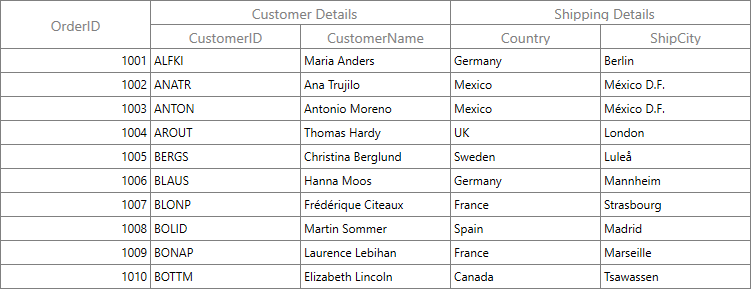

# Stacked Headers in WPF DataGrid (SfDataGrid)

DataGrid supports additional unbound header rows known as `stacked header rows` or  that span across the DataGrid columns using [StackedHeaderRows](http://help.syncfusion.com/cr/wpf/Syncfusion.UI.Xaml.Grid.StackedHeaderRows.html). You can group one or more columns under each stacked header.

Each [StackedHeaderRow](http://help.syncfusion.com/cr/wpf/Syncfusion.UI.Xaml.Grid.StackedHeaderRow.html) contains [StackedColumns](https://help.syncfusion.com/cr/wpf/Syncfusion.UI.Xaml.Grid.StackedHeaderRow.html#Syncfusion_UI_Xaml_Grid_StackedHeaderRow_StackedColumns) where each [StackedColumn](http://help.syncfusion.com/cr/wpf/Syncfusion.UI.Xaml.Grid.StackedColumn.html) contains a number of child columns. The `StackedColumn.ChildColumns` property returns the columns grouped under the stacked header row. The `StackedColumn.MappingName` is a unique name used for mapping a specific child columns grouped under the same stacked header row whereas, the `StackedColumn.HeaderText` returns the text displayed in the stacked header row.



<syncfusion:SfDataGrid x:Name="dataGrid"         
                       ItemsSource="{Binding Orders}">
    <syncfusion:SfDataGrid.StackedHeaderRows>
        <syncfusion:StackedHeaderRow>
            <syncfusion:StackedHeaderRow.StackedColumns>
                <syncfusion:StackedColumn ChildColumns="OrderID,CustomerID,CustomerName,ShipCity,Country" HeaderText="Sales Details" MappingName="SalesDetails"/>
            </syncfusion:StackedHeaderRow.StackedColumns>
        </syncfusion:StackedHeaderRow>
        <syncfusion:StackedHeaderRow>
            <syncfusion:StackedHeaderRow.StackedColumns>
                <syncfusion:StackedColumn ChildColumns="OrderID" HeaderText="Order Details" MappingName="OrderDetails"/>
                <syncfusion:StackedColumn ChildColumns="CustomerID,CustomerName" HeaderText="Customer Details" MappingName="CustomerDetails"/>
                <syncfusion:StackedColumn ChildColumns="ShipCity,Country" HeaderText="Shipping Details" MappingName="ShippingDetails"/>
            </syncfusion:StackedHeaderRow.StackedColumns>
        </syncfusion:StackedHeaderRow>
    </syncfusion:SfDataGrid.StackedHeaderRows>
</syncfusion:SfDataGrid>


var stackedHeaderRow = new StackedHeaderRow();
stackedHeaderRow.StackedColumns.Add(new StackedColumn() { ChildColumns = "OrderID" + "," + "CustomerID" + "," + "CustomerName" + "," + "ShipCity" + "," + "Country", HeaderText = "Sales Details" , MappingName="SalesDetails" });
dataGrid.StackedHeaderRows.Add(stackedHeaderRow);
            
var stackedHeaderRow1 = new StackedHeaderRow();
stackedHeaderRow1.StackedColumns.Add(new StackedColumn() { ChildColumns = "OrderID", HeaderText = "Order Details" , MappingName="OrderDetails" });            
stackedHeaderRow1.StackedColumns.Add(new StackedColumn() { ChildColumns = "CustomerID" + "," + "CustomerName", HeaderText = "Customer Details" , MappingName="CustomerDetails" });
stackedHeaderRow1.StackedColumns.Add(new StackedColumn() { ChildColumns = "ShipCity" + "," + "Country", HeaderText = "Shipping Details" , MappingName="ShippingDetails" });
dataGrid.StackedHeaderRows.Add(stackedHeaderRow1);



## Stacked Headers using Data Annotation

You can also add the stacked headers using `GroupName` property of [Data Annotations Display attributes](https://msdn.microsoft.com/en-us/library/system.componentmodel.dataannotations.displayattribute.aspx). 



public class OrderInfo
{
    private int orderID;
    private string customerId;
    private string country;
    private string customerName;
    private string shippingCity;
        
    public int OrderID
    {
        get { return orderID; }
        set { orderID = value; }
    }

    [Display(GroupName = "Customer Details")]

    public string CustomerID
    {
        get { return customerId; }
        set { customerId = value; }
    }

    [Display(GroupName = "Customer Details")]        

    public string CustomerName
    {
        get { return customerName; }
        set { customerName = value; }
    }

    [Display(GroupName = "Shipping Details")]

    public string Country
    {
        get { return country; }
        set { country = value; }
    }

    [Display(GroupName = "Shipping Details")]

    public string ShipCity
    {
        get { return shippingCity; }
        set { shippingCity = value; }
    }
}



## Adding ChildColumns

You can add the child columns in particular stacked header directly.



var childColumn = this.dataGrid.StackedHeaderRows[1].StackedColumns[0].ChildColumns;
            this.dataGrid.StackedHeaderRows[1].StackedColumns[0].ChildColumns = childColumn + "," + "OrderDate" + "," + "Discount";



## Removing ChildColumns

Similarly, you can remove the child columns from particular stacked header directly.



var removingColumns = this.dataGrid.StackedHeaderRows[0].StackedColumns[0].ChildColumns.Split(',').ToList<string>();   
string childColumns = string.Empty;

foreach(var stackedColumnName in removingColumns.ToList())
{

    if (stackedColumnName.Equals("OrderID"))
    {
        removingColumns.Remove(stackedColumnName);
    }

    else
        childColumns = childColumns + stackedColumnName + ",";
}

this.dataGrid.StackedHeaderRows[0].StackedColumns[0].ChildColumns = childColumns;



## Changing stacked header row height

You can change the height of stacked header rows by using [VisualContainer.RowHeights](https://help.syncfusion.com/cr/wpf/Syncfusion.UI.Xaml.Grid.VisualContainer.html#Syncfusion_UI_Xaml_Grid_VisualContainer_RowHeights) property.



using Syncfusion.UI.Xaml.Grid.Helpers;

var visualContainer = dataGrid.GetVisualContainer();            
int count = dataGrid.StackedHeaderRows.Count;

for (int i = 0; i < count; i++)
{               
    visualContainer.RowHeights[i] = 50;
}            
visualContainer.InvalidateMeasure();



You can also change the height of stacked header rows using [SfDataGrid.QueryRowHeight](https://help.syncfusion.com/cr/wpf/Syncfusion.UI.Xaml.Grid.SfDataGrid.html) event.



using Syncfusion.UI.Xaml.Grid;

this.dataGrid.QueryRowHeight += dataGrid_QueryRowHeight;

void dataGrid_QueryRowHeight(object sender, Syncfusion.UI.Xaml.Grid.QueryRowHeightEventArgs e)
{

    if(e.RowIndex <this.dataGrid.GetHeaderIndex())
    {
        e.Height = 50;
        e.Handled = true;
    }
}


