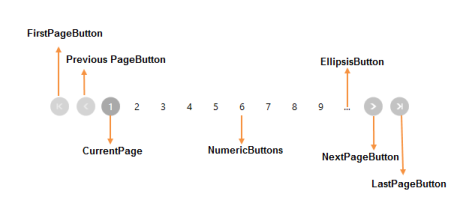
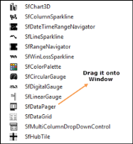

# Getting Started with WPF DataPager (SfDataPager)

This section describes the assemblies that are required for the `SfDataPager` control in your WPF application. The following assemblies are required in your application.

<table>
<tr>
<th>
Required Assemblies
</th>
<th>
Description
</th>
</tr>
<tr>
<td>
Syncfusion.SfGrid.WPF
</td>
<td>
Contains the SfDataPager control and related UI components.
</td>
</tr>
</table>

When you use SfDataPager with SfDataGrid, you need to add the following assemblies along with the default assemblies.

<table>
<tr>
<th>
Required Assemblies
</th>
<th>
Description
</th>
</tr>
<tr>
<td>
Syncfusion.Data.WPF
</td>
<td>
Contains base classes for data operations (sorting, grouping, filtering).
</td>
</tr>
<tr>
<td>
Syncfusion.Shared.WPF
</td>
<td>
Contains editor controls used in data cells (CurrencyTextBox, PercentEdit, DateTimeEdit).
</td>
</tr>
</table>

## Control Structure

The following screenshot describes the elements of the DataPager control.

* FirstPageButton: Moves the current page index to the first page and displays the first page data.
* PreviousPageButton: Moves the current page index to the previous page and displays the previous page data.
* LastPageButton: Moves the current page index to the last page and displays the last page data.
* NextPageButton: Moves the current page index to the next page and displays the next page data.
* NumericButtons: Denotes the available pages. You can directly navigate to the page by clicking the corresponding button.
* EllipsisButton: Displayed when `AutoEllipsis` mode is set. This button displays the next set of numeric page buttons.

## Create Simple Application with SfDataPager

The following steps help you to use the SfDataPager in an application:

### Option A: Add Control via Designer

1. Create a new WPF application in Visual Studio.

2. Open the Visual Studio toolbox and locate **SyncfusionControls**. Drag **SfDataPager** to the design window.

   

3. When you drag SfDataPager to the window, the required assembly references are automatically added to your project.

### Option B: Add Control Manually in XAML

1. Create a new WPF application in Visual Studio.

2. Add the following required assemblies to the project:
   - Syncfusion.SfGrid.WPF
   - Syncfusion.Data.WPF (if using SfDataPager with SfDataGrid)

3. Add the SfDataPager namespace to your XAML page and declare the control.




<Window x:Class="SfDataPagerDemo.MainWindow"
        xmlns="http://schemas.microsoft.com/winfx/2006/xaml/presentation"
        xmlns:x="http://schemas.microsoft.com/winfx/2006/xaml"
        xmlns:d="http://schemas.microsoft.com/expression/blend/2008"
        xmlns:mc="http://schemas.openxmlformats.org/markup-compatibility/2006"
        xmlns:local="clr-namespace:SfDataPagerDemo"        
        xmlns:datapager="clr-namespace:Syncfusion.UI.Xaml.Controls.DataPager;assembly=Syncfusion.SfGrid.WPF"
        mc:Ignorable="d"
        Title="MainWindow" Height="350" Width="525">
    <Grid>
        <datapager:SfDataPager x:Name="sfDataPager"/>
    </Grid>
</Window>



{{ codesnippet1 | OrderList_Indent_Level_1 }}

4. Create a business object class named `OrderInfo`.




public class OrderInfo
{
    int orderID;
    string customerId;
    string country;
    string customerName;
    string shippingCity;

    public int OrderID
    {
        get { return orderID; }
        set { orderID = value; }
    }

    public string CustomerID
    {
        get { return customerId; }
        set { customerId = value; }
    }

    public string CustomerName
    {
        get { return customerName; }
        set { customerName = value; }
    }

    public string Country
    {
        get { return country; }
        set { country = value; }
    }

    public string ShipCity
    {
        get { return shippingCity; }
        set { shippingCity = value; }
    }

    public OrderInfo(int orderId, string customerName, string country, string customerId, string shipCity)
    {
        this.OrderID = orderId;
        this.CustomerName = customerName;
        this.Country = country;
        this.CustomerID = customerId;
        this.ShipCity = shipCity;
    }
}



{{ codesnippet2 | OrderList_Indent_Level_1 }}

5. Add the following code in the `ViewModel` class.




public class ViewModel
{
    ObservableCollection<OrderInfo> orderCollection;

    public ObservableCollection<OrderInfo> OrderInfoCollection
    {
        get { return orderCollection; }
        set { orderCollection = value; }
    }

    public ViewModel()
    {
        orderCollection = new ObservableCollection<OrderInfo>();
        this.GenerateOrders();
    }

    private void GenerateOrders()
    {
        orderCollection.Add(new OrderInfo(1001, "Maria Anders", "Germany", "ALFKI", "Berlin"));
        orderCollection.Add(new OrderInfo(1002, "Ana Trujilo", "Mexico", "ANATR", "Mexico D.F."));
        orderCollection.Add(new OrderInfo(1003, "Antonio Moreno", "Mexico", "ANTON", "Mexico D.F."));
        orderCollection.Add(new OrderInfo(1004, "Thomas Hardy", "UK", "AROUT", "London"));
        orderCollection.Add(new OrderInfo(1005, "Christina Berglund", "Sweden", "BERGS", "Lula"));
        orderCollection.Add(new OrderInfo(1006, "Hanna Moos", "Germany", "BLAUS", "Mannheim"));
        orderCollection.Add(new OrderInfo(1007, "Frederique Citeaux", "France", "BLONP", "Strasbourg"));
        orderCollection.Add(new OrderInfo(1008, "Martin Sommer", "Spain", "BOLID", "Madrid"));
        orderCollection.Add(new OrderInfo(1009, "Laurence Lebihan", "France", "BONAP", "Marseille"));
        orderCollection.Add(new OrderInfo(1010, "Elizabeth Lincoln", "Canada", "BOTTM", "Tsawassen"));
    }
}



{{ codesnippet3 | OrderList_Indent_Level_1 }}

6. Set the ViewModel instance as the DataContext of the window. Now, you can bind the data collection to the [Source](https://help.syncfusion.com/cr/wpf/Syncfusion.UI.Xaml.Controls.DataPager.SfDataPager.html#Syncfusion_UI_Xaml_Controls_DataPager_SfDataPager_Source) property of `SfDataPager`.




<Window.DataContext>
    <local:ViewModel/>
</Window.DataContext>
<Grid>
    <datapager:SfDataPager x:Name="sfDataPager" 
						   Grid.Row="1"
						   AccentBackground="DodgerBlue"
						   NumericButtonCount="5"
						   PageSize="5" 
						   Source="{Binding OrderInfoCollection}" />
</Grid>



{{ codesnippet4 | OrderList_Indent_Level_1 }}

7. Then bind the [PagedSource](https://help.syncfusion.com/cr/wpf/Syncfusion.UI.Xaml.Controls.DataPager.SfDataPager.html#Syncfusion_UI_Xaml_Controls_DataPager_SfDataPager_PagedSource) property of the `SfDataPager` control to the [ItemsSource](https://help.syncfusion.com/cr/wpf/Syncfusion.UI.Xaml.Grid.SfDataGrid.html#Syncfusion_UI_Xaml_Grid_SfDataGrid_ItemsSource) property of `SfDataGrid`. The `sfGrid` namespace below points to the `Syncfusion.UI.Xaml.Grid` namespace in the `Syncfusion.SfGrid.WPF` assembly.




<Window.DataContext>
    <local:ViewModel/>
</Window.DataContext>
<Grid>
    <Grid.RowDefinitions>
        <RowDefinition Height="*" />
        <RowDefinition Height="Auto" />
    </Grid.RowDefinitions>
    <sfGrid:SfDataGrid AutoGenerateColumns="True" 
					   ItemsSource="{Binding ElementName=sfDataPager,Path=PagedSource}"/>
    <datapager:SfDataPager x:Name="sfDataPager" 
						   Grid.Row="1"
						   NumericButtonCount="10"
						   PageSize="10" 
						   Source="{Binding OrdersDetails}" />
</Grid>



{{ codesnippet5 | OrderList_Indent_Level_1 }}

The following screenshot displays the output for the implementation of the SfDataPager in the SfDataGrid control.

## Theme

SfDataPager supports various built-in themes. Refer to the below links to apply themes for the SfDataPager,

  * [Apply theme using SfSkinManager](https://help.syncfusion.com/wpf/themes/skin-manager)
	
  * [Create a custom theme using ThemeStudio](https://help.syncfusion.com/wpf/themes/theme-studio#creating-custom-theme)

  

