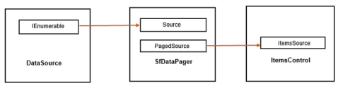

# WPF DataPager (SfDataPager) Overview

The SfDataPager control provides a configurable user interface for paging using a data collection. You can bind the SfDataPager to any IEnumerable <a>(https://learn.microsoft.com/en-us/previous-versions/windows/silverlight/dotnet-windows-silverlight/h1x9x1b1(v=vs.95)?redirectedfrom=MSDN)collection</a>. The SfDataPager control wraps the collection internally in PagedCollectionView and exposes by using PagedSource property. PagedCollectionView helps to provide the paging functionality. You can apply paging for data bound control by setting PagedSource property as ItemsSource for that control.

The following screenshot displays the basic concept of paging.

