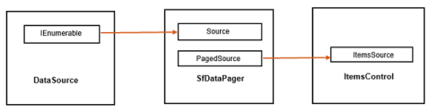

# About Syncfusion® WPF SfDataPager Control

The SfDataPager provides a configurable user interface for paging using a data collection. You can bind it to any [IEnumerable](https://learn.microsoft.com/en-us/dotnet/api/system.collections.ienumerable?redirectedfrom=MSDN&view=net-5.0). The control wraps the collection internally in `PagedCollectionView` and exposes by using [SfDataPager.PagedSource](https://help.syncfusion.com/cr/wpf/Syncfusion.UI.Xaml.Controls.DataPager.SfDataPager.html#Syncfusion_UI_Xaml_Controls_DataPager_SfDataPager_PagedSource) property. `PagedCollectionView` helps to provide the paging functionality. You can apply paging for data bound control by setting `PagedSource` property as ItemsSource for that control.

The following screenshot displays the basic concept of paging.

