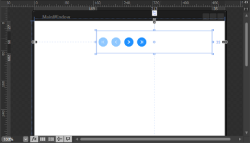

# Styles and Templates in WPF DataPager (SfDataPager)

WPF Styles and Templates is a suite of features (styles and templates) that allow developers and designers to create visual compelling effects and consistent appearance of the products.

This section explains the information to change the visual appearance of the DataPager. In addition, you can edit the structure of the DataPager by using Blend and VisualStudio that helps you to customize their appearances. 

* Edit Appearance in Expression Blend
* Edit Appearance in VisualStudio

## Edit Appearance in Expression Blend

The section explains how to edit a SfDataPager style in Expression Blend. The following steps helps to Edit the style of the control in Expression Blend.

* Open your application in Expression Blend
* Select the SfDataPager control from the window.

*  Go to the Menu bar Choose Object > EditStyle

* There are two options in submenu,
* Edit a Copy –Edits a copy of the default style. When you select this option, a new dialog window opens as follows.

The Create style Resources dialog prompts you to enter the name or change the name of your style, as well as to choose the location for the style.

When OK is pressed, the Expression Blend generates the style of the SfDataPager control in the Resource section. You can edit the generated XAML in the XAML view or in VisualStudio

* Create Empty- create an empty style for the SfDataPager. When you select this option, the Create style Resources dialog is opened. You can enter the name or change the name of style and choose the location for the style.

## Edit Appearance in Visual Studio

This section explains how to edit the style of SfDataPager in Visual Studio Designing View. To Edit the control style in Visual Studio, refer to the following steps,

* Open your application in Visual Studio.
* Open Design view>> Select SfDataPager Control >Right Click on SfDataPagerControl, Menu options are displayed.

* Click EditTemplate, you have the following two options. 
* Edit a Copy –Edit a copy of the default style. When you select this option, a new dialog window opens as follows.

The Create style Resources dialog prompts you to enter the name or change the name for your style, as well as to choose the location for the style.

When OK is pressed, Visual Studio generate the style of SfDataPager in the Resource section.The control style of the SfDataPager control is loaded in the XAML . You can edit the generated XAML in the XAML view.

* Create Empty- create an empty style for the SfDataPager. When you select this option, the Create style Resources dialog opens. You can enter the name or change the name of style and choose the location where your style is defined.

