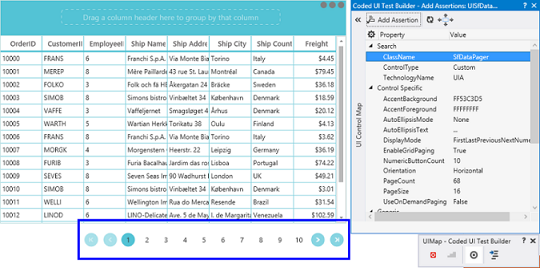
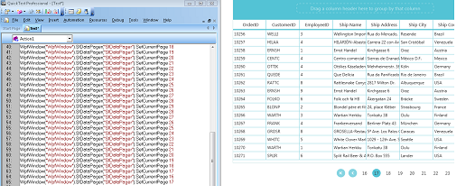

# UIAutomation in WPF DataPager (SfDataPager)

SfDataPager supports the following UIAutomation,

* Coded UI
* Quick Test Professional

## Coded UI

SfDataPager supports CodedUITest automation that helps you to create an automation test with SfDataPager elements and record the sequence of actions.

There are three levels of support in CodedUITest for SfDataPager

<table>
<tr>
<th>
Levels</th><th>
Description</th></tr>
<tr>
<td>
Level – 1</td><td>
Record and Detects the UI Elements when the actions in the Control is performed.</td></tr>
<tr>
<td>
Level – 2</td><td>
Provides custom properties for UI elements when you drag the Cross hair to any UI element.</td></tr>
<tr>
<td>
Level – 3</td><td>
CodedUITest Builder generates code from the recorded session and you need to implement custom class to access custom properties, so the generated code is simplified.</td></tr>
</table>

To know more about CodedUITest, refer to the [link](http://help.syncfusion.com/wpf/sfdatagrid/ui-automation#coded-ui-test).

The following screenshot displays the SfDataPager properties when you drag the crosshair to the SfDataPager

The following table describes the properties of SfDataPager.

<table>
<tr>
<th>
  UI Element</th><th>
Properties</th></tr>
<tr>
<td>
SfDataPager</td><td>
* AccentBackground* AccentForeground* AutoEllipsisMode* AutoEllipsisText* DisplayMode* EnableGridPaging* NumericButtonCount* Orientation* PageCount* PageSize* UseOnDemandPaging</td></tr>
</table>

## Quick Test Professional

SfDataPager supports QTP test. You can record the actions performed in the control by the corresponding method name 
with Syncfusion namespace. To know more about QTP test, refer to the [link](http://help.syncfusion.com/wpf/sfdatagrid/ui-automation#quick-test-professional-qtp)

The following screenshot displays the QTP Test for SfDataPager

The following table describe the methods of SfDataPager.

<table>
<tr>
<th>
Method</th><th>
Description</th><th>
Parameters </th><th>
Return Type </th></tr>
<tr>
<td>
void SetCurrentPage(int pageIndex</td><td>
To set the current page in SfDataPager</td><td>
 Int pageIndex</td><td>
Void</td></tr>
</table>

