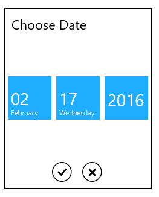
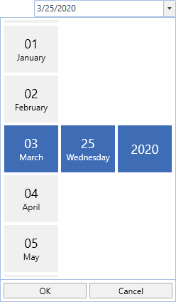
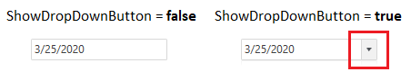

# Customizing DropDown of WPF SfDatePicker

We can customize the [SfDateSelector](https://help.syncfusion.com/cr/wpf/Syncfusion.SfInput.Wpf~Syncfusion.Windows.Controls.Input.SfDateSelector.html) visibility, drop down button visibility and height of the `SfDateSelector`.

## Change DropDown height

The height of drop down can be changed using [DropDownHeight](https://help.syncfusion.com/cr/wpf/Syncfusion.SfInput.Wpf~Syncfusion.Windows.Controls.Input.SfDatePicker~DropDownHeight.html) property.




<syncfusion:SfDatePicker DropDownHeight="300" 
	                     x:Name="sfDatePicker"/>




SfDatePicker sfDatePicker = new SfDatePicker();
sfDatePicker.DropDownHeight = 300;




## Show or hide SfDateSelector

We can show or hide the date selector drop down programmatically at any time by using the [IsDropDownOpen](https://help.syncfusion.com/cr/wpf/Syncfusion.SfInput.Wpf~Syncfusion.Windows.Controls.Input.SfDatePicker~IsDropDownOpen.html) property as either `true` or `false`. The default value of `IsDropDownOpen` property is `false`.




<syncfusion:SfDatePicker IsDropDownOpen="True" 
	                     x:Name="sfDatePicker"/>




SfDatePicker sfDatePicker = new SfDatePicker();
sfDatePicker.IsDropDownOpen = true;




Here, initially the `SfDatePicker` shows the date selector drop down.

## Show or hide DropDown button

If we wants to restrict the user to selecting the date from  date selector drop down, we can hide the drop down button by using the [ShowDropDownButton](https://help.syncfusion.com/cr/wpf/Syncfusion.SfInput.Wpf~Syncfusion.Windows.Controls.Input.SfDatePicker~ShowDropDownButton.html) property value as `false`. The default value of `ShowDropDownButton` property is `true`.




<syncfusion:SfDatePicker ShowDropDownButton="False" 
	                     x:Name="sfDatePicker"/>




SfDatePicker sfDatePicker = new SfDatePicker();
sfDatePicker.ShowDropDownButton = false;




