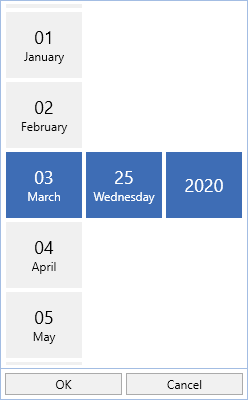
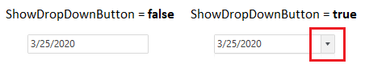

# Customizing DropDown in WPF DatePicker

We can customize the [SfDateSelector](https://help.syncfusion.com/cr/wpf/Syncfusion.Windows.Controls.Input.SfDateSelector.html) visibility, drop-down button visibility and height of the `SfDateSelector`.

## Change DropDown height

The height of drop-down can be changed using [DropDownHeight](https://help.syncfusion.com/cr/wpf/Syncfusion.Windows.Controls.Input.SfDatePicker.html#Syncfusion_Windows_Controls_Input_SfDatePicker_DropDownHeight) property.




<Window 
    . . .
    xmlns:syncfusion="http://schemas.syncfusion.com/wpf">
    <syncfusion:SfDatePicker DropDownHeight="300" 
	                     x:Name="sfDatePicker"/>
</Window>




using Syncfusion.Windows.Controls.Input;

SfDatePicker sfDatePicker = new SfDatePicker();
sfDatePicker.DropDownHeight = 300;




## Show or hide DropDown button

If we want to restrict the user from selecting a date from a drop-down date selector, we can hide the drop-down button by using the [ShowDropDownButton](https://help.syncfusion.com/cr/wpf/Syncfusion.Windows.Controls.Input.SfDatePicker.html#Syncfusion_Windows_Controls_Input_SfDatePicker_ShowDropDownButton) property value as `false`. The default value of `ShowDropDownButton` property is `true`.




<Window 
    . . .
    xmlns:syncfusion="http://schemas.syncfusion.com/wpf">
    <syncfusion:SfDatePicker ShowDropDownButton="False" 
	                     x:Name="sfDatePicker"/>
</Window>




using Syncfusion.Windows.Controls.Input;

SfDatePicker sfDatePicker = new SfDatePicker();
sfDatePicker.ShowDropDownButton = false;




Click [here](https://github.com/SyncfusionExamples/wpf-date-picker-examples/tree/master/Samples/DateSelectorItem) to download the sample that showcases the DropDown customization support.
