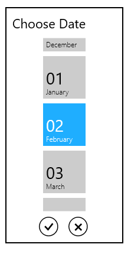

# Date Formatting in WPF SfDatePicker

The [SfDatePicker](https://www.syncfusion.com/wpf-ui-controls/datepicker) control allows the user to select and display the date in various formats.

## Display the date using the FormatString

 We can edit and display the selected date with various formatting like date, month and year formats by using the [FormatString](https://help.syncfusion.com/cr/wpf/Syncfusion.Windows.Controls.Input.SfDatePicker.html#Syncfusion_Windows_Controls_Input_SfDatePicker_FormatString) property. The default value of `FormatString` property is `"d"`.




<syncfusion:SfDatePicker x:Name="sfDatePicker" 
                         FormatString="M"/>




SfDatePicker sfDatePicker = new SfDatePicker();
sfDatePicker.FormatString = "M";




## Specifying format for the DateSelector

We can allow the user to select the pair of date, month and year selector or any single selector cell from the [SfDateSelector](https://help.syncfusion.com/cr/wpf/Syncfusion.Windows.Controls.Input.SfDateSelector.html) by using the [SelectorFormatString](https://help.syncfusion.com/cr/wpf/Syncfusion.Windows.Controls.Input.SfDatePicker.html#Syncfusion_Windows_Controls_Input_SfDatePicker_SelectorFormatString) property. The default value of `SelectorFormatString` property is `"M/d/yyyy"` and the date, time and year value selector is enabled in the `SfDateSelector`.




<syncfusion:SfDatePicker x:Name="sfDatePicker" 
                         SelectorFormatString="M"/>




SfDatePicker sfDatePicker = new SfDatePicker();
sfDatePicker.SelectorFormatString = "M";




Here, we can only able to select the month value from the `SfDateSelector`

Click [here](https://github.com/SyncfusionExamples/wpf-date-picker-examples/tree/master/Samples/Formatting) to download the sample that showcases the edit, display date formatting and date selection formatting by the `SfDatePicker`.

N> A detailed explanation of standard date time formatting is available [here](http://msdn.microsoft.com/en-us/library/az4se3k1(v=vs.71).aspx). The result string produced by these format specifiers are influenced by the settings in the Regional Options control panel. Computers with different cultures or different date and time settings will generate different result strings.

