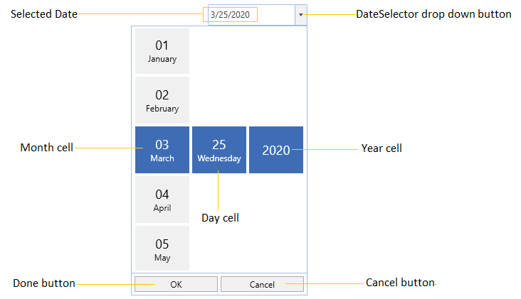
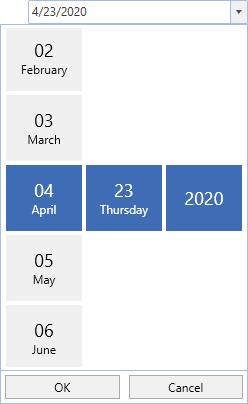

# Getting Started with WPF SfDatePicker

This section explains how to create a [WPF DatePicker](https://www.syncfusion.com/wpf-controls/datepicker) and explains about its structure.

## Structure of SfDatePicker

## Assembly deployment

Refer to the [control dependencies](https://help.syncfusion.com/wpf/control-dependencies#sfdatepicker) section to get the list of assemblies or NuGet package that needs to be added as a reference to use the control in any application.

You can find more details about installing the NuGet package in a WPF application in the following link: 

[How to install nuget packages](https://help.syncfusion.com/wpf/nuget-packages)

## Add control through designer

The `SfDatePicker` control can be added to an application by dragging it from the toolbox to a designer view. The following required assembly references will be added automatically:

* Syncfusion.SfInput.WPF
* Syncfusion.SfShared.WPF

## Adding control manually in XAML

To add the control manually in XAML, follow the given steps:

1.	Add the following required assembly references to the project:
    * Syncfusion.SfInput.WPF
    * Syncfusion.SfShared.WPF
2.	Import Syncfusion WPF schema **http://schemas.syncfusion.com/wpf** in the XAML page.
3.	Declare the `SfDatePicker` control in the XAML page.




<Window xmlns="http://schemas.microsoft.com/winfx/2006/xaml/presentation"
        xmlns:x="http://schemas.microsoft.com/winfx/2006/xaml"
        xmlns:syncfusion="http://schemas.syncfusion.com/wpf" 
        x:Class="SfDatePickerSample.MainWindow"
        Title="SfDatePicker Sample" Height="350" Width="525">
    <Grid>
        <!-- Adding SfDatePicker control -->
        <syncfusion:SfDatePicker x:Name="sfDatePicker" 
                                 Width="200"/>
    </Grid>
</Window>




## Add control manually in C\#

To add the control manually in C#, follow the given steps:

1.	Add the following required assembly references to the project:
    * Syncfusion.SfInput.WPF
    * Syncfusion.SfShared.WPF
2.	Import the `SfDatePicker` namespace **using Syncfusion.Windows.Controls.Input;**.
3.	Create an `SfDatePicker` instance, and add it to the window.




using Syncfusion.Windows.Controls.Input;
namespace SfDatePickerSample {    
    public partial class MainWindow : Window {
        public MainWindow() {
            InitializeComponent();

            //Creating an instance of SfDatePicker control
            SfDatePicker sfDatePicker = new SfDatePicker();

            //Adding SfDatePicker as window content
            this.Content = sfDatePicker;
        } 
    }
}




## Setting the Date

We can set or change the selected date by using [Value](https://help.syncfusion.com/cr/wpf/Syncfusion.Windows.Controls.Input.SfDatePicker.html#Syncfusion_Windows_Controls_Input_SfDatePicker_Value) property. If we not assign any value for the `Value` property, it will automatically assign the current system date as `Value` property value.




<syncfusion:SfDatePicker  Value="5/30/2021"
                          Name="sfDatePicker" />




SfDatePicker sfDatePicker= new SfDatePicker();
sfDatePicker.Value = new DateTime(2021,5,30);




## Date changed notification

When the selected date of `SfDatePicker`is changed, it will be notified by using the [ValueChanged](https://help.syncfusion.com/cr/wpf/Syncfusion.Windows.Controls.Input.SfDatePicker.html) event. You can get the details about the checked item in [ItemCheckedEventArgs](https://help.syncfusion.com/cr/wpf/Syncfusion.Windows.Tools.Controls.ItemCheckedEventArgs.html).

* **OldValue** : Gets a date which is previously selected.

* **NewValue** : Gets a date which is currently selected.




<syncfusion:SfDatePicker ValueChanged="SfdatePicker_ValueChanged" 
                         Name="sfDatePicker"/>




SfDatePicker sfDatePicker = new SfDatePicker();
sfDatePicker.ValueChanged += SfdatePicker_ValueChanged;




You can handle the event as follows:




private void SfdatePicker_ValueChanged(DependencyObject d, DependencyPropertyChangedEventArgs e) {          
    Console.WriteLine("The Old selected Date: " + e.OldValue.ToString());
    Console.WriteLine("The Newly selected Date: " + e.NewValue.ToString());            
}




## Display the date using the FormatString

 We can edit and display the selected date with various formatting like date, month and year formats by using the [FormatString](https://help.syncfusion.com/cr/wpf/Syncfusion.Windows.Controls.Input.SfDatePicker.html#Syncfusion_Windows_Controls_Input_SfDatePicker_FormatString) property. The default value of `FormatString` property is `"d"`.




<syncfusion:SfDatePicker x:Name="sfDatePicker" 
                         FormatString="M"/>




SfDatePicker sfDatePicker = new SfDatePicker();
sfDatePicker.FormatString = "M";




## Specifying format for the DateSelector

We can allow the user to select the pair of date, month and year selector or any single selector cell from the [SfDateSelector](https://help.syncfusion.com/cr/wpf/Syncfusion.Windows.Controls.Input.SfDateSelector.html) by using the [SelectorFormatString](https://help.syncfusion.com/cr/wpf/Syncfusion.Windows.Controls.Input.SfDatePicker.html#Syncfusion_Windows_Controls_Input_SfDatePicker_SelectorFormatString) property. The default value of `SelectorFormatString` property is `"M/d/yyyy"` and the date, time and year value selector is enabled in the `SfDateSelector`.




<syncfusion:SfDatePicker x:Name="sfDatePicker" 
                         SelectorFormatString="M"/>




SfDatePicker sfDatePicker = new SfDatePicker();
sfDatePicker.SelectorFormatString = "M";




Here, we can only able to select the month value from the `SfDateSelector`

Click [here](https://github.com/SyncfusionExamples/wpf-date-picker-examples/tree/master/Samples/Formatting) to download the sample that showcases the display date formatting and date selection formatting by the `SfDatePicker`.

## Set selected value on lost focus

If we want to update the selected date of `SfDateSelector` to the `SfDatePicker.Value` property by moving the focus from `SfDateSelector` to anywhere, use the [SetValueOnLostFocus](https://help.syncfusion.com/cr/wpf/Syncfusion.Windows.Controls.Input.SfDatePicker.html#Syncfusion_Windows_Controls_Input_SfDatePicker_SetValueOnLostFocus) property value as `true`. By default, the selected date of `SfDateSelector` can be sets to the `SfDatePicker.Value` property only by clicking the `OK` button, otherwise the selected value not updated by the move focus.




<syncfusion:SfDatePicker  SetValueOnLostFocus="True"
                          Name="sfDatePicker" />




SfDatePicker sfDatePicker= new SfDatePicker();
sfDatePicker.SetValueOnLostFocus = true;




Click [here](https://github.com/SyncfusionExamples/wpf-date-picker-examples/tree/master/Samples/Value-setting) to download the sample that showcases the value setting support in the `SfDatePicker`.

## Localization support

Localization is the process of translating the application resources into different language for the specific cultures. You can localize the `Ok` and `Cancel` button text in `SfDatePicker` control by adding resource file for each language.

N> Refer [Localization](https://help.syncfusion.com/wpf/localization) page to know more about how to provide a localization support for the `SfDatePicker`.

## Theme

SfDatePicker supports various built-in themes. Refer to the below links to apply themes for the SfDatePicker,

  * [Apply theme using SfSkinManager](https://help.syncfusion.com/wpf/themes/skin-manager)
	
  * [Create a custom theme using ThemeStudio](https://help.syncfusion.com/wpf/themes/theme-studio#creating-custom-theme)

