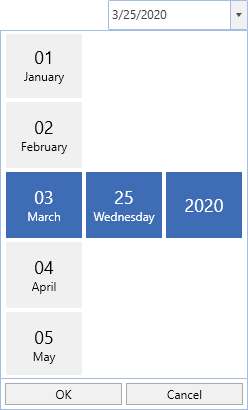

# About Syncfusion WPF DatePicker Control

The [SfDatePicker](https://help.syncfusion.com/cr/wpf/Syncfusion.Windows.Controls.Input.SfDatePicker.html) control allows the user to select date values in a touch friendly manner.

### Normal view:

### Expanded view:

### Key Features

Formatting – The control displays the selected Date value in various formats.

Date Selector – The drop-down portion used for selecting the date can be customized.

