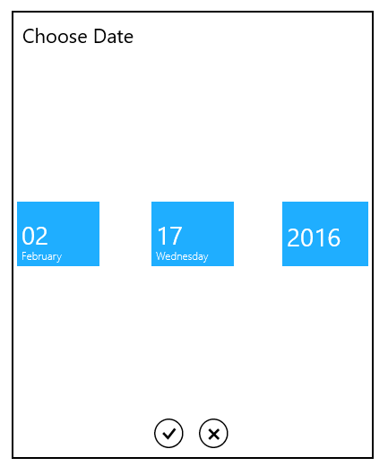

# SelectorItem Customization of WPF SfDatePicker

We can change the date selector items width, height and spacing.

## SfDateSelector item width and height

The item size in the `SfDateSelector` control can be changed by setting the [SelectorItemWidth](https://help.syncfusion.com/cr/wpf/Syncfusion.SfInput.Wpf~Syncfusion.Windows.Controls.Input.SfDatePicker~SelectorItemWidth.html) and [SelectorItemHeight](https://help.syncfusion.com/cr/wpf/Syncfusion.SfInput.Wpf~Syncfusion.Windows.Controls.Input.SfDatePicker~SelectorItemHeight.html) properties. The default value of the `SelectorItemWidth` and `SelectorItemHeight` properties is `80` and `70`. 




<syncfusion:SfDatePicker SelectorItemWidth="100" 
                         SelectorItemHeight="100" 
	                     x:Name="sfDatePicker"/>




SfDatePicker sfDatePicker = new SfDatePicker();
sfDatePicker.SelectorItemWidth = 100;
sfDatePicker.SelectorItemHeight = 100;




## SfDateSelector item spacing
 
We can change the space between `SfDateSelector` date, month and year items by using the [SelectorItemSpacing](https://help.syncfusion.com/cr/wpf/Syncfusion.SfInput.Wpf~Syncfusion.Windows.Controls.Input.SfDatePicker~SelectorItemSpacing.html). The default value of the `SelectorItemSpacing` property is `4`.




<syncfusion:SfDatePicker SelectorItemSpacing="50" 
	                     x:Name="sfDatePicker"/>




SfDatePicker sfDatePicker = new SfDatePicker();
sfDatePicker.SelectorItemSpacing = 50;




## SelectorItemCount

The [SelectorItemCount](https://help.syncfusion.com/cr/wpf/Syncfusion.SfInput.Wpf~Syncfusion.Windows.Controls.Input.SfDatePicker~SelectorItemCount.html) property is used to specify the number of items to be used in SfDateSelector.

The following code sample shows the usage of the [SelectorItemWidth](https://help.syncfusion.com/cr/wpf/Syncfusion.SfInput.Wpf~Syncfusion.Windows.Controls.Input.SfDatePicker~SelectorItemWidth.html), [SelectorItemHeight](https://help.syncfusion.com/cr/wpf/Syncfusion.SfInput.Wpf~Syncfusion.Windows.Controls.Input.SfDatePicker~SelectorItemHeight.html), [SelectorItemSpacing](https://help.syncfusion.com/cr/wpf/Syncfusion.SfInput.Wpf~Syncfusion.Windows.Controls.Input.SfDatePicker~SelectorItemSpacing.html), and [SelectorItemCount](https://help.syncfusion.com/cr/wpf/Syncfusion.SfInput.Wpf~Syncfusion.Windows.Controls.Input.SfDatePicker~SelectorItemCount.html) properties. 



	<Grid Background="{StaticResource ApplicationPageBackgroundThemeBrush}">

            <syncfusion:SfDatePicker VerticalAlignment="Center"

                                   Width="200"

	SelectorItemWidth="100"

                SelectorItemHeight="100"

                SelectorItemSpacing="50"

                SelectorItemCount="4"/>

	</Grid>



The output is displayed in the following image:

