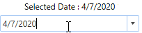
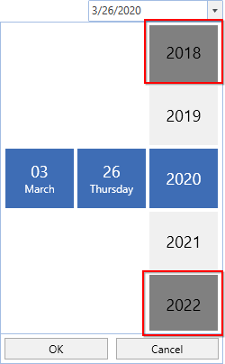

# Setting Date in WPF DatePicker (SfDatePicker)

We can change the value of [SfDatePicker](https://help.syncfusion.com/cr/wpf/Syncfusion.Windows.Controls.Input.SfDatePicker.html) by using the [SfDateSelector](https://help.syncfusion.com/cr/wpf/Syncfusion.Windows.Controls.Input.SfDateSelector.html) and keyboard interaction.

## Setting Date using property

We can set or change the selected date by using [Value](https://help.syncfusion.com/cr/wpf/Syncfusion.Windows.Controls.Input.SfDatePicker.html#Syncfusion_Windows_Controls_Input_SfDatePicker_Value) property. If we not assign any value for the `Value` property, it will automatically assign the current system date as `Value` property value.




<syncfusion:SfDatePicker  Value="5/30/2021"
                          Name="sfDatePicker" />




SfDatePicker sfDatePicker= new SfDatePicker();
sfDatePicker.Value = new DateTime(2021,5,30);




## Setting Null Value

If we want to set null value for the `SfDatePicker`, set the [AllowNull](https://help.syncfusion.com/cr/wpf/Syncfusion.Windows.Controls.Input.SfDatePicker.html#Syncfusion_Windows_Controls_Input_SfDatePicker_AllowNull) property as `true` and [Value](https://help.syncfusion.com/cr/wpf/Syncfusion.Windows.Controls.Input.SfDatePicker.html#Syncfusion_Windows_Controls_Input_SfDatePicker_Value) property as `null`. If `AllowNull` property is `false`, then the current system date is updated in  `Value` property and displayed instead of `null`. 




<syncfusion:SfDatePicker  AllowNull="True" 
                          Value="{x:Null}"
                          Name="sfDatePicker" />




SfDatePicker sfDatePicker= new SfDatePicker();
sfDatePicker.AllowNull = true;
sfDatePicker.Value = null;




## Setting WaterMark text

We can prompt the user with some information by using the [Watermark](https://help.syncfusion.com/cr/wpf/Syncfusion.Windows.Controls.Input.SfDatePicker.html#Syncfusion_Windows_Controls_Input_SfDatePicker_Watermark) property. This will apply on when the `SfDatePicker` contains the [Value](https://help.syncfusion.com/cr/wpf/Syncfusion.Windows.Controls.Input.SfDatePicker.html#Syncfusion_Windows_Controls_Input_SfDatePicker_Value) property as `null` and [AllowNull](https://help.syncfusion.com/cr/wpf/Syncfusion.Windows.Controls.Input.SfDatePicker.html#Syncfusion_Windows_Controls_Input_SfDatePicker_AllowNull) property as `true` . If `AllowNull` property is `false`, then the current system date is updated in  `Value` property and displayed instead of `Watermark` text. 




<syncfusion:SfDatePicker Watermark="Select the Date"
                         AllowNull="True"  
                         Value="{x:Null}"
                         Name="sfDatePicker" >
</syncfusion:SfDatePicker>




SfDatePicker sfDatePicker = new SfDatePicker();
sfDatePicker.Watermark = "Select the Date";
sfDatePicker.AllowNull = true;
sfDatePicker.Value = null;




### Setting WaterMark Template

We can change the template of the `Watermark` by using the [WatermarkTemplate](https://help.syncfusion.com/cr/wpf/Syncfusion.Windows.Controls.Input.SfDatePicker.html#Syncfusion_Windows_Controls_Input_SfDatePicker_WatermarkTemplate) property.




<syncfusion:SfDatePicker Name="sfDatePicker" 
                         AllowNull="True" 
                         Value="{x:Null}" 
                         Watermark="Select the Date" >
    <syncfusion:SfDatePicker.WatermarkTemplate >
        <DataTemplate>
            <Border Background="Yellow">
                <TextBlock Foreground="Blue"
                           FontWeight="Bold"  
                           Text="{Binding}" 
                           TextAlignment="Center"/>
            </Border>
        </DataTemplate>
    </syncfusion:SfDatePicker.WatermarkTemplate>
</syncfusion:SfDatePicker>




## Set selected value on lost focus

If we want to update the selected date of `SfDateSelector` to the `SfDatePicker.Value` property by moving the focus from `SfDateSelector` to anywhere, use the [SetValueOnLostFocus](https://help.syncfusion.com/cr/wpf/Syncfusion.Windows.Controls.Input.SfDatePicker.html#Syncfusion_Windows_Controls_Input_SfDatePicker_SetValueOnLostFocus) property value as `true`. By default, the selected date of `SfDateSelector` can be sets to the `SfDatePicker.Value` property only by clicking the `OK` button, otherwise the selected value not updated by the move focus.




<syncfusion:SfDatePicker  SetValueOnLostFocus="True" 
                          Name="sfDatePicker" />




SfDatePicker sfDatePicker= new SfDatePicker();
sfDatePicker.SetValueOnLostFocus = true;




## Setting the date using editing

If we want to perform the validation after the user completely entering their date inputs, use the [AllowInlineEditing](https://help.syncfusion.com/cr/wpf/Syncfusion.Windows.Controls.Input.SfDatePicker.html#Syncfusion_Windows_Controls_Input_SfDatePicker_AllowInlineEditing) property value as `true`. Then the entered date value is validated with the [FormatString](https://help.syncfusion.com/cr/wpf/Syncfusion.Windows.Controls.Input.SfDatePicker.html#Syncfusion_Windows_Controls_Input_SfDatePicker_FormatString) property value by pressing the `Enter` key or lost focus. If entered value is not suit with `FormatString` property, the selected date will be set as default format value.

By default, the user entering each input numbers are automatically validated with the `FormatString` formats and assigned the proper value for it, then it will move to next input part of the date format.




<syncfusion:SfDatePicker Name="sfDatePicker" 
                         AllowInlineEditing="True" />




SfDatePicker sfDatePicker= new SfDatePicker();
sfDatePicker.AllowInlineEditing = true;




## Setting the Input Scope for the On-Screen Keyboard

We can change the input type of the on-screen keyboard by using the [InputScope](https://help.syncfusion.com/cr/wpf/Syncfusion.Windows.Controls.Input.SfDatePicker.html#Syncfusion_Windows_Controls_Input_SfDatePicker_InputScope) property. When the `InputScope` property set to `Number`, only the numeric keypad will be visible in the on-screen keyboard.

N> The [AllowInlineEditing](https://help.syncfusion.com/cr/wpf/Syncfusion.Windows.Controls.Input.SfDatePicker.html#Syncfusion_Windows_Controls_Input_SfDatePicker_AllowInlineEditing) property must be set to `True` for this property to take effect.




<syncfusion:SfDatePicker Name="sfDatePicker" 
                         AllowInlineEditing="True" 
                         InputScope="Number"/>




SfDatePicker sfDatePicker= new SfDatePicker();
sfDatePicker.AllowInlineEditing = true;
sfDatePicker.InputScope = InputScopeNameValue.Date;




## Restrict selecting date limit

we can restrict the user to select a date in the specific date limit by setting the value for the [MinDate](https://help.syncfusion.com/cr/wpf/Syncfusion.Windows.Controls.Input.SfDatePicker.html#Syncfusion_Windows_Controls_Input_SfDatePicker_MinDate) and [MaxDate](https://help.syncfusion.com/cr/wpf/Syncfusion.Windows.Controls.Input.SfDatePicker.html#Syncfusion_Windows_Controls_Input_SfDatePicker_MaxDate) properties. If we assign the value for the `Value` property lower than `MinDate`, then `MinDate` will be the selected date. If we assign the value for the `Value` property higher than `MaxDate`, then `MaxDate` will be the selected date.




<syncfusion:SfDatePicker MinDate="1/1/2020"
                         MaxDate="6/30/2020" 
                         Name="sfDatePicker"/>




SfDatePicker sfDatePicker = new SfDatePicker();
sfDatePicker.MinDate = new DateTime(2020, 1, 1);
sfDatePicker.MaxDate = new DateTime(2020, 6, 30);




Here, the users can select the year from `2019` to `2021` only. 

## Date changed notification

When the selected date of `SfDatePicker`is changed, it will be notified by using the [ValueChanged](https://help.syncfusion.com/cr/wpf/Syncfusion.Windows.Controls.Input.SfDatePicker.html) event. You can get the details about the checked item in [ItemCheckedEventArgs](https://help.syncfusion.com/cr/wpf/Syncfusion.Windows.Tools.Controls.ItemCheckedEventArgs.html).

* **OldValue** : Gets a date which is previously selected.

* **NewValue** : Gets a date which is currently selected.




<syncfusion:SfDatePicker ValueChanged="SfdatePicker_ValueChanged" 
                         Name="sfDatePicker"/>




SfDatePicker sfDatePicker = new SfDatePicker();
sfDatePicker.ValueChanged += SfdatePicker_ValueChanged;




You can handle the event as follows:




private void SfdatePicker_ValueChanged(DependencyObject d, DependencyPropertyChangedEventArgs e) {          
    Console.WriteLine("The Old selected Date: " + e.OldValue.ToString());
    Console.WriteLine("The Newly selected Date: " + e.NewValue.ToString());            
}




Click [here](https://github.com/SyncfusionExamples/wpf-date-picker-examples/tree/master/Samples/Value-setting) to download the sample that showcases the input types and selected date with its notification supports.
