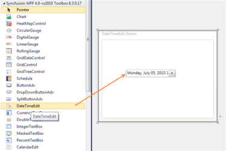
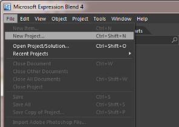
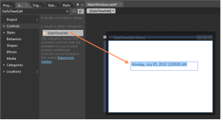
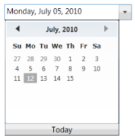

# Getting Started

## Creating a DateTimeEdit Control

DateTimeEdit control can be added to the application by using Visual Studio and Microsoft Expression Blend.

### Creating a DateTimeEdit control in C#

The steps to create a DateTimeEdit control by using Visual Studio in C# are as follows:

1. Open Visual Studio.
2. On the File menu, select New -> Project. This opens the New Project Dialog box.

{{ '' | markdownify }}
{:.image }

3. On the Project Dialog window, select WPF Application, in the name field, type the name of the project, and then click OK.

{{ '' | markdownify }}
{:.image }

4. Add the following reference with the sample project:
1. Syncfusion.Shared.WPF.dll

{{ '' | markdownify }}
{:.image }

5. Click the C# file, to open the C# file and add the DateTimeEdit control to the application. Here is the code to create the DateTimeEdit control in C#:

<table>
<tr>
<td>
C#</td></tr>
<tr>
<td>
namespace WpfApp{    public partial class MainWindow : Window    {        public MainWindow()        {            InitializeComponent();            //Adding DateTimeEdit control to application from Syncfusion.Windows.Shared            Syncfusion.Windows.Shared.DateTimeEdit dateTimeEdit = new                               Syncfusion.Windows.Shared.DateTimeEdit();            dateTimeEdit.Width = 200;            dateTimeEdit.Height = 25;            this.LayoutRoot.Children.Add(dateTimeEdit);        }    }}</td></tr>
</table>

{{ '' | markdownify }}
{:.image }

See Also

Creating a DateTimeEdit control in XAML

Creating a DateTimeEdit control by using Expression Blend

### Creating a DateTimeEdit control in XAML

The steps to create a DateTimeEdit control by using VisualStudio in XAML are as follows:

1. Create a new application in VisualStudio.
2. In the VisualStudio ToolBox, click the Syncfusion WPF Toolbox tab and select DateTimeEdit.
3. Drag and drop the DateTimeEdit control to Design View, to add the DateTimeEdit control to the application.

{{ '' | markdownify }}
{:.image }

4. On the Properties window, customize the properties of the DateTimeEdit control.

<table>
<tr>
<td>
XAML</td></tr>
<tr>
<td>
<Window x:Class="WpfApp.MainWindow"        xmlns="http://schemas.microsoft.com/winfx/2006/xaml/presentation"        xmlns:x="http://schemas.microsoft.com/winfx/2006/xaml"        Title="DateTimeEdit Demo" Height="280" Width="365"        xmlns:syncfusion="              clr-namespace:Syncfusion.Windows.Shared;assembly=Syncfusion.Shared.Wpf"        xmlns:local="clr-namespace:WpfApp">    <Grid x:Name="LayoutRoot"><syncfusion:DateTimeEdit Height="29" Margin="75,71,50,0"                                    VerticalAlignment="Top"/>    </Grid></Window></td></tr>
</table>

{{ '' | markdownify }}
{:.image }

See Also

Creating a DateTimeEdit control by using C#

Creating a DateTimeEdit control by using Expression Blend

### Creating a DateTimeEdit control by using Expression Blend

The steps to create a DateTimeEdit control in the application by using Expression Blend are as follows:

1. Open Expression Blend.
2. On the File menu, select New Project. This opens the New Project dialog box.

{{ '' | markdownify }}
{:.image }

3. In the Project types panel, select WPF Application and then click OK.

{{ '' | markdownify }}
{:.image }

4. Add the following reference with the sample project:
1. Syncfusion.Shared.WPF.dll
5. On the Window menu, select Assets. This opens the Assets Library dialog box.
6. In the Search box, type DateTimeEdit. This displays the search results.

{{ '' | markdownify }}
{:.image }

7. Drag the DateTimeEdit control to Design View.

{{ '' | markdownify }}
{:.image }

<table>
<tr>
<td>
XAML</td></tr>
<tr>
<td>
<Window x:Class="WpfApp.MainWindow"        xmlns="http://schemas.microsoft.com/winfx/2006/xaml/presentation"        xmlns:x="http://schemas.microsoft.com/winfx/2006/xaml"        Title="DateTimeEdit Demo" Height="280" Width="365"        xmlns:syncfusion="              clr-namespace:Syncfusion.Windows.Shared;assembly=Syncfusion.Shared.Wpf"        xmlns:local="clr-namespace:WpfApp">    <Grid x:Name="LayoutRoot"><syncfusion:DateTimeEdit Height="29" Margin="75,71,50,0"                                    VerticalAlignment="Top"/>    </Grid></Window></td></tr>
</table>

{{ '' | markdownify }}
{:.image }

See Also

Creating a DateTimeEdit control by using C#

Creating a DateTimeEdit control in XAML

## Setting Date

You have to use the DateTime property to set the date for the DateTimeEdit control.

<table>
<tr>
<td>
XAML</td></tr>
<tr>
<td>
<syncfusion:DateTimeEdit x:Name="dateTimeEdit" Height="25" Width="200"                          DateTime="07/05/2010" Pattern="LongDate"/></td></tr>
<tr>
<td>
C#</td></tr>
<tr>
<td>
dateTimeEdit.DateTime = new DateTime(2010, 07, 05);</td></tr>
</table>

> _Note:Use the DateTime property for Binding and Setting the date to the control. Do not use the Text property._

> _If you do not set any value to the DateTimeEdit then the default value will be as follows:_

> _If the IsEmptyDateEnabled is set to true then,_

> _Value of the NullValue property will be the default value._

> _Otherwise_ 

> _DateTime.Today will be the default value (based on the MinValue and MaxValue the default value will change)._

> 

See Also

Culture support

DateTime Patterns

Minimum and Maximum Value

## Setting Minimum and Maximum Value

The Minimum and Maximum values of the DateTimeEdit can be specified by the MinDateTime and MaxDateTime properties respectively.

<table>
<tr>
<td>
XAML</td></tr>
<tr>
<td>
<syncfusion:DateTimeEdit x:Name="dateTimeEdit" Height="25" Width="200"                          DateTime="07/05/2010" Pattern="LongDate"                          MinDateTime="01/01/2010" MaxDateTime="07/15/2010"/></td></tr>
<tr>
<td>
C#</td></tr>
<tr>
<td>
Syncfusion.Windows.Shared.DateTimeEdit dateTimeEdit = new                           Syncfusion.Windows.Shared.DateTimeEdit();dateTimeEdit.Width = 200;dateTimeEdit.Height = 25;dateTimeEdit.DateTime = new DateTime(2010, 07, 05);dateTimeEdit.MinDateTime = new DateTime(2010, 01, 01);dateTimeEdit.MaxDateTime = new DateTime(2010, 07, 15);dateTimeEdit.Pattern = DateTimePattern.LongDate;this.LayoutRoot.Children.Add(dateTimeEdit);</td></tr>
</table>

{{ '' | markdownify }}
{:.image }

See Also

Maximum and Minimum Value

NullValue support

