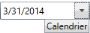
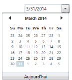
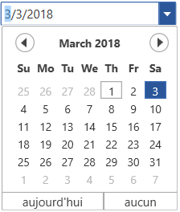

# Localization

Localization is the process of translating the application resources into different language for the specific cultures. You can localize the DateTimeEdit by adding resource file. 

<table>
<tr>
<th>
Property</th><th>
Description</th></tr>
<tr>
<td>
AccessCalendarText</td><td>
Sets the string for the Calendar Text in DateTimeEdit.</td></tr>
<tr>
<td colspan = "1">
{{''|markdownify}}

{{ '_AccessCalendarText(en-US)_' | markdownify }}
</td>
<td>
{{''|markdownify}}

{{ '_AccessCalendarText(fr-FR)_' | markdownify }}</td></tr>
<tr>
<td>
AccessClockText</td><td>
Sets the string for the Clock Text in DateTimeEdit</td></tr>
<tr>
<td colspan = "1">
{{''|markdownify}}

{{ '_AccessClockText(en-US)_' | markdownify }}
</td>
<td>
{{''|markdownify}}

{{'_AccessClockText(fr-FR)_' | markdownify }}</td></tr>
<tr>
<td>
AccessEmptyDateText</td><td>
Sets the string for the Empty Date Text in DateTimeEdit.</td></tr>
<tr>
<td colspan = "1">
{{''|markdownify}}

{{ '_AccessEmptyDateText (en-US)_' | markdownify }}
</td>
<td>
{{''|markdownify}}

{{ '_AccessEmptyDateText(fr-FR)_' | markdownify }}</td></tr>
<tr>
<td>
AccessWatchText</td><td>
Sets the string for the Watch Text in DateTimeEdit.</td></tr>
<tr>
<td colspan = "1">
Watch(en-US)</td><td> Watch(fr-FR)</td></tr>
<tr>
<td>
TodayLabel</td><td>
Sets the string for the Today Label in DateTimeEdit.</td></tr>
<tr>
<td colspan = "1">
{{''|markdownify}}

{{ '_TodayLabel_' | markdownify }}
</td>
<td>
{{''|markdownify}}

{{ '_TodayLabel_' | markdownify }}</td></tr>
</table>

N> To create the localized application, follow the steps mentioned [here](https://help.syncfusion.com/wpf/introduction/common-supports#localization). 
Also, you can get the sample [here](http://www.syncfusion.com/downloads/support/directtrac/general/ze/WPF_DateTimeEditLocalization1161670264) . 
