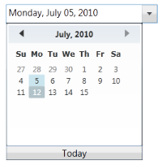

# Maximum and Minimum Value

DateTimeEdit control allows you to set the start and end dates by using the [MinDateTime](https://help.syncfusion.com/cr/wpf/Syncfusion.Shared.Wpf~Syncfusion.Windows.Shared.DateTimeEdit~MinDateTime.html) and [MaxDateTime](https://help.syncfusion.com/cr/wpf/Syncfusion.Shared.Wpf~Syncfusion.Windows.Shared.DateTimeEdit~MaxDateTime.html) properties. The Calendar also displays only the dates between the MinDateTime and MaxDateTime.

When the MinDateTime is set, if the new [MinDateTime](https://help.syncfusion.com/cr/wpf/Syncfusion.Shared.Wpf~Syncfusion.Windows.Shared.DateTimeEdit~MinDateTime.html) property value is greater than the [MaxDateTime](https://help.syncfusion.com/cr/wpf/Syncfusion.Shared.Wpf~Syncfusion.Windows.Shared.DateTimeEdit~MaxDateTime.html) property value, then the [MaxDateTime](https://help.syncfusion.com/cr/wpf/Syncfusion.Shared.Wpf~Syncfusion.Windows.Shared.DateTimeEdit~MaxDateTime.html) is set equal to the [MinDateTime](https://help.syncfusion.com/cr/wpf/Syncfusion.Shared.Wpf~Syncfusion.Windows.Shared.DateTimeEdit~MinDateTime.html). If the [DateTime](https://help.syncfusion.com/cr/wpf/Syncfusion.Shared.Wpf~Syncfusion.Windows.Shared.DateTimeEdit~DateTime.html) (DateTime property) is less than the new [MinDateTime](https://help.syncfusion.com/cr/wpf/Syncfusion.Shared.Wpf~Syncfusion.Windows.Shared.DateTimeEdit~MinDateTime.html), then the [DateTime](https://help.syncfusion.com/cr/wpf/Syncfusion.Shared.Wpf~Syncfusion.Windows.Shared.DateTimeEdit~DateTime.html) property is also set equal to the [MinDateTime](https://help.syncfusion.com/cr/wpf/Syncfusion.Shared.Wpf~Syncfusion.Windows.Shared.DateTimeEdit~MinDateTime.html).

When the [MaxDateTime](https://help.syncfusion.com/cr/wpf/Syncfusion.Shared.Wpf~Syncfusion.Windows.Shared.DateTimeEdit~MaxDateTime.html) is set, if the [MinDateTime](https://help.syncfusion.com/cr/wpf/Syncfusion.Shared.Wpf~Syncfusion.Windows.Shared.DateTimeEdit~MinDateTime.html) property is greater than the new [MaxDateTime](https://help.syncfusion.com/cr/wpf/Syncfusion.Shared.Wpf~Syncfusion.Windows.Shared.DateTimeEdit~MaxDateTime.html) property, then the [MinDateTime](https://help.syncfusion.com/cr/wpf/Syncfusion.Shared.Wpf~Syncfusion.Windows.Shared.DateTimeEdit~MinDateTime.html) property value is set equal to the [MaxDateTime](https://help.syncfusion.com/cr/wpf/Syncfusion.Shared.Wpf~Syncfusion.Windows.Shared.DateTimeEdit~MaxDateTime.html). If the current [DateTime](https://help.syncfusion.com/cr/wpf/Syncfusion.Shared.Wpf~Syncfusion.Windows.Shared.DateTimeEdit~DateTime.html) (DateTime property) is greater than the new [MaxDateTime](https://help.syncfusion.com/cr/wpf/Syncfusion.Shared.Wpf~Syncfusion.Windows.Shared.DateTimeEdit~MaxDateTime.html), then the [DateTime](https://help.syncfusion.com/cr/wpf/Syncfusion.Shared.Wpf~Syncfusion.Windows.Shared.DateTimeEdit~DateTime.html) property is set equal to the [MaxDateTime](https://help.syncfusion.com/cr/wpf/Syncfusion.Shared.Wpf~Syncfusion.Windows.Shared.DateTimeEdit~MaxDateTime.html).





<syncfusion:DateTimeEdit x:Name="dateTimeEdit" Height="25" Width="200"  DateTime="07/05/2010" Pattern="LongDate"  MinDateTime="01/01/2010" MaxDateTime="07/15/2010"/>





Syncfusion.Windows.Shared.DateTimeEdit dateTimeEdit = new Syncfusion.Windows.Shared.DateTimeEdit();
dateTimeEdit.Width = 200;
dateTimeEdit.Height = 25;
dateTimeEdit.DateTime = new DateTime(2010, 07, 05);
dateTimeEdit.MinDateTime = new DateTime(2010, 01, 01);
dateTimeEdit.MaxDateTime = new DateTime(2010, 07, 15);
dateTimeEdit.Pattern = DateTimePattern.LongDate;
this.LayoutRoot.Children.Add(dateTimeEdit);





This Calendar also displays the range of dates between the MinDateTime and MaxDateTime.