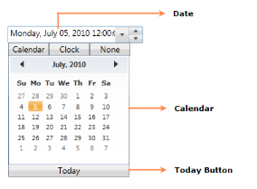

# Overview

DateTimeEdit is a control that allows you to select and edit the date with support for data binding, Null Value, Watermark, maximum and minimum value, and culture. It provides many customization options to enhance its appearance and to suit your applications.

The core features of the DateTimeEdit are as follows:

* Provides eleven different types of DateTime patterns.
* Supports custom date formats.
* Provides culture support.
* Provides data binding support.
* Provides Null Value support.
* Provides keyboard and mouse support.
* Provides Watermark support.
* Provides maximum and minimum value support.

## Control structure

### DateTimeEdit members

DateTimeEdit exposes the following members:

#### Properties

DateTimeEdit Members table

<table>
<tr>
<th>
Name</th><th>
Type</th><th>
Value it Accepts</th><th>
Description</th><th>
Default Value</th><th>
Reference Link</th></tr>
<tr>
<td>
CustomPattern</td><td>
DependencyProperty</td><td>
String</td><td>
Gets or sets the Format that is used to display the date.</td><td>
String.Empty</td><td>
CustomPattern</td></tr>
<tr>
<td>
CultureInfo</td><td>
DependencyProperty</td><td>
Culture</td><td>
Gets or sets the CultureInfo property.</td><td>
-</td><td>
CultureInfo</td></tr>
<tr>
<td>
DateTimeFormat</td><td>
DependencyProperty</td><td>
DateTimeFormatInfo</td><td>
DateTimeFormat defines the format to display the date. </td><td>
-</td><td>
DateTimeFormat</td></tr>
<tr>
<td>
NoneDateText</td><td>
DependencyProperty</td><td>
String</td><td>
Gets or sets the NoneDateTextProperty.</td><td>
'No date is selected'</td><td>
NoneDateText</td></tr>
<tr>
<td>
IsScrollingOnCircle</td><td>
DependencyProperty</td><td>
Bool</td><td>
Gets or sets the IsScrollingOnCircle property.</td><td>
True</td><td>
IsScrollingOnCircle</td></tr>
<tr>
<td>
IsPopupEnabled</td><td>
DependencyProperty</td><td>
Bool</td><td>
Gets or sets a value indicating whether the Dropdown popup is open or closed.</td><td>
True</td><td>
IsPopupEnabled</td></tr>
<tr>
<td>
IsEnabledRepeatButton</td><td>
DependencyProperty</td><td>
Bool</td><td>
Gets or sets a value indicating whether the RepeatButton is enabled or disabled.</td><td>
True</td><td>
IsEnabledRepeatButton</td></tr>
<tr>
<td>
IsEmptyDateEnabled</td><td>
DependencyProperty</td><td>
Bool</td><td>
Gets or sets the IsEmptyDateEnabled property.</td><td>
False</td><td>
IsEmptyDateEnabled</td></tr>
<tr>
<td>
IsWatchEnabled</td><td>
DependencyProperty</td><td>
Bool</td><td>
Gets or sets the Visibility of the Watch in the Dropdown Popup.</td><td>
True</td><td>
IsWatchEnabled</td></tr>
<tr>
<td>
IsCalendarEnabled</td><td>
DependencyProperty</td><td>
Bool</td><td>
Gets or sets the Visibility of the Calendar in the Dropdown Popup.</td><td>
True</td><td>
IsCalendarEnabled</td></tr>
<tr>
<td>
IsVisibleRepeatButton</td><td>
DependencyProperty</td><td>
Bool</td><td>
Gets or sets the Visibility of the RepeatButton.</td><td>
False</td><td>
IsVisibleRepeatButton</td></tr>
<tr>
<td>
IsButtonPopUpEnabled</td><td>
DependencyProperty</td><td>
Bool</td><td>
Gets or sets the Visibility of the Dropdown Button.</td><td>
True</td><td>
IsButtonPopUpEnabled</td></tr>
<tr>
<td>
Pattern</td><td>
DependencyProperty</td><td>
Enum of Type DateTimePattern</td><td>
Gets or sets the Format that is used to display the date.</td><td>
DateTimePattern.FullDateTime</td><td>
Pattern</td></tr>
<tr>
<td>
RepeatButtonBackground</td><td>
DependencyProperty</td><td>
Brush</td><td>
Gets or sets the Background for the RepeatButton.</td><td>
-</td><td>
RepeatButtonBackground</td></tr>
<tr>
<td>
RepeatButtonBorderThickness</td><td>
DependencyProperty</td><td>
Thickness</td><td>
Gets or sets the BorderThickness for the RepeatButton.</td><td>
-</td><td>
RepeatButtonBorderThickness</td></tr>
<tr>
<td>
UpRepeatButtonTemplate</td><td>
DependencyProperty</td><td>
ControlTemplate</td><td>
Gets or sets the ControlTemplate for the UpRepeatButton.</td><td>
-</td><td>
UpRepeatButtonTemplate</td></tr>
<tr>
<td>
DownRepeatButtonTemplate</td><td>
DependencyProperty</td><td>
ControlTemplate</td><td>
Gets or sets the ControlTemplate for the DownRepeatButton.</td><td>
-</td><td>
DownRepeatButtonTemplate</td></tr>
<tr>
<td>
DropDownButtonTemplate</td><td>
DependencyProperty</td><td>
ControlTemplate</td><td>
Gets or sets the ControlTemplate for the DropDownButton.</td><td>
-</td><td>
DropDownButtonTemplate</td></tr>
<tr>
<td>
NullValue</td><td>
DependencyProperty</td><td>
DateTime?</td><td>
Gets or sets the NullValue property.</td><td>
Null</td><td>
NullValue</td></tr>
<tr>
<td>
DateTime</td><td>
DependencyProperty</td><td>
DateTime?</td><td>
Gets or sets the date for the DateTimeEdit control.</td><td>
Null</td><td>
DateTime</td></tr>
<tr>
<td>
MinDateTime</td><td>
DependencyProperty</td><td>
DateTime</td><td>
Gets or sets the Minimum value for the DateTimeEdit control.</td><td>
00:00:00.0000000, January 1, 0001</td><td>
MinDateTime</td></tr>
<tr>
<td>
MaxDateTime</td><td>
DependencyProperty</td><td>
DateTime</td><td>
Gets or sets the Maximum value for the DateTimeEdit control.</td><td>
23:59:59.9999999, December 31, 9999, exactly one 100-nanosecond tick before 00:00:00, January 1, 10000</td><td>
MaxDateTime</td></tr>
</table>

#### Events

DateTimeEdit members Events table

<table>
<tr>
<th>
Name</th><th>
Event Type</th><th>
Event Args Parameter</th><th>
Description</th><th>
Reference Link</th></tr>
<tr>
<td>
DateTimeChanged</td><td>
PropertyChangedCallback</td><td>
DependencyPropertyChangedEventArgs</td><td>
Occurs after the DateTime value of the DateTimeEdit control has changed.</td><td>
DateTimeChanged</td></tr>
<tr>
<td>
MaxDateTimeChanged</td><td>
PropertyChangedCallback</td><td>
DependencyPropertyChangedEventArgs</td><td>
Occurs after the MaxDateTime of the DateTimeEdit control has changed.</td><td>
MaxDateTimeChanged</td></tr>
<tr>
<td>
MinDateTimeChanged</td><td>
PropertyChangedCallback</td><td>
DependencyPropertyChangedEventArgs</td><td>
Occurs after the MinDateTime of the DateTimeEdit control has changed.</td><td>
PropertyChangedCallback</td></tr>
<tr>
<td>
PatternChanged</td><td>
PropertyChangedCallback</td><td>
DependencyPropertyChangedEventArgs</td><td>
Occurs after the Pattern property of the DateTimeEdit control has changed.</td><td>
PatternChanged</td></tr>
<tr>
<td>
CalendarPopupOpened</td><td>
PropertyChangedCallback</td><td>
DependencyPropertyChangedEventArgs</td><td>
Occurs when the Calendar Popup opens.</td><td>
CalendarPopupOpened</td></tr>
</table>
