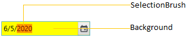
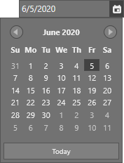

# Appearance in WPF DateTimePicker (DateTimeEdit)

This section explains different UI customization options available in [DateTimeEdit](https://help.syncfusion.com/cr/wpf/Syncfusion.Windows.Shared.DateTimeEdit.html) control.

## Setting the Foreground

You can change the foreground color for `dateTimeEdit` by setting the `Foreground` property. The default color value of `Foreground` property is `Black`.




<syncfusion:DateTimeEdit Foreground="Red"
                           Name="dateTimeEdit"/>




DateTimeEdit dateTimeEdit = new DateTimeEdit();
dateTimeEdit.Foreground = Brushes.Red;




N> View [Sample](https://github.com/SyncfusionExamples/wpf-datetimepicker-examples/tree/master/Samples/Appearance) in GitHub

## Setting the Background

You can change the background color and selection color of `DateTimeEdit` by using the `Background` and `SelectionBrush` property. The default value of `Background` property is `White` and `SelectionBrush` property is `Royal Blue`.




<syncfusion:DateTimeEdit Background="Yellow"
                         SelectionBrush="Red"
                         Name="dateTimeEdit"/>




DateTimeEdit dateTimeEdit = new DateTimeEdit();
dateTimeEdit.Background = Brushes.Yellow;
dateTimeEdit.SelectionBrush = Brushes.Red;




N> View [Sample](https://github.com/SyncfusionExamples/wpf-datetimepicker-examples/tree/master/Samples/Appearance) in GitHub

## Change focus border color

You can change the focus border color of the `DateTimeEdit` by setting the [FocusedBorderBrush](https://help.syncfusion.com/cr/wpf/Syncfusion.Windows.Shared.DateTimeEdit.html#Syncfusion_Windows_Shared_DateTimeEdit_FocusedBorderBrush) property. The default value of `FocusedBorderBrush` property is `Medium Aquamarine`.




<syncfusion:DateTimeEdit FocusedBorderBrush="Red"
                         Name="dateTimeEdit"/>




DateTimeEdit dateTimeEdit = new DateTimeEdit();
dateTimeEdit.FocusedBorderBrush = Brushes.Red;




N> View [Sample](https://github.com/SyncfusionExamples/wpf-datetimepicker-examples/tree/master/Samples/Appearance) in GitHub

## Change flow direction

You can change the flow direction of the `DateTimeEdit` layout from right to left by setting the `FlowDirection` property value as `RightToLeft`. The default value of `FlowDirection` property is `LeftToRight`.




<syncfusion:DateTimeEdit FlowDirection="RightToLeft"
                         Name="dateTimeEdit"/>




DateTimeEdit dateTimeEdit = new DateTimeEdit();
dateTimeEdit.FlowDirection = FlowDirection.RightToLeft;




N> View [Sample](https://github.com/SyncfusionExamples/wpf-datetimepicker-examples/tree/master/Samples/Appearance) in GitHub

## Theme

You can customize the appearance of the `DateTimeEdit` control by using the [SfSkinManager.SetVisualStyle](https://help.syncfusion.com/cr/wpf/Syncfusion.SfSkinmanager.SfSkinmanager.html#Syncfusion_SfSkinManager_SfSkinManager_SetVisualStyle_System_Windows_DependencyObject_Syncfusion_SfSkinManager_VisualStyles_) method and `SfSkinManager.VisualStyle` property . The following are the various built-in visual styles for `DateTimeEdit` control.

* Blend
* Default
* Lime
* MaterialDark
* MaterialDarkBlue
* MaterialLight
* MaterialLightBlue
* Metro
* Office2010Black
* Office2010Blue
* Office2010Silver
* Office2013DarkGray
* Office2013LightGray
* Office2013White
* Office2016Colorful
* Office2016DarkGray
* Office2016White
* Office2019Black
* Office2019Colorful
* Office365
* Saffron
* SystemTheme
* VisualStudio2013
* VisualStudio2015

Here, the `Blend` style is applied to the `DateTimeEdit`.




<Window
    xmlns:syncfusion="http://schemas.syncfusion.com/wpf"
    xmlns:syncfusionskin ="clr-namespace:Syncfusion.SfSkinManager;assembly=Syncfusion.SfSkinManager.WPF">
    <Grid>
        <syncfusion:DateTimeEdit syncfusionskin:SfSkinManager.VisualStyle="Blend" 
                                 Name="dateTimeEdit" />
    </Grid>
</Window>




//Namespace for the SfSkinManager.
using Syncfusion.SfSkinManager;

DateTimeEdit dateTimeEdit = new DateTimeEdit();
SfSkinManager.SetVisualStyle(dateTimeEdit, VisualStyles.Blend);




N> View [Sample](https://github.com/SyncfusionExamples/wpf-datetimepicker-examples/tree/master/Samples/Themes) in GitHub

### Custom Theme using Theme Studio

DateTimeEdit themes can be customized using theme studio. Refer the [Theme Studio](https://help.syncfusion.com/wpf/themes/theme-studio) documentation  for more information.

