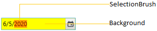

# Appearance in WPF DateTimePicker

This section explains different UI customization options available in [DateTimeEdit](https://help.syncfusion.com/cr/wpf/Syncfusion.Windows.Shared.DateTimeEdit.html) control.

## Setting the Foreground

You can change the foreground color for `dateTimeEdit` by setting the `Foreground` property. The default color value of `Foreground` property is `Black`.



<Window 
    . . .
    xmlns:syncfusion="http://schemas.syncfusion.com/wpf">
    <syncfusion:DateTimeEdit Foreground="Red"
                           Name="dateTimeEdit"/>
</Window>



using Syncfusion.Windows.Shared;

DateTimeEdit dateTimeEdit = new DateTimeEdit();
dateTimeEdit.Foreground = Brushes.Red;




N> View [Sample](https://github.com/SyncfusionExamples/wpf-datetimepicker-examples/tree/master/Samples/Appearance) in GitHub

## Setting the Background

You can change the background color and selection color of `DateTimeEdit` by using the `Background` and `SelectionBrush` property. The default value of `Background` property is `White` and `SelectionBrush` property is `RoyalBlue`.



<Window 
    . . .
    xmlns:syncfusion="http://schemas.syncfusion.com/wpf">
    <syncfusion:DateTimeEdit Background="Yellow"
                         SelectionBrush="Red"
                         Name="dateTimeEdit"/>
</Window>



using Syncfusion.Windows.Shared;

DateTimeEdit dateTimeEdit = new DateTimeEdit();
dateTimeEdit.Background = Brushes.Yellow;
dateTimeEdit.SelectionBrush = Brushes.Red;




N> View [Sample](https://github.com/SyncfusionExamples/wpf-datetimepicker-examples/tree/master/Samples/Appearance) in GitHub

## Change focus border color

You can change the focus border color of the `DateTimeEdit` by setting the [FocusedBorderBrush](https://help.syncfusion.com/cr/wpf/Syncfusion.Windows.Shared.DateTimeEdit.html#Syncfusion_Windows_Shared_DateTimeEdit_FocusedBorderBrush) property. The default value of `FocusedBorderBrush` property is `MediumAquamarine`.



<Window 
    . . .
    xmlns:syncfusion="http://schemas.syncfusion.com/wpf">
    <syncfusion:DateTimeEdit FocusedBorderBrush="Red"
                         Name="dateTimeEdit"/>
</Window>



using Syncfusion.Windows.Shared;

DateTimeEdit dateTimeEdit = new DateTimeEdit();
dateTimeEdit.FocusedBorderBrush = Brushes.Red;




N> View [Sample](https://github.com/SyncfusionExamples/wpf-datetimepicker-examples/tree/master/Samples/Appearance) in GitHub

## Change flow direction

You can change the flow direction of the `DateTimeEdit` layout from right to left by setting the `FlowDirection` property value as `RightToLeft`. The default value of `FlowDirection` property is `LeftToRight`.



<Window 
    . . .
    xmlns:syncfusion="http://schemas.syncfusion.com/wpf">
    <syncfusion:DateTimeEdit FlowDirection="RightToLeft"
                         Name="dateTimeEdit"/>
</Window>



using Syncfusion.Windows.Shared;

DateTimeEdit dateTimeEdit = new DateTimeEdit();
dateTimeEdit.FlowDirection = FlowDirection.RightToLeft;




N> View [Sample](https://github.com/SyncfusionExamples/wpf-datetimepicker-examples/tree/master/Samples/Appearance) in GitHub

## Theme

DateTimeEdit supports various built-in themes. Refer to the below links to apply themes for the DateTimeEdit,

  * [Apply theme using SfSkinManager](https://help.syncfusion.com/wpf/themes/skin-manager)
	
  * [Create a custom theme using ThemeStudio](https://help.syncfusion.com/wpf/themes/theme-studio#creating-custom-theme)

