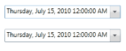

# Binding Support

Data binding is the process of establishing a connection between the application UI and business logic. Data binding can be unidirectional (source to target) or bidirectional (source to target and target to source). You can bind the data to the DateTimeEdit control through the DateTime property.

The following example shows a simple binding between the [DateTime](https://help.syncfusion.com/cr/wpf/Syncfusion.Shared.Wpf~Syncfusion.Windows.Shared.DateTimeEdit~DateTime.html) property of the DateTimeEdit control and another DateTimeEdit control:





<syncfusion:DateTimeEdit x:Name="dateTimeEdit1" Height="25" Width="220" Margin="10"/><syncfusion:DateTimeEdit x:Name="dateTimeEdit2" Height="25" Width="220"                          DateTime="{Binding ElementName=dateTimeEdit1,                                             Path=DateTime,Mode=TwoWay}"                         Margin="10"/>







[NullValue Support](/wpf/datetimeedit/null-value-support)

[Maximum and Minimum Value](/wpf/datetimeedit/maximum-and-minimum-value)


