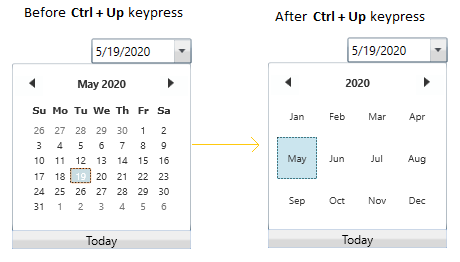
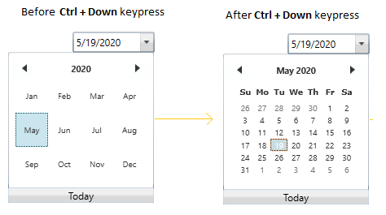
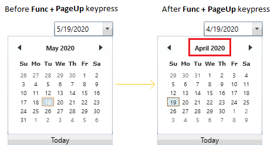
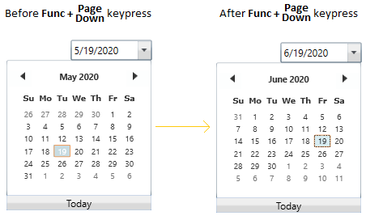
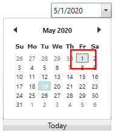
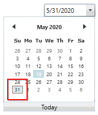
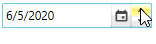
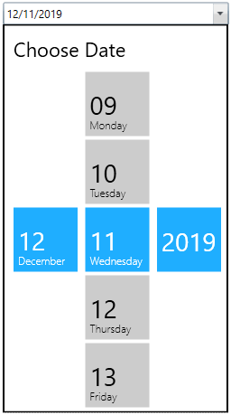
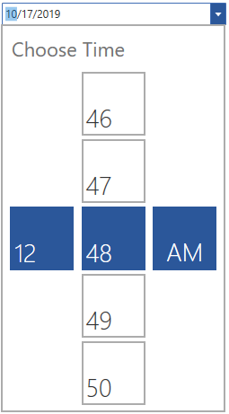

# DateTime Editing in WPF DateTimePicker (DateTimeEdit)

The [DateTimeEdit](https://help.syncfusion.com/cr/wpf/Syncfusion.Windows.Shared.DateTimeEdit.html) control provides support for changing date time using text box. It supports both free form editing and mask based editing. 

## Mask editing

Mask editing is the default editing mode. In this mode, you can provide only valid input. Any invalid input given will be automatically corrected or ignored. In mask editing mode, the date will be separated into different fields such as date, month, year, minutes, hours, and seconds. The field can be updated by selecting the field and edit the value for the respectively fields or pressing the up (or) down arrow keys to increase or decrease the selected field respectively.




<syncfusion:DateTimeEdit Name="dateTimeEdit"
                         Height="25" 
                         Width="200"/>




DateTimeEdit dateTimeEdit = new DateTimeEdit();
dateTimeEdit.Width = 150;
dateTimeEdit.Height = 25;




N> View [Sample](https://github.com/SyncfusionExamples/wpf-datetimepicker-examples/tree/master/Samples/SettingDate) in GitHub

### Validation

In mask editing mode, value will be validated and corrected immediately based on the edited input value.  The following table demonstrates some of the validation in `DateTimeEdit` control:

<table>
<tr>
<th>
{{'**Validation**'| markdownify }} </th><th>
{{'**Example**'| markdownify }} </th></tr>
<tr>
<td>
If the Space or next field character is pressed, focus will automatically navigated to next valid date / time field that can be edited.</td><td>
In short pattern, "/" character is used as the date separators: MM/dd/yyyy. On pressing "/" the focus will automatically navigated to next valid field.</td></tr>
<tr>
<td>
Field focus will be automatically navigated when value of the selected field is filled.</td><td>
 </td></tr>
<tr>
<td>
DateTimeEdit value will be validated and corrected immediately based on the edited input value.
</td><td>

Ex: If the month field is February, then if we type 29 in day field year field will be automatically validated and moved to next leap year based on corresponding date.</td></tr>

<tr>
<td>
Day field of DateTimeEdit can not be selected as it cannot be edited.</td><td>
- </td></tr>
</table>

N> View [Sample](https://github.com/SyncfusionExamples/wpf-datetimepicker-examples/tree/master/Samples/SettingDate) in GitHub

## DateTime field navigation

By default, the focus field will be navigated automatically after the value has been validated to the corresponding field. If you want to manually change the date, month, year, hour or minute values, before that you navigate to the respective field by using the mouse or move the `Left-Right` keys in the keyboard.

### Keyboard Navigation between datetime fields

The following table explains how the navigation performed between datetime fields,

<table>
<tr>
<th> S.No </th>
<th> Key </th>
<th> Description </th>
<th> Image </th>
</tr>
<tr>
<td>1</td>
<td>Up</td>
<td>Increase selected date, month or year value by 1.</td>
<td>
</td>
</tr>
<tr>
<td>2</td>
<td>Down</td>
<td>Decrease selected date, month or year value by 1.</td>
<td>
</td>
</tr>
<tr>
<td>3</td>
<td>Right</td>
<td>Navigate to the previous field from the currently selected field.</td>
<td>
</td>
</tr>
<tr>
<td>4</td>
<td>Left</td>
<td>Navigate to the next field from the currently selected field.</td>
<td>
</td>
</tr>
<tr>
<td>5</td>
<td>Ctrl + Up</td>
<td>Move forward from current selection view to next month or year selection view.</td>
<td>
</td>
</tr>
<tr>
<td>6</td>
<td>Ctrl + Down</td>
<td>Move backward from current selection view to previous month or date selection view.</td>
<td>
</td>
</tr>
<tr>
<td>7</td>
<td>PageUp</td>
<td>Move to previous month, date or year from the corresponding selection view.</td>
<td>
</td>
</tr>
<tr>
<td>8</td>
<td>PageDown</td>
<td>Move to next month, date or year from the corresponding selection view.</td>
<td>
</td>
</tr>
<tr>
<td>9</td>
<td>Home</td>
<td>Select first date or month or year or decade of the current selection view.</td>
<td>
</td>
</tr>
<tr>
<td>10</td>
<td>End</td>
<td>Select last date or month or year or decade of the current selection view.</td>
<td>
</td>
</tr>
</table>

N> View [Sample](https://github.com/SyncfusionExamples/wpf-datetimepicker-examples/tree/master/Samples/Dropdown-Options) in GitHub

## Change date time programmatically

You can set or change the selected datetime of the `DateTimeEdit` programmatically by setting the value to the [DateTime](https://help.syncfusion.com/cr/wpf/Syncfusion.Windows.Shared.DateTimeEdit.html#Syncfusion_Windows_Shared_DateTimeEdit_DateTime) property.




<syncfusion:DateTimeEdit DateTime="08/06/2020"
                         Name="dateTimeEdit"/>




DateTimeEdit dateTimeEdit = new DateTimeEdit();
dateTimeEdit.DateTime = new DateTime(2020, 06, 30);




N> View [Sample](https://github.com/SyncfusionExamples/wpf-datetimepicker-examples/tree/master/Samples/SettingDate) in GitHub

## Binding date time value

You can bind the selected date time value by using the `DateTime` property.

The following code snippets illustrate the value binding from one `DateTimeEdit` to another.




//ViewModel.cs
class ViewModel : NotificationObject {
    private DateTime selectedDate = DateTime.Now;

    public DateTime SelectedDate {
        get {
            return selectedDate;
        }
        set {
            selectedDate = value;
            this.RaisePropertyChanged(nameof(SelectedDate));
        }
    }
}







<Window.DataContext>
    <local:ViewModel/>
</Window.DataContext>

<StackPanel HorizontalAlignment="Center" 
            VerticalAlignment="Center">
    <syncfusion:DateTimeEdit Name="dateTimeEdit1"
                             Height="25" 
                             Width="200" 
                             DateTime="{Binding SelectedDate, Mode=TwoWay}"/>
    <syncfusion:DateTimeEdit Name="dateTimeEdit2"
                             Height="25" 
                             Width="200" 
                             DateTime="{Binding SelectedDate, Mode=TwoWay}"
                             Margin="10"/>
</StackPanel>




N> View [Sample](https://github.com/SyncfusionExamples/wpf-datetimepicker-examples/tree/master/Samples/Data-Binding) in GitHub

## Free form editing

You can change the `DateTime` value like a normal textbox editing by setting the [CanEdit](https://help.syncfusion.com/cr/wpf/Syncfusion.Windows.Shared.DateTimeBase.html#Syncfusion_Windows_Shared_DateTimeBase_CanEdit) property value as `true`. Input given by an end-user, will be validated when pressing `Enter` key or if control lost its focus. If the entered value is invalid, it set the previously selected date as `DateTime` value. Otherwise, it will accept the given input.




<syncfusion:DateTimeEdit Name="dateTimeEdit"
                         CanEdit="True"/>



DateTimeEdit dateTimeEdit= new DateTimeEdit();
dateTimeEdit.CanEdit = true;




N> View [Sample](https://github.com/SyncfusionExamples/wpf-datetimepicker-examples/tree/master/Samples/Dropdown-Options) in GitHub

## Change date time on mouse wheel

You can increase or decrease the datetime by select the respective fields and mouse scrolling over the `DateTimeEdit`. If you want to restrict the user to change datetime by using mouse scrolling, use the [EnableMouseWheelEdit](https://help.syncfusion.com/cr/wpf/Syncfusion.Windows.Shared.DateTimeBase.html#Syncfusion_Windows_Shared_DateTimeBase_EnableMouseWheelEdit) property value as `false`. The default value of `EnableMouseWheelEdit` property is `true`.




<syncfusion:DateTimeEdit EnableMouseWheelEdit="True"
                         Name="dateTimeEdit"/>




DateTimeEdit dateTimeEdit= new DateTimeEdit();
dateTimeEdit.EnableMouseWheelEdit = true;




N> View [Sample](https://github.com/SyncfusionExamples/wpf-datetimepicker-examples/tree/master/Samples/Dropdown-Options) in GitHub

## Change date time using up-down button

You can change the value of the datetime by selecting the respective date, month, year, minutes, hours, or seconds field and pressing the up or down button to increase or decrease the selected field respectively. By default, the updown button are hidden. you can show the UpDown button by setting the [IsVisibleRepeatButton](https://help.syncfusion.com/cr/wpf/Syncfusion.Windows.Shared.DateTimeBase.html#Syncfusion_Windows_Shared_DateTimeBase_IsVisibleRepeatButton)  property value as `true`.




<syncfusion:DateTimeEdit IsVisibleRepeatButton="True" 
                         IsEnabledRepeatButton="True"
                         Name="dateTimeEdit"/>




DateTimeEdit dateTimeEdit = new DateTimeEdit();
dateTimeEdit.IsVisibleRepeatButton= true;
dateTimeEdit.IsEnabledRepeatButton= true;




N> View [Sample](https://github.com/SyncfusionExamples/wpf-datetimepicker-examples/tree/master/Samples/Dropdown-Options) in GitHub

## Disable up-down button

You can disable the updown button by setting the [IsEnabledRepeatButton](https://help.syncfusion.com/cr/wpf/Syncfusion.Windows.Shared.DateTimeBase.html#Syncfusion_Windows_Shared_DateTimeBase_IsEnabledRepeatButton) property as `false`. The default value of `IsEnabledRepeatButton` property is `true`.




<syncfusion:DateTimeEdit IsEnabledRepeatButton="False"
                         IsVisibleRepeatButton="True" 
                         Name="dateTimeEdit"/>




DateTimeEdit dateTimeEdit = new DateTimeEdit();
dateTimeEdit.IsEnabledRepeatButton= false;
dateTimeEdit.IsVisibleRepeatButton= true;




N> View [Sample](https://github.com/SyncfusionExamples/wpf-datetimepicker-examples/tree/master/Samples/Dropdown-Options) in GitHub

### Show only the up-down button

You can show only the updown button by hiding the dropdown button. You can hide the dropdown button by setting the [IsButtonPopUpEnabled](https://help.syncfusion.com/cr/wpf/Syncfusion.Windows.Shared.DateTimeBase.html#Syncfusion_Windows_Shared_DateTimeBase_IsButtonPopUpEnabled) property value as `false`.




<syncfusion:DateTimeEdit IsButtonPopUpEnabled="False"
                         IsVisibleRepeatButton="True" 
                         IsEnabledRepeatButton="True"
                         Name="dateTimeEdit"/>




DateTimeEdit dateTimeEdit = new DateTimeEdit();
dateTimeEdit.IsVisibleRepeatButton= true;
dateTimeEdit.IsEnabledRepeatButton= true;
dateTimeEdit.IsButtonPopUpEnabled = false;




N> View [Sample](https://github.com/SyncfusionExamples/wpf-datetimepicker-examples/tree/master/Samples/Dropdown-Options) in GitHub

## Customize up-down appearance

You can change the background and UI of the updown button.

### Change updown background

If you want to change the updown button background, use the [RepeatButtonBackground](https://help.syncfusion.com/cr/wpf/Syncfusion.Windows.Shared.DateTimeBase.html#Syncfusion_Windows_Shared_DateTimeBase_RepeatButtonBackground) property. You can also change the margin of the up and down button separately by using the [DownRepeatButtonMargin](https://help.syncfusion.com/cr/wpf/Syncfusion.Windows.Shared.DateTimeBase.html#Syncfusion_Windows_Shared_DateTimeBase_DownRepeatButtonMargin) and [UpRepeatButtonMargin](https://help.syncfusion.com/cr/wpf/Syncfusion.Windows.Shared.DateTimeBase.html#Syncfusion_Windows_Shared_DateTimeBase_UpRepeatButtonMargin) properties. The default value of `RepeatButtonBackground` property is `Gainsboro`  and `UpRepeatButtonMargin` & `DownRepeatButtonMargin` properties is `{0,0,0,0}`.




<syncfusion:DateTimeEdit RepeatButtonBackground="Red" 
                         DownRepeatButtonMargin="1" 
                         UpRepeatButtonMargin="1"
                         IsVisibleRepeatButton="True"
                         Width="150" 
                         Height="25"
                         Name="dateTimeEdit"/>




DateTimeEdit dateTimeEdit = new DateTimeEdit();
dateTimeEdit.RepeatButtonBackground= Brushes.Red;
dateTimeEdit.DownRepeatButtonMargin= new Thickness(1);
dateTimeEdit.UpRepeatButtonMargin = new Thickness(1);
dateTimeEdit.IsVisibleRepeatButton= true;




N> View [Sample](https://github.com/SyncfusionExamples/wpf-datetimepicker-examples/tree/master/Samples/Dropdown-Options) in GitHub

### Custom UI for up and down button

You can customize the up and down button appearance separately by using the [UpRepeatButtonTemplate](https://help.syncfusion.com/cr/wpf/Syncfusion.Windows.Shared.DateTimeBase.html#Syncfusion_Windows_Shared_DateTimeBase_UpRepeatButtonTemplate) and [DownRepeatButtonTemplate](https://help.syncfusion.com/cr/wpf/Syncfusion.Windows.Shared.DateTimeBase.html#Syncfusion_Windows_Shared_DateTimeBase_DownRepeatButtonTemplate) properties.




<syncfusion:DateTimeEdit IsVisibleRepeatButton="True"
                         Name="dateTimeEdit">
    <!--Custom UI for up button--> 
    <syncfusion:DateTimeEdit.UpRepeatButtonTemplate>
        <ControlTemplate>
            <TextBlock Foreground="Yellow"
                       TextAlignment="Center" 
                       FontSize="15"
                       FontWeight="ExtraBold"  
                       Text="+" 
                       Background="Green"/>
        </ControlTemplate>
    </syncfusion:DateTimeEdit.UpRepeatButtonTemplate>

    <!--Custom UI for down button-->
    <syncfusion:DateTimeEdit.DownRepeatButtonTemplate>
        <ControlTemplate>
            <TextBlock Foreground="Yellow"
                       TextAlignment="Center"  
                       FontSize="15"
                       FontWeight="ExtraBold"
                       Text="-" 
                       Background="Red"/>
        </ControlTemplate>
    </syncfusion:DateTimeEdit.DownRepeatButtonTemplate>
</syncfusion:DateTimeEdit>




N> View [Sample](https://github.com/SyncfusionExamples/wpf-datetimepicker-examples/tree/master/Samples/NullValue-Options) in GitHub

## Change month using alpha keys

You can change the month which is in abbreviated form or digit form, can be edited by select the month field and pressing the initial letter of respective month. You can enable it by setting the [EnableAlphaKeyNavigation](https://help.syncfusion.com/cr/wpf/Syncfusion.Windows.Shared.DateTimeEdit.html#Syncfusion_Windows_Shared_DateTimeEdit_EnableAlphaKeyNavigation) value as `true` and `CanEdit` property as `false`. The default value of `EnableAlphaKeyNavigation` property is `false`.

For example, If you pressing the `j` key, then it will selects `January`. On subsequent presses of the `j` key selects `June` and then `July`.




<syncfusion:DateTimeEdit EnableAlphaKeyNavigation="True" 
                         CanEdit="False" 
                         Pattern="LongDate"
                         Name="dateTimeEdit"/>




DateTimeEdit dateTimeEdit = new DateTimeEdit();
dateTimeEdit.EnableAlphaKeyNavigation = true;
dateTimeEdit.CanEdit = false;
dateTimeEdit.Pattern = DateTimePattern.LongDate;




N> View [Sample](https://github.com/SyncfusionExamples/wpf-datetimepicker-examples/tree/master/Samples/Dropdown-Options) in GitHub

## Delete and edit the date time value

By default, date time field will be selected and you can only override the date time field value without deleting the old value. You can delete the existing field values by pressing the `BackSpace` or `Delete` key and enter the new values. You can enable it by setting the [EnableBackspaceKey](https://help.syncfusion.com/cr/wpf/Syncfusion.Windows.Shared.DateTimeEdit.html#Syncfusion_Windows_Shared_DateTimeEdit_EnableBackspaceKey) and [EnableDeleteKey](https://help.syncfusion.com/cr/wpf/Syncfusion.Windows.Shared.DateTimeEdit.html#Syncfusion_Windows_Shared_DateTimeEdit_EnableDeleteKey) properties as `true`. The default value of `EnableBackspaceKey` and `EnableDeleteKey` property is `false`.




<syncfusion:DateTimeEdit EnableBackspaceKey="True"
                         EnableDeleteKey="True" 
                         Name="dateTimeEdit"/>




DateTimeEdit dateTimeEdit = new DateTimeEdit();
dateTimeEdit.EnableBackspaceKey = true;
dateTimeEdit.EnableDeleteKey = true;




N> View [Sample](https://github.com/SyncfusionExamples/wpf-datetimepicker-examples/tree/master/Samples/Dropdown-Options) in GitHub

## Change date time using custom calendar and clock

You can add your own calendar and clock control in `DateTimeEdit` to selected the date and time.

### Custom calendar

If you want to select the Date from the own calendar, use the [DateTimeCalender](https://help.syncfusion.com/cr/wpf/Syncfusion.Windows.Shared.DateTimeEdit.html#Syncfusion_Windows_Shared_DateTimeEdit_DateTimeCalender) property and set the custom date selector. You can enable the calendar by setting [DropDownView](https://help.syncfusion.com/cr/wpf/Syncfusion.Windows.Shared.DateTimeEdit.html#Syncfusion_Windows_Shared_DateTimeEdit_DropDownView)  property as `Calendar`.




//ViewModel.cs
class ViewModel : NotificationObject {
    private DateTime selectedDate = DateTime.Now;

    public DateTime SelectedDate {
        get {
            return selectedDate;
        }
        set {
            selectedDate = value;
            this.RaisePropertyChanged(nameof(SelectedDate));
        }
    }
}







<Window.DataContext>
    <local:ViewModel/>
</Window.DataContext>

<syncfusion:DateTimeEdit DateTime="{Binding SelectedDate, Mode=TwoWay}" 
                         DropDownView="Calendar" 
                         Pattern="ShortDate"
                         Name="dateTimeEdit">
    <syncfusion:DateTimeEdit.DateTimeCalender>
        <syncfusion:SfDateSelector SelectorItemWidth="80" 
                                   SelectorItemHeight="80" 
                                   ShowDoneButton="False" 
                                   SelectedDateTime="{Binding SelectedDate, Mode=TwoWay}"/>
    </syncfusion:DateTimeEdit.DateTimeCalender>
</syncfusion:DateTimeEdit>




N> View [Sample](https://github.com/SyncfusionExamples/wpf-date-time-edit-examples/tree/master/Samples/Custom-clock-and-calendar) in GitHub

### Custom clock

If you want to select the time from the own clock, use the [Clock](https://help.syncfusion.com/cr/wpf/Syncfusion.Windows.Shared.DateTimeEdit.html#Syncfusion_Windows_Shared_DateTimeEdit_Clock) property and set the custom time selector. You can enable the custom clock by setting `DropDownView` property as `Clock`.




//ViewModel.cs
class ViewModel : NotificationObject {
    private DateTime selectedTime = DateTime.Now;

    public DateTime SelectedTime {
        get {
            return selectedTime;
        }
        set {
            selectedTime = value;
            this.RaisePropertyChanged(nameof(SelectedTime));
        }
    }
}







<syncfusion:DateTimeEdit DateTime="{Binding SelectedTime, Mode=TwoWay}" 
                         DropDownView="Clock"
                         Pattern="ShortDate"
                         Name="dateTimeEdit">
    <syncfusion:DateTimeEdit.Clock>
        <syncfusion:SfTimeSelector SelectorItemWidth="70"  
                                   SelectorItemHeight="70"
                                   ShowCancelButton="False"
                                   ShowDoneButton="False"
                                   SelectedTime="{Binding SelectedTime, Mode=TwoWay}"/>
    </syncfusion:DateTimeEdit.Clock>
</syncfusion:DateTimeEdit>




N> View [Sample](https://github.com/SyncfusionExamples/wpf-date-time-edit-examples/tree/master/Samples/Custom-clock-and-calendar) in GitHub

N> You can also use both custom clock and calendar in the full datetime pattern by setting the `DropDownView` property as `Combined`. View [Sample](https://github.com/SyncfusionExamples/wpf-date-time-edit-examples/tree/master/Samples/Custom-FullDateSelector) in GitHub

## Setting the null value

If you want to set or change the null value for the `DateTimeEdit`, use the [NullValue]() property. you can enable it only by setting the [IsEmptyDateEnabled](https://help.syncfusion.com/cr/wpf/Syncfusion.Windows.Shared.DateTimeBase.html#Syncfusion_Windows_Shared_DateTimeBase_IsEmptyDateEnabled) property as `true` and [ShowMaskOnNullValue](https://help.syncfusion.com/cr/wpf/Syncfusion.Windows.Shared.DateTimeEdit.html#Syncfusion_Windows_Shared_DateTimeEdit_ShowMaskOnNullValue) property as `false`. If `IsEmptyDateEnabled` property is `false`, then the default date time is displayed. If the [ShowMaskOnNullValue](https://help.syncfusion.com/cr/wpf/Syncfusion.Windows.Shared.DateTimeEdit.html#Syncfusion_Windows_Shared_DateTimeEdit_ShowMaskOnNullValue) property true, then datetime mask is shown.




<syncfusion:DateTimeEdit ShowMaskOnNullValue="False"
                         NullValue="{x:Null}"
                         IsEmptyDateEnabled="True" 
                         x:Name="dateTimeEdit" 
                         Height="25" 
                         Width="200"  />




DateTimeEdit dateTimeEdit = new DateTimeEdit();
dateTimeEdit.ShowMaskOnNullValue= false;
dateTimeEdit.IsEmptyDateEnabled= true;
dateTimeEdit.NullValue = null;




N> View [Sample](https://github.com/SyncfusionExamples/wpf-datetimepicker-examples/tree/master/Samples/NullValue-Options) in GitHub

### Show mask on null value

you can show only the mask on null value by setting the `ShowMaskOnNullValue` property value as `true`.




<syncfusion:DateTimeEdit ShowMaskOnNullValue="True"
                         NullValue="{x:Null}"
                         IsEmptyDateEnabled="True" 
                         Name="dateTimeEdit" />




DateTimeEdit dateTimeEdit = new DateTimeEdit();
dateTimeEdit.ShowMaskOnNullValue= true;
dateTimeEdit.IsEmptyDateEnabled= true;
dateTimeEdit.NullValue = null;




## Show watermark when value is null

If you want to display any watermark text instead of null value, use the [NoneDateText](https://help.syncfusion.com/cr/wpf/Syncfusion.Windows.Shared.DateTimeBase.html#Syncfusion_Windows_Shared_DateTimeBase_NoneDateText) property to setting the watermark text. you can enable it only by setting the `IsEmptyDateEnabled` property as `true`, `ShowMaskOnNullValue` property as `false`  and `NullValue` property as `null`. The default value of `NoneDateText` property is `string.Empty`.




<syncfusion:DateTimeEdit NoneDateText="Select the date"
                         ShowMaskOnNullValue="True"
                         NullValue="{x:Null}"
                         IsEmptyDateEnabled="True" 
                         Name="dateTimeEdit"/>




DateTimeEdit dateTimeEdit = new DateTimeEdit();
dateTimeEdit.NoneDateText= "Select the date";
dateTimeEdit.ShowMaskOnNullValue= true;
dateTimeEdit.IsEmptyDateEnabled= true;
dateTimeEdit.NullValue = null;




N> View [Sample](https://github.com/SyncfusionExamples/wpf-datetimepicker-examples/tree/master/Samples/NullValue-Options) in GitHub

## Select the date time field on focus 

By default, the first field of the date time is selected to edit when control got focus. you can set the last field of date time as selected field when control got focus by setting the [OnFocusBehavior](https://help.syncfusion.com/cr/wpf/Syncfusion.Windows.Shared.DateTimeEdit.html#Syncfusion_Windows_Shared_DateTimeEdit_OnFocusBehavior) property as `CursorAtEnd`. The default value of `OnFocusBehavior` property is `CursorOnFirstCharacter`.

N> If control got focus by directly clicking the date time field, `OnFocusBehavior` property value not take effects.




<syncfusion:DateTimeEdit OnFocusBehavior="CursorAtEnd" 
                         Name="dateTimeEdit" />




DateTimeEdit dateTimeEdit = new DateTimeEdit();
dateTimeEdit.OnFocusBehavior = OnFocusBehavior.CursorAtEnd;




N> View [Sample](https://github.com/SyncfusionExamples/wpf-datetimepicker-examples/tree/master/Samples/Dropdown-Options) in GitHub

## Restrict automatic focus to next field

You can prevent the focus in `DateTimeEdit` automatically moving from one field to another by setting the `AutoForwarding` property value as `false`. By default, the value of `AutoForwarding` property is `true`.




<syncfusion:DateTimeEdit x:Name="dateTimeEdit" AutoForwarding="False" />




DateTimeEdit dateTimeEdit = new DateTimeEdit();
dateTimeEdit.AutoForwarding = false;




## Value Changed Notification

The selected datetime changed in `DateTimeEdit` can be examined using [DateTimeChanged](https://help.syncfusion.com/cr/wpf/Syncfusion.Windows.Shared.DateTimeEdit.html) event. The `DateTimeChanged` event contains the old and newly selected date time values in the `OldValue` and `NewValue` properties.




 <syncfusion:DateTimeEdit DateTimeChanged="dateTimeEdit_DateTimeChanged" 
                          Name="dateTimeEdit"/>




DateTimeEdit dateTimeEdit = new DateTimeEdit();
dateTimeEdit.DateTimeChanged += dateTimeEdit_DateTimeChanged;




You can handle the event as follows,




private void dateTimeEdit_DateTimeChanged(DependencyObject d, DependencyPropertyChangedEventArgs e) {
    //Get old and new values
    var oldValue = e.OldValue;
    var newValue = e.NewValue;
}




