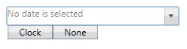
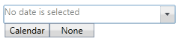
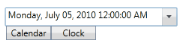

# Dropdown Pop-up

## Dropdown pop-up contains the following parts (refer control structure)

* Calendar Button
* Clock Button
* None Button
* Calendar
* Clock
* Today Button

You can display the Dropdown Popup by checking the DropDown Button. The visibility of the DropDown popup can be enabled by setting the [IsPopupEnabled](https://help.syncfusion.com/cr/cref_files/wpf/Syncfusion.Shared.Wpf~Syncfusion.Windows.Shared.DateTimeBase~IsPopupEnabled.html) property to true.

## Visibility of pop-up parts

* Calendar Button visibility can be enabled by setting the [IsCalendarEnabled](https://help.syncfusion.com/cr/cref_files/wpf/Syncfusion.Shared.Wpf~Syncfusion.Windows.Shared.DateTimeBase~IsCalendarEnabled.html) property to true. 
* Clock Button visibility can be enabled by setting the [IsWatchEnabled](https://help.syncfusion.com/cr/cref_files/wpf/Syncfusion.Shared.Wpf~Syncfusion.Windows.Shared.DateTimeBase~IsWatchEnabled.html) property to true. 
* None Button visibility can be enabled by setting the [IsEmptyDateEnabled](https://help.syncfusion.com/cr/cref_files/wpf/Syncfusion.Shared.Wpf~Syncfusion.Windows.Shared.DateTimeBase~IsEmptyDateEnabled.html) property to true.




<syncfusion:DateTimeEdit x:Name="dateTimeEdit" Height="25" Width="230" Margin="10" EnableClassicStyle="True"   IsCalendarEnabled="False" IsWatchEnabled="True" IsEmptyDateEnabled="True"/>







<syncfusion:DateTimeEdit x:Name="dateTimeEdit" Height="25" Width="230" Margin="10" EnableClassicStyle="True"  IsCalendarEnabled="True" IsWatchEnabled="False" IsEmptyDateEnabled="True"/>







<syncfusion:DateTimeEdit x:Name="dateTimeEdit" Height="25" Width="230" Margin="10" EnableClassicStyle="True" IsCalendarEnabled="True" IsWatchEnabled="True" IsEmptyDateEnabled="False"/>







<syncfusion:DateTimeEdit x:Name="dateTimeEdit" Height="25" Width="200" EnableClassicStyle="False" IsEmptyDateEnabled="True"  DateTime="07/05/2010" Pattern="LongDate"/>




## Working with drop-down pop-up

By clicking the None Button you can set the null value to the [DateTime](https://help.syncfusion.com/cr/wpf/Syncfusion.Shared.Wpf~Syncfusion.Windows.Shared.DateTimeEdit~DateTime.html) property of the DateTimeEdit control. You can use the Calendar and Clock for changing the Date and Time of the DateTimeEdit control.
