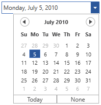

# Dropdown Pop-up

You can display the Dropdown Popup by checking the DropDown Button. The visibility of the DropDown popup can be enabled by setting the [IsPopupEnabled](https://help.syncfusion.com/cr/cref_files/wpf/Syncfusion.Shared.Wpf~Syncfusion.Windows.Shared.DateTimeBase~IsPopupEnabled.html) property to true. The Dropdown pop-up in DateTimeEdit controls contains the following parts:

* Calendar
* Clock
* Today Button
* None Button

## Enable / Disable the pop-up buttons

* None Button visibility can be enabled by setting the [IsEmptyDateEnabled](https://help.syncfusion.com/cr/cref_files/wpf/Syncfusion.Shared.Wpf~Syncfusion.Windows.Shared.DateTimeBase~IsEmptyDateEnabled.html) property to true.





<syncfusion:DateTimeEdit x:Name="dateTimeEdit" Height="25" Width="200" 
                         EnableClassicStyle="False" IsEmptyDateEnabled="True"  
                         DateTime="07/05/2010" Pattern="LongDate"/>





## Enable / Disable up-down button

You can edit value of DateTimeEdit using the up-down button by setting the [IsVisibleRepeatButton](https://help.syncfusion.com/cr/cref_files/wpf/Syncfusion.Shared.Wpf~Syncfusion.Windows.Shared.DateTimeBase~IsVisibleRepeatButton.html) property to true. 





<syncfusion:DateTimeEdit x:Name="dateTimeEdit" Height="25" Width="200" 
                         DateTime="07/15/2010" IsVisibleRepeatButton="True" />





dateTimeEdit.IsVisibleRepeatButton = true;





## Pop-up and up-down buttons functionalities

You can use the Calendar and Clock for changing the Date and Time of the DateTimeEdit control. Also, by clicking the None Button you can set the null value to the [DateTime](https://help.syncfusion.com/cr/wpf/Syncfusion.Shared.Wpf~Syncfusion.Windows.Shared.DateTimeEdit~DateTime.html) property of the DateTimeEdit control. 

## Open and Close drop-down through Keyboard

`DateTimeEdit` dropdown popup can be opened and closed by pressing `Enter` key. This behavior can be enabled by setting the [AllowEnter](https://help.syncfusion.com/cr/wpf/Syncfusion.Shared.Wpf~Syncfusion.Windows.Shared.DateTimeEdit~AllowEnter.html) property of DateTimeEdit to true.





<syncfusion:DateTimeEdit x:Name="datetimeedit" CanEdit="False" AllowEnter="True"/>





datetimeedit.CanEdit = false;
datetimeedit.AllowEnter = true;





N> Dropdown popup of DateTimeEdit cannot be opened by pressing Enter Key when [CanEdit](https://help.syncfusion.com/cr/cref_files/wpf/Syncfusion.Shared.Wpf~Syncfusion.Windows.Shared.DateTimeBase~CanEdit.html) Property set to `True`.
