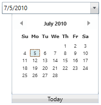

# Getting Started with DateTimeEdit

This section explains how to create a WPF DateTimeEdit and explains about its structure.

## Structure of DateTimeEdit

The various elements of DateTimeEdit are illustrated in the following screenshot.

## Assembly deployment

Refer to the [Control Dependencies](https://help.syncfusion.com/wpf/control-dependencies#datetimeedit) section to get the list of assemblies or NuGet package that needs to be added as a reference to use the control in any application.

Refer to this [documentation](https://help.syncfusion.com/wpf/visual-studio-integration/nuget-packages) to find more details about installing nuget packages in a WPF application.

## Adding WPF DateTimeEdit via designer

1) The DateTimeEdit can be added to an application by dragging it from the toolbox to a designer view. The following dependent assemblies will be added automatically:

* Syncfusion.Shared.WPF

2) Set the properties for DateTimeEdit in design mode using the SmartTag feature.

## Adding WPF DateTimeEdit via XAML

To add the DateTimeEdit manually in XAML, follow these steps:

1) Create a new WPF project in Visual Studio.

2) Add the following required assembly references to the project:

* Syncfusion.Shared.WPF

3) Import Syncfusion WPF schema **http://schemas.syncfusion.com/wpf**, and declare the DateTimeEdit in XAML page.





<Window x:Class="DateTimeEdit_sample.MainWindow"
        xmlns="http://schemas.microsoft.com/winfx/2006/xaml/presentation"
        xmlns:x="http://schemas.microsoft.com/winfx/2006/xaml"
        xmlns:d="http://schemas.microsoft.com/expression/blend/2008"
        xmlns:mc="http://schemas.openxmlformats.org/markup-compatibility/2006"
        xmlns:local="clr-namespace:DateTimeEdit_sample"
        xmlns:syncfusion="http://schemas.syncfusion.com/wpf"
        mc:Ignorable="d"
        Title="MainWindow" Height="450" Width="800">

<Grid Name="grid">
    <syncfusion:DateTimeEdit Name="dateTimeEdit" Height="25" Width="200"/>
</Grid>

</Window>





## Adding WPF DateTimeEdit via C#

To add the DateTimeEdit manually in C#, follow these steps:

1) Create a new WPF application via Visual Studio.

2) Add the following required assembly references to the project:

* Syncfusion.Shared.WPF

3) Include the required namespace.





using Syncfusion.Windows.Shared;





4) Create an instance of [DateTimeEdit](https://help.syncfusion.com/cr/wpf/Syncfusion.Shared.Wpf~Syncfusion.Windows.Shared.DateTimeEdit.html), and add it to the window.





// Creating an instance of the DateTimeEdit
Syncfusion.Windows.Shared.DateTimeEdit dateTimeEdit = new Syncfusion.Windows.Shared.DateTimeEdit();

// Setting height and width to DateTimeEdit
dateTimeEdit.Height = 25;
dateTimeEdit.Width = 200;

// Adding control into the main window
grid.Children.Add(dateTimeEdit); 





## Setting date time value

You can set the date using the [DateTime](https://help.syncfusion.com/cr/wpf/Syncfusion.Shared.Wpf~Syncfusion.Windows.Shared.DateTimeEdit~DateTime.html) property of DateTimeEdit.





<!--Setting date -->
<syncfusion:DateTimeEdit x:Name="dateTimeEdit" Height="25" Width="200" DateTime="07/05/2010"/>





//Setting date
dateTimeEdit.DateTime = new DateTime(2010, 07, 05);





N> Download demo application from [GitHub](https://github.com/SyncfusionExamples/wpf-date-time-edit-examples/tree/master/Samples/SettingDate)

## Value changed notification

The DateTimeEdit notifies that the value is changed through the [DateTimeChanged](https://help.syncfusion.com/cr/wpf/Syncfusion.Shared.Wpf~Syncfusion.Windows.Shared.DateTimeEdit~DateTimeChanged_EV.html) event. You can use the **OldValue** and **NewValue** properties to get the old and new date time value in the **DateTimeChanged** event.





dateTimeEdit.DateTimeChanged += DateTimeEdit_DateTimeChanged;

private void DateTimeEdit_DateTimeChanged(DependencyObject d, DependencyPropertyChangedEventArgs e)
{
    Console.WriteLine("DateTimeChanged event is fired");     
}





## Applying built-in pattern

You can change the date-time pattern using the [Pattern](https://help.syncfusion.com/cr/wpf/Syncfusion.Shared.Wpf~Syncfusion.Windows.Shared.DateTimeBase~Pattern.html) property of the DateTimeEdit. The DateTimeEdit control supports the following DateTime format:

* LongDate
* LongTime
* ShortDate
* ShortTime
* FullDateTime
* MonthDay
* CustomPattern
* ShortableDateTime
* UniversalShortableDateTime
* RFC1123
* YearMonth 





<!--Setting ShortDate Pattern-->
<syncfusion:DateTimeEdit x:Name="dateTimeEdit" Height="25" Width="200" 
                         DateTime="07/15/2010" Pattern="ShortDate"/>





//Setting predefined ShortDate pattern
dateTimeEdit.Pattern = DateTimePattern.ShortDate;





## Applying custom pattern

You can also set the custom pattern for displaying the date in the DateTimeEdit control by using the [CustomPattern](https://help.syncfusion.com/cr/cref_files/wpf/Syncfusion.Shared.Wpf~Syncfusion.Windows.Shared.DateTimeBase~CustomPattern.html) property. 





<Grid x:Name="grid">
    <syncfusion:DateTimeEdit x:Name="dateTimeEdit" Height="25" Width="200" 
                             DateTime="07/15/2010" Pattern="CustomPattern" 
                             CustomPattern="MM**dd**yy hh:mm:ss"/>
 </Grid>                         





Syncfusion.Windows.Shared.DateTimeEdit dateTimeEdit = new Syncfusion.Windows.Shared.DateTimeEdit();

public MainWindow()
{
    InitializeComponent();
    dateTimeEdit.Width = 200;
    dateTimeEdit.Height = 25;
    dateTimeEdit.DateTime = new DateTime(2019, 07, 15);
    dateTimeEdit.Pattern = DateTimePattern.CustomPattern;

    //Setting Custom Pattern
    dateTimeEdit.CustomPattern = "MM**dd**yy hh:mm:ss";
    this.grid.Children.Add(dateTimeEdit);
}



 

N>[CustomPattern](https://help.syncfusion.com/cr/cref_files/wpf/Syncfusion.Shared.Wpf~Syncfusion.Windows.Shared.DateTimeBase~CustomPattern.html) support can be enabled by setting the [Pattern](https://help.syncfusion.com/cr/cref_files/wpf/Syncfusion.Shared.Wpf~Syncfusion.Windows.Shared.DateTimeBase~Pattern.html) property to the DateTimePattern.CustomPattern.

## Editing date time

The **DateTimeEdit** control provides support for editing DateTime using text box. It supports both free flow editing and mask based editing. Editing modes can be changed using the [CanEdit](https://help.syncfusion.com/cr/cref_files/wpf/Syncfusion.Shared.Wpf~Syncfusion.Windows.Shared.DateTimeBase~CanEdit.html) property of DateTimeEdit. The following code example demonstrates free flow editing in the DateTimeEdit by setting the **CanEdit** property as true.





<syncfusion:DateTimeEdit Name="dateTimeEdit" Height="25" Width="200" 
                         DateTime="07/15/2010" CanEdit="True"/>





// Enabling editing mode in DateTimeEdit by setting CanEdit property as true.
dateTimeEdit.CanEdit = true;





## Restrict date range

Prevents users from selecting a date and time in a particular range by specifying [minimum](https://help.syncfusion.com/cr/wpf/Syncfusion.Shared.Wpf~Syncfusion.Windows.Shared.DateTimeEdit~MinDateTime.html) and [maximum](https://help.syncfusion.com/cr/wpf/Syncfusion.Shared.Wpf~Syncfusion.Windows.Shared.DateTimeEdit~MaxDateTime.html) dates in DateTimeEdit control.





<!--Setting date range -->
<syncfusion:DateTimeEdit x:Name="dateTimeEdit" Height="25" Width="200" 
                         DateTime="07/05/2010" MinDateTime="07/01/2010" 
                         MaxDateTime="07/28/2010"/>





//Setting date range
dateTimeEdit.MinDateTime = new DateTime(2010, 07, 01);
dateTimeEdit.MaxDateTime = new DateTime(2010, 07, 28);





## Watermark for null value

The DateTimeEdit control provides support to display a hint information using watermark text when the selected date is null. In addition, it also provides support to define null DateTime value. You can customize the watermark text using the [NoneDateText](https://help.syncfusion.com/cr/cref_files/wpf/Syncfusion.Shared.Wpf~Syncfusion.Windows.Shared.DateTimeBase~NoneDateText.html) property of DateTimeEdit.





<syncfusion:DateTimeEdit x:Name="dateTimeEdit" Height="25" Width="200"
                         NoneDateText="No date is selected" NullValue="{x:Null}"
                         IsEmptyDateEnabled="True" CanEdit="True"/>





dateTimeEdit.NullValue = null;
dateTimeEdit.IsEmptyDateEnabled = true;
dateTimeEdit.NoneDateText = "No date is selected";





N> The [NullValue](https://help.syncfusion.com/cr/wpf/Syncfusion.Shared.Wpf~Syncfusion.Windows.Shared.DateTimeEdit~NullValue.html) support in the DateTimeEdit control can be enabled only when setting the [IsEmptyDateEnabled](https://help.syncfusion.com/cr/cref_files/wpf/Syncfusion.Shared.Wpf~Syncfusion.Windows.Shared.DateTimeBase~IsEmptyDateEnabled.html) property to `true`.