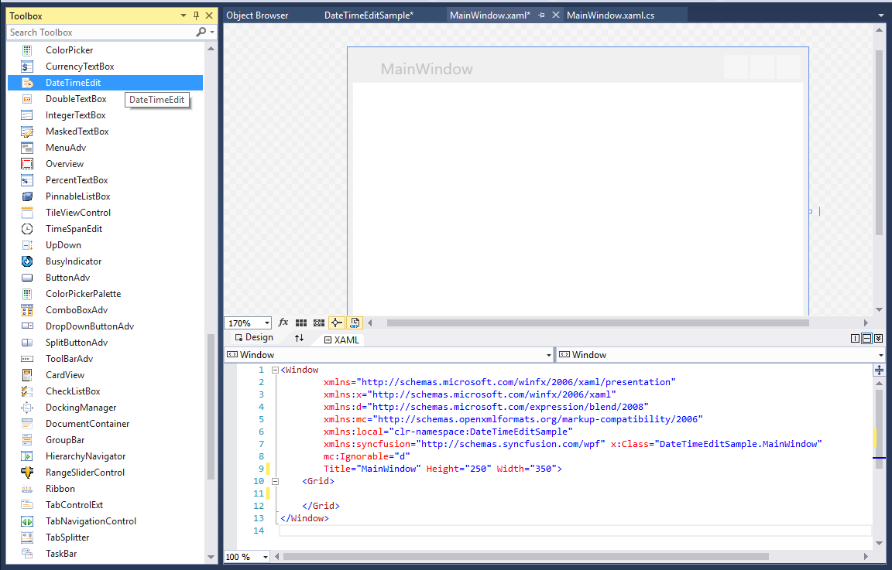
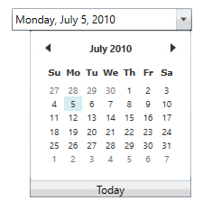

# Getting Started

## Assembly deployment

Refer to the [control dependencies](https://help.syncfusion.com/wpf/control-dependencies#datetimeedit) section to get the list of assemblies or NuGet package that needs to be added as a reference to use the control in any application.

You can find more details about installing the NuGet package in a WPF application in the following link: 

[How to install nuget packages](https://help.syncfusion.com/wpf/nuget-packages)

## Create a simple application with DateTimeEdit

You can create a WPF application with the DateTimeEdit control using the following steps:

## Create a project

Create a new WPF project in Visual Studio to display the DateTimeEdit control with its functionalities.

## Add control through designer

The DateTimeEdit control can be added to an application by dragging it from the toolbox to a designer view. The **Syncfusion.Shared.WPF** assembly reference will be added automatically.

## Add control manually in XAML

To add the control manually in XAML, follow the given steps:

1.	Add the **Syncfusion.Shared.WPF** assembly reference to the project.
2.	Import Syncfusion WPF schema **http://schemas.syncfusion.com/wpf** in the XAML page.
3.	Declare the DateTimeEdit control in the XAML page.



<Window xmlns="http://schemas.microsoft.com/winfx/2006/xaml/presentation"
        xmlns:x="http://schemas.microsoft.com/winfx/2006/xaml"
        xmlns:syncfusion="http://schemas.syncfusion.com/wpf" 
        x:Class="DateTimeEditSample.MainWindow"
        Title="DateTimeEdit Sample" Height="350" Width="525">
    <Grid>
        <!--Adding DateTimeEdit control -->
        <syncfusion:DateTimeEdit x:Name="dateTimeEdit" Width="100" VerticalAlignment="Center" HorizontalAlignment="Center"/>
    </Grid>
</Window>



## Add control manually in C\#

To add the control manually in C#, follow the given steps:

1.	Add the **Syncfusion.Shared.WPF** assembly reference to the project.
2.	Import the DateTimeEdit namespace **using Syncfusion.Windows.Shared;**.
3.	Create a DateTimeEdit instance, and add it to the window.



using Syncfusion.Windows.Shared;
namespace DateTimeEditBoxSample
{
    /// 

    /// Interaction logic for MainWindow.xaml
    /// 

    public partial class MainWindow : Window
    {
        public MainWindow()
        {
            InitializeComponent();
            //Creating an instance of DateTimeEdit control
            DateTimeEdit dateTimeEdit = new DateTimeEdit();
            //Adding DateTimeEdit as window content
            this.Content = dateTimeEdit;
        } 
    }
}



## Setting date

You can use the [DateTime](https://help.syncfusion.com/cr/wpf/Syncfusion.Shared.Wpf~Syncfusion.Windows.Shared.DateTimeEdit~DateTime.html) property to set date to the DateTimeEdit control.



<!--Setting date -->
<syncfusion:DateTimeEdit x:Name="dateTimeEdit" Height="25" Width="200" DateTime="07/05/2010" Pattern="LongDate"/>


//Setting date
dateTimeEdit.DateTime = new DateTime(2010, 07, 05);



## Date-time format

You can define the format to display the date value in the DateTimeEdit control by setting the [DateTimeFormat](https://help.syncfusion.com/cr/wpf/Syncfusion.Shared.Wpf~Syncfusion.Windows.Shared.DateTimeBase~DateTimeFormat.html) property.



<syncfusion:DateTimeEdit x:Name="dateTimeEdit" Height="25" Width="200" DateTime="07/15/2010" Pattern="ShortDate">
    <syncfusion:DateTimeEdit.DateTimeFormat>
        <global:DateTimeFormatInfo ShortDatePattern="MM/dd/yy hh:mm:ss"/>
    </syncfusion:DateTimeEdit.DateTimeFormat>
</syncfusion:DateTimeEdit>


Syncfusion.Windows.Shared.DateTimeEdit dateTimeEdit = new Syncfusion.Windows.Shared.DateTimeEdit();
dateTimeEdit.Width = 200;
dateTimeEdit.Height = 25;
dateTimeEdit.DateTime = new DateTime(2010, 07, 05);
dateTimeEdit.Pattern = DateTimePattern.ShortDate;
dateTimeEdit.DateTimeFormat = new DateTimeFormatInfo()
{
	ShortDatePattern = "MM/dd/yy hh:mm:ss"
};



## DateTime Patterns

DateTimeEdit displays the date-time in the following patterns:

1. LongDate
2. LongTime
3. ShortDate
4. ShortTime
5. FullDateTime
6. MonthDay
7. CustomPattern
8. ShortableDateTime
9. UniversalShortableDateTime
10. RFC1123
11. YearMonth
12. CustomPattern 

You can change the date-time pattern using the [Pattern](https://help.syncfusion.com/cr/wpf/Syncfusion.Shared.Wpf~Syncfusion.Windows.Shared.DateTimeBase~Pattern.html) property of the DateTimeEdit control.



<!--Setting ShortDate Pattern-->
<syncfusion:DateTimeEdit x:Name="dateTimeEdit" Height="25" Width="200" DateTime="07/15/2010" Pattern="ShortDate"/>


//Setting predefined ShortDate pattern
dateTimeEdit.Pattern = DateTimePattern.ShortDate;



## Date range

You can define the start and end dates by setting the [MinDateTime](https://help.syncfusion.com/cr/wpf/Syncfusion.Shared.Wpf~Syncfusion.Windows.Shared.DateTimeEdit~MinDateTime.html) and [MaxDateTime](https://help.syncfusion.com/cr/wpf/Syncfusion.Shared.Wpf~Syncfusion.Windows.Shared.DateTimeEdit~MaxDateTime.html) properties of the DateTimeEdit control.



<!--Setting date range -->
<syncfusion:DateTimeEdit x:Name="dateTimeEdit" Height="25" Width="200" DateTime="07/05/2010" MinDateTime="07/01/2010" MaxDateTime="07/28/2010" Pattern="LongDate"/>


//Setting date range
dateTimeEdit.MinDateTime = new DateTime(2010, 07, 01);
dateTimeEdit.MaxDateTime = new DateTime(2010, 07, 28);



## Watermark support

You can set watermark to the content using the [NoneDateText](https://help.syncfusion.com/cr/wpf/Syncfusion.Shared.Wpf~Syncfusion.Windows.Shared.EditorBase~WatermarkText.html) property.



<!--Setting ShortDate Pattern-->
<syncfusion:DateTimeEdit x:Name="dateTimeEdit" syncfusion:SkinStorage.VisualStyle="Metro" CanEdit="True" NoneDateText="No date is selected" IsEmptyDateEnabled="True" NullValue="{x:Null}">


dateTimeEdit.NullValue = null;
dateTimeEdit.IsEmptyDateEnabled = true;
dateTimeEdit.NoneDateText = "No date is selected";



