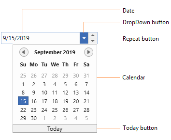
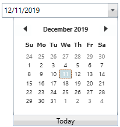
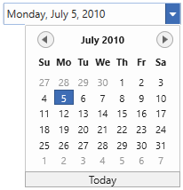
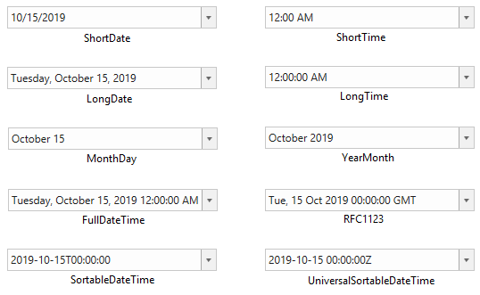
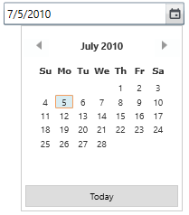
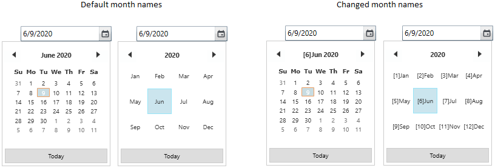
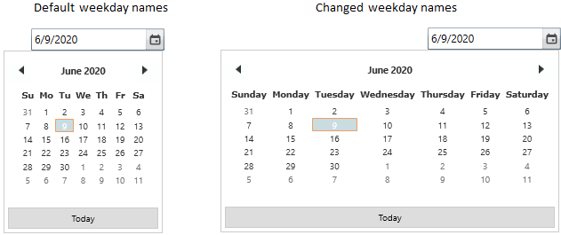

# Getting Started with WPF DateTimePicker (DateTimeEdit)

This section provides a quick overview of working with the WPF [DateTimeEdit](https://help.syncfusion.com/cr/wpf/Syncfusion.Windows.Shared.DateTimeEdit.html).

## Visual Structure

## Assembly deployment

Refer to the [Control Dependencies](https://help.syncfusion.com/wpf/control-dependencies#datetimeedit) section to get the list of assemblies or NuGet package that needs to be added as a reference to use the [DateTimeEdit](https://help.syncfusion.com/cr/wpf/Syncfusion.Windows.Shared.DateTimeEdit.html) control in any application.

You can find more details about installing the NuGet package in a WPF application in the following link: [How to install nuget packages](https://help.syncfusion.com/wpf/visual-studio-integration/nuget-packages)

## Creating an application with the DateTimeEdit control

In this walkthrough, you will create a WPF application that contains the [DateTimEdit](https://help.syncfusion.com/cr/wpf/Syncfusion.Windows.Shared.DateTimeEdit.html) control.

## Creating a project

Create a new WPF project to show the `DateTimeEdit` control in Visual Studio.

## Adding control via designer

The `DateTimeEdit` control can be added to the application by dragging it from Toolbox and dropping it in the designer. The required [assemblies](https://help.syncfusion.com/wpf/control-dependencies#datetimeedit) will be added automatically.

N> You can customize the properties of DateTimeEdit control using the SmartTag.

## Adding control manually in XAML

To add the control manually in XAML page, follow the given steps:

1.Add the following required assembly references to the project,

* Syncfusion.Shared.WPF

2.Import Syncfusion WPF schema **http://schemas.syncfusion.com/wpf** in XAML page.

3.Declare the `DateTimeEdit` control in XAML page.





<Window x:Class="DateTimeEdit_sample.MainWindow"
        xmlns="http://schemas.microsoft.com/winfx/2006/xaml/presentation"
        xmlns:x="http://schemas.microsoft.com/winfx/2006/xaml"
        xmlns:d="http://schemas.microsoft.com/expression/blend/2008"
        xmlns:mc="http://schemas.openxmlformats.org/markup-compatibility/2006"
        xmlns:local="clr-namespace:DateTimeEdit_sample"
        xmlns:syncfusion="http://schemas.syncfusion.com/wpf"
        mc:Ignorable="d"
        Title="MainWindow" Height="450" Width="800">
    <Grid Name="grid">
        <syncfusion:DateTimeEdit x:Name="dateTimeEdit" Height="25" Width="120" VerticalAlignment="Center"/>
    </Grid>
</Window>





## Adding control manually in C#

To add the control manually in C#, follow the given steps:

1.Add the following required assembly references to the project,

* Syncfusion.Shared.WPF

2.Import the `DateTimeEdit` namespace **Syncfusion.Windows.Shared**.

3.Create the `DateTimeEdit` control instance and add it to the page.





// Creating an instance of the DateTimeEdit
DateTimeEdit dateTimeEdit = new DateTimeEdit();

// Setting height and width to DateTimeEdit
dateTimeEdit.Height = 25;
dateTimeEdit.Width = 120;

// Adding control into the main window
this.Content = dateTimeEdit;





## Setting date time value

You can set the date using the [DateTime](https://help.syncfusion.com/cr/wpf/Syncfusion.Windows.Shared.DateTimeEdit.html#Syncfusion_Windows_Shared_DateTimeEdit_DateTime) property of the `DateTimeEdit` control.




<!--Setting date -->
<syncfusion:DateTimeEdit DateTime="07/05/2010"
                         Name="dateTimeEdit" 
                         Height="25"
                         Width="120" />





//Setting date
dateTimeEdit.DateTime = new DateTime(2010, 07, 05);




N> [View sample in GitHub](https://github.com/SyncfusionExamples/wpf-date-time-edit-examples/tree/master/Samples/SettingDate).

## Binding date time value

You can bind the selected date time value by using the `DateTime` property.

The following code snippets illustrate the value binding from one `DateTimeEdit` to another.




//ViewModel.cs
class ViewModel : NotificationObject {
    private DateTime selectedDate = DateTime.Now;

    public DateTime SelectedDate {
        get {
            return selectedDate;
        }
        set {
            selectedDate = value;
            this.RaisePropertyChanged(nameof(SelectedDate));
        }
    }
}







<Window.DataContext>
    <local:ViewModel/>
</Window.DataContext>

<StackPanel HorizontalAlignment="Center" 
            VerticalAlignment="Center">
    <syncfusion:DateTimeEdit Name="dateTimeEdit1"
                             Height="25" 
                             Width="200" 
                             DateTime="{Binding SelectedDate, Mode=TwoWay}"/>
    <syncfusion:DateTimeEdit Name="dateTimeEdit2"
                             Height="25" 
                             Width="200" 
                             DateTime="{Binding SelectedDate, Mode=TwoWay}"
                             Margin="10"/>
</StackPanel>




N> [View sample in GitHub](https://github.com/SyncfusionExamples/wpf-datetimepicker-examples/tree/master/Samples/Data-Binding).

## Value Changed Notification

The [DateTime](https://help.syncfusion.com/cr/wpf/Syncfusion.Windows.Shared.DateTimeEdit.html#Syncfusion_Windows_Shared_DateTimeEdit_DateTime) property value changed in the `DateTimeEdit` can be examined using the [DateTimeChanged](https://help.syncfusion.com/cr/wpf/Syncfusion.Windows.Shared.DateTimeEdit.html#Syncfusion_Windows_Shared_DateTimeEdit_DateTimeChanged) event. The `DateTimeChanged` event contains the old and newly selected date time values in the `OldValue` and `NewValue` properties.




<syncfusion:DateTimeEdit DateTimeChanged="dateTimeEdit_DateTimeChanged" 
                          Name="dateTimeEdit"/>




DateTimeEdit dateTimeEdit = new DateTimeEdit();
dateTimeEdit.DateTimeChanged += dateTimeEdit_DateTimeChanged;




You can handle the event as follows,




private void dateTimeEdit_DateTimeChanged(DependencyObject d, DependencyPropertyChangedEventArgs e) {
    //Get old and new values
    var oldValue = e.OldValue;
    var newValue = e.NewValue;
}




## Applying built-in pattern

You can change the date-time pattern using the [Pattern](https://help.syncfusion.com/cr/wpf/Syncfusion.Windows.Shared.DateTimeBase.html#Syncfusion_Windows_Shared_DateTimeBase_Pattern) property to the following formats in the DateTimeEdit control.

* LongDate
* LongTime
* ShortDate
* ShortTime
* FullDateTime
* MonthDay
* CustomPattern
* ShortableDateTime
* UniversalShortableDateTime
* RFC1123
* YearMonth 




<!--Setting ShortDate Pattern-->
<syncfusion:DateTimeEdit x:Name="dateTimeEdit" 
                         DateTime="07/15/2010" 
                         Pattern="ShortDate"/>




//Setting predefined ShortDate pattern
dateTimeEdit.Pattern = DateTimePattern.ShortDate;




N> [View sample in GitHub](https://github.com/SyncfusionExamples/wpf-datetimepicker-examples/tree/master/Samples/DateTimeFormatting).

## Applying custom pattern

You can display the date and time in any format in the DateTimeEdit control by using the [CustomPattern](https://help.syncfusion.com/cr/wpf/Syncfusion.Windows.Shared.DateTimeBase.html#Syncfusion_Windows_Shared_DateTimeBase_CustomPattern) property. The `CustomPattern` property support can be enabled by setting the [Pattern](https://help.syncfusion.com/cr/wpf/Syncfusion.Windows.Shared.DateTimeBase.html#Syncfusion_Windows_Shared_DateTimeBase_Pattern) property to `CustomPattern`.




<syncfusion:DateTimeEdit CustomPattern="MM**dd**yy hh:mm:ss"
                         Pattern="CustomPattern" 
                         DateTime="07/15/2010" 
                         Name="dateTimeEdit"/>
                      




DateTimeEdit dateTimeEdit = new DateTimeEdit();
dateTimeEdit.CustomPattern = "MM**dd**yy hh:mm:ss";
dateTimeEdit.Pattern = DateTimePattern.CustomPattern;
dateTimeEdit.DateTime = new DateTime(2019, 07, 15);


 

N> [View sample in GitHub](https://github.com/SyncfusionExamples/wpf-datetimepicker-examples/tree/master/Samples/DateTimeFormatting).

## Editing date time

The [DateTimeEdit](https://help.syncfusion.com/cr/wpf/Syncfusion.Windows.Shared.DateTimeEdit.html) control supports both free form editing (like normal textbox editing) and mask based editing. You can edit the date-time in the `DateTimeEdit` control by setting the [CanEdit](https://help.syncfusion.com/cr/wpf/Syncfusion.Windows.Shared.DateTimeBase.html#Syncfusion_Windows_Shared_DateTimeBase_CanEdit) property to `true`. For every user input, the value will be validated after the <kbd>Enter</kbd> key is pressed, or focus is lost when the `CanEdit` property is enabled.




<syncfusion:DateTimeEdit CanEdit="True"
                         DateTime="07/15/2010" 
                         Name="dateTimeEdit"/>




DateTimeEdit dateTimeEdit = new DateTimeEdit();
dateTimeEdit.CanEdit = true;




N> [View sample in GitHub](https://github.com/SyncfusionExamples/wpf-datetimepicker-examples/tree/master/Samples/Dropdown-Options).

## Restrict date range

You can restrict the users from selecting a date and time in a particular range by using the [MinimumDateTime](https://help.syncfusion.com/cr/wpf/Syncfusion.Windows.Shared.DateTimeEdit.html#Syncfusion_Windows_Shared_DateTimeEdit_MinDateTime) and [MaximumDateTime](https://help.syncfusion.com/cr/wpf/Syncfusion.Windows.Shared.DateTimeEdit.html#Syncfusion_Windows_Shared_DateTimeEdit_MaxDateTime) properties in the `DateTimeEdit` control.




<!--Setting date range -->
<syncfusion:DateTimeEdit MinDateTime="06/1/2020" 
                         MaxDateTime="06/10/2020"
                         Name="dateTimeEdit"/>




DateTimeEdit dateTimeEdit = new DateTimeEdit();
dateTimeEdit.MinDateTime = new DateTime(2020, 06, 01);
dateTimeEdit.MaxDateTime = new DateTime(2020, 06, 10);




N> [View sample in GitHub](https://github.com/SyncfusionExamples/wpf-datetimepicker-examples/tree/master/Samples/Dropdown-Options).

## Show watermark when value is null

If you want to display the watermark text instead of null value, use the [NoneDateText](https://help.syncfusion.com/cr/wpf/Syncfusion.Windows.Shared.DateTimeBase.html#Syncfusion_Windows_Shared_DateTimeBase_NoneDateText) property to setting the watermark text. You can enable it only by setting the [IsEmptyDateEnabled](https://help.syncfusion.com/cr/wpf/Syncfusion.Windows.Shared.DateTimeBase.html#Syncfusion_Windows_Shared_DateTimeBase_IsEmptyDateEnabled) property to `true`, [ShowMaskOnNullValue](https://help.syncfusion.com/cr/wpf/Syncfusion.Windows.Shared.DateTimeEdit.html#Syncfusion_Windows_Shared_DateTimeEdit_ShowMaskOnNullValue) property to `false` and `NullValue` property as `null`. The default value of `NoneDateText` property is `string.Empty`.




<syncfusion:DateTimeEdit NoneDateText="Select the date"
                         ShowMaskOnNullValue="True"
                         NullValue="{x:Null}"
                         IsEmptyDateEnabled="True" 
                         Name="dateTimeEdit"/>




DateTimeEdit dateTimeEdit = new DateTimeEdit();
dateTimeEdit.NoneDateText= "Select the date";
dateTimeEdit.ShowMaskOnNullValue= true;
dateTimeEdit.IsEmptyDateEnabled= true;
dateTimeEdit.NullValue = null;




N> [View sample in GitHub](https://github.com/SyncfusionExamples/wpf-datetimepicker-examples/tree/master/Samples/NullValue-Options).

## Change month names

You can change the popup calendar month names in the `DateTimeEdit` control by adding the respective new names to the [AbbreviatedMonthNames](https://help.syncfusion.com/cr/wpf/Syncfusion.Windows.Shared.DateTimeEdit.html#Syncfusion_Windows_Shared_DateTimeEdit_AbbreviatedMonthNames) property. The default value of the `AbbreviatedMonthNames` property is `null`.




<syncfusion:DateTimeEdit Name="dateTimeEdit" >
    <syncfusion:DateTimeEdit.AbbreviatedMonthNames>
        <x:Array Type="sys:String" 
                 xmlns:sys="clr-namespace:System;assembly=mscorlib">
            <sys:String>[1]Jan</sys:String>
            <sys:String>[2]Feb</sys:String>
            <sys:String>[3]Mar</sys:String>
            <sys:String>[4]Apr</sys:String>
            <sys:String>[5]May</sys:String>
            <sys:String>[6]Jun</sys:String>
            <sys:String>[7]Jul</sys:String>
            <sys:String>[8]Aug</sys:String>
            <sys:String>[9]Sep</sys:String>
            <sys:String>[10]Oct</sys:String>
            <sys:String>[11]Nov</sys:String>
            <sys:String>[12]Dec</sys:String>
        </x:Array>
    </syncfusion:DateTimeEdit.AbbreviatedMonthNames>    
</syncfusion:DateTimeEdit>




DateTimeEdit dateTimeEdit = new DateTimeEdit();
dateTimeEdit.AbbreviatedMonthNames = new string[]
{
    "[1]Jan",
    "[2]Feb",
    "[3]Mar",
    "[4]Apr",
    "[5]May",
    "[6]Jun",
    "[7]Jul",
    "[8]Aug",
    "[9]Sep",
    "[10]Oct",
    "[11]Nov",
    "[12]Dec"
};




N> [View sample in GitHub](https://github.com/SyncfusionExamples/wpf-datetimepicker-examples/tree/master/Samples/MonthNames).

## Change week day names

You can change the popup calendar week day names in DateTimeEdit control by adding the respective new names to the [ShortestDayNames](https://help.syncfusion.com/cr/wpf/Syncfusion.Windows.Shared.DateTimeEdit.html#Syncfusion_Windows_Shared_DateTimeEdit_ShortestDayNames) property. The default value of the `ShortestDayNames` property is `null`.




<syncfusion:DateTimeEdit Name="dateTimeEdit" >
    <syncfusion:DateTimeEdit.ShortestDayNames>
        <x:Array Type="sys:String" 
                 xmlns:sys="clr-namespace:System;assembly=mscorlib">
            <sys:String>Sunday</sys:String>
            <sys:String>Monday</sys:String>
            <sys:String>Tuesday</sys:String>
            <sys:String>Wednesday</sys:String>
            <sys:String>Thursday</sys:String>
            <sys:String>Friday</sys:String>
            <sys:String>Saturday</sys:String>
        </x:Array>
    </syncfusion:DateTimeEdit.ShortestDayNames>    
</syncfusion:DateTimeEdit>




DateTimeEdit dateTimeEdit = new DateTimeEdit();
dateTimeEdit.ShortestDayNames= new string[]
{
    "Sunday",
    "Monday",
    "Tuesday",
    "Wednesday",
    "Thursday",
    "Friday",
    "Saturday"
};




N> [View sample in GitHub](https://github.com/SyncfusionExamples/wpf-datetimepicker-examples/tree/master/Samples/WeekDayNames).

## Block particular dates 

You can restrict the user to select the date within some range by blocking the particular date in the `DateTimeEdit`. If you try to set the blackout dates as the selected datetime through editing or when pressing down arrow, it will reset the previous valid date from `StartDate` of blackout dates in `DateTimeEdit`. If you try to set the blackout dates as the selected datetime  by pressing down arrow, it will reset the next valid date from `EndDate` of blackout dates in `DateTimeEdit`.

N> If you try to set the `DateTime` value which contained in blackout dates collection or  try to add the selected `DateTime` value in blackout dates collection, its throws the `Specified argument was out of the range of valid values`.




<syncfusion:DateTimeEdit Loaded="DateTimeEdit_Loaded" 
                         Name="dateTimeEdit"/>



DateTimeEdit dateTimeEdit = new  DateTimeEdit();
dateTimeEdit.Loaded += DateTimeEdit_Loaded; 







//Setting the blockout days
private void DateTimeEdit_Loaded(object sender, RoutedEventArgs e) 
{
    //Setting start and end range for blocking dates
    DateTime StartDate = new DateTime(DateTime.Now.Year, DateTime.Now.Month, 1);
    DateTime EndDate = new DateTime(DateTime.Now.Year, DateTime.Now.Month, DateTime.Now.Day - 2);
    CalendarDateRange blackOutDays = new CalendarDateRange()
    {
        Start = StartDate,
        End = EndDate
    };
    Calendar calendar = new Calendar();
    calendar.BlackoutDates.Add(blackOutDays);
    dateTimeEdit.DateTimeCalender = calendar;
}




N> [View sample in GitHub](https://github.com/SyncfusionExamples/wpf-date-time-edit-examples/tree/master/Samples/BlackOutdates).

## Theme

DateTimeEdit supports various built-in themes. Refer to the below links to apply themes for the DateTimeEdit,

  * [Apply theme using SfSkinManager](https://help.syncfusion.com/wpf/themes/skin-manager)
	
  * [Create a custom theme using ThemeStudio](https://help.syncfusion.com/wpf/themes/theme-studio#creating-custom-theme)

