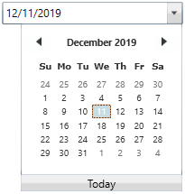

# WPF DateTimePicker (DateTimeEdit) Overview

The [DateTimeEdit](https://help.syncfusion.com/cr/wpf/Syncfusion.Windows.Shared.DateTimeEdit.html) allows you to quickly navigate and select dates using months, years, and decades of calendar. The `DateTimeEdit` comprises text box and a dropdown with calendar and clock to pick or edit a date with time. It supports data binding, null value, maximum and minimum dates, date validation, watermark, culture and much more. It also provides flexible options for displaying the date-time according to the format required, as well as many customization options to enhance its appearance.

## Key features

**Editing mode** - Supports the default text editing and mask mode that helps to restrict the date input in formatted values based on pre-defined or custom date-time pattern.

**Date-range support** - Supports the maximum and minimum dates in order to prevent users from setting a date or time within a given range.

**Globalization** - Supports different date-time formats and patterns based on cultures.

**Date validation** - Supports date validation when date range constraints are met.

**Accessibility** - Provides touch, keyboard, and mouse support to make applications available to a wide variety of users.

**Watermark** - Supports to display watermark text when a selected date is null.

**Styles** - Provides a rich set of built-in themes and customizes the style of each part of `DateTimeEdit`.

**Testing** - Provides QTP add-in that contains custom libraries, which helps [QTP](https://help.syncfusion.com/wpf/datetimepicker/ui-automation#quick-test-professional-qtp) to recognize `DateTimeEdit`.