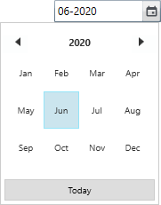

# Restrict date time value in WPF DateTimePicker (DateTimeEdit)

This section explains how to select a date and time in a particular range by specifying minimum and maximum dates and formatting the datetime in [DateTimeEdit](https://help.syncfusion.com/cr/wpf/Syncfusion.Shared.Wpf~Syncfusion.Windows.Shared.DateTimeEdit.html) control.

## Restrict the datetime within minimum and maximum datetime

The selecting datetime in `DateTimeEdit` can be restricted within the maximum and minimum time span limits. Once the selected time has reached the minimum or maximum time span limits , the selected time does not exceed the limit. You can change the minimum and maximum time span limits by using [MinDateTime](https://help.syncfusion.com/cr/wpf/Syncfusion.Shared.Wpf~Syncfusion.Windows.Shared.DateTimeEdit~MinDateTime.html) and [MaxDateTime](https://help.syncfusion.com/cr/wpf/Syncfusion.Shared.Wpf~Syncfusion.Windows.Shared.DateTimeEdit~MaxDateTime.html) properties

N> The `MaxDateTime` should be greater than `MinDateTime` of the `DateTimeEdit`. If the `MinDateTime` property is greater than the new `MaxDateTime`, then the `MinDateTime` will be reset to the `MaxDateTime`.




<!--Setting date range -->
<syncfusion:DateTimeEdit MinDateTime="06/1/2020" 
                         MaxDateTime="06/10/2020"
                         Name="dateTimeEdit"/>




DateTimeEdit dateTimeEdit = new DateTimeEdit();
dateTimeEdit.MinDateTime = new DateTime(2020, 06, 01);
dateTimeEdit.MaxDateTime = new DateTime(2020, 06, 10);




N> View [Sample](https://github.com/SyncfusionExamples/wpf-datetimepicker-examples/tree/master/Samples/Dropdown-Options) in GitHub

### Minimum and maximum value change notification

The `DateTimeEdit` notifies that the minimum and maximum value is changed through the [MinDateTimeChanged](https://help.syncfusion.com/cr/wpf/Syncfusion.Shared.Wpf~Syncfusion.Windows.Shared.DateTimeEdit~MinDateTimeChanged_EV.html) and [MaxDateTimeChanged](https://help.syncfusion.com/cr/wpf/Syncfusion.Shared.Wpf~Syncfusion.Windows.Shared.DateTimeEdit~MaxDateTimeChanged_EV.html) event. You can use the `OldValue` and `NewValue` properties to get the old and new minimum / maximum date time value.




<syncfusion:DateTimeEdit MinDateTimeChanged="DateTimeEdit_MinDateTimeChanged" 
                         MaxDateTimeChanged="DateTimeEdit_MaxDateTimeChanged"
                         Name="dateTimeEdit"/>




DateTimeEdit dateTimeEdit = new  DateTimeEdit();
dateTimeEdit.MinDateTimeChanged += DateTimeEdit_MinDateTimeChanged;
dateTimeEdit.MaxDateTimeChanged += DateTimeEdit_MaxDateTimeChanged;




You can handle the event as follows,




private void DateTimeEdit_MinDateTimeChanged(DependencyObject d, DependencyPropertyChangedEventArgs e) {
    //Get old and new minimum date values
    var oldMinDate = e.OldValue;
    var newMinDate = e.NewValue;
}

private void DateTimeEdit_MaxDateTimeChanged(DependencyObject d, DependencyPropertyChangedEventArgs e) {
    //Get old and new maximum date values
    var oldMaxDate = e.OldValue;
    var newMaxDate = e.NewValue;
}




## Restrict date selection

You can restrict the user to select the date from the popup calendar by setting the [DisableDateSelection](https://help.syncfusion.com/cr/wpf/Syncfusion.Shared.Wpf~Syncfusion.Windows.Shared.DateTimeEdit~DisableDateSelection.html) property value as `true`. You can select only month and year from the popup calendar. The default value of `DisableDateSelection` property is `false`.




<syncfusion:DateTimeEdit DisableDateSelection="true" 
                         Pattern="CustomPattern" 
                         CustomPattern="MM-yyyy"
                         Name="dateTimeEdit"/>




DateTimeEdit dateTimeEdit = new DateTimeEdit();
dateTimeEdit.DisableDateSelection = true;
dateTimeEdit.Pattern = DateTimePattern.CustomPattern;
dateTimeEdit.CustomPattern = "MM-yyyy";




N> View [Sample](https://github.com/SyncfusionExamples/wpf-datetimepicker-examples/tree/master/Samples/Dropdown-Options) in GitHub

## Block particular dates 

You can restrict the user to select the date within some range by blocking the particular date in the `DateTimeEdit`. If you try to set the blackout dates as the selected datetime through editing or when pressing down arrow, it will reset the previous valid date from `StartDate` of blackout dates in `DateTimeEdit`. If you try to set the blackout dates as the selected datetime  by pressing down arrow, it will reset the next valid date from `EndDate` of blackout dates in `DateTimeEdit`.

N> If you try to set the `DateTime` value which contained in blackout dates collection or  try to add the selected `DateTime` value in blackout dates collection, its throws the `Specified argument was out of the range of valid values`.




<syncfusion:DateTimeEdit Loaded="DateTimeEdit_Loaded" 
                         Name="dateTimeEdit"/>



DateTimeEdit dateTimeEdit = new  DateTimeEdit();
dateTimeEdit.Loaded += DateTimeEdit_Loaded; 







//Setting the blockout days
private void DateTimeEdit_Loaded(object sender, RoutedEventArgs e) {
    //Setting start and end range for blocking dates
    DateTime StartDate = new DateTime(DateTime.Now.Year, DateTime.Now.Month, 1);
    DateTime EndDate = new DateTime(DateTime.Now.Year, DateTime.Now.Month, DateTime.Now.Day - 2);
    Syncfusion.Windows.Controls.CalendarDateRange blackOutDays = new Syncfusion.Windows.Controls.CalendarDateRange() 
    {
        Start = StartDate, 
        End = EndDate
    };
    Syncfusion.Windows.Controls.Calendar calendar = dateTimeEdit.DateTimeCalender as Syncfusion.Windows.Controls.Calendar;
    calendar.BlackoutDates.Add(blackOutDays);
}




N> View [Sample](https://github.com/SyncfusionExamples/wpf-date-time-edit-examples/tree/master/Samples/BlackOutdates) in GitHub

## ReadOnly support

If you want to restrict the inputs from the user, use the `IsReadOnly` property value as `true`. However, value can be changed programmatically in readonly mode and the user can still select text. The default value of `IsReadOnly` property is `false`.




<syncfusion:DateTimeEdit IsReadOnly="True" 
                         DateTime="06/20/2020" 
                         Name="dateTimeEdit" />




DateTimeEdit dateTimeEdit = new  DateTimeEdit();
dateTimeEdit.IsReadOnly = true;
dateTimeEdit.DateTime = new DateTime(2020, 06, 20);




N> View [Sample](https://github.com/SyncfusionExamples/wpf-datetimepicker-examples/tree/master/Samples/Dropdown-Options) in GitHub
