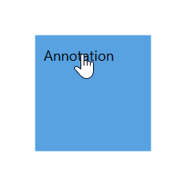

# How to Select and Resize the Annotation

Basic intersections of selecting and resizing can be applied over annotation. These interactions can be controlled by annotation and its parent node or connector.
To learn about annotation constraints, refer to the [Annotation Constraints](https://help.syncfusion.com/cr/wpf/Syncfusion.UI.Xaml.Diagram.AnnotationConstraints.html).

## Selecting the annotation

Selection of annotation can be enabled by using the `Constraints` property of `AnnotationEditorViewModel` class and setting its value as `AnnotationConstraints.Selectable`.




<!--Initialize the Annotation Collection-->
<syncfusion:AnnotationCollection>
    <!--Initialize the annotation with selectable constraint-->
    <syncfusion:AnnotationEditorViewModel Content="Annotation" Constraints="Selectable"/>
</syncfusion:AnnotationCollection>
                                




//Initialize the AnnotationCollection
Annotations = new ObservableCollection<IAnnotation>()
{
    new AnnotationEditorViewModel()
    {
        Content = "Annotation",
        //Initialize the constraint as selectable
        Constraints = AnnotationConstraints.Selectable 
    }
}




## Resizing the annotation

Resizing of annotation can be enabled by using the `Constraints` property of `AnnotationEditorViewModel` class and setting its value as `AnnotationConstraints.Resizable`.




<!--Initialize the Annotation Collection-->
<syncfusion:AnnotationCollection>
    <!--Initialize the Annotation with resizable constraint-->
    <syncfusion:AnnotationEditorViewModel Content="Annotation" Constraints="Selectable,Resizable"/>
</syncfusion:AnnotationCollection>
                                



//Initialize the Annotation Collection
Annotations = new ObservableCollection<IAnnotation>()
{
    new AnnotationEditorViewModel()
    {
        Content = "Annotation",
        //Initialize the constraint as resizable
        Constraints = AnnotationConstraints.Selectable | AnnotationConstraints.Resizable
    }
}




