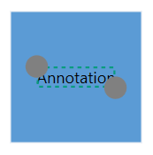
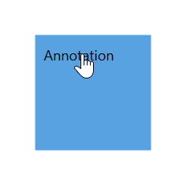

# Annotation Selection and Resizing in WPF SfDiagram

Basic interactions of selecting and resizing can be applied over annotation. These interactions can be controlled by annotation and its parent node or connector.

To learn about annotation constraints, refer to the [Annotation Constraints](https://help.syncfusion.com/cr/wpf/Syncfusion.UI.Xaml.Diagram.AnnotationConstraints.html).

## Selecting the annotation

Selection of an annotation can be enabled by using the [`Constraints`](https://help.syncfusion.com/cr/wpf/Syncfusion.UI.Xaml.Diagram.AnnotationEditorViewModel.html#Syncfusion_UI_Xaml_Diagram_AnnotationEditorViewModel_Constraints) property of [`AnnotationEditorViewModel`](https://help.syncfusion.com/cr/wpf/Syncfusion.UI.Xaml.Diagram.AnnotationEditorViewModel.html) class and setting its value as `AnnotationConstraints.Selectable`.




<!--Initialize the Annotation Collection-->
<syncfusion:AnnotationCollection>
    <!--Initialize the annotation with selectable constraint-->
    <syncfusion:AnnotationEditorViewModel Content="Annotation" Constraints="Selectable"/>
</syncfusion:AnnotationCollection>
                                




//Initialize the AnnotationCollection
Annotations = new ObservableCollection<IAnnotation>()
{
    new AnnotationEditorViewModel()
    {
        Content = "Annotation",
        //Initialize the constraint as selectable
        Constraints = AnnotationConstraints.Selectable 
    }
}




* The [ItemSelectingEvent](https://help.syncfusion.com/cr/wpf/Syncfusion.UI.Xaml.Diagram.IGraphInfo.html#Syncfusion_UI_Xaml_Diagram_IGraphInfo_ItemSelectingEvent) and [ItemSelectedEvent](https://help.syncfusion.com/cr/wpf/Syncfusion.UI.Xaml.Diagram.IGraphInfo.html#Syncfusion_UI_Xaml_Diagram_IGraphInfo_ItemSelectedEvent) notify when an annotation is selected. The event arguments, derived from [DiagramPreviewEventArgs](https://help.syncfusion.com/cr/wpf/Syncfusion.UI.Xaml.Diagram.DiagramPreviewEventArgs.html) and [DiagramEventArgs](https://help.syncfusion.com/cr/wpf/Syncfusion.UI.Xaml.Diagram.DiagramEventArgs.html), provide the selected item, which can be an `AnnotationEditorViewModel` or `TextAnnotationViewModel`, depending on the annotation type.

* The [ItemUnSelectingEvent](https://help.syncfusion.com/cr/wpf/Syncfusion.UI.Xaml.Diagram.IGraphInfo.html#Syncfusion_UI_Xaml_Diagram_IGraphInfo_ItemUnSelectingEvent) and [ItemUnSelectedEvent](https://help.syncfusion.com/cr/wpf/Syncfusion.UI.Xaml.Diagram.IGraphInfo.html#Syncfusion_UI_Xaml_Diagram_IGraphInfo_ItemUnSelectedEvent) notify when an annotation is unselected. The event arguments, also derived from [DiagramPreviewEventArgs](https://help.syncfusion.com/cr/wpf/Syncfusion.UI.Xaml.Diagram.DiagramPreviewEventArgs.html) and [DiagramEventArgs](https://help.syncfusion.com/cr/wpf/Syncfusion.UI.Xaml.Diagram.DiagramEventArgs.html), provide the unselected item, which can be an `AnnotationEditorViewModel` or `TextAnnotationViewModel`, based on the annotation type.

## Resizing the annotation

Resizing an annotation can be enabled by using the `Constraints` property of `AnnotationEditorViewModel` class and setting its value as `AnnotationConstraints.Resizable`.




<!--Initialize the Annotation Collection-->
<syncfusion:AnnotationCollection>
    <!--Initialize the Annotation with resizable constraint-->
    <syncfusion:AnnotationEditorViewModel Content="Annotation" Constraints="Selectable,Resizable"/>
</syncfusion:AnnotationCollection>
                                



//Initialize the Annotation Collection
Annotations = new ObservableCollection<IAnnotation>()
{
    new AnnotationEditorViewModel()
    {
        Content = "Annotation",
        //Initialize the constraint as resizable
        Constraints = AnnotationConstraints.Selectable | AnnotationConstraints.Resizable
    }
}




## See Also
[How to highlight the node when selecting an annotation of the node and vice versa in the WPF Diagram (SfDiagram)?](https://support.syncfusion.com/kb/article/18245/how-to-highlight-the-node-when-selecting-an-annotation-of-the-node-and-vice-versa-in-the-wpf-diagram-sfdiagram)