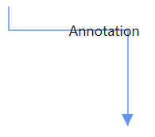
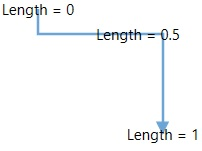
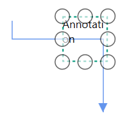

# Positioning and Appearance in WPF Diagram (SfDiagram)

Diagram allows you to customize the position and appearance of the annotation efficiently.

## How to position node's annotation 

Annotation can be aligned relative to the node boundaries. It has Margin, Offset, Horizontal, and Vertical alignment settings. It is quite tricky when all four alignments are used together but gives more control over alignments properties of `AnnotationEditorViewModel` class.

Annotations of a node can be positioned using the following properties of `AnnotationEditorViewModel` class.

* `Offset`
* `HorizontalAlignment` and `VerticalAlignment`
* `Margin`

### Offset

The `Offset` property of `AnnotationEditorViewModel` is used to align the annotations based on fractions. 0 represents top-left corner, 1 represents bottom-right corner, and 0.5 represents half of width/height. Default value is (0.5, 0.5).




<!--Initialize the Node-->
<syncfusion:NodeViewModel UnitHeight="100" UnitWidth="100" 
                          Shape="{StaticResource Rectangle}" 
                          OffsetX="100" OffsetY="100">
    <syncfusion:NodeViewModel.Annotations>
        <!--Initialize the Annotation Collection-->
        <syncfusion:AnnotationCollection>
            <!--Initialize the annotation with offset values-->
            <syncfusion:AnnotationEditorViewModel Content="Offset(0,0)" 
                                                  Offset="0,0"/>
        </syncfusion:AnnotationCollection>
    </syncfusion:NodeViewModel.Annotations>
</syncfusion:NodeViewModel>



//Initialize the NodeViewModel
NodeViewModel node = new NodeViewModel()
{
    UnitWidth = 100,
    UnitHeight = 100,
    Shape = new RectangleGeometry() { Rect = new Rect(0, 0, 10, 10) },
    OffsetX = 100,
    OffsetY = 100,
    //Initialize the Annotation Collection
    Annotations = new ObservableCollection<IAnnotation>()
    {
        //Initialize the annotation with offset values
        new AnnotationEditorViewModel()
        {
            Content = "Offset(0,0)",
            Offset = new Point(0,0),
        },
    }
};            



| Offset values | Output |
|---|---|
| (0,0) |  |
| (0,0.5) |  |
| (0,1) |  |
| (0.5,0) |  |
| (0.5,0.5) |  |
| (0.5,1) |  |
| (1,0) |  |
| (1,0.5) |  |
| (1,1) |  |

### Horizontal and vertical Alignments

The `HorizontalAlignment` property of `AnnotationEditorViewModel` class is used to align the annotation horizontally. Default value is Center.

The `VerticalAlignment` property of `AnnotationEditorViewModel` class is used to align the annotation vertically. Default value is Center.




<!--Initialize the Annotation Collection-->
<syncfusion:AnnotationCollection>
    <!--Initialize the Annotation with horizontal and vertical alignment properties-->
    <syncfusion:AnnotationEditorViewModel Content="Annotation" 
                                          HorizontalAlignment="Left" 
                                          VerticalAlignment="Top" 
                                          Offset="0,0"/>
</syncfusion:AnnotationCollection>



//Initialize the Annotation Collection
Annotations = new ObservableCollection<IAnnotation>()
{
    //Initialize the Annotation with horizontal and vertical alignment properties
    new AnnotationEditorViewModel()
    {
        Content = "Annotation",
        HorizontalAlignment = HorizontalAlignment.Left,
        VerticalAlignment = VerticalAlignment.Top,
        Offset = new Point(0,0),
    }
}             



| Horizontal Alignment | Vertical Alignment | Output with Offset(0,0) |
|---|---|---|
| Left | Top |  |
| Center | Top |  |
| Right | Top |  |
| Left | Center |  |
| Center | Center|  |
| Right |Center |  |
| Left | Bottom |  |
| Center | Bottom |  |
| Right | Bottom |  |

### Margin

`Margin` is an absolute value used to add some blank space in any one of its four sides. The annotations can be displaced with the margin property. The following code example explains how to align an annotation based on its Margin value. Default value is (0,0,0,0).




<!--Initialize the Annotation Collection-->
<syncfusion:AnnotationCollection>
    <!--Initialize the Annotation with margin property-->
    <syncfusion:AnnotationEditorViewModel Content="Annotation" Margin="0,60,0,0"/>
</syncfusion:AnnotationCollection>
 



//Initialize the Annotation Collection
Annotations = new ObservableCollection<IAnnotation>()
{
    //Initialize the Annotation with margin property
    new AnnotationEditorViewModel()
    {
        Content = "Annotation",
        Margin = new Thickness(0, 60, 0, 0),
    }
}




## How to position connector's annotation 

Annotations of a connector can be positioned using the following properties of `AnnotationEditorViewModel` class:

* `Alignment`
* `Length`
* `Displacement`
* `Pivot`
* `Margin`

### Alignment

Connector's annotation can be aligned over its segment path using the `Alignment` property of `AnnotationEditorViewModel` class. Default value is Center.




<!--Initialize the AnnotationCollection-->
<syncfusion:AnnotationCollection>
    <!--Initialize the Annotation with alignment property-->
    <syncfusion:AnnotationEditorViewModel Content="Annotation" Alignment="Source" />
</syncfusion:AnnotationCollection>
 



//Initialize the Annotation Collection
Annotations = new ObservableCollection<IAnnotation>()
{
    //Initialize the Annotation with alignment property
    new AnnotationEditorViewModel()
    {
        Content = "Annotation",
        Alignment = ConnectorAnnotationAlignment.Source,
    }
}




| Property| Value | Output |
|---|---|---|
| Alignment | Source |  |
| | Center |  |
| | Target |  |

### Length

The `Length` property of annotation is used to align the annotations based on fractions. 0 represents Top-Left corner, 1 represents Bottom-Right corner, and 0.5 represents half of Width/Height. The default value is 0.5d.



<!--Initialize the Annotation Collection-->
<syncfusion:AnnotationCollection>
    <!--Initialize the Annotation with length property-->
    <syncfusion:AnnotationEditorViewModel Content="Annotation" Length="0" />
</syncfusion:AnnotationCollection>
 



//Initialize the Annotation Collection
Annotations = new ObservableCollection<IAnnotation>()
{
    //Initialize the Annotation with length property
    new AnnotationEditorViewModel()
    {
        Content = "Annotation",
        Length = 0,
    }
}




The following image shows the relationship between the annotation position and Length (fraction values).

### Displacement

The `Displacement` property is used to dislocate the annotation by the value given. By default, annotation will be in center of the connector path. When you assign value to the `Displacement` property, annotation will be displaced from its position by displacment value. Default value is 0d.



<!--Initialize the Annotation ollection-->
<syncfusion:AnnotationCollection>
    <!--Initialize the Annotation with dispalcement property-->
    <syncfusion:AnnotationEditorViewModel Content="Annotation" Displacement="60" />
</syncfusion:AnnotationCollection>


//Initialize the Annotation Collection
Annotations = new ObservableCollection<IAnnotation>()
{
    //Initialize the Annotation with dispalcement property
    new AnnotationEditorViewModel()
    {
        Content = "Annotation",
        Displacement = 60
    }
}



| Property| Value | Output |
|---|---|---|
| Displacement | 0 |  |
| | 60 |  |
| | -60 |  |

### Pivot

Position of an annotation is controlled by using its `Length` property, which represents the distance from connector center. The `Pivot` property is used to align the annotation based on its center point. Default value of the pivot point is (0.5, 0.5), that means center of length.



<!--Initialize the Annotation Collection-->
<syncfusion:AnnotationCollection>
    <!--Initialize the Annotation with pivot property-->
    <syncfusion:AnnotationEditorViewModel Content="Annotation" Pivot="0,0" Length="0" />
</syncfusion:AnnotationCollection>
 



//Initialize the Annotation Collection
Annotations = new ObservableCollection<IAnnotation>()
{
    //Initialize the Annotation with pivot property
    new AnnotationEditorViewModel()
    {
        Content = "Annotation",
        Pivot = new Point(0,0),
        Length = 0,
    }
}




| Property| Value | Output with 0 Length value |
|---|---|---|
|Pivot | (0.5,0.5) |  |
| | (0,0) |  |
| | (0,1) |  |
| | 1,0) |  |
| | (1,1) |  |

### Margin

`Margin` is an absolute value used to add some blank space in any one of its four sides. You can displace the annotations with the `Margin` property. Default value is (0,0,0,0).




<!--Initialize the Annotation Collection-->
<syncfusion:AnnotationCollection>
    <!--Initialize the annotation with margin property-->
    <syncfusion:AnnotationEditorViewModel  Content="Annotation" 
                                           Margin="0,0,0,-30" 
                                           RotationReference="Page" />
</syncfusion:AnnotationCollection>                       
                                



//Initialize the AnnotationCollection
Annotations = new ObservableCollection<IAnnotation>()
{
    new AnnotationEditorViewModel()
    {
        Content="Annotation",
        //Initialize the margin property
        Margin = new Thickness(0,0,0,-30),
        // Decide to apply orientation or rotation based on segment when annotation is positioned.
        RotationReference = RotationReference.Page,
    }
}



## How to set size for annotation

Diagram allows you to set size for annotations by using the `UnitWidth` and `UnitHeight` properties. Default value of UnitWidth and UnitHeight properties are double.NaN. 




<!--Initialize the AnnotationCollection-->
<syncfusion:AnnotationCollection>
    <!--Initialize the annotation wih size-->
    <syncfusion:AnnotationEditorViewModel Content="Annotation" 
                                          UnitWidth="50" UnitHeight="50" />
</syncfusion:AnnotationCollection>                       
                                



//Initialize the AnnotationCollection
Annotations = new ObservableCollection<IAnnotation>()
{
    new AnnotationEditorViewModel()
    {
        Content="Annotation",
        //Set the size of annotation
        UnitWidth = 50,
        UnitHeight = 50,
    }
}



 &ensp;&ensp;&ensp;&ensp; 

N> Size of the annotation is 100% size of the node.

## Wrapping

When text overflows node boundaries, you can control it by using the `WrapText` property. So, it is wrapped into multiple lines. The Wrapping property of annotation defines how the content should be wrapped. Default value is Wrap.




<!--Initialize the Annotation Collection-->
<syncfusion:AnnotationCollection>
    <!--Initialize the annotation with wrap text property-->
    <syncfusion:AnnotationEditorViewModel Content="LengthyAnnotation with wrapping text" 
                                          WrapText="Wrap"/>
</syncfusion:AnnotationCollection>                    
                                



//Initialize the Annotation Collection
Annotations = new AnnotationCollection()
{
    new AnnotationEditorViewModel()
    {
        Content = "LengthyAnnotation with wrapping text",
        //Define the value for wrap text property
        WrapText=TextWrapping.Wrap,
    }
}




| Values | Description | Node |
|---|---|---|---|
| NoWrap | Text will not be wrapped. |  |
| Wrap | Text-wrapping occurs when the text overflows beyond the available annotation container width. |  |
| WrapWithOverflow | Text-wrapping occurs when the text overflows beyond the available annotation container width. However, the text may overflow beyond the annotation container width in the case of a very long word. |  |

## How to change the appearance of annotation

Default appearance of the annotations can be customized by using the `EditTemplate` and `ViewTemplate` properties. ViewTemplate is used to control the appearance of the annotation when it is in non-editing stage. EditTemplate is used to control the appearance of the annotation while it is in editing.




<!--Template overriding for view template-->
<DataTemplate x:Key="viewTemplate">
    <TextBlock Text="{Binding Path=Content, Mode=TwoWay}" 
               FontStyle="Italic" FontSize="12" 
               FontFamily="TimesNewRomen" 
               TextDecorations="Underline" 
               FontWeight="Bold" 
               Foreground="Black"/>
</DataTemplate>

<!--Template overriding for edit template-->
<DataTemplate x:Key="editTemplate">
    <TextBox Text="{Binding Path=Content, Mode=TwoWay}" 
             FontStyle="Oblique" FontSize="12" 
             FontFamily="TimesNewRomen" 
             FontWeight="Bold" Foreground="Red"/>
</DataTemplate>

<!--Initialize the Annotation Collection-->
<syncfusion:AnnotationCollection>
    <!--Initialize the Annotation with view and edit templates-->
    <syncfusion:AnnotationEditorViewModel Content="Annotation" 
                                          ViewTemplate="{StaticResource viewTemplate}" 
                                          EditTemplate="{StaticResource editTemplate}"/>
</syncfusion:AnnotationCollection>




//Initialize the AnnotationCollection
Annotations = new ObservableCollection<IAnnotation>()
{
    new AnnotationEditorViewModel()
    {
        Content = "Annotation",
        //Defines the view and edit templates
        ViewTemplate = App.Current.Resources["viewTemplate"] as DataTemplate,
        EditTemplate  = App.Current.Resources["editTemplate"] as DataTemplate,
    }
}




 &ensp;&ensp;&ensp;&ensp;&ensp; 

Also, diagram have `TextAnnotationViewModel` class to customize the appearance of the annotation directly instead of overriding view and edit templates of the annotation. This class customization will be applied for both view and edit mode of annotation.




<!--Initialize the Annotation Collection-->
<syncfusion:AnnotationCollection>
    <!--Initialize the Text Annotation View Model class-->
    <syncfusion:TextAnnotationViewModel Text="Annotation" FontStyle="Italic" 
                                        FontSize="12" FontFamily="TimesNewRomen" 
                                        TextDecorations="Underline" 
                                        FontWeight="Bold" Foreground="Black"/>
</syncfusion:AnnotationCollection>
                                



//Initialize the Annotation Collection
Annotations = new ObservableCollection<IAnnotation>()
{
    //Intialize the Text Annotation View Model class
    new TextAnnotationViewModel()
    {
        Text = "Annotation",
        FontStyle = FontStyles.Italic,
        FontSize = 12,
        FontFamily = new FontFamily("TimesNewRomen"),
        TextDecorations = TextDecorations.Underline,
        FontWeight = FontWeights.Bold,
        Foreground = new SolidColorBrush(Colors.Black),
    }
}




 &ensp;&ensp;&ensp;&ensp;&ensp; 

### How to change the editing mode

Diagram allows you to show the annotation in view or edit mode while loading the diagram elements by using the `Mode` property of `AnnotationEditorViewModel` class. Default value is View.




<!--Initialize the Annotation Collection-->
<syncfusion:AnnotationCollection>
    <!--Initialize the Annotation with edit mode property-->
    <syncfusion:AnnotationEditorViewModel Content="Annotation" Mode="Edit"/>
</syncfusion:AnnotationCollection>
                                



//Initialize the Annotation Collection
Annotations = new ObservableCollection<IAnnotation>()
{
    new AnnotationEditorViewModel()
    {
        Content = "Annotation",
        //Initialize the editing mode property
        Mode = ContentEditorMode.Edit,
    }
}




N> Edit mode will be applied to a single element at a time.

### How to edit the annotation

Annotation will be in editing state when you double click the node or annotation. Annotation will be selected when you single click the annotation if selectable constraints are enabled. 

Also, the `ReadOnly` property of `AnnotationEditorViewModel` class allows you to disable the editing option of annotation.




<!--Initialize the Annotation Collection-->
<syncfusion:AnnotationCollection>
    <!--Initialize the annotation with read only property-->
    <syncfusion:AnnotationEditorViewModel Content="Annotation" ReadOnly="True"/>
</syncfusion:AnnotationCollection>
                                



//Initialize the Annotation Collection
Annotations = new ObservableCollection<IAnnotation>()
{
    new AnnotationEditorViewModel()
    {
        Content = "Annotation",
        //Initialize the ReadOnly property
        ReadOnly = true,
    }
}



