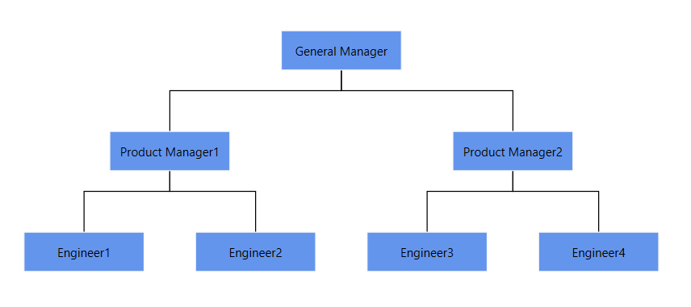
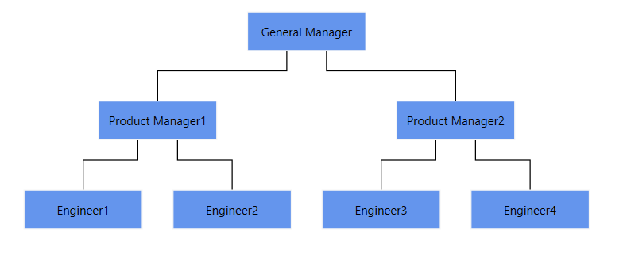
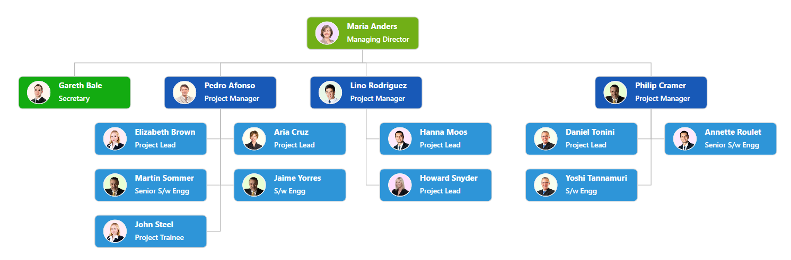
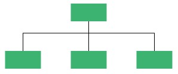
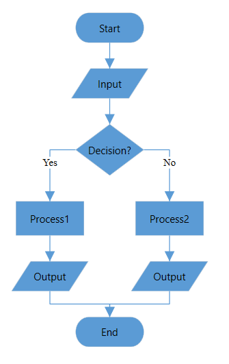
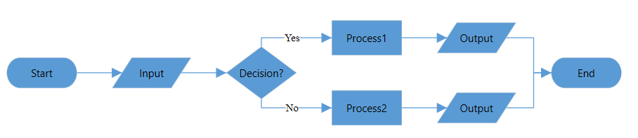

# Automatic Layout in WPF Diagram (SfDiagram)

SfDiagram provides a set of built-in automatic layout algorithms, which is used to arrange nodes automatically based on a predefined layout logic. SfDiagram supports the following built-in automatic layout algorithms:

* Hierarchical tree layout
* Radial tree layout
* Organizational layout
* Flowchart layout

Automatic layout algorithm uses the nodes and connectors defined in NodeCollection and ConnectorCollection or business objects defined in DataSource as input to generate the layout. To generate layout from NodeCollection and ConnectorCollection, you have to create all the nodes and connectors required for layout and add those items in NodeCollection and ConnectorCollection as defined in the following code snippet.




<!--Initializes the SfDiagram-->
<syncfusion:SfDiagram x:Name="diagram">
    <!--Initialize Nodes-->
    <syncfusion:SfDiagram.Nodes>
        <syncfusion:NodeCollection>
            <syncfusion:NodeViewModel ID="General Manager"
                                      UnitHeight="40" UnitWidth="120" 
                                      Shape="{StaticResource Rectangle}" 
                                      Content="General Manager"/>
            <syncfusion:NodeViewModel ID="Product Manager1"
                                      UnitHeight="40" UnitWidth="120" 
                                      Shape="{StaticResource Rectangle}" 
                                      Content="Product Manager1"/>
            <syncfusion:NodeViewModel ID="Product Manager2"
                                      UnitHeight="40" UnitWidth="120" 
                                      Shape="{StaticResource Rectangle}" 
                                      Content="Product Manager2"/>
            <syncfusion:NodeViewModel ID="Engineer1" 
                                      UnitHeight="40" UnitWidth="120" 
                                      Shape="{StaticResource Rectangle}" 
                                      Content="Engineer1"/>
            <syncfusion:NodeViewModel ID="Engineer2" 
                                      UnitHeight="40" UnitWidth="120" 
                                      Shape="{StaticResource Rectangle}" 
                                      Content="Engineer2"/>
            <syncfusion:NodeViewModel ID="Engineer3" 
                                      UnitHeight="40" UnitWidth="120" 
                                      Shape="{StaticResource Rectangle}" 
                                      Content="Engineer3"/>
            <syncfusion:NodeViewModel ID="Engineer4" 
                                      UnitHeight="40" UnitWidth="120" 
                                      Shape="{StaticResource Rectangle}" 
                                      Content="Engineer4"/>
        </syncfusion:NodeCollection>
    </syncfusion:SfDiagram.Nodes>
    <!--Initialize Connectors-->
    <syncfusion:SfDiagram.Connectors>
        <syncfusion:ConnectorCollection>
            <syncfusion:ConnectorViewModel SourceNodeID="General Manager" 
                                           TargetNodeID="Product Manager1"/>
            <syncfusion:ConnectorViewModel SourceNodeID="General Manager" 
                                           TargetNodeID="Product Manager2"/>
            <syncfusion:ConnectorViewModel SourceNodeID="Product Manager1" 
                                           TargetNodeID="Engineer1"/>
            <syncfusion:ConnectorViewModel SourceNodeID="Product Manager1" 
                                           TargetNodeID="Engineer2"/>
            <syncfusion:ConnectorViewModel SourceNodeID="Product Manager2" 
                                           TargetNodeID="Engineer3"/>
            <syncfusion:ConnectorViewModel SourceNodeID="Product Manager2" 
                                           TargetNodeID="Engineer4"/>
        </syncfusion:ConnectorCollection>
    </syncfusion:SfDiagram.Connectors>           
</syncfusion:SfDiagram>




//Create SfDiagram instance
SfDiagram diagram = new SfDiagram;

//Initialize Nodes and Connectors Collection

diagram.Nodes = new NodeCollection();
diagram.Connectors = new ConnectorCollection();

//Create and add Nodes and Connectors

(diagram.Nodes as NodeCollection).Add(CreateNode("General Manager"));
(diagram.Nodes as NodeCollection).Add(CreateNode("Product Manager1"));
(diagram.Nodes as NodeCollection).Add(CreateNode("Product Manager2"));
(diagram.Nodes as NodeCollection).Add(CreateNode("Engineer1"));
(diagram.Nodes as NodeCollection).Add(CreateNode("Engineer2"));
(diagram.Nodes as NodeCollection).Add(CreateNode("Engineer3"));
(diagram.Nodes as NodeCollection).Add(CreateNode("Engineer4"));

(diagram.Connectors as ConnectorCollection).Add(CreateConnector("General Manager", "Product Manager1"));
(diagram.Connectors as ConnectorCollection).Add(CreateConnector("General Manager", "Product Manager2"));
(diagram.Connectors as ConnectorCollection).Add(CreateConnector("Product Manager1", "Engineer1"));
(diagram.Connectors as ConnectorCollection).Add(CreateConnector("Product Manager1", "Engineer2"));
(diagram.Connectors as ConnectorCollection).Add(CreateConnector("Product Manager2", "Engineer3"));
(diagram.Connectors as ConnectorCollection).Add(CreateConnector("Product Manager2", "Engineer4"));

//Method to create Connectors
private ConnectorViewModel CreateConnector(string node1, string node2)
{
    ConnectorViewModel con = new ConnectorViewModel()
    {
        SourceNodeID = node1,
        TargetNodeID = node2,
    };
    return con;
}

//Method to create Nodes
private NodeViewModel CreateNode(string content)
{
    NodeViewModel node = new NodeViewModel()
    {
        ID = content,
        UnitHeight = 40,
        UnitWidth = 120,
        Shape = new RectangleGeometry() { Rect = new Rect(10, 10, 10, 10) },
        Content = content,
    };
    return node;
}




To generate layout from DataSource, you have to define the business object and add the necessary data to the DataSource collection. During the layout generation, nodes and connectors can be generated automatically with the information provided through data source and those items will be added to NodeCollection and ConnectorCollection respectively. Refer to the following code to generate the layout from data source.




<!-- Initializes the employee collection-->
<local:Employees x:Key="employees">
    <local:Employee EmpId = "1" ParentId="" Name="General Manager"/>
    <local:Employee EmpId = "2" ParentId = "1" Name = "Product Manager1" />
    <local:Employee EmpId = "3" ParentId = "1" Name = "Product Manager2"/>
    <local:Employee EmpId = "4" ParentId = "2" Name = "Engineer1"/>
    <local:Employee EmpId = "5" ParentId = "2" Name = "Engineer2"/>
    <local:Employee EmpId = "6" ParentId = "3" Name = "Engineer3"/>
    <local:Employee EmpId = "7" ParentId = "3" Name = "Engineer4"/>
</local:Employees>

<!--Initializes the DataSourceSettings -->
<syncfusion:DataSourceSettings x:Key="DataSourceSettings" 
                               ParentId="ParentId" Id="EmpId"
                               DataSource="{StaticResource employees}"/>





Employees employee = new Employees();
employee.Add(new Employee() { EmpId = "1", ParentId = "", Name = "General Manager"});
employee.Add(new Employee() { EmpId = "2", ParentId = "1", Name = "Product Manager1"});
employee.Add(new Employee() { EmpId = "3", ParentId = "1", Name = "Product Manager2"});
employee.Add(new Employee() { EmpId = "4", ParentId = "2", Name = "Engineer1"});
employee.Add(new Employee() { EmpId = "5", ParentId = "2", Name = "Engineer2"});
employee.Add(new Employee() { EmpId = "6", ParentId = "3", Name = "Engineer3"});
employee.Add(new Employee() { EmpId = "7", ParentId = "3", Name = "Engineer4"});

//Initializes the DataSourceSettings
diagram.DataSourceSettings = new DataSourceSettings()
{
    Id = "EmpId",
    ParentId = "ParentId",
    DataSource = employee,
};
		



## Defining layout

You can use the [LayoutManager.Layout](https://help.syncfusion.com/cr/wpf/Syncfusion.UI.Xaml.Diagram.Layout.LayoutManager.html#Syncfusion_UI_Xaml_Diagram_Layout_LayoutManager__ctor) property to specify any one of the layouting algorithm.




<!--Initializes the SfDiagram-->
<syncfusion:SfDiagram x:Name="diagram">
    <!--Initialize LayoutManager and Layout-->
    <syncfusion:SfDiagram.LayoutManager>
        <syncfusion:LayoutManager>
            <syncfusion:LayoutManager.Layout>
                <syncfusion:DirectedTreeLayout HorizontalSpacing="30" 
                                               VerticalSpacing="50" 
                                               AvoidSegmentOverlapping="False" 
                                               Orientation="TopToBottom" 
                                               Type="Hierarchical"/>
            </syncfusion:LayoutManager.Layout>
        </syncfusion:LayoutManager>
    </syncfusion:SfDiagram.LayoutManager>            
</syncfusion:SfDiagram>




//Initialize layout Manager
diagram.LayoutManager = new LayoutManager()
{
    Layout = new DirectedTreeLayout()
    {
        HorizontalSpacing = 30,
        VerticalSpacing = 50,
        Orientation = TreeOrientation.TopToBottom,
        Type = LayoutType.Hierarchical,
        AvoidSegmentOverlapping = false,
    },
};




## Updating layout

The [RefreshFrequency](https://help.syncfusion.com/cr/wpf/Syncfusion.UI.Xaml.Diagram.Layout.LayoutManager.html#Syncfusion_UI_Xaml_Diagram_Layout_LayoutManager_RefreshFrequency) property of LayoutManager is used to re-arrange the nodes in the diagram area when a node is added, deleted, moved, or resized. Also, you can decide when the nodes should be arranged for every diagram load or only for the first load. Find the description for each condition in the following table.

| Refresh Frequencies | Description|
| --- | --- |
| Add | Used to update the layout after adding a new element to the datasource. |
| Remove | Used to update the layout after removing an existing element from datasource. |
| Move | Used to update the layout after moving element in the datasource. |
| Reset | Used to update the layout after resetting the datasource. | 
| Load | Used to update the layout when loading the diagram. |
| FirstLoad | Used to update the layout in the first load of the diagram. |
| Resizing | Used to update the layout when resizing an element in the layout. |
| Resized | Used to update the layout when resizing of an element is completed. |
| ArrangeParsing | Used to update the layout when the operations like Add, Remove, Move, Reset, Resizing, and Resized are performed in layout. |



<syncfusion:LayoutManager RefreshFrequency="ArrangeParsing"/>


diagram.LayoutManager = new LayoutManager()
{
    RefreshFrequency = RefreshFrequency.ArrangeParsing,
};



### Customize spacing between nodes in layout 

The Horizontal and Vertical spacing properties of Layouts are used to customize the space between successive nodes in both horizontally and vertically. The default value for horizontal spacing is `20` and vertical spacing is `50`.



<syncfusion:DirectedTreeLayout HorizontalSpacing="50" VerticalSpacing="60"/>        


diagram.LayoutManager = new LayoutManager()
{
    Layout = new DirectedTreeLayout()
    {
        HorizontalSpacing = 50,
        VerticalSpacing = 60,
    },
};



### Customize tree orientation in layout

[Orientation](https://help.syncfusion.com/cr/wpf/Syncfusion.UI.Xaml.Diagram.Layout.DirectedTreeLayout.html#Syncfusion_UI_Xaml_Diagram_Layout_DirectedTreeLayout_Orientation) of `DirectedTreeLayout` is used to arrange the tree layout based on the direction. Orientation is only valid for hierarchical and organization layout. The default value for orientation is TopToBottom. The different orientation types are defined in the following table:

| Orientation Type | Description |
|---|---|---|
| TopToBottom | Aligns the tree layout from top to bottom. All the roots are placed at top of diagram. |
| LeftToRight | Aligns the tree layout from left to right. All the roots are placed at left of diagram. |
| BottomToTop | Aligns the tree layout from bottom to top. All the roots are placed at bottom of the diagram. |
| RightToLeft | Aligns the tree layout from right to left. All the roots are placed at right of the diagram. |



<syncfusion:DirectedTreeLayout Orientation="LeftToRight" />        


diagram.LayoutManager = new LayoutManager()
{
    Layout = new DirectedTreeLayout()
    {
        Orientation = TreeOrientation.LeftToRight,
    },
};



>N `Orientation` is not valid for `RadialTreeLayout`.

### Avoiding connector segment overlapping in layout

The [AvoidSegmentOverlapping](https://help.syncfusion.com/cr/wpf/Syncfusion.UI.Xaml.Diagram.Layout.DirectedTreeLayout.html#Syncfusion_UI_Xaml_Diagram_Layout_DirectedTreeLayout_AvoidSegmentOverlapping) property of `DirectedTreeLayout` is used to decide whether segment of each connector from a single parent is distributed automatically or not. It is only valid for hierarchical and multi-parent layout.



<syncfusion:DirectedTreeLayout AvoidSegmentOverlapping="True">
</Syncfusion:DirectedTreeLayout>        


diagram.LayoutManager = new LayoutManager()
{
    Layout = new DirectedTreeLayout()
    {
        AvoidSegmentOverlapping = true,
    },
};



>N `AvoidSegmentOverlapping` is not valid for `RadialTreeLayout`.

### Customize margin in layout

The [Margin](https://help.syncfusion.com/cr/wpf/Syncfusion.UI.Xaml.Diagram.Layout.LayoutBase.html#Syncfusion_UI_Xaml_Diagram_Layout_LayoutBase_Margin) property of `DirectedTreeLayout` is used to provide space between the bounds of the tree layout to the diagram. The default margin value is `50`.



<syncfusion:DirectedTreeLayout Margin="200">
</Syncfusion:DirectedTreeLayout>        


diagram.LayoutManager = new LayoutManager()
{
    Layout = new DirectedTreeLayout()
    {
        Margin = new Thickness(200),
    },
};





>N `Margin` is not valid for `RadialTreeLayout`.

## Hierarchical tree layout

The hierarchical tree Layout arranges nodes in a tree-like structure, where the nodes in the hierarchical layout may have multiple parents. There is no need to specify the layout root.

To arrange the nodes in hierarchical structure, specify the [LayoutType](https://help.syncfusion.com/cr/wpf/Syncfusion.UI.Xaml.Diagram.Layout.DirectedTreeLayout.html#Syncfusion_UI_Xaml_Diagram_Layout_DirectedTreeLayout_Type) as hierarchical tree.




<!-- Initializes the employee collection-->
<local:Employees x:Key="employees">
    <local:Employee EmpId = "1" ParentId="" Name="Plant Manager" _Color = "#034d6d"/>
    <local:Employee EmpId = "2" ParentId = "1" Name = "Production Manager" _Color = "#1b80c6"/>
    <local:Employee EmpId = "3" ParentId = "1" Name = "Administrative Officer" _Color = "#1b80c6"/>
    <local:Employee EmpId = "4" ParentId = "1" Name = "Maintenance Manager" _Color = "#1b80c6"/>
    <local:Employee EmpId = "5" ParentId = "2" Name = "Control Room" _Color = "#3dbfc9"/>
    <local:Employee EmpId = "6" ParentId = "2" Name = "Plant Operator" _Color = "#3dbfc9"/>
    <local:Employee EmpId = "7" ParentId = "4" Name = "Electrical Supervisor" _Color = "#3dbfc9"/>
    <local:Employee EmpId = "8" ParentId = "4" Name = "Mechanical Supervisor" _Color = "#3dbfc9"/>
    <local:Employee EmpId = "9" ParentId = "5" Name = "Foreman" _Color = "#2bb28e"/>
    <local:Employee EmpId = "10" ParentId = "6" Name = "Foreman" _Color = "#2bb28e"/>
    <local:Employee EmpId = "11" ParentId = "7" Name = "Craft Personnel" _Color = "#2bb28e"/>
    <local:Employee EmpId = "12" ParentId = "7" Name = "Craft Personnel" _Color = "#2bb28e"/>
    <local:Employee EmpId = "13" ParentId = "8" Name = "Craft Personnel" _Color = "#2bb28e"/>
    <local:Employee EmpId = "14" ParentId = "8" Name = "Craft Personnel" _Color = "#2bb28e"/>
    <local:Employee EmpId = "15" ParentId = "9" Name = "Craft Personnel" _Color = "#76d13b"/>
    <local:Employee EmpId = "16" ParentId = "9" Name = "Craft Personnel" _Color = "#76d13b"/>
    <local:Employee EmpId = "17" ParentId = "10" Name = "Craft Personnel" _Color = "#76d13b"/>
</local:Employees>

<!--Initializes the DataSourceSettings -->
<syncfusion:DataSourceSettings x:Key="DataSourceSettings" Id="EmpId" 
                               ParentId="ParentId"
                               DataSource="{StaticResource employees}" />
<!--Initialize the Layout-->
<syncfusion:DirectedTreeLayout x:Name="DirectedTreeLayout" 
                               x:Key="treeLayout" 
                               HorizontalSpacing="30" 
                               VerticalSpacing="50" 
                               Orientation="TopToBottom" 
                               Type="Hierarchical" 
                               SpaceBetweenSubTrees="20" />
<!--Initialize the Layout Manager-->
<syncfusion:LayoutManager x:Key="layoutManager" 
                          Layout="{StaticResource treeLayout}"/>


//Initializes the employee collection
Employees employee = new Employees();
employee.Add(new Employee() { EmpId = "1", ParentId = "", Name = "Plant Manager", _Color = "#034d6d" });
employee.Add(new Employee() { EmpId = "2", ParentId = "1", Name = "Production Manager", _Color = "#1b80c6" });
employee.Add(new Employee() { EmpId = "3", ParentId = "1", Name = "Administrative Officer", _Color = "#1b80c6" });
employee.Add(new Employee() { EmpId = "4", ParentId = "1", Name = "Maintenance Manager", _Color = "#1b80c6" });
employee.Add(new Employee() { EmpId = "5", ParentId = "2", Name = "Control Room", _Color = "#3dbfc9" });
employee.Add(new Employee() { EmpId = "6", ParentId = "2", Name = "Plant Operator", _Color = "#3dbfc9" });
employee.Add(new Employee() { EmpId = "7", ParentId = "4", Name = "Electrical Supervisor", _Color = "#3dbfc9" });
employee.Add(new Employee() { EmpId = "8", ParentId = "4", Name = "Mechanical Supervisor", _Color = "#3dbfc9" });
employee.Add(new Employee() { EmpId = "9", ParentId = "5", Name = "Foreman", _Color = "#2bb28e" });
employee.Add(new Employee() { EmpId = "10", ParentId = "6", Name = "Foreman", _Color = "#2bb28e" });
employee.Add(new Employee() { EmpId = "11", ParentId = "7", Name = "Craft Personnel", _Color = "#2bb28e" });
employee.Add(new Employee() { EmpId = "12", ParentId = "7", Name = "Craft Personnel", _Color = "#2bb28e" });
employee.Add(new Employee() { EmpId = "13", ParentId = "8", Name = "Craft Personnel", _Color = "#2bb28e" });
employee.Add(new Employee() { EmpId = "14", ParentId = "8", Name = "Craft Personnel", _Color = "#2bb28e" });
employee.Add(new Employee() { EmpId = "15", ParentId = "9", Name = "Craft Personnel", _Color = "#76d13b" });
employee.Add(new Employee() { EmpId = "16", ParentId = "9", Name = "Craft Personnel", _Color = "#76d13b" });
employee.Add(new Employee() { EmpId = "17", ParentId = "10", Name = "Craft Personnel", _Color = "#76d13b" });

//Initializes the DataSourceSettings
diagram.DataSourceSettings = new DataSourceSettings()
{
    Id = "EmpId",
    ParentId = "ParentId",
    DataSource = employee,
};

//Initialize the Layout
diagram.LayoutManager = new LayoutManager()
{
    Layout = new DirectedTreeLayout()
    {
        Type = LayoutType.Hierarchical,
        Orientation = TreeOrientation.TopToBottom,
        HorizontalSpacing = 30,
        VerticalSpacing = 50,
    },
                
    RefreshFrequency = RefreshFrequency.ArrangeParsing,
};




[View sample in GitHub](https://github.com/SyncfusionExamples/WPF-Diagram-Examples/tree/master/Samples/Automatic%20Layout/Hierarchical%20Tree)

## Organization layout 

An organizational chart is a diagram that displays the structure of an organization and relationships. To create an organizational chart, type should be set to LayoutType.Organization in `DirectedTreeLayout`.

To arrange the nodes in organization structure , specify the [LayoutType](https://help.syncfusion.com/cr/wpf/Syncfusion.UI.Xaml.Diagram.Layout.DirectedTreeLayout.html#Syncfusion_UI_Xaml_Diagram_Layout_DirectedTreeLayout_Type) as Organization.




<!--Initialize employee collection-->
<local:Employees x:Key="employee">
    <local:Employee Name = "Maria Anders" Designation = "Managing Director" 
                    ImageUrl = "./Assets/eric.png" RatingColor = "#71AF17" />
    <local:Employee Name = "Gareth Bale" Designation = "Secretary" 
                    ImageUrl = "./Assets/image54.png" RatingColor = "#13ab11" 
                    ReportingPerson = "Maria Anders" />
    <local:Employee Name = "Pedro Afonso" Designation = "Project Manager" 
                    ImageUrl = "./Assets/Paul.png" RatingColor = "#1859B7" 
                    ReportingPerson = "Maria Anders" />
    <local:Employee Name = "Elizabeth Brown" Designation = "Project Lead" 
                    ImageUrl = "./Assets/Maria.png" RatingColor = "#2E95D8" 
                    ReportingPerson = "Pedro Afonso" />
    <local:Employee Name = "Aria Cruz" Designation = "Project Lead" 
                    ImageUrl = "./Assets/Jenny.png" RatingColor = "#2E95D8" 
                    ReportingPerson = "Pedro Afonso" />
    <local:Employee Name = "Martín Sommer" Designation = "Senior S/w Engg" 
                    ImageUrl = "./Assets/image2.png" RatingColor = "#2E95D8" 
                    ReportingPerson = "Pedro Afonso" />
    <local:Employee Name = "Jaime Yorres" Designation = "S/w Engg" 
                    ImageUrl = "./Assets/image2.png" RatingColor = "#2E95D8" 
                    ReportingPerson = "Pedro Afonso" />
    <local:Employee Name = "John Steel" Designation = "Project Trainee" 
                    ImageUrl = "/Assets/Maria.png" RatingColor = "#2E95D8" 
                    ReportingPerson = "Pedro Afonso" />
    <local:Employee Name = "Lino Rodriguez" Designation = "Project Manager" 
                    ImageUrl = "./Assets/Robin.PNG" RatingColor = "#1859B7" 
                    ReportingPerson = "Maria Anders" />
    <local:Employee Name = "Hanna Moos" Designation = "Project Lead" 
                    ImageUrl = "./Assets/image55.png" RatingColor = "#2E95D8" 
                    ReportingPerson = "Lino Rodriguez" />
    <local:Employee Name = "Howard Snyder" Designation = "Project Lead" 
                    ImageUrl = "./Assets/image12.png" RatingColor = "#2E95D8" 
                    ReportingPerson = "Lino Rodriguez" />
    <local:Employee Name = "Philip Cramer" Designation = "Project Manager" 
                    ImageUrl = "./Assets/image2.PNG" RatingColor = "#1859B7" 
                    ReportingPerson = "Maria Anders" />
    <local:Employee Name = "Daniel Tonini" Designation = "Project Lead" 
                    ImageUrl = "./Assets/image57.png" RatingColor = "#2E95D8" 
                    ReportingPerson = "Philip Cramer" />
    <local:Employee Name = "Annette Roulet" Designation = "Senior S/w Engg" 
                    ImageUrl = "./Assets/image55.png" RatingColor = "#2E95D8" 
                    ReportingPerson = "Philip Cramer" />
    <local:Employee Name = "Yoshi Tannamuri" Designation = "S/w Engg" 
                    ImageUrl = "./Assets/image57.png" RatingColor = "#2E95D8" 
                    ReportingPerson = "Philip Cramer" />
</local:Employees>

<!--Initialize Datasource settings-->
<syncfusion:DataSourceSettings x:Key="DataSourceSettings" 
                               Id="Name" 
                               ParentId="ReportingPerson"
                               DataSource="{StaticResource employee}"/> 

<!--Initialize the Layout-->
<syncfusion:DirectedTreeLayout x:Key="treeLayout" 
                               Type="Organization" 
                               Orientation="TopToBottom" 
                               HorizontalSpacing="50" 
                               VerticalSpacing="40"  />

<!--Initialize the Layout Manager-->
<syncfusion:LayoutManager x:Key="layoutManager" 
                          Layout="{StaticResource treeLayout}" />




//Initialize employee collection
Employees employee = new Employees();
employee.Add(new Employee() 
{
    Name = "Maria Anders", 
    Designation = "Managing Director", 
    ImageUrl = "./Assets/eric.png", 
    RatingColor = "#71AF17" 
});
employee.Add(new Employee() 
{ 
    Name = "Gareth Bale", 
    Designation = "Secretary", 
    ImageUrl = "./Assets/image54.png", 
    RatingColor = "#13ab11", 
    ReportingPerson = "Maria Anders" 
});
employee.Add(new Employee() 
{ 
    Name = "Pedro Afonso", 
    Designation = "Project Manager", 
    ImageUrl = "./Assets/Paul.png", 
    RatingColor = "#1859B7", 
    ReportingPerson = "Maria Anders" 
});
employee.Add(new Employee() 
{ 
    Name = "Elizabeth Brown", 
    Designation = "Project Lead", 
    ImageUrl = "./Assets/Maria.png", 
    RatingColor = "#2E95D8", 
    ReportingPerson = "Pedro Afonso" 
});
employee.Add(new Employee() 
{ 
    Name = "Aria Cruz", 
    Designation = "Project Lead", 
    ImageUrl = "./Assets/Jenny.png", 
    RatingColor = "#2E95D8", 
    ReportingPerson = "Pedro Afonso" 
});
employee.Add(new Employee() 
{
    Name = "Martín Sommer", 
    Designation = "Senior S/w Engg", 
    ImageUrl = "./Assets/image2.png", 
    RatingColor = "#2E95D8", 
    ReportingPerson = "Pedro Afonso" 
});
employee.Add(new Employee() 
{ 
    Name = "Jaime Yorres", 
    Designation = "S/w Engg", 
    ImageUrl = "./Assets/image2.png", 
    RatingColor = "#2E95D8", 
    ReportingPerson = "Pedro Afonso" 
});
employee.Add(new Employee() 
{
    Name = "John Steel", 
    Designation = "Project Trainee", 
    ImageUrl = "/Assets/Maria.png", 
    RatingColor = "#2E95D8", 
    ReportingPerson = "Pedro Afonso" 
});
employee.Add(new Employee() 
{ 
    Name = "Lino Rodriguez", 
    Designation = "Project Manager", 
    ImageUrl = "./Assets/Robin.PNG", 
    RatingColor = "#1859B7", 
    ReportingPerson = "Maria Anders" 
});
employee.Add(new Employee() 
{
    Name = "Hanna Moos", 
    Designation = "Project Lead", 
    ImageUrl = "./Assets/image55.png", 
    RatingColor = "#2E95D8", 
    ReportingPerson = "Lino Rodriguez" 
});
employee.Add(new Employee() 
{
    Name = "Howard Snyder", 
    Designation = "Project Lead", 
    ImageUrl = "./Assets/image12.png", 
    RatingColor = "#2E95D8", 
    ReportingPerson = "Lino Rodriguez" 
});
employee.Add(new Employee() 
{ 
    Name = "Philip Cramer", 
    Designation = "Project Manager", 
    ImageUrl = "./Assets/image2.PNG", 
    RatingColor = "#1859B7", 
    ReportingPerson = "Maria Anders" 
});
employee.Add(new Employee() 
{ 
    Name = "Daniel Tonini", 
    Designation = "Project Lead", 
    ImageUrl = "./Assets/image57.png", 
    RatingColor = "#2E95D8", 
    ReportingPerson = "Philip Cramer" 
});
employee.Add(new Employee() 
{ 
    Name = "Annette Roulet", 
    Designation = "Senior S/w Engg", 
    ImageUrl = "./Assets/image55.png", 
    RatingColor = "#2E95D8", 
    ReportingPerson = "Philip Cramer" 
});
employee.Add(new Employee() 
{ 
    Name = "Yoshi Tannamuri", 
    Designation = "S/w Engg", 
    ImageUrl = "./Assets/image57.png", 
    RatingColor = "#2E95D8", 
    ReportingPerson = "Philip Cramer" 
});

//Initialize DataSourceSettings for SfDiagram
diagram.DataSourceSettings = new DataSourceSettings()
{
    ParentId = "ReportingPerson",
    Id = "Name",
    DataSource = employee,
};

//Initialize LayoutSettings for SfDiagram 
diagram.LayoutManager = new LayoutManager()
{
    Layout = new DirectedTreeLayout()
    {
        Type = LayoutType.Organization,
        HorizontalSpacing = 50,
        VerticalSpacing = 40
    },
};




### How to change the chart type and orientation in organization layout 

You can change the chart type and orientation of organization layout by using the GetLayoutInfo event of the SfDiagram. This event will fire for each time when an organization layout gets updated. Default chart type is Alternate and default orientation is Vertical.

For GetLayoutInfo, refer to, [GetLayoutInfo](https://help.syncfusion.com/cr/wpf/Syncfusion.UI.Xaml.Diagram.IGraphInfo.html).

**Event Arguments:**

| Event args | Property | Description |
|---|---|---|
| LayoutInfoArgs | Item | Added item when layout is getting updated. |
| | Type | Gets or sets the organizational chart type. |
| | Orientation | Gets or sets the organizational chart orientation. |

The following table explains the different chart orientations and chart types: 

| Orientation | Type | Description | Example |
|---|---|---|---|
| Horizontal | Left | Arranges the child nodes Horizontally at the Left the of Parent. |  |
| | Right | Arranges the child nodes Horizontally at the Right of the Parent. |  |
| | Center | Arranges the child nodes horizontally at the Center of the parent. |  |
| Vertical | Left | Vertically arranges the children at the Left of the Parent. |  |
| | Right | Vertically arranges the children at the Right of the Parent. |  |
| | Alternate | Vertically arranges the children at both Left and Right of the Parent. |  |



//Register GetLayoutInfo event 
(diagram.Info as IGraphInfo).GetLayoutInfo += MainWindow_GetLayoutInfo;

//GetLayoutInfo Method to change the orientation and chart type
private void MainWindow_GetLayoutInfo(object sender, LayoutInfoArgs args)
{
    if (!args.HasSubTree)
    {
        args.Type = ChartType.Alternate;
        args.Orientation = Orientation.Horizontal;
    }
}




### How to add assistant in organization layout

You can add assistant for in an organization layout by using the GetLayoutInfo event of the SfDiagram. This event will fire for each time when the layout gets updated. 

Find the code example to add assistant in an organization layout.




//Register GetLayoutInfo event
(diagram.Info as IGraphInfo).GetLayoutInfo += MainWindow_GetLayoutInfo;

//GetLayoutInfo method to add assistant
private void MainWindow_GetLayoutInfo(object sender, LayoutInfoArgs args)
{
    if (diagram.LayoutManager.Layout is DirectedTreeLayout)
    {
        if ((diagram.LayoutManager.Layout as DirectedTreeLayout).Type == LayoutType.Organization)
        {
            if (args.Item is INode)
            {
                if (((args.Item as INode).Content as Employee).Designation.ToString() == "Managing Director")
                {
                    args.Assistants.Add(args.Children[0]);
                    args.Children.Remove(args.Children[0]);
                }
            }
        }
    }
}




[View sample in GitHub](https://github.com/SyncfusionExamples/WPF-Diagram-Examples/tree/master/Samples/Automatic%20Layout/Organization%20Chart)

### How to create a parent - child relation with dropped nodes from stencil

You can create a layout with dropped nodes from stencil using the `ItemDropped` event. In `ItemDropped` event, you have to create a connection between the source and target item. 

Find the code example to create parent - child relation between source and target nodes in item dropped event.



//Initialize Events
(diagram.Info as IGraphInfo).ItemAdded += MainWindow_ItemAdded;
(diagram.Info as IGraphInfo).ItemDropEvent += MainWindow_ItemDropEvent;

//Method used to add the Allowdrop constraints to the dropped node
//Allowdrop constraints is used to allow the itemdropped event to get the element as target element.
private void MainWindow_ItemAdded(object sender, ItemAddedEventArgs args)
{
    if (args.Item is CustomNode)
    {
        (args.Item as CustomNode).Constraints = (args.Item as CustomNode).Constraints.Add(NodeConstraints.AllowDrop);         
    }
}

//Mehtod to create relation between drag and dropped nodes
private void MainWindow_ItemDropEvent(object sender, ItemDropEventArgs args)
{
    if (!(args.Target is SfDiagram))
    {
        foreach (object targetElement in args.Target as IEnumerable<object>)
        {
            if(targetElement is CustomNode)
            {
                if ((args.Source as CustomNode).ParentId == null)
                {
                    (args.Source as CustomNode).Id = "Node" + (diagram.Nodes as ObservableCollection<CustomNode>).Count.ToString();
                    (args.Source as CustomNode).ID = (args.Source as CustomNode).Id;
                    (args.Source as CustomNode).ParentId = (targetElement as CustomNode).Id;

                    CreateConnector((args.Source as CustomNode).ParentId, (args.Source as CustomNode).Id);
                    diagram.LayoutManager.Layout.UpdateLayout();
                }
            }
        }
    }
    else if(args.Target is SfDiagram)
    {
        if ((args.Source as CustomNode).ParentId == null)
        {
            (args.Source as CustomNode).Id = "Node" + (diagram.Nodes as ObservableCollection<CustomNode>).Count.ToString();
            (args.Source as CustomNode).ID = (args.Source as CustomNode).Id;
            (args.Source as CustomNode).ParentId = "";
            diagram.LayoutManager.Layout.UpdateLayout();
        }
    }
}



[View sample in GitHub](https://github.com/SyncfusionExamples/WPF-Diagram-Examples/tree/master/Samples/Automatic%20Layout/OrgChart%20with%20drag%20and%20dropped%20nodes)

## Radial-Tree layout

The Radial-Tree layout is a specification of the Directed Tree Layout Manager that employs a circular layout algorithm for locating the diagram nodes. The Radial-Tree Layout arranges nodes in a circular layout, positioning the root node at the center of the graph and the child nodes in a circular fashion around the root. Sub-trees formed by the branching of child nodes are located radically around the child nodes.  

The arrangement results in an ever-expanding concentric arrangement with radial proximity to the root node indicating the node level in the hierarchy. However, it is necessary to specify a layout root for the tree layout as the Radial-Tree Layout positions the nodes based on the [LayoutRoot](https://help.syncfusion.com/cr/wpf/Syncfusion.UI.Xaml.Diagram.Layout.RadialTreeLayout.html#Syncfusion_UI_Xaml_Diagram_Layout_RadialTreeLayout_LayoutRoot).



<!--Initialize employee collection-->            
<local:Employees x:Key="employees">                
    <local:Employee EmpId = "1" ParentId = "" Imageurl = "./Assets/Thomas.png" />
    <local:Employee EmpId = "2" ParentId = "1" Imageurl = "./Assets/Clayton.png" />
    <local:Employee EmpId = "3" ParentId = "1" Imageurl = "./Assets/eric.png" />
    <local:Employee EmpId = "4" ParentId = "1" Imageurl = "./Assets/John.png" />
    <local:Employee EmpId = "5" ParentId = "1" Imageurl = "./Assets/image12.png" />
    <local:Employee EmpId = "6" ParentId = "1" Imageurl = "./Assets/image2.png" />
    <local:Employee EmpId = "7" ParentId = "1" Imageurl = "./Assets/image3.png" />
    <local:Employee EmpId = "8" ParentId = "1" Imageurl = "./Assets/image50.png" />
    <local:Employee EmpId = "9" ParentId = "2" Imageurl = "./Assets/image51.png" />
    <local:Employee EmpId = "10" ParentId = "2" Imageurl = "./Assets/image53.png" />
    <local:Employee EmpId = "11" ParentId = "3" Imageurl = "./Assets/image54.png" />
    <local:Employee EmpId = "12" ParentId = "3" Imageurl = "./Assets/image55.png" />
    <local:Employee EmpId = "13" ParentId = "4" Imageurl = "./Assets/image56.png" />
    <local:Employee EmpId = "14" ParentId = "4" Imageurl = "./Assets/image57.png" />
    <local:Employee EmpId = "15" ParentId = "5" Imageurl = "./Assets/images7.png" />
    <local:Employee EmpId = "16" ParentId = "5" Imageurl = "./Assets/images9.png" />
    <local:Employee EmpId = "17" ParentId = "6" Imageurl = "./Assets/Jenny.png" />
    <local:Employee EmpId = "18" ParentId = "6" Imageurl = "./Assets/John.png" />
    <local:Employee EmpId = "19" ParentId = "7" Imageurl = "./Assets/eric.png" />
    <local:Employee EmpId = "20" ParentId = "7" Imageurl = "./Assets/Maria.png" />
    <local:Employee EmpId = "21" ParentId = "8" Imageurl = "./Assets/image12.png" />
    <local:Employee EmpId = "22" ParentId = "8" Imageurl = "./Assets/Paul.png" />
    <local:Employee EmpId = "23" ParentId = "9" Imageurl = "./Assets/Robin.png" />
    <local:Employee EmpId = "24" ParentId = "9" Imageurl = "./Assets/smith.png" />
    <local:Employee EmpId = "25" ParentId = "10" Imageurl = "./Assets/Thomas.png" />
    <local:Employee EmpId = "26" ParentId = "10" Imageurl = "./Assets/Clayton.png" />
    <local:Employee EmpId = "27" ParentId = "11" Imageurl = "./Assets/eric.png" />
    <local:Employee EmpId = "28" ParentId = "11" Imageurl = "./Assets/images7.png" />
    <local:Employee EmpId = "29" ParentId = "12" Imageurl = "./Assets/image12.png" />
    <local:Employee EmpId = "30" ParentId = "12" Imageurl = "./Assets/image2.png" />
    <local:Employee EmpId = "31" ParentId = "13" Imageurl = "./Assets/image3.png" />
    <local:Employee EmpId = "32" ParentId = "13" Imageurl = "./Assets/image50.png" />
    <local:Employee EmpId = "33" ParentId = "14" Imageurl = "./Assets/image51.png" />
    <local:Employee EmpId = "34" ParentId = "14" Imageurl = "./Assets/image53.png" />
    <local:Employee EmpId = "35" ParentId = "15" Imageurl = "./Assets/image54.png" />
    <local:Employee EmpId = "36" ParentId = "15" Imageurl = "./Assets/image55.png" />
    <local:Employee EmpId = "37" ParentId = "16" Imageurl = "./Assets/image56.png" />
    <local:Employee EmpId = "38" ParentId = "16" Imageurl = "./Assets/image57.png" />
    <local:Employee EmpId = "39" ParentId = "17" Imageurl = "./Assets/images7.png" />
    <local:Employee EmpId = "40" ParentId = "17" Imageurl = "./Assets/images9.png" />
    <local:Employee EmpId = "41" ParentId = "18" Imageurl = "./Assets/Jenny.png" />
    <local:Employee EmpId = "42" ParentId = "18" Imageurl = "./Assets/John.png" />
    <local:Employee EmpId = "43" ParentId = "19" Imageurl = "./Assets/Clayton.png" />
    <local:Employee EmpId = "44" ParentId = "19" Imageurl = "./Assets/Maria.png" />
    <local:Employee EmpId = "45" ParentId = "20" Imageurl = "./Assets/image55.png" />
    <local:Employee EmpId = "46" ParentId = "20" Imageurl = "./Assets/Paul.png" />
    <local:Employee EmpId = "47" ParentId = "21" Imageurl = "./Assets/Robin.png" />
    <local:Employee EmpId = "48" ParentId = "21" Imageurl = "./Assets/smith.png" />
    <local:Employee EmpId = "49" ParentId = "22" Imageurl = "./Assets/Thomas.png" />
    <local:Employee EmpId = "50" ParentId = "22" Imageurl = "./Assets/John.png" />
</local:Employees>

<!--Initializes the DataSourceSettings -->
<syncfusion:DataSourceSettings x:Key="DataSourceSettings" 
                               ParentId="ParentId" Id="EmpId"
                               DataSource="{StaticResource employees}" 
                               Root="1"/>
    <!--Initialize the Layout-->
    <syncfusion:RadialTreeLayout x:Key="treeLayout" 
                                 HorizontalSpacing="30" 
                                 VerticalSpacing="50" />
    <!--Initialize the Layout Manager-->
    <syncfusion:LayoutManager x:Key="layoutManager" Layout="{StaticResource treeLayout}" />


//Initialize employee collection
Employees employee = new Employees();

employee.Add(new Employee() { EmpId = "1", ParentId = "", Imageurl = "./Assets/Thomas.png" });
employee.Add(new Employee() { EmpId = "2", ParentId = "1", Imageurl = "./Assets/Clayton.png" });
employee.Add(new Employee() { EmpId = "3", ParentId = "1", Imageurl = "./Assets/eric.png" });
employee.Add(new Employee() { EmpId = "4", ParentId = "1", Imageurl = "./Assets/John.png" });
employee.Add(new Employee() { EmpId = "5", ParentId = "1", Imageurl = "./Assets/image12.png" });
employee.Add(new Employee() { EmpId = "6", ParentId = "1", Imageurl = "./Assets/image2.png" });
employee.Add(new Employee() { EmpId = "7", ParentId = "1", Imageurl = "./Assets/image3.png" });
employee.Add(new Employee() { EmpId = "8", ParentId = "1", Imageurl = "./Assets/image50.png" });
employee.Add(new Employee() { EmpId = "9", ParentId = "2", Imageurl = "./Assets/image51.png" });
employee.Add(new Employee() { EmpId = "10", ParentId = "2", Imageurl = "./Assets/image53.png" });
employee.Add(new Employee() { EmpId = "11", ParentId = "3", Imageurl = "./Assets/image54.png" });
employee.Add(new Employee() { EmpId = "12", ParentId = "3", Imageurl = "./Assets/image55.png" });
employee.Add(new Employee() { EmpId = "13", ParentId = "4", Imageurl = "./Assets/image56.png" });
employee.Add(new Employee() { EmpId = "14", ParentId = "4", Imageurl = "./Assets/image57.png" });
employee.Add(new Employee() { EmpId = "15", ParentId = "5", Imageurl = "./Assets/images7.png" });
employee.Add(new Employee() { EmpId = "16", ParentId = "5", Imageurl = "./Assets/images9.png" });
employee.Add(new Employee() { EmpId = "17", ParentId = "6", Imageurl = "./Assets/Jenny.png" });
employee.Add(new Employee() { EmpId = "18", ParentId = "6", Imageurl = "./Assets/John.png" });
employee.Add(new Employee() { EmpId = "19", ParentId = "7", Imageurl = "./Assets/eric.png" });
employee.Add(new Employee() { EmpId = "20", ParentId = "7", Imageurl = "./Assets/Maria.png" });
employee.Add(new Employee() { EmpId = "21", ParentId = "8", Imageurl = "./Assets/image12.png" });
employee.Add(new Employee() { EmpId = "22", ParentId = "8", Imageurl = "./Assets/Paul.png" });
employee.Add(new Employee() { EmpId = "23", ParentId = "9", Imageurl = "./Assets/Robin.png" });
employee.Add(new Employee() { EmpId = "24", ParentId = "9", Imageurl = "./Assets/smith.png" });
employee.Add(new Employee() { EmpId = "25", ParentId = "10", Imageurl = "./Assets/Thomas.png" });
employee.Add(new Employee() { EmpId = "26", ParentId = "10", Imageurl = "./Assets/Clayton.png" });
employee.Add(new Employee() { EmpId = "27", ParentId = "11", Imageurl = "./Assets/eric.png" });
employee.Add(new Employee() { EmpId = "28", ParentId = "11", Imageurl = "./Assets/images7.png" });
employee.Add(new Employee() { EmpId = "29", ParentId = "12", Imageurl = "./Assets/image12.png" });
employee.Add(new Employee() { EmpId = "30", ParentId = "12", Imageurl = "./Assets/image2.png" });
employee.Add(new Employee() { EmpId = "31", ParentId = "13", Imageurl = "./Assets/image3.png" });
employee.Add(new Employee() { EmpId = "32", ParentId = "13", Imageurl = "./Assets/image50.png" });
employee.Add(new Employee() { EmpId = "33", ParentId = "14", Imageurl = "./Assets/image51.png" });
employee.Add(new Employee() { EmpId = "34", ParentId = "14", Imageurl = "./Assets/image53.png" });
employee.Add(new Employee() { EmpId = "35", ParentId = "15", Imageurl = "./Assets/image54.png" });
employee.Add(new Employee() { EmpId = "36", ParentId = "15", Imageurl = "./Assets/image55.png" });
employee.Add(new Employee() { EmpId = "37", ParentId = "16", Imageurl = "./Assets/image56.png" });
employee.Add(new Employee() { EmpId = "38", ParentId = "16", Imageurl = "./Assets/image57.png" });
employee.Add(new Employee() { EmpId = "39", ParentId = "17", Imageurl = "./Assets/images7.png" });
employee.Add(new Employee() { EmpId = "40", ParentId = "17", Imageurl = "./Assets/images9.png" });
employee.Add(new Employee() { EmpId = "41", ParentId = "18", Imageurl = "./Assets/Jenny.png" });
employee.Add(new Employee() { EmpId = "42", ParentId = "18", Imageurl = "./Assets/John.png" });
employee.Add(new Employee() { EmpId = "43", ParentId = "19", Imageurl = "./Assets/Clayton.png" });
employee.Add(new Employee() { EmpId = "44", ParentId = "19", Imageurl = "./Assets/Maria.png" });
employee.Add(new Employee() { EmpId = "45", ParentId = "20", Imageurl = "./Assets/image55.png" });
employee.Add(new Employee() { EmpId = "46", ParentId = "20", Imageurl = "./Assets/Paul.png" });
employee.Add(new Employee() { EmpId = "47", ParentId = "21", Imageurl = "./Assets/Robin.png" });
employee.Add(new Employee() { EmpId = "48", ParentId = "21", Imageurl = "./Assets/smith.png" });
employee.Add(new Employee() { EmpId = "49", ParentId = "22", Imageurl = "./Assets/Thomas.png" });
employee.Add(new Employee() { EmpId = "50", ParentId = "22", Imageurl = "./Assets/John.png" });

//Initialize Datatsource settings
diagram.DataSourceSettings = new DataSourceSettings()
{
    Id = "EmpId",
    ParentId = "ParentId",
    DataSource = employee,
    Root = "1",
};

//Initialize LayoutManager
diagram.LayoutManager = new LayoutManager()
{
    Layout = new RadialTreeLayout()
    {
        HorizontalSpacing = 10,
        VerticalSpacing = 30,
    }
};



[View sample in GitHub](https://github.com/SyncfusionExamples/WPF-Diagram-Examples/tree/master/Samples/Automatic%20Layout/Radial%20Tree)

### Customize Bounds in layout

The [Bounds](https://help.syncfusion.com/cr/wpf/Syncfusion.UI.Xaml.Diagram.Layout.LayoutBase.html#Syncfusion_UI_Xaml_Diagram_Layout_LayoutBase_Bounds) Property of `RadialTreeLayout` is used to define the region where the layout to be rendered based on its root. It is valid only for `RadialTreeLayout`.



<syncfusion:RadialTreeLayout Bounds="0,0,1000,1000"/>


diagram.LayoutManager = new LayoutManager()
{
    Layout = new RadialTreeLayout()
    {
        Bounds = new Rect(0,0,1000,1000),
    },
};



## Flowchart layout

The flowchart layout is a diagrammatic representation of a process, workflow, system, or computer algorithm. Flowcharts uses various kind of symbols to illustrate the different types of actions and symbols connected together with arrows showing the flow direction of process.

### Common flowchart symbols

Different flowchart symbols have different meanings that are used to represent different states in flowchart. The following table describes the most common flowchart symbols that are used in creating flowchart.

|Symbol|Built-in resource key in SfDiagram|Description|
|---|---|---|
||Terminator/StartOrEnd|Indicates the beginning and ending of the process.|
||Data|Indicates data input or output for a process.|
||Process|Represents an operation or set of operations and data manipulations.|
||Decision|Shows a branching point where the decision is made to choose one of the two paths|
||Document|Represents a single document or report in the process.|
||SubProcess/PredefinedProcess|Represents a sequence of actions that combine to perform a specific task that is defined elsewhere.|
||DirectData|Represents a collection of information that allows searching, sorting, and filtering.|
||StoredData|Represents a step where data get stored within a process.|
||ManualInput|Represents the manual input of data into a field or step in a process.|
||ManualOperation|Represents an operation in a process that must be done manually, not automatically.|
||Preparation|Represents a setup or initialization process to another step in the process.|
||OnPageReference|Represents a pair of labeled connectors used to link long or confusing line on a flowchart.|
||OffPageReference|Represents a labeled connector used to link two flowcharts on different pages.|
||MultiDocument|Represents multiple documents or reports in the process.|
|||Represents a direction of flow from one step to another. It will get created automatically based on the relationship between the parent and child.|

N> We have provided some more built-in Shapes as ResourceDictionary. For more Shapes, refer to this [page](/wpf/sfdiagram/shapes).



<ResourceDictionary.MergedDictionaries>
    <!--Initialize Shapes-->
    <ResourceDictionary Source="/Syncfusion.SfDiagram.Wpf;component/Resources/BasicShapes.xaml"/>
</ResourceDictionary.MergedDictionaries>

<local:DataItems x:Key="Dataitems">
<local:ItemInfo Id="1" NodeShape="{StaticResource Terminator}" Width="80" Height="35" Name="Start"/>
<local:ItemInfo Id="2" NodeShape="{StaticResource Data}" Width="90" Height="35" Name="Input">
    <local:ItemInfo.ParentId>
        <local:LabelList>
            <sys:String>1</sys:String>
        </local:LabelList>
    </local:ItemInfo.ParentId>
</local:ItemInfo>
<local:ItemInfo Id="3" NodeShape="{StaticResource Decision}" Width="80" Height="60" Name="Decision?">
    <local:ItemInfo.ParentId>
        <local:LabelList>
            <sys:String>2</sys:String>
        </local:LabelList>
    </local:ItemInfo.ParentId>
</local:ItemInfo>
<local:ItemInfo Id="4" NodeShape="{StaticResource Process}" Width="80" Height="40" Name="Process1">
    <local:ItemInfo.ParentId>
        <local:LabelList>
            <sys:String>3</sys:String>
        </local:LabelList>
    </local:ItemInfo.ParentId>
    <local:ItemInfo.Label>
        <local:LabelList>
                <sys:String>Yes</sys:String>
        </local:LabelList>
    </local:ItemInfo.Label>
</local:ItemInfo>
<local:ItemInfo Id="5" NodeShape="{StaticResource Process}" Width="80" Height="40" Name="Process2">
    <local:ItemInfo.ParentId>
        <local:LabelList>
            <sys:String>3</sys:String>
        </local:LabelList>
    </local:ItemInfo.ParentId>
    <local:ItemInfo.Label>
        <local:LabelList>
            <sys:String>No</sys:String>
        </local:LabelList>
    </local:ItemInfo.Label>
</local:ItemInfo>
<local:ItemInfo Id="6" NodeShape="{StaticResource Data}" Width="90" Height="35" Name="Output">
    <local:ItemInfo.ParentId>
        <local:LabelList>
            <sys:String>5</sys:String>
        </local:LabelList>
    </local:ItemInfo.ParentId>
</local:ItemInfo>
<local:ItemInfo Id="7" NodeShape="{StaticResource Data}" Width="90" Height="35" Name="Output">
    <local:ItemInfo.ParentId>
        <local:LabelList>
            <sys:String>4</sys:String>
        </local:LabelList>
    </local:ItemInfo.ParentId>
</local:ItemInfo>
<local:ItemInfo Id="8" NodeShape="{StaticResource Terminator}" Width="80" Height="35" Name="End">
    <local:ItemInfo.ParentId>
        <local:LabelList>
            <sys:String>6</sys:String>
            <sys:String>7</sys:String>
        </local:LabelList>
    </local:ItemInfo.ParentId>
</local:ItemInfo>
</local:DataItems>
<!--Initializes the Layout-->
<syncfusion:FlowchartLayout x:Key="Layout" Orientation="LeftToRight" 
                            HorizontalSpacing="50" VerticalSpacing="30" 
                            YesBranchDirection="LeftInFlow" 
                            NoBranchDirection="RightInFlow">
</syncfusion:FlowchartLayout>

<!--Initializes the LayoutManager-->
<syncfusion:LayoutManager x:Key="layoutmanager" Layout="{StaticResource Layout}"/>

<!--Initializes the DataSourceSettings -->
<syncfusion:FlowchartDataSourceSettings x:Key="DataSourceSettings" 
                                        DataSource="{StaticResource Dataitems}" 
                                        ParentId="ParentId" Id="Id" 
                                        ShapeMapping="NodeShape" 
                                        WidthMapping="Width" 
                                        HeightMapping="Height" 
                                        ConnectorTextMapping="Label" 
                                        ContentMapping="Name"/>

<!--Initializes the SfDiagram --> 
<syncfusion:SfDiagram x:Name="diagram" Grid.Column="0" 
                      LayoutManager="{StaticResource layoutmanager}" 
                      DataSourceSettings="{StaticResource DataSourceSettings}">
    <syncfusion:SfDiagram.Theme>
        <syncfusion:OfficeTheme/>
    </syncfusion:SfDiagram.Theme>
</syncfusion:SfDiagram>                                       



//Initialize Diagram
SfDiagram diagram = new SfDiagram();

//Initialize Node Collection
diagram.Nodes = new ObservableCollection<NodeViewModel>();           

//Initialize Connector Collection
diagram.Connectors = new ObservableCollection<ConnectorViewModel>();

(diagram.Info as IGraphInfo).ItemAdded += MainWindow_ItemAdded;

//Initialize DataSourceSettings for SfDiagram
diagram.DataSourceSettings = new FlowchartDataSourceSettings()
{
    ParentId = "ParentId",
    Id = "Id",
    DataSource = GetData(),
    ConnectorTextMapping = "Label",
    ContentMapping = "Name",
    ShapeMapping = "NodeShape",
    WidthMapping = "Width",
    HeightMapping = "Height"
};

//Initialize LayoutManager
LayoutManager layoutManager = new LayoutManager();

//Initialize Layout for SfDiagram
layoutManager.Layout = new FlowchartLayout()
{
    Orientation = FlowchartOrientation.TopToBottom,
    YesBranchDirection = BranchDirection.LeftInFlow,
    NoBranchDirection = BranchDirection.RightInFlow,             
    HorizontalSpacing = 50,
    VerticalSpacing = 30
};

//Initialize theming style for SfDiagram
diagram.Theme = new OfficeTheme();

//Initialize LayoutManager
diagram.LayoutManager = layoutManager;
    
//Adding Sfdiagram as children to mainwindow grid.
WindowGrid.Children.Add(diagram);

//Initializes the DataSource collection
private DataItems GetData()
{
    DataItems itemscollection = new DataItems();
    itemscollection.Add(new ItemInfo()
    {
        Id ="1",
        NodeShape =App.Current.Resources["Terminator"] as string,
        Name = "Start",
        Height =35,
        Width =80
    });
    itemscollection.Add(new ItemInfo()
    {
        Id = "2",
        ParentId =new List<string> { "1" },
        NodeShape = App.Current.Resources["Data"] as string,
        Name = "Input",
        Height = 35,
        Width =90
    });
    itemscollection.Add(new ItemInfo()
    {
        Id = "3", ParentId =new List<string> { "2" },                
        NodeShape = App.Current.Resources["Decision"] as string,
        Name = "Decision?",
        Height =60,
        Width = 80
    });
    itemscollection.Add(new ItemInfo()
    {
        Id = "4",
        ParentId = new List<string> { "3" },
        Label =new List<string> {"Yes" },
        NodeShape = App.Current.Resources["Process"] as string,
        Name = "Process1",
        Height = 40,
        Width = 80
    });
    itemscollection.Add(new ItemInfo()
    {
        Id = "5",
        ParentId = new List<string> { "3" },
        Label = new List<string> { "No" },
        NodeShape = App.Current.Resources["Process"] as string,
        Name = "Process2",
        Height = 40,
        Width = 80
    });
    itemscollection.Add(new ItemInfo()
    {
        Id = "6",
        ParentId = new List<string> { "5" },                
        NodeShape = App.Current.Resources["Data"] as string,
        Name = "Output",
        Height = 35,
        Width = 90
    });
    itemscollection.Add(new ItemInfo()
    {
        Id = "7",
        ParentId = new List<string> { "4" },                
        NodeShape = App.Current.Resources["Data"] as string,
        Name = "Output",
        Height = 35,
        Width = 90
    });
    itemscollection.Add(new ItemInfo()
    {
        Id = "8",
        ParentId = new List<string> { "6","7" },                
        NodeShape =App.Current.Resources["Terminator"] as string,
        Name = "End",
        Height = 35,
        Width = 80
    });
    return itemscollection;
}

//Data Object Class
public class ItemInfo
{
    public string Name { get; set; }
    public string Id { get; set; }
    public List<string> ParentId { get; set; }
    public string NodeShape { get; set; }       
    public List<string> Label { get; set; }
    public double Width { get; set; }        
    public double Height { get; set; }
}

//Collection to hold the Data Object class
public class DataItems : ObservableCollection<ItemInfo>
{
}




### Customize flowchart layout orientation

Sequence of the node's direction can be customized by flowchart orientation either vertically from top to bottom or by horizontally from left to right.
The `Orientation` property of `FlowchartLayout` class allows you to define the flow direction for flowchart as `TopToBottom` or `LeftToRight`.

#### TopToBottom orientation

Arranges the element in the layout vertically from top to bottom.



<syncfusion:FlowchartLayout x:Key="Layout" Orientation="TopToBottom"/>


//Initialize LayoutManager
LayoutManager layoutManager = new LayoutManager();
//Initialize Layout for SfDiagram
layoutManager.Layout = new FlowchartLayout()
{
    Orientation = FlowchartOrientation.TopToBottom,            
};




 

#### LeftToRight orientation

Arranges the element in the layout horizontally from left to right.

 

### Customize the decision output directions

Decision symbol denotes the question that can be answered in binary format (Yes/No, True/False). The output direction of the decision symbol can be controlled by the direction of "Yes" and "No" branches using the `YesBranchDirection` and `NoBranchDirection` properties of `FlowchartLayout` class.

`Left In Flow`: Arranges the Yes/No branch to the Left of the Decision symbol.

`Right In Flow`: Arranges the Yes/No branch to the Right of the Decision symbol.

`Same As Flow`: Arranges the Yes/No branch as same as the flow of the Decision symbol.

The following table will explain the pictorial representation of the behavior:

|YesBranchDirection| NoBranchDirection | TopToBottom | LeftToRight |
|---|---|---|---|
| Left In Flow |Right In Flow|||
| Right In Flow |Left In Flow || |
| Same As Flow |Right In Flow || |
|Same As Flow |Same As Flow|||

N> If both branch directions are same, **Yes** branch will be prioritized.

#### Custom Yes and No branch values

The decision symbol will produce the two branches as output, which will be **Yes** branch and **No** branch. If the output branch connector text value matches the values in the `YesBranchValues` property of `FlowchartLayout` class, it will be considered as **Yes** branch and similarly if connector text value matches the values in the `NoBranchValues` property, it will be considered as **No** branch. By default, the `YesBranchValues` property will contain **Yes** and **True** string values and the `NoBranchValues` property will contain **No** and **False** string values.  

Any text value can be given as a connector text to describe the flow. Also, any string value can be given in the `YesBranchValues` and `NoBranchValues`. To decide the flow based on if or else, that connector text should match the values in the `YesBranchValues` and `NoBranchValues`.



<syncfusion:FlowchartLayout x:Key="Layout" Orientation="TopToBottom" 
                            YesBranchDirection="LeftInFlow" 
                            NoBranchDirection="RightInFlow"  
                            HorizontalSpacing="50" 
                            VerticalSpacing="30">
    <syncfusion:FlowchartLayout.YesBranchValues>
        <local:LabelList>
            <sys:String>Accept</sys:String>
            <sys:String>Yes</sys:String>
        </local:LabelList>
    </syncfusion:FlowchartLayout.YesBranchValues>
    <syncfusion:FlowchartLayout.NoBranchValues>
        <local:LabelList>
            <sys:String>Reject</sys:String>
            <sys:String>No</sys:String>
        </local:LabelList>
    </syncfusion:FlowchartLayout.NoBranchValues>
</syncfusion:FlowchartLayout>



//Initialize LayoutManager
LayoutManager layoutManager = new LayoutManager();

//Initialize Layout for SfDiagram
layoutManager.Layout = new FlowchartLayout()
{
    Orientation = FlowchartOrientation.TopToBottom,
    YesBranchDirection = BranchDirection.LeftInFlow,
    NoBranchDirection = BranchDirection.RightInFlow,
    YesBranchValues=new List<string> { "Accept","Yes"},
    NoBranchValues=new List<string> { "Reject","No"},
    HorizontalSpacing = 50,
    VerticalSpacing = 30
};             




### Customize vertical and horizontal spacing 

Control the spacing between the nodes both horizontally and vertically using the `HorizontalSpacing` and `VerticalSpacing` properties of `FlowchartLayout` class.



<syncfusion:FlowchartLayout x:Key="Layout" HorizontalSpacing="50" VerticalSpacing="30"/>   


//Initialize LayoutManager
LayoutManager layoutManager = new LayoutManager();

//Initialize Layout for SfDiagram
layoutManager.Layout = new FlowchartLayout()
{               
    HorizontalSpacing = 50,
    VerticalSpacing = 30
};             



[View sample in GitHub](https://github.com/SyncfusionExamples/WPF-Diagram-Examples/tree/master/Samples/Automatic%20Layout/Flowchart%20Layout)

## See Also
 
* [How to create parent and child relationship by drag and drop nodes?](https://www.syncfusion.com/kb/11401/how-to-create-parent-and-child-relationship-by-drag-and-drop-nodes-in-wpf-diagramsfdiagram)
* [How to show assistants to the parent node of the organization layout?](https://www.syncfusion.com/kb/10183/how-to-show-assistants-to-the-parent-node-of-the-organization-layout-in-wpf)