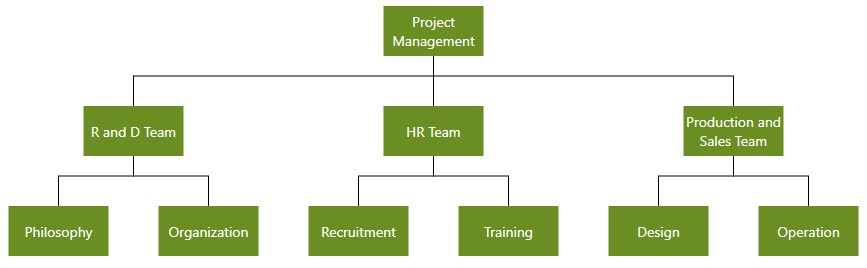

# Automatic Layout

SfDiagram provides support to auto-arrange the nodes in the diagram area that is referred as **Layout**. It includes the following layout modes:

* Hierarchical tree layout
* Radial tree
* Organizational layout
* Flowchart layout

## Hierarchical tree layout

The hierarchical tree Layout arranges nodes in a tree-like structure, where the nodes in the hierarchical layout may have multiple parents. There is no need to specify the layout root.
To arrange the nodes in hierarchical structure, specify the [LayoutType](https://help.syncfusion.com/cr/cref_files/wpf/Syncfusion.SfDiagram.WPF~Syncfusion.UI.Xaml.Diagram.Layout.DirectedTreeLayout~Type.html "LayoutType") as hierarchical tree.

N> The SpaceBetweenSubTrees property of the DirectedTreeLayout will no longer efficient. Use HorizontalSpacing and VerticalSpacing.




<local:Employees x:Key="Employees">
<local:Employee Empid="0" Role="Project Management"></local:Employee>
<local:Employee Empid= "1"  Role= "R and D Team" Team= "0"/>
<local:Employee Empid= "3"  Role= "Philosophy" Team= "1"/>
<local:Employee Empid= "4"  Role= "Organization" Team= "1"/>
<local:Employee Empid= "156"  Role= "HR Team" Team= "0"/>
<local:Employee Empid= "13"  Role= "Recruitment" Team= "156"/>
<local:Employee Empid= "113"  Role= "Training" Team= "156"/>
<local:Employee Empid= "17"  Role= "Production and Sales Team" Team= "0"/>
<local:Employee Empid= "119"  Role= "Design" Team= "17"/>
<local:Employee Empid= "19"  Role= "Operation" Team= "17"/>
</local:Employees>
<!--Initializes the Layout-->
<syncfusion:DirectedTreeLayout x:Key="treeLayout" Orientation="TopToBottom" Type="Hierarchical"
HorizontalSpacing="80" VerticalSpacing="50"
SpaceBetweenSubTrees="20"/>

<!--Initializes the LayoutManager-->
<syncfusion:LayoutManager x:Key="layoutManager" Layout="{StaticResource treeLayout}" />




## Radial-Tree layout

The Radial-Tree layout is a specification of the Directed Tree Layout Manager that employs a circular layout algorithm for locating the Diagram nodes. The Radial-Tree Layout arranges nodes in a circular layout, positioning the root node at the center of the graph and the child nodes in a circular fashion around the root. Sub-trees formed by the branching of child nodes are located radically around the child nodes. 
The arrangement results in an ever-expanding concentric arrangement with radial proximity to the root Node indicating the node level in the hierarchy. However, it is necessary to specify a layout root for the tree layout as the Radial-Tree Layout positions the nodes based on the [LayoutRoot](https://help.syncfusion.com/cr/cref_files/wpf/Syncfusion.SfDiagram.WPF~Syncfusion.UI.Xaml.Diagram.Layout.RadialTreeLayout~LayoutRoot.html "LayoutRoot").




<local:Employees x:Key="Employees">
	<local:Employee Empid="0" Role="Project Management"></local:Employee>
	<local:Employee Empid= "1"  Role= "R and D Team" Team= "0"/>
	<local:Employee Empid= "3"  Role= "Philosophy" Team= "1"/>
	<local:Employee Empid= "4"  Role= "Organization" Team= "1"/>
	<local:Employee Empid= "156"  Role= "HR Team" Team= "0"/>
	<local:Employee Empid= "13"  Role= "Recruitment" Team= "156"/>
	<local:Employee Empid= "113"  Role= "Training" Team= "156"/>
	<local:Employee Empid= "17"  Role= "Production Team" Team= "0"/>
	<local:Employee Empid= "119"  Role= "Design" Team= "17"/>
	<local:Employee Empid= "19"  Role= "Operation" Team= "17"/>
	<local:Employee Empid= "18"  Role= "Sales Team" Team= "0"/>
	<local:Employee Empid= "113"  Role= "Support and Maintenance" Team= "18"/>
	<local:Employee Empid= "117"  Role= "Customer Interaction" Team= "18"/>
</local:Employees>

<!--Initializes the Layout-->
<syncfusion:RadialTreeLayout x:Key="treeLayout"
HorizontalSpacing="80" VerticalSpacing="50"
SpaceBetweenSubTrees="20"/>

<!--Initializes the LayoutManager-->
<syncfusion:LayoutManager x:Key="layoutManager" Layout="{StaticResource treeLayout}" />




## Organization layout 

An organizational chart is a Diagram that displays the structure of an organization and relationships. To create an organizational chart, type should be set to LayoutType.Organization.
For LayoutType, refer to, [LayoutType](https://help.syncfusion.com/cr/cref_files/wpf/Syncfusion.SfDiagram.WPF~Syncfusion.UI.Xaml.Diagram.Layout.DirectedTreeLayout~Type.html "LayoutType")




_//Initializes data source_
<local:Employees x:Key="Employees">
<local:Employee Empid="0" Role="Project Management"></local:Employee>
<local:Employee Empid= "1"  Role= "R and D Team" Team= "0"/>
<local:Employee Empid= "3"  Role= "Philosophy" Team= "1"/>
<local:Employee Empid= "4"  Role= "Organization" Team= "1"/>
<local:Employee Empid= "5"  Role= "Technology" Team= "1"/>
<local:Employee Empid= "7"  Role= "Funding" Team= "1"/>
<local:Employee Empid= "8"  Role= "Resource Allocation" Team= "1"/>
<local:Employee Empid= "9"  Role= "Targeting" Team= "1"/>
<local:Employee Empid= "11"  Role= "Evaluation" Team= "1"/>
<local:Employee Empid= "156"  Role= "HR Team" Team= "0"/>
<local:Employee Empid= "13"  Role= "Recruitment" Team= "156"/>
<local:Employee Empid= "113"  Role= "Training" Team= "156"/>
<local:Employee Empid= "112"  Role= "Employee Relation" Team= "156"/>
<local:Employee Empid= "14"  Role= "Record Keeping" Team= "156"/>
<local:Employee Empid= "15"  Role= "Compensations and Benefits" Team= "12"/>
<local:Employee Empid= "16"  Role= "Compliances" Team= "12"/>
<local:Employee Empid= "17"  Role= "Production and Sales Team" Team= "0"/>
<local:Employee Empid= "119"  Role= "Design" Team= "17"/>
<local:Employee Empid= "19"  Role= "Operation" Team= "17"/>
<local:Employee Empid= "20"  Role= "Support" Team= "17"/>
<local:Employee Empid= "21"  Role= "Quality Assurance" Team= "17"/>
<local:Employee Empid= "23"  Role= "Customer Interaction" Team= "17"/>
<local:Employee Empid= "24"  Role= "Support and Maintenance" Team= "17"/>
<local:Employee Empid= "25"  Role= "Task Coordination" Team= "17"/>
</local:Employees>

<!--Initializes the Layout-->
<syncfusion:DirectedTreeLayout x:Key="treeLayout" Orientation="TopToBottom" Type="Organization"
HorizontalSpacing="80" VerticalSpacing="50"
SpaceBetweenSubTrees="20"/>

<!--Initializes the LayoutManager-->
<syncfusion:LayoutManager x:Key="layoutManager" Layout="{StaticResource treeLayout}" />




Organizational chart layout starts parsing from root and iterate through all its child elements. ‘GetLayoutInfo’ method provides necessary information of a node’s children and the way to arrange (orientation, type, and more) them. You can customize the arrangements by overriding this function as explained.

## Get layout info

User can change the ChartType and Orientation by using GetLayoutInfo event of the SfDiagram. This event will fire for each node added in the layout when the layout is getting updated. Default ChartType is Alternate and default orientation is Vertical.
For GetLayoutInfo, refer to, [GetLayoutInfo](https://help.syncfusion.com/cr/cref_files/wpf/Syncfusion.SfDiagram.WPF~Syncfusion.UI.Xaml.Diagram.IGraphInfo~GetLayoutInfo_EV.html "GetLayoutInfo").

**Event Arguments:**

| Event args | Property | Description |
|---|---|---|
| LayoutInfoArgs | Item | Added item when layout is getting updated. |
| | Type | Gets or sets the organizational chart type. |
| | Orientation | Gets or sets the organizational chart orientation. |




// Registering an event 

(diagramcontrol.Info as IGraphInfo).GetLayoutInfo += diagramcontrol_GetLayoutInfo;

void diagramcontrol_GetLayoutInfo(object sender, LayoutInfoArgs args)
{
    if (!args.HasSubTree)
    {
        args.Type = ChartType.Alternate;
        args.Orientation = Orientation.Vertical;
    }
}




The following table illustrates the different chart orientations and chart types. 

| Orientation | Type | Description | Example |
|---|---|---|---|
| Horizontal | Left | Arranges the child nodes Horizontally at the Left the of Parent. |  |
| | Right | Arranges the child nodes Horizontally at the Right of the Parent. |  |
| | Center | Arranges the child nodes horizontally at the Center of the parent. |  |
| Vertical | Left | Vertically arranges the children at the Left of the Parent. |  |
| | Right | Vertically arranges the children at the Right of the Parent. |  |
| | Alternate | Vertically arranges the children at both Left and Right of the Parent. |  |

## Customize layout

Diagram layouts can be arranged at the custom positions based on the layout bounds, margins, and alignments. For LayoutManager, refer to [LayoutManager](https://help.syncfusion.com/cr/cref_files/wpf/Syncfusion.SfDiagram.WPF~Syncfusion.UI.Xaml.Diagram.Layout.LayoutManager.html "LayoutManager").




diagramcontrol.LayoutManager = new LayoutManager()
{
	Layout = new DirectedTreeLayout()
	{
       	   Type = LayoutType.Hierarchical,
	       HorizotalAlignment = HorizontalAlignment.Left,
		   VerticalAlignment = VerticalAlignment.Top,
	       Bounds = new Rect(100, 100, 500, 500),
	       Margin = new Thickness(25, 25, 25, 25) 
	}
};




## Flowchart layout

The Flowchart layout is a diagrammatic representation of a process, workflow, system or computer algorithm. Flowcharts uses various kind of symbols to illustrate the different types of actions and symbols connected together with arrows showing the flow direction of process.

## Common flowchart symbols

Different flowchart symbols have different meanings that are used to represent different states in Flowchart. The following table describes the most common Flowchart symbols that are used in creating flowchart.

|Symbol|Built-in resource key in SfDiagram|Description|
|---|---|---|
||Terminator/StartOrEnd|Indicates the beginning and ending of the process.|
||Data|Indicates data input or output for a process.|
||Process|Represents an operation or set of operations and data manipulations.|
||Decision|Shows a branching point where the decision is made to choose one of the two paths|
||Document|Represents a single document or report in the process.|
||SubProcess/PredefinedProcess|Represents a sequence of actions that combine to perform a specific task that is defined elsewhere.|
||DirectData|Represents a collection of information that allows searching, sorting, and filtering|
||StoredData|Represents a step where data get stored within a process.|
||ManualInput|Represents the manual input of data into a field or step in a process.|
||ManualOperation|Represents an operation in a process that must be done manually, not automatically.|
||Preparation|Represents a setup or initialization process to another step in the process.|
||OnPageReference|Represents a pair of labeled connectors used to link long or confusing line on a flowchart.|
||OffPageReference|Represents a labeled connector used to link two flowcharts on different pages.|
||MultiDocument|Represents multiple documents or reports in the process.|
|||Represents a direction of flow from one step to another. It will get created automatically based on the relationship between the parent and child.|

N> We have provided some more built-in Shapes as ResourceDictionary. For more Shapes, please refer this [page](/wpf/sfdiagram/shapes).





<ResourceDictionary.MergedDictionaries>

<!--Initialize Shapes-->  

 < ResourceDictionary Source="/Syncfusion.SfDiagram.Wpf;component/Resources/BasicShapes.xaml"/>

</ResourceDictionary.MergedDictionaries>

<local:DataItems x:Key="Dataitems">
<local:ItemInfo Id="1" NodeShape="{StaticResource Terminator}" Width="80" Height="35" Name="Start"></local:ItemInfo>
<local:ItemInfo Id="2" NodeShape="{StaticResource Data}" Width="90" Height="35" Name="Input">
    <local:ItemInfo.ParentId>
        <local:LabelList>
            <sys:String>1</sys:String>
        </local:LabelList>
    </local:ItemInfo.ParentId>
</local:ItemInfo>
<local:ItemInfo Id="3" NodeShape="{StaticResource Decision}" Width="80" Height="60" Name="Decision?">
    <local:ItemInfo.ParentId>
        <local:LabelList>
            <sys:String>2</sys:String>
        </local:LabelList>
    </local:ItemInfo.ParentId>
</local:ItemInfo>
<local:ItemInfo Id="4" NodeShape="{StaticResource Process}" Width="80" Height="40" Name="Process1">
    <local:ItemInfo.ParentId>
        <local:LabelList>
            <sys:String>3</sys:String>
        </local:LabelList>
    </local:ItemInfo.ParentId>
    <local:ItemInfo.Label>
        <local:LabelList>
                <sys:String>Yes</sys:String>
        </local:LabelList>
    </local:ItemInfo.Label>
</local:ItemInfo>
<local:ItemInfo Id="5" NodeShape="{StaticResource Process}" Width="80" Height="40" Name="Process2">
    <local:ItemInfo.ParentId>
        <local:LabelList>
            <sys:String>3</sys:String>
        </local:LabelList>
    </local:ItemInfo.ParentId>
    <local:ItemInfo.Label>
        <local:LabelList>
            <sys:String>No</sys:String>
        </local:LabelList>
    </local:ItemInfo.Label>
</local:ItemInfo>
<local:ItemInfo Id="6" NodeShape="{StaticResource Data}" Width="90" Height="35" Name="Output">
    <local:ItemInfo.ParentId>
        <local:LabelList>
            <sys:String>5</sys:String>
        </local:LabelList>
    </local:ItemInfo.ParentId>
</local:ItemInfo>
<local:ItemInfo Id="7" NodeShape="{StaticResource Data}" Width="90" Height="35" Name="Output">
    <local:ItemInfo.ParentId>
        <local:LabelList>
            <sys:String>4</sys:String>
        </local:LabelList>
    </local:ItemInfo.ParentId>
</local:ItemInfo>
<local:ItemInfo Id="8" NodeShape="{StaticResource Terminator}" Width="80" Height="35" Name="End">
    <local:ItemInfo.ParentId>
        <local:LabelList>
            <sys:String>6</sys:String>
            <sys:String>7</sys:String>
        </local:LabelList>
    </local:ItemInfo.ParentId>
</local:ItemInfo>
</local:DataItems>
<!--Initializes the Layout-->
<syncfusion:FlowchartLayout x:Key="Layout" 
                            Orientation="LeftToRight"
                            HorizontalSpacing="50"
                            VerticalSpacing="30"                            
                            YesBranchDirection="LeftInFlow"
                            NoBranchDirection="RightInFlow">
            </syncfusion:FlowchartLayout>

<!--Initializes the LayoutManager-->
<syncfusion:LayoutManager x:Key="layoutmanager" 
                          Layout="{StaticResource Layout}"/>
<!--Initializes the DataSourceSettings -->
<syncfusion:FlowchartDataSourceSettings x:Key="DataSourceSettings" 
                                        DataSource="{StaticResource Dataitems}"   
                                        ParentId="ParentId" 
                                        Id="Id" 
                                        ShapeMapping="NodeShape" 
                                        WidthMapping="Width" 
                                        HeightMapping="Height" 
                                        ConnectorTextMapping="Label" 
                                        ContentMapping="Name"/>
<!--Initializes the SfDiagram --> 
<syncfusion:SfDiagram x:Name="Diagram" 
                              Grid.Column="0" 
                              LayoutManager="{StaticResource layoutmanager}" 
                              DataSourceSettings="{StaticResource DataSourceSettings}" >
    <syncfusion:SfDiagram.Theme>
        <syncfusion:OfficeTheme/>
    </syncfusion:SfDiagram.Theme>
</syncfusion:SfDiagram>                                       





    //Initialize Diagram
    SfDiagram Diagram = new SfDiagram();

    //Initialize Node Collection
    Diagram.Nodes = new ObservableCollection<NodeViewModel>();           

    //Initialize Connector Collection
    Diagram.Connectors = new ObservableCollection<ConnectorViewModel>();

    (Diagram.Info as IGraphInfo).ItemAdded += MainWindow_ItemAdded;

    // Initialize DataSourceSettings for SfDiagram
    Diagram.DataSourceSettings = new FlowchartDataSourceSettings()
        {
            ParentId = "ParentId",
            Id = "Id",
            DataSource = GetData(),
            ConnectorTextMapping = "Label",
            ContentMapping = "Name",
            ShapeMapping = "NodeShape",
            WidthMapping = "Width",
            HeightMapping = "Height"
        };

    //Initialize LayoutManager
    LayoutManager layoutManager = new LayoutManager();

    //Initialize Layout for SfDiagram
    layoutManager.Layout = new FlowchartLayout()
        {
            Orientation = FlowchartOrientation.TopToBottom,
            YesBranchDirection = BranchDirection.LeftInFlow,
            NoBranchDirection = BranchDirection.RightInFlow,             
            HorizontalSpacing = 50,
            VerticalSpacing = 30
        };

    //initialize theming style for SfDiagram
    Diagram.Theme = new OfficeTheme();

    //Initialize LayoutManager
    Diagram.LayoutManager = layoutManager;
    
    //Adding Sfdiagram as children to mainwindow grid.
    WindowGrid.Children.Add(Diagram);

    // Initializes the DataSource collection
    private DataItems GetData()
    {
        DataItems itemscollection = new DataItems();
        itemscollection.Add(new ItemInfo()
        {
            Id ="1",
            NodeShape =App.Current.Resources["Terminator"] as string,
            Name = "Start",
            Height =35,
            Width =80
        });
        itemscollection.Add(new ItemInfo()
        {
            Id = "2",
            ParentId =new List<string> { "1" },
            NodeShape = App.Current.Resources["Data"] as string,
            Name = "Input",
            Height = 35,
            Width =90
        });
        itemscollection.Add(new ItemInfo()
        {
            Id = "3", ParentId =new List<string> { "2" },                
            NodeShape = App.Current.Resources["Decision"] as string,
            Name = "Decision?",
            Height =60,
            Width = 80
        });
        itemscollection.Add(new ItemInfo()
        {
            Id = "4",
            ParentId = new List<string> { "3" },
            Label =new List<string> {"Yes" },
            NodeShape = App.Current.Resources["Process"] as string,
            Name = "Process1",
            Height = 40,
            Width = 80
        });
        itemscollection.Add(new ItemInfo()
        {
            Id = "5",
            ParentId = new List<string> { "3" },
            Label = new List<string> { "No" },
            NodeShape = App.Current.Resources["Process"] as string,
            Name = "Process2",
            Height = 40,
            Width = 80
        });
        itemscollection.Add(new ItemInfo()
        {
            Id = "6",
            ParentId = new List<string> { "5" },                
            NodeShape = App.Current.Resources["Data"] as string,
            Name = "Output",
            Height = 35,
            Width = 90
        });
        itemscollection.Add(new ItemInfo()
        {
            Id = "7",
            ParentId = new List<string> { "4" },                
            NodeShape = App.Current.Resources["Data"] as string,
            Name = "Output",
            Height = 35,
            Width = 90
        });
        itemscollection.Add(new ItemInfo()
        {
            Id = "8",
            ParentId = new List<string> { "6","7" },                
            NodeShape =App.Current.Resources["Terminator"] as string,
            Name = "End",
            Height = 35,
            Width = 80
        });
        return itemscollection;
        }

    //Data Object Class
    public class ItemInfo
     {
        public string Name { get; set; }
        public string Id { get; set; }
        public List<string> ParentId { get; set; }
        public string NodeShape { get; set; }       
        public List<string> Label { get; set; }
        public double Width { get; set; }        
        public double Height { get; set; }
        
    }

    //Collection to hold the Data Object class
    public class DataItems : ObservableCollection<ItemInfo>
    {

    }





 

## Customize flowchart layout orientation

Sequence of the node's direction can be customized by flowchart orientation either vertically from top to bottom or by horizontally from left to right.
The `Orientation` property of `FlowchartLayout` class allows you to define the flow direction for flowchart as `TopToBottom` or `LeftToRight`.

### TopToBottom Orientation
Arranges the element in the layout vertically from top to bottom.





 <syncfusion:FlowchartLayout x:Key="Layout" 
                            Orientation="TopToBottom">





            //Initialize LayoutManager
            LayoutManager layoutManager = new LayoutManager();

            //Initialize Layout for SfDiagram
            layoutManager.Layout = new FlowchartLayout()
            {
                Orientation = FlowchartOrientation.TopToBottom,            
            };





 

### LeftToRight orientation
Arranges the element in the layout horizontally from left to right.

 

## Customize the decision output directions

Decision symbol denotes the question that can be answered in binary format (Yes/No, True/False). The output direction of the decision symbol can be controlled by the direction of "Yes" and "No" branches using the `YesBranchDirection` and `NoBranchDirection` properties of `FlowchartLayout` class.

`Left In Flow`: Arranges the Yes/No branch to the Left of the Decision symbol.

`Right In Flow`: Arranges the Yes/No branch to the Right of the Decision symbol.

`Same As Flow`: Arranges the Yes/No branch as same as the flow of the Decision symbol.

The following table will explain the pictorial representation of the behavior:

|YesBranchDirection| NoBranchDirection | TopToBottom | LeftToRight |
|---|---|---|---|
| Left In Flow |Right In Flow|||
| Right In Flow |Left In Flow || |
| Same As Flow |Right In Flow || |
|Same As Flow |Same As Flow|||

N> If both branch directions are same, **Yes** branch will be prioritized.

### Custom Yes and No branch values

The decision symbol will produce the two branches as output, which will be **Yes** branch and **No** branch. If the output branch connector text value matches the values in the `YesBranchValues` property of `FlowchartLayout` class, it will be considered as **Yes** branch and similarly if connector text value matches the values in the `NoBranchValues` property, it will be considered as **No** branch. By default, the `YesBranchValues` property will contain **Yes** and **True** string values and the `NoBranchValues` property will contain **No** and **False** string values.  

Any text value can be given as a connector text to describe the flow. Also, any string value can be given in the `YesBranchValues` and `NoBranchValues`. To decide the flow based on if or else, that connector text should match the values in the `YesBranchValues` and `NoBranchValues`.





<syncfusion:FlowchartLayout x:Key="Layout" 
                                        Orientation="TopToBottom"
                                        YesBranchDirection="LeftInFlow"
                                        NoBranchDirection="RightInFlow"
                                        HorizontalSpacing="50" 
                                        VerticalSpacing="30">
    <syncfusion:FlowchartLayout.YesBranchValues>
        <local:LabelList>
            <sys:String>Accept</sys:String>
            <sys:String>Yes</sys:String>
        </local:LabelList>
    </syncfusion:FlowchartLayout.YesBranchValues>
    <syncfusion:FlowchartLayout.NoBranchValues>
        <local:LabelList>
            <sys:String>Reject</sys:String>
            <sys:String>No</sys:String>
        </local:LabelList>
    </syncfusion:FlowchartLayout.NoBranchValues>
</syncfusion:FlowchartLayout>





            //Initialize LayoutManager
            LayoutManager layoutManager = new LayoutManager();

            //Initialize Layout for SfDiagram
            layoutManager.Layout = new FlowchartLayout()
            {
                Orientation = FlowchartOrientation.TopToBottom,
                YesBranchDirection = BranchDirection.LeftInFlow,
                NoBranchDirection = BranchDirection.RightInFlow,
                YesBranchValues=new List<string> { "Accept","Yes"},
                NoBranchValues=new List<string> { "Reject","No"},
                HorizontalSpacing = 50,
                VerticalSpacing = 30
            };             





### Vertical and horizontal spacing 

Control the spacing between the nodes both horizontally and vertically using the `HorizontalSpacing` and `VerticalSpacing` properties of `FlowchartLayout` class.





< syncfusion:FlowchartLayout x:Key="Layout"                                         
                            HorizontalSpacing="50" 
                            VerticalSpacing="30">   
</syncfusion:FlowchartLayout>





            //Initialize LayoutManager
            LayoutManager layoutManager = new LayoutManager();

            //Initialize Layout for SfDiagram
            layoutManager.Layout = new FlowchartLayout()
            {               
                HorizontalSpacing = 50,
                VerticalSpacing = 30
            };             





Please find [Flowchart sample](https://www.syncfusion.com/downloads/support/directtrac/general/ze/Flowchart_Layout-2088923614-1032196453.zip) to depict this support.
