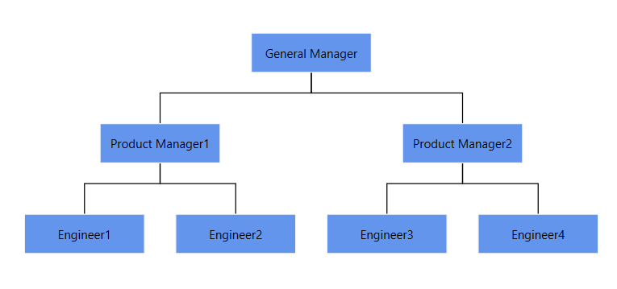
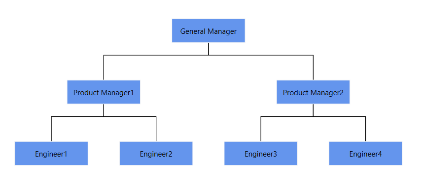
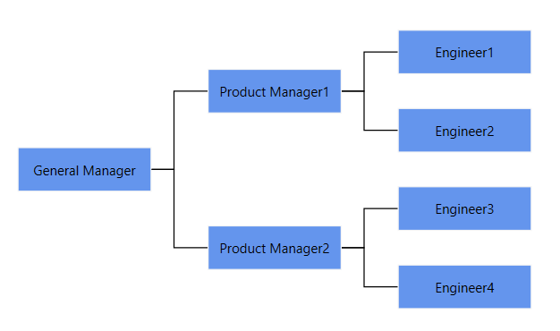
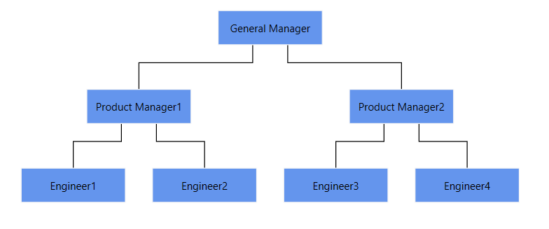

# Automatic Layout in WPF Diagram

[WPF Diagram](https://www.syncfusion.com/diagram-sdk/wpf-diagram) provides a set of built-in automatic layout algorithms, which are used to arrange nodes automatically based on a predefined layout logic. Diagram supports the following built-in automatic layout algorithms:

* [Organizational layout](https://help.syncfusion.com/wpf/diagram/automatic-layouts/organizationlayout)
* [Flowchart layout](https://help.syncfusion.com/wpf/diagram/automatic-layouts/flowchartlayout)
* [MindMap tree layout](https://help.syncfusion.com/wpf/diagram/automatic-layouts/mindmaptreelayout)
* [Hierarchical tree layout](https://help.syncfusion.com/wpf/diagram/automatic-layouts/hierarchicaltreelayout)
* [Force directed tree layout](https://help.syncfusion.com/wpf/diagram/automatic-layouts/forcedirectedtreelayout)
* [Radial tree layout](https://help.syncfusion.com/wpf/diagram/automatic-layouts/radialtreelayout)

Automatic layout algorithm uses the nodes and connectors defined in NodeCollection and ConnectorCollection or business objects defined in DataSource as input to generate the layout. To generate a layout from `NodeCollection` and `ConnectorCollection`, create the required nodes and connectors and add them to those collections as defined in the following code snippet.




<!--Initializes the SfDiagram-->
<syncfusion:SfDiagram x:Name="diagram">
    <!--Initialize Nodes-->
    <syncfusion:SfDiagram.Nodes>
        <syncfusion:NodeCollection>
            <syncfusion:NodeViewModel ID="General Manager"
                                      UnitHeight="40" UnitWidth="120" 
                                      Shape="{StaticResource Rectangle}" 
                                      Content="General Manager"/>
            <syncfusion:NodeViewModel ID="Product Manager1"
                                      UnitHeight="40" UnitWidth="120" 
                                      Shape="{StaticResource Rectangle}" 
                                      Content="Product Manager1"/>
            <syncfusion:NodeViewModel ID="Product Manager2"
                                      UnitHeight="40" UnitWidth="120" 
                                      Shape="{StaticResource Rectangle}" 
                                      Content="Product Manager2"/>
            <syncfusion:NodeViewModel ID="Engineer1" 
                                      UnitHeight="40" UnitWidth="120" 
                                      Shape="{StaticResource Rectangle}" 
                                      Content="Engineer1"/>
            <syncfusion:NodeViewModel ID="Engineer2" 
                                      UnitHeight="40" UnitWidth="120" 
                                      Shape="{StaticResource Rectangle}" 
                                      Content="Engineer2"/>
            <syncfusion:NodeViewModel ID="Engineer3" 
                                      UnitHeight="40" UnitWidth="120" 
                                      Shape="{StaticResource Rectangle}" 
                                      Content="Engineer3"/>
            <syncfusion:NodeViewModel ID="Engineer4" 
                                      UnitHeight="40" UnitWidth="120" 
                                      Shape="{StaticResource Rectangle}" 
                                      Content="Engineer4"/>
        </syncfusion:NodeCollection>
    </syncfusion:SfDiagram.Nodes>
    <!--Initialize Connectors-->
    <syncfusion:SfDiagram.Connectors>
        <syncfusion:ConnectorCollection>
            <syncfusion:ConnectorViewModel SourceNodeID="General Manager" 
                                           TargetNodeID="Product Manager1"/>
            <syncfusion:ConnectorViewModel SourceNodeID="General Manager" 
                                           TargetNodeID="Product Manager2"/>
            <syncfusion:ConnectorViewModel SourceNodeID="Product Manager1" 
                                           TargetNodeID="Engineer1"/>
            <syncfusion:ConnectorViewModel SourceNodeID="Product Manager1" 
                                           TargetNodeID="Engineer2"/>
            <syncfusion:ConnectorViewModel SourceNodeID="Product Manager2" 
                                           TargetNodeID="Engineer3"/>
            <syncfusion:ConnectorViewModel SourceNodeID="Product Manager2" 
                                           TargetNodeID="Engineer4"/>
        </syncfusion:ConnectorCollection>
    </syncfusion:SfDiagram.Connectors>           
</syncfusion:SfDiagram>




//Create Diagram instance
SfDiagram diagram = new SfDiagram();

//Initialize Nodes and Connectors Collection

diagram.Nodes = new NodeCollection();
diagram.Connectors = new ConnectorCollection();

//Create and add Nodes and Connectors

(diagram.Nodes as NodeCollection).Add(CreateNode("General Manager"));
(diagram.Nodes as NodeCollection).Add(CreateNode("Product Manager1"));
(diagram.Nodes as NodeCollection).Add(CreateNode("Product Manager2"));
(diagram.Nodes as NodeCollection).Add(CreateNode("Engineer1"));
(diagram.Nodes as NodeCollection).Add(CreateNode("Engineer2"));
(diagram.Nodes as NodeCollection).Add(CreateNode("Engineer3"));
(diagram.Nodes as NodeCollection).Add(CreateNode("Engineer4"));

(diagram.Connectors as ConnectorCollection).Add(CreateConnector("General Manager", "Product Manager1"));
(diagram.Connectors as ConnectorCollection).Add(CreateConnector("General Manager", "Product Manager2"));
(diagram.Connectors as ConnectorCollection).Add(CreateConnector("Product Manager1", "Engineer1"));
(diagram.Connectors as ConnectorCollection).Add(CreateConnector("Product Manager1", "Engineer2"));
(diagram.Connectors as ConnectorCollection).Add(CreateConnector("Product Manager2", "Engineer3"));
(diagram.Connectors as ConnectorCollection).Add(CreateConnector("Product Manager2", "Engineer4"));

//Method to create Connectors
private ConnectorViewModel CreateConnector(string node1, string node2)
{
    ConnectorViewModel con = new ConnectorViewModel()
    {
        SourceNodeID = node1,
        TargetNodeID = node2,
    };
    return con;
}

//Method to create Nodes
private NodeViewModel CreateNode(string content)
{
    NodeViewModel node = new NodeViewModel()
    {
        ID = content,
        UnitHeight = 40,
        UnitWidth = 120,
        Shape = new RectangleGeometry() { Rect = new Rect(10, 10, 10, 10) },
        Content = content,
    };
    return node;
}




To generate layout from DataSource, you have to define the business object and add the necessary data to the DataSource collection. During the layout generation, nodes and connectors can be generated automatically with the information provided through data source and those items will be added to NodeCollection and ConnectorCollection respectively. Refer to the following code to generate the layout from data source.




<!-- Initializes the employee collection-->
<local:Employees x:Key="employees">
    <local:Employee EmpId = "1" ParentId="" Name="General Manager"/>
    <local:Employee EmpId = "2" ParentId = "1" Name = "Product Manager1" />
    <local:Employee EmpId = "3" ParentId = "1" Name = "Product Manager2"/>
    <local:Employee EmpId = "4" ParentId = "2" Name = "Engineer1"/>
    <local:Employee EmpId = "5" ParentId = "2" Name = "Engineer2"/>
    <local:Employee EmpId = "6" ParentId = "3" Name = "Engineer3"/>
    <local:Employee EmpId = "7" ParentId = "3" Name = "Engineer4"/>
</local:Employees>

<!--Initializes the DataSourceSettings -->
<syncfusion:DataSourceSettings x:Key="DataSourceSettings" 
                               ParentId="ParentId" Id="EmpId"
                               DataSource="{StaticResource employees}"/>





Employees employee = new Employees();
employee.Add(new Employee() { EmpId = "1", ParentId = "", Name = "General Manager"});
employee.Add(new Employee() { EmpId = "2", ParentId = "1", Name = "Product Manager1"});
employee.Add(new Employee() { EmpId = "3", ParentId = "1", Name = "Product Manager2"});
employee.Add(new Employee() { EmpId = "4", ParentId = "2", Name = "Engineer1"});
employee.Add(new Employee() { EmpId = "5", ParentId = "2", Name = "Engineer2"});
employee.Add(new Employee() { EmpId = "6", ParentId = "3", Name = "Engineer3"});
employee.Add(new Employee() { EmpId = "7", ParentId = "3", Name = "Engineer4"});

//Initializes the DataSourceSettings
diagram.DataSourceSettings = new DataSourceSettings()
{
    Id = "EmpId",
    ParentId = "ParentId",
    DataSource = employee,
};
		



## Defining layout

You can use the [`LayoutManager.Layout`](https://help.syncfusion.com/cr/wpf/Syncfusion.UI.Xaml.Diagram.Layout.LayoutManager.html#Syncfusion_UI_Xaml_Diagram_Layout_LayoutManager_Layout) property to specify any one of the layout algorithms.

> **Note:** After the `LayoutManager` is assigned, the layout runs automatically based on the configured `RefreshFrequency`. To trigger a manual refresh at any time, call `LayoutManager.UpdateLayout()`.




<!--Initializes the SfDiagram-->
<syncfusion:SfDiagram x:Name="diagram">
    <!--Initialize LayoutManager and Layout-->
    <syncfusion:SfDiagram.LayoutManager>
        <syncfusion:LayoutManager>
            <syncfusion:LayoutManager.Layout>
                <syncfusion:DirectedTreeLayout HorizontalSpacing="30" 
                                               VerticalSpacing="50" 
                                               AvoidSegmentOverlapping="False" 
                                               Orientation="TopToBottom" 
                                               Type="Hierarchical"/>
            </syncfusion:LayoutManager.Layout>
        </syncfusion:LayoutManager>
    </syncfusion:SfDiagram.LayoutManager>            
</syncfusion:SfDiagram>




//Initialize layout Manager
diagram.LayoutManager = new LayoutManager()
{
    Layout = new DirectedTreeLayout()
    {
        HorizontalSpacing = 30,
        VerticalSpacing = 50,
        Orientation = TreeOrientation.TopToBottom,
        Type = LayoutType.Hierarchical,
        AvoidSegmentOverlapping = false,
    },
};




## Updating layout

The [`RefreshFrequency`](https://help.syncfusion.com/cr/wpf/Syncfusion.UI.Xaml.Diagram.Layout.LayoutManager.html#Syncfusion_UI_Xaml_Diagram_Layout_LayoutManager_RefreshFrequency) property of `LayoutManager` is used to re-arrange the nodes in the diagram area when a node is added, deleted, moved, or resized. You can decide when the nodes should be arranged for every diagram load or only for the first load. Find the description for each condition in the following table. The default value of `RefreshFrequency` is `FirstLoad`.

| Refresh Frequencies | Description|
| --- | --- |
| Add | Used to update the layout after adding a new element to the datasource. |
| Remove | Used to update the layout after removing an existing element from datasource. |
| Move | Used to update the layout after moving an element in the datasource. |
| Reset | Used to update the layout after resetting the datasource. | 
| Load | Used to update the layout when loading the diagram. |
| FirstLoad | Used to update the layout in the first load of the diagram. |
| Resizing | Used to update the layout when resizing an element in the layout. |
| Resized | Used to update the layout when resizing of an element is completed. |
| ArrangeParsing | Used to update the layout when the operations like Add, Remove, Move, Reset, Resizing, and Resized are performed in the layout. |



<syncfusion:LayoutManager RefreshFrequency="ArrangeParsing"/>


diagram.LayoutManager = new LayoutManager()
{
    RefreshFrequency = RefreshFrequency.ArrangeParsing,
};



N> The default value of `RefreshFrequency` is `FirstLoad`. Because `RefreshFrequency` is a `[Flags]` enumeration, multiple values can be combined using the bitwise OR operator, for example `RefreshFrequency = RefreshFrequency.Add | RefreshFrequency.Remove`. `ArrangeParsing` itself is a combined flag that includes `Add | Remove | Move | Reset | Resizing | Resized`.

## Customize spacing between nodes in layout

The `HorizontalSpacing` and `VerticalSpacing` properties of a layout are used to customize the space between successive nodes, both horizontally and vertically. The default value for horizontal spacing is `20` and vertical spacing is `50`.



<syncfusion:DirectedTreeLayout HorizontalSpacing="50" VerticalSpacing="60"/>        


diagram.LayoutManager = new LayoutManager()
{
    Layout = new DirectedTreeLayout()
    {
        HorizontalSpacing = 50,
        VerticalSpacing = 60,
    },
};



N> `HorizontalSpacing` and `VerticalSpacing` are not valid for `ForceDirectedTreeLayout`; it uses a physics-based algorithm and does not expose fixed spacing properties.

## Customize tree orientation in layout

[`Orientation`](https://help.syncfusion.com/cr/wpf/Syncfusion.UI.Xaml.Diagram.Layout.DirectedTreeLayout.html#Syncfusion_UI_Xaml_Diagram_Layout_DirectedTreeLayout_Orientation) of [`DirectedTreeLayout`](https://help.syncfusion.com/cr/wpf/Syncfusion.UI.Xaml.Diagram.Layout.DirectedTreeLayout.html) is used to arrange the tree layout based on the direction. Orientation is only valid for the hierarchical and organization layouts (and `DirectedTreeLayout` configured with a `Tree` type). The default value for orientation is `TopToBottom`. The different orientation types are defined in the following table:

| Orientation Type | Description |
|---|---|---|
| TopToBottom | Aligns the tree layout from top to bottom. All the roots are placed at the top of the diagram. |
| LeftToRight | Aligns the tree layout from left to right. All the roots are placed at the left of the diagram. |
| BottomToTop | Aligns the tree layout from bottom to top. All the roots are placed at the bottom of the diagram. |
| RightToLeft | Aligns the tree layout from right to left. All the roots are placed at the right of the diagram. |



<syncfusion:DirectedTreeLayout Orientation="LeftToRight" />        


diagram.LayoutManager = new LayoutManager()
{
    Layout = new DirectedTreeLayout()
    {
        Orientation = TreeOrientation.LeftToRight,
    },
};



N> `Orientation` is not valid for [`RadialTreeLayout`](https://help.syncfusion.com/cr/wpf/Syncfusion.UI.Xaml.Diagram.Layout.RadialTreeLayout.html) and [`ForceDirectedTreeLayout`]().

## Avoiding connector segment overlapping in layout

The [`AvoidSegmentOverlapping`](https://help.syncfusion.com/cr/wpf/Syncfusion.UI.Xaml.Diagram.Layout.DirectedTreeLayout.html#Syncfusion_UI_Xaml_Diagram_Layout_DirectedTreeLayout_AvoidSegmentOverlapping) property of `DirectedTreeLayout` is used to decide whether the segment of each connector from a single parent is distributed automatically or not. It is only valid for the hierarchical and multi-parent layouts (that is, `DirectedTreeLayout` with `Type="Hierarchical"` or `Type="Organizational"`, and `DirectedTreeLayout` configured for multi-parent). The default value is `false`.



<syncfusion:DirectedTreeLayout AvoidSegmentOverlapping="True">
</syncfusion:DirectedTreeLayout>


diagram.LayoutManager = new LayoutManager()
{
    Layout = new DirectedTreeLayout()
    {
        AvoidSegmentOverlapping = true,
    },
};



N> `AvoidSegmentOverlapping` is not valid for `RadialTreeLayout` and `ForceDirectedTreeLayout`.

## Customize margin in layout

The [`Margin`](https://help.syncfusion.com/cr/wpf/Syncfusion.UI.Xaml.Diagram.Layout.LayoutBase.html#Syncfusion_UI_Xaml_Diagram_Layout_LayoutBase_Margin) property of [`LayoutBase`](https://help.syncfusion.com/cr/wpf/Syncfusion.UI.Xaml.Diagram.Layout.LayoutBase.html) is used to provide space between the bounds of the layout and the diagram. The default margin value is `50`.

N> The `Margin` property is of type `Thickness`. In XAML, `Margin="200"` is a shortcut that applies a uniform `200`-pixel thickness on all four sides. For asymmetric values, use the full syntax `Margin="Left,Top,Right,Bottom"`.



<syncfusion:DirectedTreeLayout Margin="200">
</syncfusion:DirectedTreeLayout>        


diagram.LayoutManager = new LayoutManager()
{
    Layout = new DirectedTreeLayout()
    {
        Margin = new Thickness(200),
    },
};





## See Also
 
[How to create parent and child relationship by drag and drop nodes?](https://support.syncfusion.com/kb/article/10008/how-to-create-parent-and-child-relationship-by-drag-and-drop-nodes-in-wpf-diagram-sfdiagram)

[How to show assistants to the parent node of the organization layout?](https://support.syncfusion.com/kb/article/9115/how-to-show-assistants-to-the-parent-node-of-the-organization-layout-in-wpf-diagram)

[How to generate Layout with DataSource as NodeViewModel instead of business object class?](https://support.syncfusion.com/kb/article/10187/how-to-generate-layout-with-datasource-as-nodeviewmodel-instead-of-business-object-class-in)

[How to update layout automatically when collection is changed?](https://support.syncfusion.com/kb/article/5857/how-to-update-layout-automatically-when-collection-is-changed-in-wpf-diagram-sfdiagram)

[How to provide MultipleParentSupport in Diagram layout using DataSourceSettings?](https://support.syncfusion.com/kb/article/5493/how-to-provide-multipleparentsupport-in-wpf-diagram-sfdiagram-layout-via-datasourcesettings)

[How to create a custom layout in the WPF Diagram ?](https://support.syncfusion.com/kb/article/17780/how-to-create-a-custom-layout-in-the-wpf-diagram-sfdiagram)

[How to generate tree like diagram with nested objects in WPF Diagram?](https://support.syncfusion.com/kb/article/3478/how-to-generate-tree-like-diagram-with-nested-objects-in-wpf-)

[How to drag and drop elements from treeview in WPF Diagram?](https://support.syncfusion.com/kb/article/9277/how-to-drag-and-drop-elements-from-treeview-in-wpf-diagram-sfdiagram)

[How to do Expand/Collapse for MultiParent Layout in WPF Diagram?](https://support.syncfusion.com/kb/article/11417/how-to-do-expand-collapse-for-multiparent-layout-in-wpf-diagramsfdiagram)