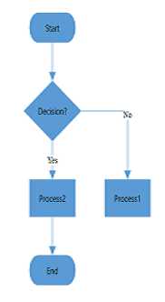
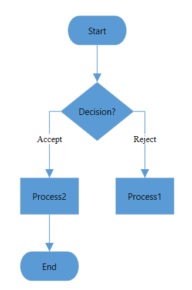

# Flowchart layout in WPF Diagram (SfDiagram)

The flowchart layout is a diagrammatic representation of a process, workflow, system, or computer algorithm. Flowcharts uses various kind of symbols to illustrate the different types of actions and symbols connected together with arrows showing the flow direction of process.

## Common flowchart symbols

Different flowchart symbols have different meanings that are used to represent different states in flowchart. The following table describes the most common flowchart symbols that are used in creating flowchart.

|Symbol|Built-in resource key in SfDiagram|Description|
|---|---|---|
||Terminator/StartOrEnd|Indicates the beginning and ending of the process.|
||Data|Indicates data input or output for a process.|
||Process|Represents an operation or set of operations and data manipulations.|
||Decision|Shows a branching point where the decision is made to choose one of the two paths|
||Document|Represents a single document or report in the process.|
||SubProcess/PredefinedProcess|Represents a sequence of actions that combine to perform a specific task that is defined elsewhere.|
||DirectData|Represents a collection of information that allows searching, sorting, and filtering.|
||StoredData|Represents a step where data get stored within a process.|
||ManualInput|Represents the manual input of data into a field or step in a process.|
||ManualOperation|Represents an operation in a process that must be done manually, not automatically.|
||Preparation|Represents a setup or initialization process to another step in the process.|
||OnPageReference|Represents a pair of labeled connectors used to link long or confusing line on a flowchart.|
||OffPageReference|Represents a labeled connector used to link two flowcharts on different pages.|
||MultiDocument|Represents multiple documents or reports in the process.|
|||Represents a direction of flow from one step to another. It will get created automatically based on the relationship between the parent and child.|

N> We have provided some more built-in Shapes as ResourceDictionary. For more Shapes, refer to this [page](/wpf/sfdiagram/shapes).



<ResourceDictionary.MergedDictionaries>
    <!--Initialize Shapes-->
    <ResourceDictionary Source="/Syncfusion.SfDiagram.Wpf;component/Resources/BasicShapes.xaml"/>
</ResourceDictionary.MergedDictionaries>

<local:DataItems x:Key="Dataitems">
<local:ItemInfo Id="1" NodeShape="{StaticResource Terminator}" Width="80" Height="35" Name="Start"/>
<local:ItemInfo Id="2" NodeShape="{StaticResource Data}" Width="90" Height="35" Name="Input">
    <local:ItemInfo.ParentId>
        <local:LabelList>
            <sys:String>1</sys:String>
        </local:LabelList>
    </local:ItemInfo.ParentId>
</local:ItemInfo>
<local:ItemInfo Id="3" NodeShape="{StaticResource Decision}" Width="80" Height="60" Name="Decision?">
    <local:ItemInfo.ParentId>
        <local:LabelList>
            <sys:String>2</sys:String>
        </local:LabelList>
    </local:ItemInfo.ParentId>
</local:ItemInfo>
<local:ItemInfo Id="4" NodeShape="{StaticResource Process}" Width="80" Height="40" Name="Process1">
    <local:ItemInfo.ParentId>
        <local:LabelList>
            <sys:String>3</sys:String>
        </local:LabelList>
    </local:ItemInfo.ParentId>
    <local:ItemInfo.Label>
        <local:LabelList>
                <sys:String>Yes</sys:String>
        </local:LabelList>
    </local:ItemInfo.Label>
</local:ItemInfo>
<local:ItemInfo Id="5" NodeShape="{StaticResource Process}" Width="80" Height="40" Name="Process2">
    <local:ItemInfo.ParentId>
        <local:LabelList>
            <sys:String>3</sys:String>
        </local:LabelList>
    </local:ItemInfo.ParentId>
    <local:ItemInfo.Label>
        <local:LabelList>
            <sys:String>No</sys:String>
        </local:LabelList>
    </local:ItemInfo.Label>
</local:ItemInfo>
<local:ItemInfo Id="6" NodeShape="{StaticResource Data}" Width="90" Height="35" Name="Output">
    <local:ItemInfo.ParentId>
        <local:LabelList>
            <sys:String>5</sys:String>
        </local:LabelList>
    </local:ItemInfo.ParentId>
</local:ItemInfo>
<local:ItemInfo Id="7" NodeShape="{StaticResource Data}" Width="90" Height="35" Name="Output">
    <local:ItemInfo.ParentId>
        <local:LabelList>
            <sys:String>4</sys:String>
        </local:LabelList>
    </local:ItemInfo.ParentId>
</local:ItemInfo>
<local:ItemInfo Id="8" NodeShape="{StaticResource Terminator}" Width="80" Height="35" Name="End">
    <local:ItemInfo.ParentId>
        <local:LabelList>
            <sys:String>6</sys:String>
            <sys:String>7</sys:String>
        </local:LabelList>
    </local:ItemInfo.ParentId>
</local:ItemInfo>
</local:DataItems>
<!--Initializes the Layout-->
<syncfusion:FlowchartLayout x:Key="Layout" Orientation="LeftToRight" 
                            HorizontalSpacing="50" VerticalSpacing="30" 
                            YesBranchDirection="LeftInFlow" 
                            NoBranchDirection="RightInFlow">
</syncfusion:FlowchartLayout>

<!--Initializes the LayoutManager-->
<syncfusion:LayoutManager x:Key="layoutmanager" Layout="{StaticResource Layout}"/>

<!--Initializes the DataSourceSettings -->
<syncfusion:FlowchartDataSourceSettings x:Key="DataSourceSettings" 
                                        DataSource="{StaticResource Dataitems}" 
                                        ParentId="ParentId" Id="Id" 
                                        ShapeMapping="NodeShape" 
                                        WidthMapping="Width" 
                                        HeightMapping="Height" 
                                        ConnectorTextMapping="Label" 
                                        ContentMapping="Name"/>

<!--Initializes the SfDiagram --> 
<syncfusion:SfDiagram x:Name="diagram" Grid.Column="0" 
                      LayoutManager="{StaticResource layoutmanager}" 
                      DataSourceSettings="{StaticResource DataSourceSettings}">
    <syncfusion:SfDiagram.Theme>
        <syncfusion:OfficeTheme/>
    </syncfusion:SfDiagram.Theme>
</syncfusion:SfDiagram>                                       



//Initialize Diagram
SfDiagram diagram = new SfDiagram();

//Initialize Node Collection
diagram.Nodes = new ObservableCollection<NodeViewModel>();           

//Initialize Connector Collection
diagram.Connectors = new ObservableCollection<ConnectorViewModel>();

(diagram.Info as IGraphInfo).ItemAdded += MainWindow_ItemAdded;

//Initialize DataSourceSettings for SfDiagram
diagram.DataSourceSettings = new FlowchartDataSourceSettings()
{
    ParentId = "ParentId",
    Id = "Id",
    DataSource = GetData(),
    ConnectorTextMapping = "Label",
    ContentMapping = "Name",
    ShapeMapping = "NodeShape",
    WidthMapping = "Width",
    HeightMapping = "Height"
};

//Initialize LayoutManager
LayoutManager layoutManager = new LayoutManager();

//Initialize Layout for SfDiagram
layoutManager.Layout = new FlowchartLayout()
{
    Orientation = FlowchartOrientation.TopToBottom,
    YesBranchDirection = BranchDirection.LeftInFlow,
    NoBranchDirection = BranchDirection.RightInFlow,             
    HorizontalSpacing = 50,
    VerticalSpacing = 30
};

//Initialize theming style for SfDiagram
diagram.Theme = new OfficeTheme();

//Initialize LayoutManager
diagram.LayoutManager = layoutManager;
    
//Adding Sfdiagram as children to mainwindow grid.
WindowGrid.Children.Add(diagram);

//Initializes the DataSource collection
private DataItems GetData()
{
    DataItems itemscollection = new DataItems();
    itemscollection.Add(new ItemInfo()
    {
        Id ="1",
        NodeShape =App.Current.Resources["Terminator"] as string,
        Name = "Start",
        Height =35,
        Width =80
    });
    itemscollection.Add(new ItemInfo()
    {
        Id = "2",
        ParentId =new List<string> { "1" },
        NodeShape = App.Current.Resources["Data"] as string,
        Name = "Input",
        Height = 35,
        Width =90
    });
    itemscollection.Add(new ItemInfo()
    {
        Id = "3", ParentId =new List<string> { "2" },                
        NodeShape = App.Current.Resources["Decision"] as string,
        Name = "Decision?",
        Height =60,
        Width = 80
    });
    itemscollection.Add(new ItemInfo()
    {
        Id = "4",
        ParentId = new List<string> { "3" },
        Label =new List<string> {"Yes" },
        NodeShape = App.Current.Resources["Process"] as string,
        Name = "Process1",
        Height = 40,
        Width = 80
    });
    itemscollection.Add(new ItemInfo()
    {
        Id = "5",
        ParentId = new List<string> { "3" },
        Label = new List<string> { "No" },
        NodeShape = App.Current.Resources["Process"] as string,
        Name = "Process2",
        Height = 40,
        Width = 80
    });
    itemscollection.Add(new ItemInfo()
    {
        Id = "6",
        ParentId = new List<string> { "5" },                
        NodeShape = App.Current.Resources["Data"] as string,
        Name = "Output",
        Height = 35,
        Width = 90
    });
    itemscollection.Add(new ItemInfo()
    {
        Id = "7",
        ParentId = new List<string> { "4" },                
        NodeShape = App.Current.Resources["Data"] as string,
        Name = "Output",
        Height = 35,
        Width = 90
    });
    itemscollection.Add(new ItemInfo()
    {
        Id = "8",
        ParentId = new List<string> { "6","7" },                
        NodeShape =App.Current.Resources["Terminator"] as string,
        Name = "End",
        Height = 35,
        Width = 80
    });
    return itemscollection;
}

//Data Object Class
public class ItemInfo
{
    public string Name { get; set; }
    public string Id { get; set; }
    public List<string> ParentId { get; set; }
    public string NodeShape { get; set; }       
    public List<string> Label { get; set; }
    public double Width { get; set; }        
    public double Height { get; set; }
}

//Collection to hold the Data Object class
public class DataItems : ObservableCollection<ItemInfo>
{
}




## Customize flowchart layout orientation

Sequence of the node's direction can be customized by flowchart orientation either vertically from top to bottom or by horizontally from left to right.
The `Orientation` property of `FlowchartLayout` class allows you to define the flow direction for flowchart as `TopToBottom` or `LeftToRight`.

### TopToBottom orientation

Arranges the element in the layout vertically from top to bottom.



<syncfusion:FlowchartLayout x:Key="Layout" Orientation="TopToBottom"/>


//Initialize LayoutManager
LayoutManager layoutManager = new LayoutManager();
//Initialize Layout for SfDiagram
layoutManager.Layout = new FlowchartLayout()
{
    Orientation = FlowchartOrientation.TopToBottom,            
};




 

### LeftToRight orientation

Arranges the element in the layout horizontally from left to right.

 

## Customize the decision output directions

Decision symbol denotes the question that can be answered in binary format (Yes/No, True/False). The output direction of the decision symbol can be controlled by the direction of "Yes" and "No" branches using the `YesBranchDirection` and `NoBranchDirection` properties of `FlowchartLayout` class.

`Left In Flow`: Arranges the Yes/No branch to the Left of the Decision symbol.

`Right In Flow`: Arranges the Yes/No branch to the Right of the Decision symbol.

`Same As Flow`: Arranges the Yes/No branch as same as the flow of the Decision symbol.

The following table will explain the pictorial representation of the behavior:

|YesBranchDirection| NoBranchDirection | TopToBottom | LeftToRight |
|---|---|---|---|
| Left In Flow |Right In Flow|||
| Right In Flow |Left In Flow || |
| Same As Flow |Right In Flow || |
|Same As Flow |Same As Flow|||

N> If both branch directions are same, **Yes** branch will be prioritized.

### Custom Yes and No branch values

The decision symbol will produce the two branches as output, which will be **Yes** branch and **No** branch. If the output branch connector text value matches the values in the `YesBranchValues` property of `FlowchartLayout` class, it will be considered as **Yes** branch and similarly if connector text value matches the values in the `NoBranchValues` property, it will be considered as **No** branch. By default, the `YesBranchValues` property will contain **Yes** and **True** string values and the `NoBranchValues` property will contain **No** and **False** string values.  

Any text value can be given as a connector text to describe the flow. Also, any string value can be given in the `YesBranchValues` and `NoBranchValues`. To decide the flow based on if or else, that connector text should match the values in the `YesBranchValues` and `NoBranchValues`.



<syncfusion:FlowchartLayout x:Key="Layout" Orientation="TopToBottom" 
                            YesBranchDirection="LeftInFlow" 
                            NoBranchDirection="RightInFlow"  
                            HorizontalSpacing="50" 
                            VerticalSpacing="30">
    <syncfusion:FlowchartLayout.YesBranchValues>
        <local:LabelList>
            <sys:String>Accept</sys:String>
            <sys:String>Yes</sys:String>
        </local:LabelList>
    </syncfusion:FlowchartLayout.YesBranchValues>
    <syncfusion:FlowchartLayout.NoBranchValues>
        <local:LabelList>
            <sys:String>Reject</sys:String>
            <sys:String>No</sys:String>
        </local:LabelList>
    </syncfusion:FlowchartLayout.NoBranchValues>
</syncfusion:FlowchartLayout>



//Initialize LayoutManager
LayoutManager layoutManager = new LayoutManager();

//Initialize Layout for SfDiagram
layoutManager.Layout = new FlowchartLayout()
{
    Orientation = FlowchartOrientation.TopToBottom,
    YesBranchDirection = BranchDirection.LeftInFlow,
    NoBranchDirection = BranchDirection.RightInFlow,
    YesBranchValues=new List<string> { "Accept","Yes"},
    NoBranchValues=new List<string> { "Reject","No"},
    HorizontalSpacing = 50,
    VerticalSpacing = 30
};             




## Customize vertical and horizontal spacing 

Control the spacing between the nodes both horizontally and vertically using the `HorizontalSpacing` and `VerticalSpacing` properties of `FlowchartLayout` class.



<syncfusion:FlowchartLayout x:Key="Layout" HorizontalSpacing="50" VerticalSpacing="30"/>   


//Initialize LayoutManager
LayoutManager layoutManager = new LayoutManager();

//Initialize Layout for SfDiagram
layoutManager.Layout = new FlowchartLayout()
{               
    HorizontalSpacing = 50,
    VerticalSpacing = 30
};             



[View sample in GitHub](https://github.com/SyncfusionExamples/WPF-Diagram-Examples/tree/master/Samples/Automatic%20Layout/Flowchart%20Layout)
