# Flowchart Layout in WPF SfDiagram

The flowchart layout is a diagrammatic representation of a process, workflow, system, or computer algorithm. Flowcharts use various kinds of symbols to illustrate the different types of actions, and the symbols are connected together with arrows showing the flow direction of a process.

## Common flowchart symbols

Different flowchart symbols have different meanings that are used to represent different states in a flowchart. The following table describes the most common flowchart symbols that are used to create a flowchart.

|Symbol|Built-in resource key in SfDiagram|Description|
|---|---|---|
||Terminator/StartOrEnd|Indicates the beginning and ending of the process.|
||Data|Indicates data input or output for a process.|
||Process|Represents an operation or set of operations and data manipulations.|
||Decision|Shows a branching point where the decision is made to choose one of the two paths.|
||Document|Represents a single document or report in the process.|
||SubProcess / PredefinedProcess|Represents a sequence of actions that combine to perform a specific task that is defined elsewhere. Both keys (`SubProcess` and `PredefinedProcess`) map to the same shape; use either name when binding via `ShapeMapping`.|
||DirectData|Represents a collection of information that allows searching, sorting, and filtering. Use for read/write data sources such as databases or files.|
||StoredData|Represents a step where data is stored within a process. Use for persistent storage (for example, disk or tape).|
||ManualInput|Represents the manual input of data into a field or step in a process. Use when the value is keyed in by a user. (File renamed to `…-symbol.png` to match the other entries.)|
||ManualOperation|Represents an operation in a process that must be done manually, not automatically.|
||Preparation|Represents a setup or initialization process to another step in the process.|
||OnPageReference|Represents a pair of labeled connectors used to link long or confusing lines on a flowchart.|
||OffPageReference|Represents a labeled connector used to link two flowcharts on different pages.|
||MultiDocument|Represents multiple documents or reports in the process.|
|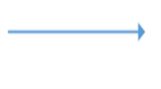||Represents a direction of flow from one step to another. It will get created automatically based on the relationship between the parent and child.|

N> We have provided some more built-in Shapes as ResourceDictionary. For more Shapes, refer to this [page](/wpf/sfdiagram/shapes).




<Window.Resources>
    <ResourceDictionary>
        <ResourceDictionary.MergedDictionaries>
            <!--Initialize Shapes-->
            <ResourceDictionary Source="/Syncfusion.SfDiagram.Wpf;component/Resources/BasicShapes.xaml"/>
        </ResourceDictionary.MergedDictionaries>
    </ResourceDictionary>
</Window.Resources>

<local:DataItems x:Key="Dataitems">
<local:ItemInfo Id="1" NodeShape="{StaticResource Terminator}" Width="80" Height="35" Name="Start"/>
<local:ItemInfo Id="2" NodeShape="{StaticResource Data}" Width="90" Height="35" Name="Input">
    <local:ItemInfo.ParentId>
        <local:LabelList>
            <sys:String>1</sys:String>
        </local:LabelList>
    </local:ItemInfo.ParentId>
</local:ItemInfo>
<local:ItemInfo Id="3" NodeShape="{StaticResource Decision}" Width="80" Height="60" Name="Decision?">
    <local:ItemInfo.ParentId>
        <local:LabelList>
            <sys:String>2</sys:String>
        </local:LabelList>
    </local:ItemInfo.ParentId>
</local:ItemInfo>
<local:ItemInfo Id="4" NodeShape="{StaticResource Process}" Width="80" Height="40" Name="Process1">
    <local:ItemInfo.ParentId>
        <local:LabelList>
            <sys:String>3</sys:String>
        </local:LabelList>
    </local:ItemInfo.ParentId>
    <local:ItemInfo.Label>
        <local:LabelList>
                <sys:String>Yes</sys:String>
        </local:LabelList>
    </local:ItemInfo.Label>
</local:ItemInfo>
<local:ItemInfo Id="5" NodeShape="{StaticResource Process}" Width="80" Height="40" Name="Process2">
    <local:ItemInfo.ParentId>
        <local:LabelList>
            <sys:String>3</sys:String>
        </local:LabelList>
    </local:ItemInfo.ParentId>
    <local:ItemInfo.Label>
        <local:LabelList>
            <sys:String>No</sys:String>
        </local:LabelList>
    </local:ItemInfo.Label>
</local:ItemInfo>
<local:ItemInfo Id="6" NodeShape="{StaticResource Data}" Width="90" Height="35" Name="Output">
    <local:ItemInfo.ParentId>
        <local:LabelList>
            <sys:String>5</sys:String>
        </local:LabelList>
    </local:ItemInfo.ParentId>
</local:ItemInfo>
<!--Note: Id=6 and Id=7 share the same Name="Output". Only the Id must be unique;
    Name is for display purposes and is allowed to repeat. The DataSourceSettings
    keying uses Id, not Name.-->
<local:ItemInfo Id="7" NodeShape="{StaticResource Data}" Width="90" Height="35" Name="Output">
    <local:ItemInfo.ParentId>
        <local:LabelList>
            <sys:String>4</sys:String>
        </local:LabelList>
    </local:ItemInfo.ParentId>
</local:ItemInfo>
<local:ItemInfo Id="8" NodeShape="{StaticResource Terminator}" Width="80" Height="35" Name="End">
    <local:ItemInfo.ParentId>
        <local:LabelList>
            <sys:String>6</sys:String>
            <sys:String>7</sys:String>
        </local:LabelList>
    </local:ItemInfo.ParentId>
</local:ItemInfo>
</local:DataItems>
<!--Initializes the Layout-->
<syncfusion:FlowchartLayout x:Key="Layout" Orientation="LeftToRight" 
                            HorizontalSpacing="50" VerticalSpacing="30" 
                            YesBranchDirection="LeftInFlow" 
                            NoBranchDirection="RightInFlow">
</syncfusion:FlowchartLayout>

<!--Initializes the LayoutManager-->
<syncfusion:LayoutManager x:Key="layoutmanager" Layout="{StaticResource Layout}"/>

<!--Initializes the DataSourceSettings -->
<syncfusion:FlowchartDataSourceSettings x:Key="DataSourceSettings" 
                                        DataSource="{StaticResource Dataitems}" 
                                        ParentId="ParentId" Id="Id" 
                                        ShapeMapping="NodeShape" 
                                        WidthMapping="Width" 
                                        HeightMapping="Height" 
                                        ConnectorTextMapping="Label" 
                                        ContentMapping="Name"/>

<!--Initializes the SfDiagram --> 
<syncfusion:SfDiagram x:Name="diagram" Grid.Column="0" 
                      LayoutManager="{StaticResource layoutmanager}" 
                      DataSourceSettings="{StaticResource DataSourceSettings}">
    <syncfusion:SfDiagram.Theme>
        <syncfusion:OfficeTheme/>
    </syncfusion:SfDiagram.Theme>
</syncfusion:SfDiagram>                                       



//Initialize Diagram
SfDiagram diagram = new SfDiagram();

//Initialize Node Collection
diagram.Nodes = new ObservableCollection<NodeViewModel>();           

//Initialize Connector Collection
diagram.Connectors = new ObservableCollection<ConnectorViewModel>();

//ItemInfo must expose a public parameterless constructor so that
//FlowchartDataSourceSettings can instantiate it from the DataSource
//collection. The class below demonstrates the required shape.

//Subscribe to ItemAdded
(diagram.Info as IGraphInfo).ItemAdded += MainWindow_ItemAdded;

//Handler for ItemAdded (placeholder: customize per requirements)
private void MainWindow_ItemAdded(object sender, ItemAddedEventArgs args)
{
    //Perform any per-item initialization here.
}

//Initialize DataSourceSettings for SfDiagram
diagram.DataSourceSettings = new FlowchartDataSourceSettings()
{
    ParentId = "ParentId",
    Id = "Id",
    DataSource = GetData(),
    ConnectorTextMapping = "Label",
    ContentMapping = "Name",
    ShapeMapping = "NodeShape",
    WidthMapping = "Width",
    HeightMapping = "Height"
};

//Initialize LayoutManager
LayoutManager layoutManager = new LayoutManager();

//Initialize Layout for SfDiagram
layoutManager.Layout = new FlowchartLayout()
{
    Orientation = FlowchartOrientation.TopToBottom,
    YesBranchDirection = BranchDirection.LeftInFlow,
    NoBranchDirection = BranchDirection.RightInFlow,             
    HorizontalSpacing = 50,
    VerticalSpacing = 30
};

//Initialize theming style for SfDiagram
diagram.Theme = new OfficeTheme();

//Assign the LayoutManager to the diagram (do not re-initialize the manager here).
diagram.LayoutManager = layoutManager;

//Add the SfDiagram as a child of the main window grid.
WindowGrid.Children.Add(diagram);

//Initializes the DataSource collection
private DataItems GetData()
{
    DataItems itemscollection = new DataItems();
    itemscollection.Add(new ItemInfo()
    {
        Id ="1",
        NodeShape =App.Current.Resources["Terminator"] as string,
        Name = "Start",
        Height =35,
        Width =80
    });
    itemscollection.Add(new ItemInfo()
    {
        Id = "2",
        ParentId =new List<string> { "1" },
        NodeShape = App.Current.Resources["Data"] as string,
        Name = "Input",
        Height = 35,
        Width =90
    });
    itemscollection.Add(new ItemInfo()
    {
        Id = "3", ParentId =new List<string> { "2" },                
        NodeShape = App.Current.Resources["Decision"] as string,
        Name = "Decision?",
        Height =60,
        Width = 80
    });
    itemscollection.Add(new ItemInfo()
    {
        Id = "4",
        ParentId = new List<string> { "3" },
        Label =new List<string> {"Yes" },
        NodeShape = App.Current.Resources["Process"] as string,
        Name = "Process1",
        Height = 40,
        Width = 80
    });
    itemscollection.Add(new ItemInfo()
    {
        Id = "5",
        ParentId = new List<string> { "3" },
        Label = new List<string> { "No" },
        NodeShape = App.Current.Resources["Process"] as string,
        Name = "Process2",
        Height = 40,
        Width = 80
    });
    itemscollection.Add(new ItemInfo()
    {
        Id = "6",
        ParentId = new List<string> { "5" },                
        NodeShape = App.Current.Resources["Data"] as string,
        Name = "Output",
        Height = 35,
        Width = 90
    });
    itemscollection.Add(new ItemInfo()
    {
        Id = "7",
        ParentId = new List<string> { "4" },                
        NodeShape = App.Current.Resources["Data"] as string,
        Name = "Output",
        Height = 35,
        Width = 90
    });
    itemscollection.Add(new ItemInfo()
    {
        Id = "8",
        ParentId = new List<string> { "6","7" },                
        NodeShape =App.Current.Resources["Terminator"] as string,
        Name = "End",
        Height = 35,
        Width = 80
    });
    return itemscollection;
}

//Data Object Class.
//A parameterless constructor is required when ItemInfo instances are
//created via XAML property syntax or by the FlowchartDataSourceSettings.
public class ItemInfo
{
    public ItemInfo()
    {
    }

    public string Name { get; set; }
    public string Id { get; set; }
    public List<string> ParentId { get; set; }
    public string NodeShape { get; set; }       
    public List<string> Label { get; set; }
    public double Width { get; set; }        
    public double Height { get; set; }
}

//Collection to hold the Data Object class
public class DataItems : ObservableCollection<ItemInfo>
{
}




## Customize flowchart layout orientation

The flow direction of nodes can be customized using the flowchart orientation, either vertically from top to bottom or horizontally from left to right. The [`Orientation`](https://help.syncfusion.com/cr/wpf/Syncfusion.UI.Xaml.Diagram.Layout.FlowchartLayout.html#Syncfusion_UI_Xaml_Diagram_Layout_FlowchartLayout_Orientation) property of the [FlowchartLayout](https://help.syncfusion.com/cr/wpf/Syncfusion.UI.Xaml.Diagram.Layout.FlowchartLayout.html) class allows you to define the flow direction for a flowchart.

The `FlowchartOrientation` enum has the following values:

| Value | Description |
| --- | --- |
| `TopToBottom` | Defines the flow orientation as top to bottom. The default value. |
| `LeftToRight` | Defines the flow orientation as left to right. |

### TopToBottom orientation

Arranges the element in the layout vertically from top to bottom.



<syncfusion:FlowchartLayout x:Key="Layout" Orientation="TopToBottom"/>


//Initialize LayoutManager
LayoutManager layoutManager = new LayoutManager();
//Initialize Layout for SfDiagram
layoutManager.Layout = new FlowchartLayout()
{
    Orientation = FlowchartOrientation.TopToBottom,            
};




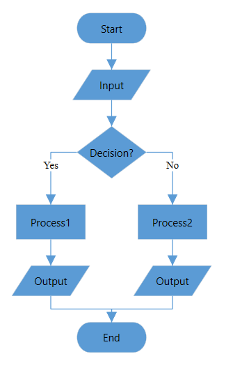 

### LeftToRight orientation

Arranges the element in the layout horizontally from left to right.



<syncfusion:FlowchartLayout x:Key="Layout" Orientation="LeftToRight"/>


//Initialize LayoutManager
LayoutManager layoutManager = new LayoutManager();
//Initialize Layout for SfDiagram
layoutManager.Layout = new FlowchartLayout()
{
    Orientation = FlowchartOrientation.LeftToRight,
};




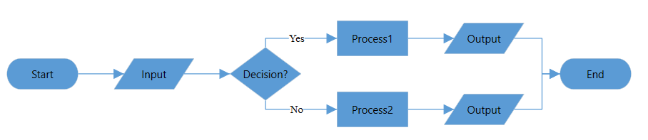

## Customize the decision output directions

The decision symbol denotes a question that can be answered in binary format (Yes/No, True/False). The output direction of the decision symbol can be controlled by the direction of the "Yes" and "No" branches using the [`YesBranchDirection`](https://help.syncfusion.com/cr/wpf/Syncfusion.UI.Xaml.Diagram.Layout.FlowchartLayout.html#Syncfusion_UI_Xaml_Diagram_Layout_FlowchartLayout_YesBranchDirection) and [`NoBranchDirection`](https://help.syncfusion.com/cr/wpf/Syncfusion.UI.Xaml.Diagram.Layout.FlowchartLayout.html#Syncfusion_UI_Xaml_Diagram_Layout_FlowchartLayout_NoBranchDirection) properties of the `FlowchartLayout` class.

The supported `BranchDirection` enum values are:

| Value | Description |
| --- | --- |
| `LeftInFlow` | Arranges the Yes/No branch to the left of the decision symbol. |
| `RightInFlow` | Arranges the Yes/No branch to the right of the decision symbol. |
| `SameAsFlow` | Arranges the Yes/No branch in the same direction as the flow of the decision symbol. |

The following table illustrates the behavior:

| `YesBranchDirection` | `NoBranchDirection` | `TopToBottom` | `LeftToRight` |
|---|---|---|---|
| `LeftInFlow` | `RightInFlow` | 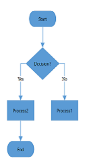 | 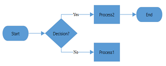 |
| `RightInFlow` | `LeftInFlow` | 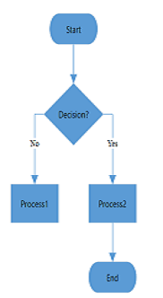 | 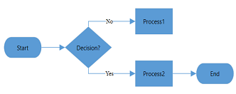 |
| `SameAsFlow` | `RightInFlow` | 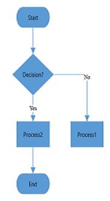 | 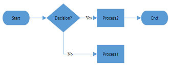 |
| `SameAsFlow` | `SameAsFlow` | 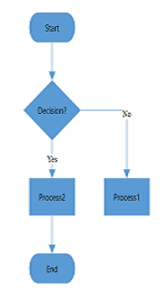 | 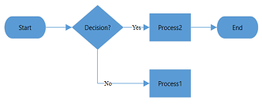 |

N> If both branch directions are the same, the **Yes** branch is prioritized.

### Custom Yes and No branch values

The decision symbol produces two output branches: a **Yes** branch and a **No** branch. If the connector text of an output branch matches a value in the [`YesBranchValues`](https://help.syncfusion.com/cr/wpf/Syncfusion.UI.Xaml.Diagram.Layout.FlowchartLayout.html#Syncfusion_UI_Xaml_Diagram_Layout_FlowchartLayout_YesBranchValues) property of the `FlowchartLayout` class, it is considered the **Yes** branch. Similarly, if the connector text matches a value in the [`NoBranchValues`](https://help.syncfusion.com/cr/wpf/Syncfusion.UI.Xaml.Diagram.Layout.FlowchartLayout.html#Syncfusion_UI_Xaml_Diagram_Layout_FlowchartLayout_NoBranchValues) property, it is considered the **No** branch.

By default, `YesBranchValues` contains `Yes` and `True`; `NoBranchValues` contains `No` and `False`. Any text value can be assigned to a connector to describe the flow, and any string value can be added to `YesBranchValues` and `NoBranchValues`. To decide the flow as if/else, the connector text must match a value in `YesBranchValues` or `NoBranchValues`. If a connector text matches neither, it falls back to the first matching branch in declaration order.



<syncfusion:FlowchartLayout x:Key="Layout" Orientation="TopToBottom" 
                            YesBranchDirection="LeftInFlow" 
                            NoBranchDirection="RightInFlow"  
                            HorizontalSpacing="50" 
                            VerticalSpacing="30">
    <syncfusion:FlowchartLayout.YesBranchValues>
        <local:LabelList>
            <sys:String>Accept</sys:String>
            <sys:String>Yes</sys:String>
        </local:LabelList>
    </syncfusion:FlowchartLayout.YesBranchValues>
    <syncfusion:FlowchartLayout.NoBranchValues>
        <local:LabelList>
            <sys:String>Reject</sys:String>
            <sys:String>No</sys:String>
        </local:LabelList>
    </syncfusion:FlowchartLayout.NoBranchValues>
</syncfusion:FlowchartLayout>



//Initialize LayoutManager
LayoutManager layoutManager = new LayoutManager();

//Initialize Layout for SfDiagram
layoutManager.Layout = new FlowchartLayout()
{
    Orientation = FlowchartOrientation.TopToBottom,
    YesBranchDirection = BranchDirection.LeftInFlow,
    NoBranchDirection = BranchDirection.RightInFlow,
    YesBranchValues=new List<string> { "Accept","Yes"},
    NoBranchValues=new List<string> { "Reject","No"},
    HorizontalSpacing = 50,
    VerticalSpacing = 30
};             




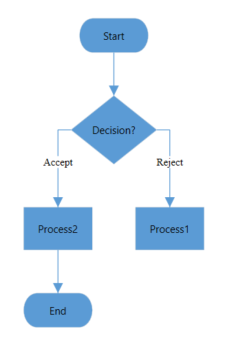

## Customize vertical and horizontal spacing

Control the spacing between the nodes, both horizontally and vertically, using the `HorizontalSpacing` and `VerticalSpacing` properties of the `FlowchartLayout` class. 




<syncfusion:FlowchartLayout x:Key="Layout" HorizontalSpacing="50" VerticalSpacing="30"/>




//Initialize LayoutManager
LayoutManager layoutManager = new LayoutManager();

//Initialize Layout for SfDiagram
layoutManager.Layout = new FlowchartLayout()
{
    HorizontalSpacing = 50,
    VerticalSpacing = 30
};



[View sample in GitHub](https://github.com/SyncfusionExamples/WPF-Diagram-Examples/tree/master/Samples/Automatic%20Layout/Flowchart%20Layout)