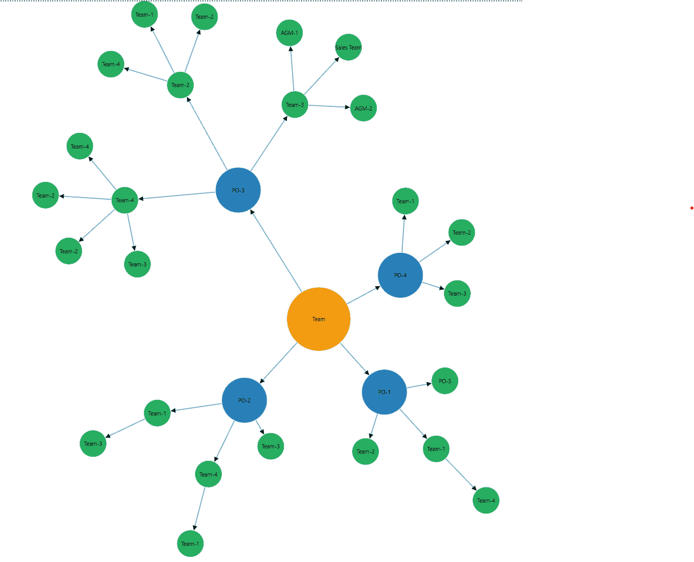
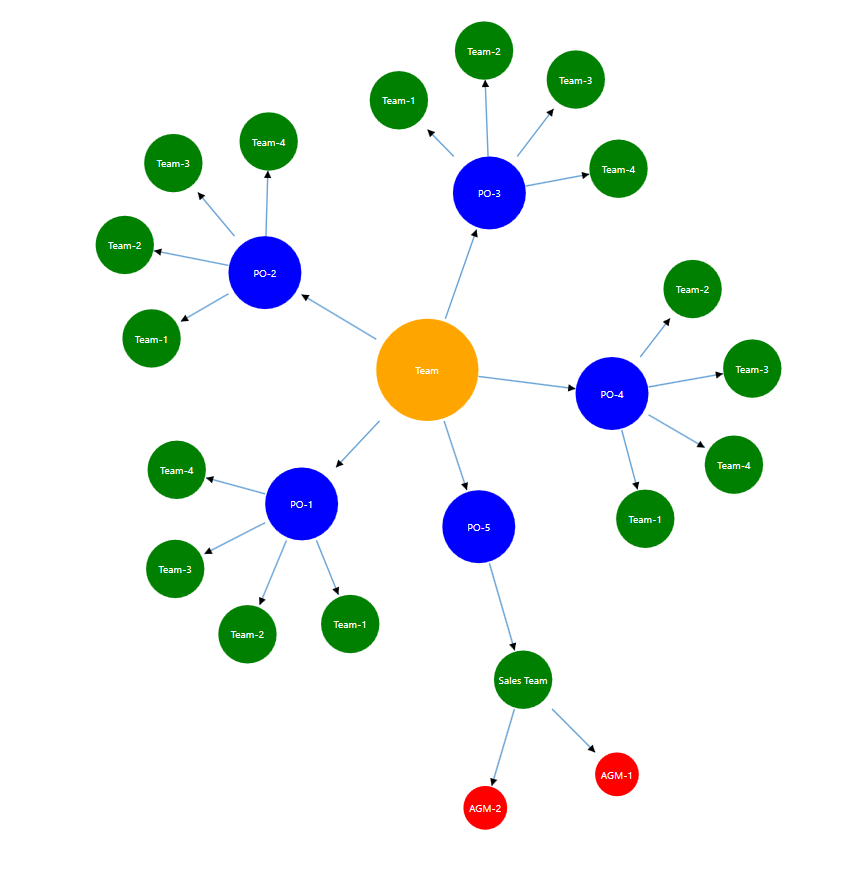

# Force-Directed Tree Layout in WPF Diagram (SfDiagram)

## Prerequisites

- **NuGet Package:** Install [Syncfusion.SfDiagram.Wpf](https://www.nuget.org/packages/Syncfusion.SfDiagram.Wpf) (version 23.1.36 or later recommended).
- **.NET/C# Version:** If using terse `new()` object initializers, your project must target **C# 9.0** and **.NET 5.0** or later. Otherwise, use explicit type names in object initializers for compatibility with earlier versions.
- **Required Namespaces:**
    ```csharp
    using Syncfusion.UI.Xaml.Diagram;
    using Syncfusion.UI.Xaml.Diagram.Controls;
    ```
- **Assembly Reference:** Ensure your project references `Syncfusion.SfDiagram.Wpf.dll`.

---


The **Force-Directed Tree Layout** arranges nodes using a physics simulation: nodes repel each other to reduce overlap, while connectors behave like springs that pull related nodes together. This produces organic, visually balanced diagrams that work well for social graphs, dependency maps, and knowledge networks.

> **Performance Note:**
> High values for `MaximumIteration` or `RepulsionStrength` can significantly increase CPU usage, especially for large graphs. Test with smaller graphs first. For very large layouts, consider providing a progress indicator, running layout on a background thread, or allowing users to cancel/re-run the layout.

---


## Properties for Configuring Force-Directed Tree Layout (WPF)
The following properties are used to configure the Force-Directed Tree Layout:

- **MaximumIteration** (integer, recommended range: 100–5000)
    - Number of simulation cycles the algorithm runs to stabilize node positions.
    - **Tradeoff:** Higher values produce more stable layouts but increase CPU time. Start with 500–2500 for typical diagrams.

- **RepulsionStrength** (double, unitless, typical range: 3000–50000)
    - Magnitude of the repulsive force between nodes, preventing overlap and crowding.
    - **Tradeoff:** Increase for more separation; decrease for denser layouts. Large values may slow layout.

- **AttractionStrength** (double, range: 0..1)
    - How strongly connected nodes are pulled toward each other.
    - **Tradeoff:** Values closer to 1 create tighter clusters; lower values allow connected nodes to spread out and ease congestion.

---

---

## Create a layout using Nodes and Connectors 


Define nodes and connectors directly in XAML, then let the `ForceDirectedTreeLayout` arrange them.

> **XAML Namespace Declaration:**
> Add the following to your Window/UserControl root:
> ```xml
> xmlns:syncfusion="clr-namespace:Syncfusion.UI.Xaml.Diagram;assembly=Syncfusion.SfDiagram.Wpf"
> ```

```xml
<syncfusion:SfDiagram x:Name="Diagram"
                      DefaultConnectorType="Line"
                      HorizontalAlignment="Stretch"
                      VerticalAlignment="Stretch">

    <syncfusion:SfDiagram.Nodes>
        <syncfusion:NodeCollection>

            <!-- Root -->
            <local:CustomNodeViewModel ID="Node1" UnitWidth="140" UnitHeight="140" Tag="Root">
                <local:CustomNodeViewModel.Shape>
                    <EllipseGeometry RadiusX="70" RadiusY="70" Center="70,70" />
                </local:CustomNodeViewModel.Shape>
                <local:CustomNodeViewModel.Annotations>
                    <syncfusion:AnnotationCollection>
                        <syncfusion:AnnotationEditorViewModel Content="Team" />
                    </syncfusion:AnnotationCollection>
                </local:CustomNodeViewModel.Annotations>
            </local:CustomNodeViewModel>

            <!-- Parents (PO-1 .. PO-5) -->
            <local:CustomNodeViewModel ID="Node2" UnitWidth="100" UnitHeight="100" Tag="Parent">
                <local:CustomNodeViewModel.Shape>
                    <EllipseGeometry RadiusX="50" RadiusY="50" Center="50,50"/>
                </local:CustomNodeViewModel.Shape>
                <local:CustomNodeViewModel.Annotations>
                    <syncfusion:AnnotationCollection>
                        <syncfusion:AnnotationEditorViewModel Content="PO-1"/>
                    </syncfusion:AnnotationCollection>
                </local:CustomNodeViewModel.Annotations>
            </local:CustomNodeViewModel>

            <local:CustomNodeViewModel ID="Node3" UnitWidth="100" UnitHeight="100" Tag="Parent">
                <local:CustomNodeViewModel.Shape>
                    <EllipseGeometry RadiusX="50" RadiusY="50" Center="50,50"/>
                </local:CustomNodeViewModel.Shape>
                <local:CustomNodeViewModel.Annotations>
                    <syncfusion:AnnotationCollection>
                        <syncfusion:AnnotationEditorViewModel Content="PO-2"/>
                    </syncfusion:AnnotationCollection>
                </local:CustomNodeViewModel.Annotations>
            </local:CustomNodeViewModel>

            <local:CustomNodeViewModel ID="Node4" UnitWidth="100" UnitHeight="100" Tag="Parent">
                <local:CustomNodeViewModel.Shape>
                    <EllipseGeometry RadiusX="50" RadiusY="50" Center="50,50"/>
                </local:CustomNodeViewModel.Shape>
                <local:CustomNodeViewModel.Annotations>
                    <syncfusion:AnnotationCollection>
                        <syncfusion:AnnotationEditorViewModel Content="PO-3"/>
                    </syncfusion:AnnotationCollection>
                </local:CustomNodeViewModel.Annotations>
            </local:CustomNodeViewModel>

            <local:CustomNodeViewModel ID="Node5" UnitWidth="100" UnitHeight="100" Tag="Parent">
                <local:CustomNodeViewModel.Shape>
                    <EllipseGeometry RadiusX="50" RadiusY="50" Center="50,50"/>
                </local:CustomNodeViewModel.Shape>
                <local:CustomNodeViewModel.Annotations>
                    <syncfusion:AnnotationCollection>
                        <syncfusion:AnnotationEditorViewModel Content="PO-4"/>
                    </syncfusion:AnnotationCollection>
                </local:CustomNodeViewModel.Annotations>
            </local:CustomNodeViewModel>

            <local:CustomNodeViewModel ID="Node6" UnitWidth="100" UnitHeight="100" Tag="Parent">
                <local:CustomNodeViewModel.Shape>
                    <EllipseGeometry RadiusX="50" RadiusY="50" Center="50,50"/>
                </local:CustomNodeViewModel.Shape>
                <local:CustomNodeViewModel.Annotations>
                    <syncfusion:AnnotationCollection>
                        <syncfusion:AnnotationEditorViewModel Content="PO-5"/>
                    </syncfusion:AnnotationCollection>
                </local:CustomNodeViewModel.Annotations>
            </local:CustomNodeViewModel>

            <!-- Children (7..30) with labels -->
            <local:CustomNodeViewModel ID="Node7" UnitWidth="60" UnitHeight="60" Tag="Child">
                <local:CustomNodeViewModel.Shape>
                    <EllipseGeometry RadiusX="30" RadiusY="30" Center="30,30"/>
                </local:CustomNodeViewModel.Shape>
                <local:CustomNodeViewModel.Annotations>
                    <syncfusion:AnnotationCollection>
                        <syncfusion:AnnotationEditorViewModel Content="Team-1"/>
                    </syncfusion:AnnotationCollection>
                </local:CustomNodeViewModel.Annotations>
            </local:CustomNodeViewModel>

            <local:CustomNodeViewModel ID="Node8" UnitWidth="60" UnitHeight="60" Tag="Child">
                <local:CustomNodeViewModel.Shape>
                    <EllipseGeometry RadiusX="30" RadiusY="30" Center="30,30"/>
                </local:CustomNodeViewModel.Shape>
                <local:CustomNodeViewModel.Annotations>
                    <syncfusion:AnnotationCollection>
                        <syncfusion:AnnotationEditorViewModel Content="Team-2"/>
                    </syncfusion:AnnotationCollection>
                </local:CustomNodeViewModel.Annotations>
            </local:CustomNodeViewModel>

            <local:CustomNodeViewModel ID="Node9" UnitWidth="60" UnitHeight="60" Tag="Child">
                <local:CustomNodeViewModel.Shape>
                    <EllipseGeometry RadiusX="30" RadiusY="30" Center="30,30"/>
                </local:CustomNodeViewModel.Shape>
                <local:CustomNodeViewModel.Annotations>
                    <syncfusion:AnnotationCollection>
                        <syncfusion:AnnotationEditorViewModel Content="Team-3"/>
                    </syncfusion:AnnotationCollection>
                </local:CustomNodeViewModel.Annotations>
            </local:CustomNodeViewModel>

            <local:CustomNodeViewModel ID="Node10" UnitWidth="60" UnitHeight="60" Tag="Child">
                <local:CustomNodeViewModel.Shape>
                    <EllipseGeometry RadiusX="30" RadiusY="30" Center="30,30"/>
                </local:CustomNodeViewModel.Shape>
                <local:CustomNodeViewModel.Annotations>
                    <syncfusion:AnnotationCollection>
                        <syncfusion:AnnotationEditorViewModel Content="Team-4"/>
                    </syncfusion:AnnotationCollection>
                </local:CustomNodeViewModel.Annotations>
            </local:CustomNodeViewModel>

            <!-- Nodes 11..24 (children) -->
            <local:CustomNodeViewModel ID="Node11" UnitWidth="60" UnitHeight="60" Tag="Child">
                <local:CustomNodeViewModel.Shape>
                    <EllipseGeometry RadiusX="30" RadiusY="30" Center="30,30"/>
                </local:CustomNodeViewModel.Shape>
                <local:CustomNodeViewModel.Annotations>
                    <syncfusion:AnnotationCollection>
                        <syncfusion:AnnotationEditorViewModel Content="Team-1"/>
                    </syncfusion:AnnotationCollection>
                </local:CustomNodeViewModel.Annotations>
            </local:CustomNodeViewModel>

            <local:CustomNodeViewModel ID="Node12" UnitWidth="60" UnitHeight="60" Tag="Child">
                <local:CustomNodeViewModel.Shape>
                    <EllipseGeometry RadiusX="30" RadiusY="30" Center="30,30"/>
                </local:CustomNodeViewModel.Shape>
                <local:CustomNodeViewModel.Annotations>
                    <syncfusion:AnnotationCollection>
                        <syncfusion:AnnotationEditorViewModel Content="Team-2"/>
                    </syncfusion:AnnotationCollection>
                </local:CustomNodeViewModel.Annotations>
            </local:CustomNodeViewModel>

            <local:CustomNodeViewModel ID="Node13" UnitWidth="60" UnitHeight="60" Tag="Child">
                <local:CustomNodeViewModel.Shape>
                    <EllipseGeometry RadiusX="30" RadiusY="30" Center="30,30"/>
                </local:CustomNodeViewModel.Shape>
                <local:CustomNodeViewModel.Annotations>
                    <syncfusion:AnnotationCollection>
                        <syncfusion:AnnotationEditorViewModel Content="Team-3"/>
                    </syncfusion:AnnotationCollection>
                </local:CustomNodeViewModel.Annotations>
            </local:CustomNodeViewModel>

            <local:CustomNodeViewModel ID="Node14" UnitWidth="60" UnitHeight="60" Tag="Child">
                <local:CustomNodeViewModel.Shape>
                    <EllipseGeometry RadiusX="30" RadiusY="30" Center="30,30"/>
                </local:CustomNodeViewModel.Shape>
                <local:CustomNodeViewModel.Annotations>
                    <syncfusion:AnnotationCollection>
                        <syncfusion:AnnotationEditorViewModel Content="Team-4"/>
                    </syncfusion:AnnotationCollection>
                </local:CustomNodeViewModel.Annotations>
            </local:CustomNodeViewModel>

            <local:CustomNodeViewModel ID="Node15" UnitWidth="60" UnitHeight="60" Tag="Child">
                <local:CustomNodeViewModel.Shape>
                    <EllipseGeometry RadiusX="30" RadiusY="30" Center="30,30"/>
                </local:CustomNodeViewModel.Shape>
                <local:CustomNodeViewModel.Annotations>
                    <syncfusion:AnnotationCollection>
                        <syncfusion:AnnotationEditorViewModel Content="Team-1"/>
                    </syncfusion:AnnotationCollection>
                </local:CustomNodeViewModel.Annotations>
            </local:CustomNodeViewModel>

            <local:CustomNodeViewModel ID="Node16" UnitWidth="60" UnitHeight="60" Tag="Child">
                <local:CustomNodeViewModel.Shape>
                    <EllipseGeometry RadiusX="30" RadiusY="30" Center="30,30"/>
                </local:CustomNodeViewModel.Shape>
                <local:CustomNodeViewModel.Annotations>
                    <syncfusion:AnnotationCollection>
                        <syncfusion:AnnotationEditorViewModel Content="Team-2"/>
                    </syncfusion:AnnotationCollection>
                </local:CustomNodeViewModel.Annotations>
            </local:CustomNodeViewModel>

            <local:CustomNodeViewModel ID="Node17" UnitWidth="60" UnitHeight="60" Tag="Child">
                <local:CustomNodeViewModel.Shape>
                    <EllipseGeometry RadiusX="30" RadiusY="30" Center="30,30"/>
                </local:CustomNodeViewModel.Shape>
                <local:CustomNodeViewModel.Annotations>
                    <syncfusion:AnnotationCollection>
                        <syncfusion:AnnotationEditorViewModel Content="Team-3"/>
                    </syncfusion:AnnotationCollection>
                </local:CustomNodeViewModel.Annotations>
            </local:CustomNodeViewModel>

            <local:CustomNodeViewModel ID="Node18" UnitWidth="60" UnitHeight="60" Tag="Child">
                <local:CustomNodeViewModel.Shape>
                    <EllipseGeometry RadiusX="30" RadiusY="30" Center="30,30"/>
                </local:CustomNodeViewModel.Shape>
                <local:CustomNodeViewModel.Annotations>
                    <syncfusion:AnnotationCollection>
                        <syncfusion:AnnotationEditorViewModel Content="Team-4"/>
                    </syncfusion:AnnotationCollection>
                </local:CustomNodeViewModel.Annotations>
            </local:CustomNodeViewModel>

            <local:CustomNodeViewModel ID="Node19" UnitWidth="60" UnitHeight="60" Tag="Child">
                <local:CustomNodeViewModel.Shape>
                    <EllipseGeometry RadiusX="30" RadiusY="30" Center="30,30"/>
                </local:CustomNodeViewModel.Shape>
                <local:CustomNodeViewModel.Annotations>
                    <syncfusion:AnnotationCollection>
                        <syncfusion:AnnotationEditorViewModel Content="Team-1"/>
                    </syncfusion:AnnotationCollection>
                </local:CustomNodeViewModel.Annotations>
            </local:CustomNodeViewModel>

            <local:CustomNodeViewModel ID="Node20" UnitWidth="60" UnitHeight="60" Tag="Child">
                <local:CustomNodeViewModel.Shape>
                    <EllipseGeometry RadiusX="30" RadiusY="30" Center="30,30"/>
                </local:CustomNodeViewModel.Shape>
                <local:CustomNodeViewModel.Annotations>
                    <syncfusion:AnnotationCollection>
                        <syncfusion:AnnotationEditorViewModel Content="Team-2"/>
                    </syncfusion:AnnotationCollection>
                </local:CustomNodeViewModel.Annotations>
            </local:CustomNodeViewModel>

            <local:CustomNodeViewModel ID="Node21" UnitWidth="60" UnitHeight="60" Tag="Child">
                <local:CustomNodeViewModel.Shape>
                    <EllipseGeometry RadiusX="30" RadiusY="30" Center="30,30"/>
                </local:CustomNodeViewModel.Shape>
                <local:CustomNodeViewModel.Annotations>
                    <syncfusion:AnnotationCollection>
                        <syncfusion:AnnotationEditorViewModel Content="Team-3"/>
                    </syncfusion:AnnotationCollection>
                </local:CustomNodeViewModel.Annotations>
            </local:CustomNodeViewModel>

            <local:CustomNodeViewModel ID="Node22" UnitWidth="60" UnitHeight="60" Tag="Child">
                <local:CustomNodeViewModel.Shape>
                    <EllipseGeometry RadiusX="30" RadiusY="30" Center="30,30"/>
                </local:CustomNodeViewModel.Shape>
                <local:CustomNodeViewModel.Annotations>
                    <syncfusion:AnnotationCollection>
                        <syncfusion:AnnotationEditorViewModel Content="Team-4"/>
                    </syncfusion:AnnotationCollection>
                </local:CustomNodeViewModel.Annotations>
            </local:CustomNodeViewModel>

            <local:CustomNodeViewModel ID="Node23" UnitWidth="60" UnitHeight="60" Tag="Child">
                <local:CustomNodeViewModel.Shape>
                    <EllipseGeometry RadiusX="30" RadiusY="30" Center="30,30"/>
                </local:CustomNodeViewModel.Shape>
                <local:CustomNodeViewModel.Annotations>
                    <syncfusion:AnnotationCollection>
                        <syncfusion:AnnotationEditorViewModel Content="Team-1"/>
                    </syncfusion:AnnotationCollection>
                </local:CustomNodeViewModel.Annotations>
            </local:CustomNodeViewModel>

            <local:CustomNodeViewModel ID="Node24" UnitWidth="60" UnitHeight="60" Tag="Child">
                <local:CustomNodeViewModel.Shape>
                    <EllipseGeometry RadiusX="30" RadiusY="30" Center="30,30"/>
                </local:CustomNodeViewModel.Shape>
                <local:CustomNodeViewModel.Annotations>
                    <syncfusion:AnnotationCollection>
                        <syncfusion:AnnotationEditorViewModel Content="Team-2"/>
                    </syncfusion:AnnotationCollection>
                </local:CustomNodeViewModel.Annotations>
            </local:CustomNodeViewModel>

            <local:CustomNodeViewModel ID="Node25" UnitWidth="60" UnitHeight="60" Tag="Child">
                <local:CustomNodeViewModel.Shape>
                    <EllipseGeometry RadiusX="30" RadiusY="30" Center="30,30"/>
                </local:CustomNodeViewModel.Shape>
                <local:CustomNodeViewModel.Annotations>
                    <syncfusion:AnnotationCollection>
                        <syncfusion:AnnotationEditorViewModel Content="Sales Team"/>
                    </syncfusion:AnnotationCollection>
                </local:CustomNodeViewModel.Annotations>
            </local:CustomNodeViewModel>

            <local:CustomNodeViewModel ID="Node26" UnitWidth="40" UnitHeight="40" Tag="Child">
                <local:CustomNodeViewModel.Shape>
                    <EllipseGeometry RadiusX="20" RadiusY="20" Center="20,20"/>
                </local:CustomNodeViewModel.Shape>
                <local:CustomNodeViewModel.Annotations>
                    <syncfusion:AnnotationCollection>
                        <syncfusion:AnnotationEditorViewModel Content="AGM-1"/>
                    </syncfusion:AnnotationCollection>
                </local:CustomNodeViewModel.Annotations>
            </local:CustomNodeViewModel>

            <local:CustomNodeViewModel ID="Node27" UnitWidth="40" UnitHeight="40" Tag="Child">
                <local:CustomNodeViewModel.Shape>
                    <EllipseGeometry RadiusX="20" RadiusY="20" Center="20,20"/>
                </local:CustomNodeViewModel.Shape>
                <local:CustomNodeViewModel.Annotations>
                    <syncfusion:AnnotationCollection>
                        <syncfusion:AnnotationEditorViewModel Content="AGM-2"/>
                    </syncfusion:AnnotationCollection>
                </local:CustomNodeViewModel.Annotations>
            </local:CustomNodeViewModel>

            <local:CustomNodeViewModel ID="Node28" UnitWidth="60" UnitHeight="60" Tag="Child">
                <local:CustomNodeViewModel.Shape>
                    <EllipseGeometry RadiusX="30" RadiusY="30" Center="30,30"/>
                </local:CustomNodeViewModel.Shape>
                <local:CustomNodeViewModel.Annotations>
                    <syncfusion:AnnotationCollection>
                        <syncfusion:AnnotationEditorViewModel Content="Team-4"/>
                    </syncfusion:AnnotationCollection>
                </local:CustomNodeViewModel.Annotations>
            </local:CustomNodeViewModel>

            <local:CustomNodeViewModel ID="Node29" UnitWidth="60" UnitHeight="60" Tag="Child">
                <local:CustomNodeViewModel.Shape>
                    <EllipseGeometry RadiusX="30" RadiusY="30" Center="30,30"/>
                </local:CustomNodeViewModel.Shape>
                <local:CustomNodeViewModel.Annotations>
                    <syncfusion:AnnotationCollection>
                        <syncfusion:AnnotationEditorViewModel Content="Team-3"/>
                    </syncfusion:AnnotationCollection>
                </local:CustomNodeViewModel.Annotations>
            </local:CustomNodeViewModel>

            <local:CustomNodeViewModel ID="Node30" UnitWidth="60" UnitHeight="60" Tag="Child">
                <local:CustomNodeViewModel.Shape>
                    <EllipseGeometry RadiusX="30" RadiusY="30" Center="30,30"/>
                </local:CustomNodeViewModel.Shape>
                <local:CustomNodeViewModel.Annotations>
                    <syncfusion:AnnotationCollection>
                        <syncfusion:AnnotationEditorViewModel Content="Team-2"/>
                    </syncfusion:AnnotationCollection>
                </local:CustomNodeViewModel.Annotations>
            </local:CustomNodeViewModel>

        </syncfusion:NodeCollection>
    </syncfusion:SfDiagram.Nodes>

    <!-- Connectors -->
    <syncfusion:SfDiagram.Connectors>
        <syncfusion:ConnectorCollection>
            <!-- Level 0 -> Level 1 -->
            <syncfusion:ConnectorViewModel ID="Node1->Node2" SourceNodeID="Node1" TargetNodeID="Node2" />
            <syncfusion:ConnectorViewModel ID="Node1->Node3" SourceNodeID="Node1" TargetNodeID="Node3" />
            <syncfusion:ConnectorViewModel ID="Node1->Node4" SourceNodeID="Node1" TargetNodeID="Node4" />
            <syncfusion:ConnectorViewModel ID="Node1->Node5" SourceNodeID="Node1" TargetNodeID="Node5" />

            <!-- Level 1 -> Level 2 -->
            <syncfusion:ConnectorViewModel ID="Node2->Node6" SourceNodeID="Node2" TargetNodeID="Node6" />
            <syncfusion:ConnectorViewModel ID="Node2->Node7" SourceNodeID="Node2" TargetNodeID="Node7" />
            <syncfusion:ConnectorViewModel ID="Node2->Node8" SourceNodeID="Node2" TargetNodeID="Node8" />

            <syncfusion:ConnectorViewModel ID="Node3->Node9" SourceNodeID="Node3" TargetNodeID="Node9" />
            <syncfusion:ConnectorViewModel ID="Node3->Node10" SourceNodeID="Node3" TargetNodeID="Node10" />
            <syncfusion:ConnectorViewModel ID="Node3->Node11" SourceNodeID="Node3" TargetNodeID="Node11" />

            <syncfusion:ConnectorViewModel ID="Node4->Node12" SourceNodeID="Node4" TargetNodeID="Node12" />
            <syncfusion:ConnectorViewModel ID="Node4->Node13" SourceNodeID="Node4" TargetNodeID="Node13" />
            <syncfusion:ConnectorViewModel ID="Node4->Node14" SourceNodeID="Node4" TargetNodeID="Node14" />

            <syncfusion:ConnectorViewModel ID="Node5->Node15" SourceNodeID="Node5" TargetNodeID="Node15" />
            <syncfusion:ConnectorViewModel ID="Node5->Node16" SourceNodeID="Node5" TargetNodeID="Node16" />
            <syncfusion:ConnectorViewModel ID="Node5->Node17" SourceNodeID="Node5" TargetNodeID="Node17" />

            <!-- Leaves and deeper children -->
            <syncfusion:ConnectorViewModel ID="Node7->Node18" SourceNodeID="Node7" TargetNodeID="Node18" />
            <syncfusion:ConnectorViewModel ID="Node10->Node19" SourceNodeID="Node10" TargetNodeID="Node19" />
            <syncfusion:ConnectorViewModel ID="Node14->Node20" SourceNodeID="Node14" TargetNodeID="Node20" />
            <syncfusion:ConnectorViewModel ID="Node11->Node21" SourceNodeID="Node11" TargetNodeID="Node21" />

            <syncfusion:ConnectorViewModel ID="Node12->Node22" SourceNodeID="Node12" TargetNodeID="Node22" />
            <syncfusion:ConnectorViewModel ID="Node12->Node23" SourceNodeID="Node12" TargetNodeID="Node23" />
            <syncfusion:ConnectorViewModel ID="Node12->Node24" SourceNodeID="Node12" TargetNodeID="Node24" />

            <syncfusion:ConnectorViewModel ID="Node13->Node25" SourceNodeID="Node13" TargetNodeID="Node25" />
            <syncfusion:ConnectorViewModel ID="Node13->Node26" SourceNodeID="Node13" TargetNodeID="Node26" />
            <syncfusion:ConnectorViewModel ID="Node13->Node27" SourceNodeID="Node13" TargetNodeID="Node27" />

            <syncfusion:ConnectorViewModel ID="Node14->Node28" SourceNodeID="Node14" TargetNodeID="Node28" />
            <syncfusion:ConnectorViewModel ID="Node14->Node29" SourceNodeID="Node14" TargetNodeID="Node29" />
            <syncfusion:ConnectorViewModel ID="Node14->Node30" SourceNodeID="Node14" TargetNodeID="Node30" />
        </syncfusion:ConnectorCollection>

    </syncfusion:SfDiagram.Connectors>

    <!-- Layout manager -->
    <syncfusion:SfDiagram.LayoutManager>
        <syncfusion:LayoutManager>
            <syncfusion:LayoutManager.Layout>
                <syncfusion:ForceDirectedTreeLayout
                    AttractionStrength="0.6"
                    RepulsionStrength="25000"
                    MaximumIteration="2500" />
            </syncfusion:LayoutManager.Layout>
        </syncfusion:LayoutManager>
    </syncfusion:SfDiagram.LayoutManager>
</syncfusion:SfDiagram>
```


```csharp
// Required using directives:
using Syncfusion.UI.Xaml.Diagram;
using Syncfusion.UI.Xaml.Diagram.Controls;

// Configure the layout and create nodes/connectors in code-behind
CreatedNode();
Diagram.LayoutManager = new LayoutManager()
{
    Layout = new ForceDirectedTreeLayout()
    {
        AttractionStrength = 0.6,
        RepulsionStrength = 25000,
        MaximumIteration = 2500,
    }
};

private void CreatedNode()
{
    // create nodes first
    string[] labels = new[]
    {
        "Team",    // 1 root
        "PO-1",    // 2
        "PO-2",    // 3
        "PO-3",    // 4
        "PO-4",    // 5
        "PO-5",    // 6
        "Team-1",  // 7
        "Team-2",  // 8
        "Team-3",  // 9
        "Team-4",  //10
        "Team-1",  //11
        "Team-2",  //12
        "Team-3",  //13
        "Team-4",  //14
        "Team-1",  //15
        "Team-2",  //16
        "Team-3",  //17
        "Team-4",  //18
        "Team-1",  //19
        "Team-2",  //20
        "Team-3",  //21
        "Team-4",  //22
        "Team-1",  //23
        "Team-2",  //24
        "Sales Team", //25
        "AGM-1",   //26
        "AGM-2",   //27
        "Team-4",  //28
        "Team-3",  //29
        "Team-2"   //30
    };

    for (int i = 1; i <= 30; i++)
    {
        string role = GetRoleForIndex(i); // "Root","Parent","Child"
        string id = $"Node{i}";
        string label = labels[i - 1];
        (Diagram.Nodes as NodeCollection).Add(CreateNode(id, role, label));
    }

    // Connectors (parent -> child)
    var cons = Diagram.Connectors as ConnectorCollection;

    // Level 0 -> Level 1
    cons.Add(Edge("Node1", "Node2"));
    cons.Add(Edge("Node1", "Node3"));
    cons.Add(Edge("Node1", "Node4"));
    cons.Add(Edge("Node1", "Node5"));

    // Level 1 -> Level 2
    cons.Add(Edge("Node2", "Node6"));
    cons.Add(Edge("Node2", "Node7"));
    cons.Add(Edge("Node2", "Node8"));

    cons.Add(Edge("Node3", "Node9"));
    cons.Add(Edge("Node3", "Node10"));
    cons.Add(Edge("Node3", "Node11"));

    cons.Add(Edge("Node4", "Node12"));
    cons.Add(Edge("Node4", "Node13"));
    cons.Add(Edge("Node4", "Node14"));

    cons.Add(Edge("Node5", "Node15"));
    cons.Add(Edge("Node5", "Node16"));
    cons.Add(Edge("Node5", "Node17"));

    // Leaves and deeper children
    cons.Add(Edge("Node7", "Node18"));
    cons.Add(Edge("Node10", "Node19"));
    cons.Add(Edge("Node14", "Node20"));
    cons.Add(Edge("Node11", "Node21"));

    cons.Add(Edge("Node12", "Node22"));
    cons.Add(Edge("Node12", "Node23"));
    cons.Add(Edge("Node12", "Node24"));

    cons.Add(Edge("Node13", "Node25"));
    cons.Add(Edge("Node13", "Node26"));
    cons.Add(Edge("Node13", "Node27"));

    cons.Add(Edge("Node14", "Node28"));
    cons.Add(Edge("Node14", "Node29"));
    cons.Add(Edge("Node14", "Node30"));
}

// Determine role by index (adjust ranges as desired)
private string GetRoleForIndex(int index)
{
    if (index == 1) return "Root";
    if (index >= 2 && index <= 5) return "Parent";
    return "Child";
}

private CustomNodeViewModel CreateNode(string id, string role, string label)
{
    double size = role == "Root" ? 140 : role == "Parent" ? 100 : 60;
    EllipseGeometry geom = new EllipseGeometry(new Point(size / 2, size / 2), size / 2, size / 2);

    CustomNodeViewModel node = new CustomNodeViewModel
    {
        ID = id,
        UnitWidth = size,
        UnitHeight = size,
        Tag = role,
        Shape = geom,
        Annotations = new ObservableCollection<IAnnotation>
        {
            new AnnotationEditorViewModel
            {
                Content = label
            }
        }
    };

    return node;
}

private ConnectorViewModel Edge(string sourceId, string targetId)
{
    return new ConnectorViewModel
    {
        ID = $"{sourceId}->{targetId}",
        SourceNodeID = sourceId,
        TargetNodeID = targetId
    };
}

// To re-run or update the layout at runtime:
// 1. Update properties on Diagram.LayoutManager.Layout as needed.
// 2. Then call:
//    Diagram.LayoutManager.Layout = Diagram.LayoutManager.Layout;
//    // Or, re-assign the LayoutManager if needed.

// To fit the diagram to the viewport after layout completes:
//    (Diagram.Info as IGraphInfo).Commands.FitToPage.Execute(null);
// If layout is long-running, consider using Dispatcher/async to avoid UI blocking.
```





> **Accessibility Note:**
> Ensure that node annotations include accessible text for screen readers. Use the `Content` property of `AnnotationEditorViewModel` to provide meaningful labels.

[View sample in GitHub](https://github.com/SyncfusionExamples/WPF-Diagram-Examples/)

---

## Create a Force-Directed Tree from a data source


Bind a collection to `DataSourceSettings`. **At least one item must have a null or empty `Manager` property to act as the root node.** Configure the `LayoutManager` with `ForceDirectedTreeLayout`.

```xml
<!-- Define items and wire DataSourceSettings, Layout, and LayoutManager in XAML -->

<local:ForceDirectedDataItems x:Key="ForceDirectedSource">
    <local:ForceDirectedDetails Id="Dev" Role="Team" Color="Orange" Width="140" Height="140" />

    <local:ForceDirectedDetails Id="Dept" Role="PO-5" Manager="Dev" Color="Blue" Width="100" Height="100" />
    <local:ForceDirectedDetails Id="PO1" Role="PO-1" Manager="Dev" Color="Blue" Width="100" Height="100" />
    <local:ForceDirectedDetails Id="PO2" Role="PO-2" Manager="Dev" Color="Blue" Width="100" Height="100" />
    <local:ForceDirectedDetails Id="PO3" Role="PO-3" Manager="Dev" Color="Blue" Width="100" Height="100" />
    <local:ForceDirectedDetails Id="PO4" Role="PO-4" Manager="Dev" Color="Blue" Width="100" Height="100" />

    <local:ForceDirectedDetails Id="PO1_T1" Role="Team-1" Manager="PO1" Color="Green" Width="80" Height="80" />
    <local:ForceDirectedDetails Id="PO1_T2" Role="Team-2" Manager="PO1" Color="Green" Width="80" Height="80" />
    <local:ForceDirectedDetails Id="PO1_T3" Role="Team-3" Manager="PO1" Color="Green" Width="80" Height="80" />
    <local:ForceDirectedDetails Id="PO1_T4" Role="Team-4" Manager="PO1" Color="Green" Width="80" Height="80" />

    <local:ForceDirectedDetails Id="PO2_T1" Role="Team-1" Manager="PO2" Color="Green" Width="80" Height="80" />
    <local:ForceDirectedDetails Id="PO2_T2" Role="Team-2" Manager="PO2" Color="Green" Width="80" Height="80" />
    <local:ForceDirectedDetails Id="PO2_T3" Role="Team-3" Manager="PO2" Color="Green" Width="80" Height="80" />
    <local:ForceDirectedDetails Id="PO2_T4" Role="Team-4" Manager="PO2" Color="Green" Width="80" Height="80" />

    <local:ForceDirectedDetails Id="PO3_T1" Role="Team-1" Manager="PO3" Color="Green" Width="80" Height="80" />
    <local:ForceDirectedDetails Id="PO3_T2" Role="Team-2" Manager="PO3" Color="Green" Width="80" Height="80" />
    <local:ForceDirectedDetails Id="PO3_T3" Role="Team-3" Manager="PO3" Color="Green" Width="80" Height="80" />
    <local:ForceDirectedDetails Id="PO3_T4" Role="Team-4" Manager="PO3" Color="Green" Width="80" Height="80" />

    <local:ForceDirectedDetails Id="PO4_T1" Role="Team-1" Manager="PO4" Color="Green" Width="80" Height="80" />
    <local:ForceDirectedDetails Id="PO4_T2" Role="Team-2" Manager="PO4" Color="Green" Width="80" Height="80" />
    <local:ForceDirectedDetails Id="PO4_T3" Role="Team-3" Manager="PO4" Color="Green" Width="80" Height="80" />
    <local:ForceDirectedDetails Id="PO4_T4" Role="Team-4" Manager="PO4" Color="Green" Width="80" Height="80" />

    <local:ForceDirectedDetails Id="Sales" Role="Sales Team" Manager="Dept" Color="Green" Width="80" Height="80" />
    <local:ForceDirectedDetails Id="AGM1" Role="AGM-1" Manager="Sales" Color="Red" Width="60" Height="60" />
    <local:ForceDirectedDetails Id="AGM2" Role="AGM-2" Manager="Sales" Color="Red" Width="60" Height="60" />
</local:ForceDirectedDataItems>

<!--Initializes the DataSourceSettings -->

<syncfusion:DataSourceSettings x:Key="DataSources"
                              DataSource="{StaticResource ForceDirectedSource}"
                              ParentId="Manager"
                              Id="Id"/>

<syncfusion:ForceDirectedTreeLayout x:Key="layout" x:Name="DirectedTreeLayout"
                              AttractionStrength = "0.7"
                              RepulsionStrength = "25000"
                              MaximumIteration = "500" />

<syncfusion:LayoutManager x:Key="Layoutmanager"  Layout="{StaticResource layout}"/>
```


```csharp
// Required using directives:
using Syncfusion.UI.Xaml.Diagram;
using Syncfusion.UI.Xaml.Diagram.Controls;

// C#: Create the layout using a data source in code-behind
public class ForceDirectedDetails
{
    public string Id { get; set; }
    public string Role { get; set; }
    public string Manager { get; set; }
    public string Color { get; set; }
    public double Width { get; set; }
    public double Height { get; set; }
}

private List<ForceDirectedDetails> GetForceDirectedData()
{
    // If using C# 9.0+ and .NET 5+, you may use new() initializers. Otherwise, use explicit type names as below:
    return new List<ForceDirectedDetails>
    {
        new ForceDirectedDetails { Id = "Dev", Role = "Team", Color = "Orange", Width = 140, Height = 140 },

        new ForceDirectedDetails { Id = "Dept", Role = "PO-5", Manager = "Dev", Color = "Blue", Width = 100, Height = 100 },
        new ForceDirectedDetails { Id = "PO1", Role = "PO-1", Manager = "Dev", Color = "Blue", Width = 100, Height = 100 },
        new ForceDirectedDetails { Id = "PO2", Role = "PO-2", Manager = "Dev", Color = "Blue", Width = 100, Height = 100 },
        new ForceDirectedDetails { Id = "PO3", Role = "PO-3", Manager = "Dev", Color = "Blue", Width = 100, Height = 100 },
        new ForceDirectedDetails { Id = "PO4", Role = "PO-4", Manager = "Dev", Color = "Blue", Width = 100, Height = 100 },

        new ForceDirectedDetails { Id = "PO1_T1", Role = "Team-1", Manager = "PO1", Color = "Green", Width = 80, Height = 80 },
        new ForceDirectedDetails { Id = "PO1_T2", Role = "Team-2", Manager = "PO1", Color = "Green", Width = 80, Height = 80 },
        new ForceDirectedDetails { Id = "PO1_T3", Role = "Team-3", Manager = "PO1", Color = "Green", Width = 80, Height = 80 },
        new ForceDirectedDetails { Id = "PO1_T4", Role = "Team-4", Manager = "PO1", Color = "Green", Width = 80, Height = 80 },

        new ForceDirectedDetails { Id = "PO2_T1", Role = "Team-1", Manager = "PO2", Color = "Green", Width = 80, Height = 80 },
        new ForceDirectedDetails { Id = "PO2_T2", Role = "Team-2", Manager = "PO2", Color = "Green", Width = 80, Height = 80 },
        new ForceDirectedDetails { Id = "PO2_T3", Role = "Team-3", Manager = "PO2", Color = "Green", Width = 80, Height = 80 },
        new ForceDirectedDetails { Id = "PO2_T4", Role = "Team-4", Manager = "PO2", Color = "Green", Width = 80, Height = 80 },

        new ForceDirectedDetails { Id = "PO3_T1", Role = "Team-1", Manager = "PO3", Color = "Green", Width = 80, Height = 80 },
        new ForceDirectedDetails { Id = "PO3_T2", Role = "Team-2", Manager = "PO3", Color = "Green", Width = 80, Height = 80 },
        new ForceDirectedDetails { Id = "PO3_T3", Role = "Team-3", Manager = "PO3", Color = "Green", Width = 80, Height = 80 },
        new ForceDirectedDetails { Id = "PO3_T4", Role = "Team-4", Manager = "PO3", Color = "Green", Width = 80, Height = 80 },

        new ForceDirectedDetails { Id = "PO4_T1", Role = "Team-1", Manager = "PO4", Color = "Green", Width = 80, Height = 80 },
        new ForceDirectedDetails { Id = "PO4_T2", Role = "Team-2", Manager = "PO4", Color = "Green", Width = 80, Height = 80 },
        new ForceDirectedDetails { Id = "PO4_T3", Role = "Team-3", Manager = "PO4", Color = "Green", Width = 80, Height = 80 },
        new ForceDirectedDetails { Id = "PO4_T4", Role = "Team-4", Manager = "PO4", Color = "Green", Width = 80, Height = 80 },

        new ForceDirectedDetails { Id = "Sales", Role = "Sales Team", Manager = "Dept", Color = "Green", Width = 80, Height = 80 },
        new ForceDirectedDetails { Id = "AGM1", Role = "AGM-1", Manager = "Sales", Color = "Red", Width = 60, Height = 60 },
        new ForceDirectedDetails { Id = "AGM2", Role = "AGM-2", Manager = "Sales", Color = "Red", Width = 60, Height = 60 }
    };
}

// Apply binding and layout (e.g., in Window Loaded)
Diagram.DataSourceSettings = new DataSourceSettings()
{
    Id = "Id",
    ParentId = "Manager",
    DataSource = GetForceDirectedData()
};

Diagram.LayoutManager = new LayoutManager()
{
    Layout = new ForceDirectedTreeLayout()
    {
        AttractionStrength = 0.7,
        RepulsionStrength = 25000,
        MaximumIteration = 500
    }
};

// To re-run or update the layout at runtime:
//   Diagram.LayoutManager.Layout = Diagram.LayoutManager.Layout;

// Fit the entire diagram to the viewport after layout completes:
//   (Diagram.Info as IGraphInfo).Commands.FitToPage.Execute(null);
// If layout is long-running, consider using Dispatcher/async to avoid UI blocking.
```





[View sample in GitHub](https://github.com/SyncfusionExamples/WPF-Diagram-Examples/tree/master/Samples/Automatic%20Layout/Force%20Directed%20Tree%20layout/ForceDirectedTreeDataSource)


---

## Troubleshooting

- **Nodes overlap or layout is crowded:** Increase `RepulsionStrength` or decrease `AttractionStrength`.
- **Layout is slow or freezes:** Lower `MaximumIteration` and/or `RepulsionStrength`. For large graphs, run layout on a background thread and provide a cancel option.
- **No root detected:** Ensure at least one data item has a null or empty `Manager` property.
- **Layout does not update after property changes:** Re-assign the `LayoutManager.Layout` property to trigger a re-layout.

---

For more details and advanced scenarios, see the [Syncfusion WPF Diagram documentation](https://help.syncfusion.com/wpf/diagram/overview).

---
