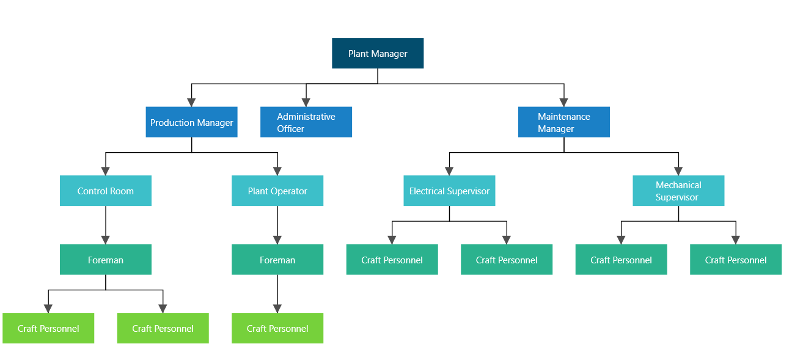

# Hierarchical Tree Layout in WPF Diagram

The hierarchical tree layout arranges nodes in a tree-like structure and supports multiple parents per node. You do not need to specify a layout root; the algorithm infers it from the data. To create a tree with a single explicit root, set the [`Root`](https://help.syncfusion.com/cr/wpf/Syncfusion.UI.Xaml.Diagram.DataSourceSettings.html#Syncfusion_UI_Xaml_Diagram_DataSourceSettings_Root) property of `DataSourceSettings`.

To arrange the nodes in a hierarchical structure, set [`Type`](https://help.syncfusion.com/cr/wpf/Syncfusion.UI.Xaml.Diagram.Layout.DirectedTreeLayout.html#Syncfusion_UI_Xaml_Diagram_Layout_DirectedTreeLayout_Type) to `LayoutType.Hierarchical` on [`DirectedTreeLayout`](https://help.syncfusion.com/cr/wpf/Syncfusion.UI.Xaml.Diagram.Layout.DirectedTreeLayout.html).

The `DirectedTreeLayout` properties used in this article are:

| Property | Description |
| --- | --- |
| `Type` | The layout algorithm. Use `LayoutType.Hierarchical` for a hierarchical tree. |
| `Orientation` | The direction the tree grows. Use `TreeOrientation.TopToBottom`, `LeftToRight`, `BottomToTop`, or `RightToLeft`. |
| `HorizontalSpacing` | The horizontal space between adjacent nodes. The default value is `20`. |
| `VerticalSpacing` | The vertical space between adjacent nodes. The default value is `50`. |
| [`SpaceBetweenSubTrees`](https://help.syncfusion.com/cr/wpf/Syncfusion.UI.Xaml.Diagram.Layout.DirectedTreeLayout.html#Syncfusion_UI_Xaml_Diagram_Layout_DirectedTreeLayout_SpaceBetweenSubTrees) | The space between sub-trees when the root has multiple children that themselves have children. The default value is `20`. |




<!-- Initializes the employee collection-->
<local:Employees x:Key="employees">
    <local:Employee EmpId = "1" ParentId="" Name="Plant Manager" _Color = "#034d6d"/>
    <local:Employee EmpId = "2" ParentId = "1" Name = "Production Manager" _Color = "#1b80c6"/>
    <local:Employee EmpId = "3" ParentId = "1" Name = "Administrative Officer" _Color = "#1b80c6"/>
    <local:Employee EmpId = "4" ParentId = "1" Name = "Maintenance Manager" _Color = "#1b80c6"/>
    <local:Employee EmpId = "5" ParentId = "2" Name = "Control Room" _Color = "#3dbfc9"/>
    <local:Employee EmpId = "6" ParentId = "2" Name = "Plant Operator" _Color = "#3dbfc9"/>
    <local:Employee EmpId = "7" ParentId = "4" Name = "Electrical Supervisor" _Color = "#3dbfc9"/>
    <local:Employee EmpId = "8" ParentId = "4" Name = "Mechanical Supervisor" _Color = "#3dbfc9"/>
    <local:Employee EmpId = "9" ParentId = "5" Name = "Foreman" _Color = "#2bb28e"/>
    <local:Employee EmpId = "10" ParentId = "6" Name = "Foreman" _Color = "#2bb28e"/>
    <local:Employee EmpId = "11" ParentId = "7" Name = "Craft Personnel" _Color = "#2bb28e"/>
    <local:Employee EmpId = "12" ParentId = "7" Name = "Craft Personnel" _Color = "#2bb28e"/>
    <local:Employee EmpId = "13" ParentId = "8" Name = "Craft Personnel" _Color = "#2bb28e"/>
    <local:Employee EmpId = "14" ParentId = "8" Name = "Craft Personnel" _Color = "#2bb28e"/>
    <local:Employee EmpId = "15" ParentId = "9" Name = "Craft Personnel" _Color = "#76d13b"/>
    <local:Employee EmpId = "16" ParentId = "9" Name = "Craft Personnel" _Color = "#76d13b"/>
    <local:Employee EmpId = "17" ParentId = "10" Name = "Craft Personnel" _Color = "#76d13b"/>
</local:Employees>

<!--Initializes the DataSourceSettings -->
<syncfusion:DataSourceSettings x:Key="DataSourceSettings" Id="EmpId"
                               ParentId="ParentId"
                               DataSource="{StaticResource employees}" />
<!--Initialize the Layout. SpaceBetweenSubTrees controls the gap between
    sibling sub-trees when the root has multiple children that each have
    their own children. The default is 20.-->
<syncfusion:DirectedTreeLayout x:Key="treeLayout"
                               HorizontalSpacing="30"
                               VerticalSpacing="50"
                               Orientation="TopToBottom"
                               Type="Hierarchical"
                               SpaceBetweenSubTrees="20" />
<!--Initialize the Layout Manager-->
<syncfusion:LayoutManager x:Key="layoutManager"
                          Layout="{StaticResource treeLayout}"/>

<!--Bind the diagram to the DataSourceSettings and LayoutManager defined above-->
<syncfusion:SfDiagram x:Name="diagram"
                      DataSourceSettings="{StaticResource DataSourceSettings}"
                      LayoutManager="{StaticResource layoutManager}">
    <syncfusion:SfDiagram.Nodes>
        <syncfusion:NodeCollection/>
    </syncfusion:SfDiagram.Nodes>
    <syncfusion:SfDiagram.Connectors>
        <syncfusion:ConnectorCollection/>
    </syncfusion:SfDiagram.Connectors>
</syncfusion:SfDiagram>


//Add the required using directives at the top of the file:
//using Syncfusion.UI.Xaml.Diagram;
//using Syncfusion.UI.Xaml.Diagram.Layout;
//using System.Collections.ObjectModel;

//Initialize the Diagram instance
SfDiagram diagram = new SfDiagram();

//Initialize the employee collection
Employees employee = new Employees();
employee.Add(new Employee() { EmpId = "1", ParentId = "", Name = "Plant Manager", _Color = "#034d6d" });
employee.Add(new Employee() { EmpId = "2", ParentId = "1", Name = "Production Manager", _Color = "#1b80c6" });
employee.Add(new Employee() { EmpId = "3", ParentId = "1", Name = "Administrative Officer", _Color = "#1b80c6" });
employee.Add(new Employee() { EmpId = "4", ParentId = "1", Name = "Maintenance Manager", _Color = "#1b80c6" });
employee.Add(new Employee() { EmpId = "5", ParentId = "2", Name = "Control Room", _Color = "#3dbfc9" });
employee.Add(new Employee() { EmpId = "6", ParentId = "2", Name = "Plant Operator", _Color = "#3dbfc9" });
employee.Add(new Employee() { EmpId = "7", ParentId = "4", Name = "Electrical Supervisor", _Color = "#3dbfc9" });
employee.Add(new Employee() { EmpId = "8", ParentId = "4", Name = "Mechanical Supervisor", _Color = "#3dbfc9" });
employee.Add(new Employee() { EmpId = "9", ParentId = "5", Name = "Foreman", _Color = "#2bb28e" });
employee.Add(new Employee() { EmpId = "10", ParentId = "6", Name = "Foreman", _Color = "#2bb28e" });
employee.Add(new Employee() { EmpId = "11", ParentId = "7", Name = "Craft Personnel", _Color = "#2bb28e" });
employee.Add(new Employee() { EmpId = "12", ParentId = "7", Name = "Craft Personnel", _Color = "#2bb28e" });
employee.Add(new Employee() { EmpId = "13", ParentId = "8", Name = "Craft Personnel", _Color = "#2bb28e" });
employee.Add(new Employee() { EmpId = "14", ParentId = "8", Name = "Craft Personnel", _Color = "#2bb28e" });
employee.Add(new Employee() { EmpId = "15", ParentId = "9", Name = "Craft Personnel", _Color = "#76d13b" });
employee.Add(new Employee() { EmpId = "16", ParentId = "9", Name = "Craft Personnel", _Color = "#76d13b" });
employee.Add(new Employee() { EmpId = "17", ParentId = "10", Name = "Craft Personnel", _Color = "#76d13b" });

//Initialize the DataSourceSettings. EmpId is the unique key; Name does not
//need to be unique (the data contains several "Craft Personnel" and
//"Foreman" entries, and they are keyed by EmpId only).
diagram.DataSourceSettings = new DataSourceSettings()
{
    Id = "EmpId",
    ParentId = "ParentId",
    DataSource = employee,
};

//Initialize the LayoutManager with a DirectedTreeLayout. The default
//RefreshFrequency is FirstLoad; ArrangeParsing is used here so the layout
//re-runs on add/remove/move/reset/resize operations.
diagram.LayoutManager = new LayoutManager()
{
    Layout = new DirectedTreeLayout()
    {
        Type = LayoutType.Hierarchical,
        // TreeOrientation is in the Syncfusion.UI.Xaml.Diagram.Layout namespace
        Orientation = TreeOrientation.TopToBottom,
        HorizontalSpacing = 30,
        VerticalSpacing = 50,
    },

    RefreshFrequency = RefreshFrequency.ArrangeParsing,
};




[View sample in GitHub](https://github.com/SyncfusionExamples/WPF-Diagram-Examples/tree/master/Samples/Automatic%20Layout/Hierarchical%20Tree)

## See Also

[How to generate Layout with DataSource as NodeViewModel instead of business object class?](https://support.syncfusion.com/kb/article/10187/how-to-generate-layout-with-datasource-as-nodeviewmodel-instead-of-business-object-class-in)

[How to change the level of nodes in DirectedTreeLayout?](https://support.syncfusion.com/kb/article/6309/how-to-change-the-level-of-nodes-in-directedtreelayout-of-wpf-diagram-sfdiagram)