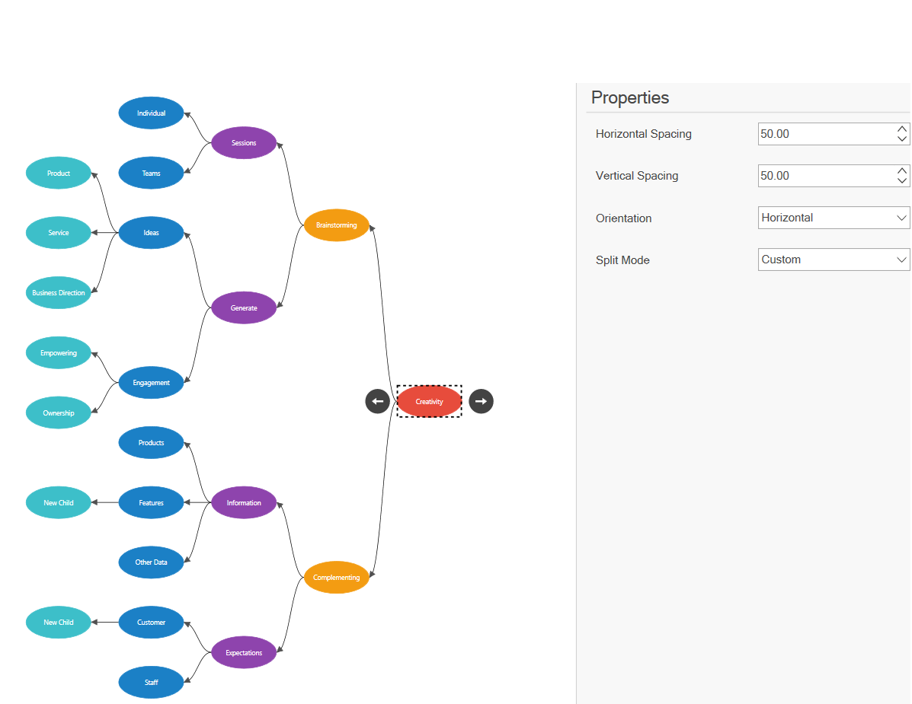

# MindMapTree Layout in WPF Diagram

A mind map is a diagram that displays the nodes as a spider diagram that organizes information around a central concept. You can use the [LayoutManager.Layout](https://help.syncfusion.com/cr/wpf/Syncfusion.UI.Xaml.Diagram.Layout.MindMapTreeLayout.html) property to specify the MindMapTreeLayout algorithm.





<model:MindmapDataItems x:Key="datasource">
            <model:MindmapDataItem Label="Creativity"
                                   ParentId=""></model:MindmapDataItem>
            <model:MindmapDataItem Label="Brainstorming"
                                   ParentId="Creativity"></model:MindmapDataItem>
            <model:MindmapDataItem Label="Complementing"
                                   ParentId="Creativity"></model:MindmapDataItem>
            <model:MindmapDataItem Label="Sessions"
                                   ParentId="Brainstorming"></model:MindmapDataItem>
            <model:MindmapDataItem Label="Generate"
                                   ParentId="Brainstorming"></model:MindmapDataItem>
            <model:MindmapDataItem Label="Local"
                                   ParentId="Sessions"></model:MindmapDataItem>
            <model:MindmapDataItem Label="Remote"
                                   ParentId="Sessions"></model:MindmapDataItem>
            <model:MindmapDataItem Label="Individual"
                                   ParentId="Sessions"></model:MindmapDataItem>
            <model:MindmapDataItem Label="Teams"
                                   ParentId="Sessions"></model:MindmapDataItem>
            <model:MindmapDataItem Label="Ideas"
                                   ParentId="Generate"></model:MindmapDataItem>
            <model:MindmapDataItem Label="Engagement"
                                   ParentId="Generate"></model:MindmapDataItem>
            <model:MindmapDataItem Label="Product"
                                   ParentId="Ideas"></model:MindmapDataItem>
            <model:MindmapDataItem Label="Service"
                                   ParentId="Ideas"></model:MindmapDataItem>
            <model:MindmapDataItem Label="Business Direction"
                                   ParentId="Ideas"></model:MindmapDataItem>
            <model:MindmapDataItem Label="Empowering"
                                   ParentId="Engagement"></model:MindmapDataItem>
            <model:MindmapDataItem Label="Ownership"
                                   ParentId="Engagement"></model:MindmapDataItem>
            <model:MindmapDataItem Label="Information"
                                   ParentId="Complementing"></model:MindmapDataItem>
            <model:MindmapDataItem Label="Expectations"
                                   ParentId="Complementing"></model:MindmapDataItem>
            <model:MindmapDataItem Label="Competitors"
                                   ParentId="Information"></model:MindmapDataItem>
            <model:MindmapDataItem Label="Products"
                                   ParentId="Information"></model:MindmapDataItem>
            <model:MindmapDataItem Label="Features"
                                   ParentId="Information"></model:MindmapDataItem>
            <model:MindmapDataItem Label="Other Data"
                                   ParentId="Information"></model:MindmapDataItem>
            <model:MindmapDataItem Label="Organization"
                                   ParentId="Expectations"></model:MindmapDataItem>
            <model:MindmapDataItem Label="Customer"
                                   ParentId="Expectations"></model:MindmapDataItem>
            <model:MindmapDataItem Label="Staff"
                                   ParentId="Expectations"></model:MindmapDataItem>
            <model:MindmapDataItem Label="Stakeholders"
                                   ParentId="Expectations"></model:MindmapDataItem>
</model:MindmapDataItems>

        <!--Initializes the DataSourceSettings -->
<syncfusion:DataSourceSettings x:Key="DataSourceSettings" Id="Label" 
                               ParentId="ParentId"
                               DataSource="{StaticResource datasource}" />
<syncfusion:MindMapTreeLayout x:Key="Mindmaplayout"
                                      HorizontalSpacing="50"
                                      VerticalSpacing="30"
                                      Orientation="Horizontal"
                                      SplitMode="Custom" />   
<!--Initialize the Layout Manager-->
<syncfusion:LayoutManager x:Key="layoutManager" 
                          Layout="{StaticResource Mindmaplayout}"/>                                           





  public MindMapDataItems GetMindMapDataItemCollection()
        {
            var dataItems = new MindMapDataItems();
            var Creativity = GetMindMapDataItem("Creativity", null);
            dataItems.Add(Creativity);
            var Brainstorming = GetMindMapDataItem("Brainstorming", Creativity);
            Brainstorming.Direction = RootChildDirection.Left;
            dataItems.Add(Brainstorming);
            var Complementing = GetMindMapDataItem("Complementing", Creativity);
            Complementing.Direction = RootChildDirection.Right;
            dataItems.Add(Complementing);
            var Sessions = GetMindMapDataItem("Sessions", Brainstorming);
            dataItems.Add(Sessions);
            var Generate = GetMindMapDataItem("Generate", Brainstorming);
            dataItems.Add(Generate);
            var Local = GetMindMapDataItem("Local", Sessions);
            dataItems.Add(Local);
            var Remote = GetMindMapDataItem("Remote", Sessions);
            dataItems.Add(Remote);
            var Individual = GetMindMapDataItem("Individual", Sessions);
            dataItems.Add(Individual);
            var Teams = GetMindMapDataItem("Teams", Sessions);
            dataItems.Add(Teams);
            var Ideas = GetMindMapDataItem("Ideas", Generate);
            dataItems.Add(Ideas);
            var Engagement = GetMindMapDataItem("Engagement", Generate);
            dataItems.Add(Engagement);
            var Product = GetMindMapDataItem("Product", Ideas);
            dataItems.Add(Product);
            var Service = GetMindMapDataItem("Service", Ideas);
            dataItems.Add(Service);
            var BusinessDirection = GetMindMapDataItem("Business Direction", Ideas);
            dataItems.Add(BusinessDirection);
            var Empowering = GetMindMapDataItem("Empowering", Engagement);
            dataItems.Add(Empowering);
            var Ownership = GetMindMapDataItem("Ownership", Engagement);
            dataItems.Add(Ownership);
            var Information = GetMindMapDataItem("Information", Complementing);
            dataItems.Add(Information);
            var Expectations = GetMindMapDataItem("Expectations", Complementing);
            dataItems.Add(Expectations);
            var Competitors = GetMindMapDataItem("Competitors", Information);
            dataItems.Add(Competitors);
            var Products = GetMindMapDataItem("Products", Information);
            dataItems.Add(Products);
            var Features = GetMindMapDataItem("Features", Information);
            dataItems.Add(Features);
            var OtherData = GetMindMapDataItem("Other Data", Information);
            dataItems.Add(OtherData);
            var Organization = GetMindMapDataItem("Organization", Expectations);
            dataItems.Add(Organization);
            var Customer = GetMindMapDataItem("Customer", Expectations);
            dataItems.Add(Customer);
            var Staff = GetMindMapDataItem("Staff", Expectations);
            dataItems.Add(Staff);
            var Stakeholders = GetMindMapDataItem("Stakeholders", Expectations);
            dataItems.Add(Stakeholders);
            return dataItems;
        }
        public MindMapDataItem GetMindMapDataItem(string label, MindMapDataItem parent)
        {
            MindMapDataItem item = new MindMapDataItem()
            {
                Label = label,
                Parent = parent
            };
            return item;
        }

           diagram.DataSourceSettings = new DataSourceSettings()
            {
                DataSource = this.GetMindMapDataItemCollection(),
                ParentId = "ParentId",
                Id = "Id"
            };
            diagram.LayoutManager = new LayoutManager()
            {
                Layout = new SfMindMapTreeLayout()
                {
                    HorizontalSpacing = 50,
                    VerticalSpacing = 30,
                    Orientation = Orientation.Horizontal,
                    SplitMode = MindMapTreeMode.Custom
                },
                RefreshFrequency = RefreshFrequency.ArrangeParsing
            };




## Tree orientation in layout

An [Orientation](https://help.syncfusion.com/cr/wpf/Syncfusion.UI.Xaml.Diagram.Layout.MindMapTreeLayout.html#Syncfusion_UI_Xaml_Diagram_Layout_MindMapTreeLayout_Orientation) of a `MindMapTreeLayout` is used to arrange the tree layout based on the direction. The default value for the orientation is Horizontal. The different orientation types are defined in the following table:

| Orientation Type | Description |
|---|---|---|
| Horizontal | Aligns the tree layout from left to right|
| Vertical | Aligns the tree layout from top to bottom|



<syncfusion:MindMapTreeLayout Orientation="Horizontal" />        


diagram.LayoutManager = new LayoutManager()
{
    Layout = new MindMapTreeLayout()
    {
        Orientation = Orientation.Horizontal,
    },
};



## Arrange Layout in a balanced way

The [SplitMode](https://help.syncfusion.com/cr/wpf/Syncfusion.UI.Xaml.Diagram.Layout.MindMapTreeMode.html) property of `MindMapTreeLayout` is used to specify the criteria for arranging the mind-map tree branches.The different SplitMode types are defined as follows:

* Area
* TreeNodesCount
* Level
* RootChildrenCount
* Custom

### Area
Balances the mind-map based on the height and width of the immediate child branches of the root node.



<syncfusion:MindMapTreeLayout SplitMode="Area" />        


diagram.LayoutManager = new LayoutManager()
{
    Layout = new MindMapTreeLayout()
    {
        SplitMode = MindMapTreeMode.Area,
    },
};



### Level
Balances the mind-map by comparing the sub-tree levels of the immediate child of the root node.



<syncfusion:MindMapTreeLayout SplitMode="Level" />        


diagram.LayoutManager = new LayoutManager()
{
    Layout = new MindMapTreeLayout()
    {
        SplitMode = MindMapTreeMode.Level,
    },
};



### RootChildrenLayout
Balances the mind-map based on the immediate children count of the root node. The right side of the root node will be prioritized while adding the children to the root node.



<syncfusion:MindMapTreeLayout SplitMode="RootChildrenLayout" />        


diagram.LayoutManager = new LayoutManager()
{
    Layout = new MindMapTreeLayout()
    {
        SplitMode = MindMapTreeMode.RootChildrenLayout,
    },
};



### TreeNodeLayout
Balances the mind-map based on the overall children (with sub child) count of the root node.



<syncfusion:MindMapTreeLayout SplitMode="TreeNodeLayout" />        


diagram.LayoutManager = new LayoutManager()
{
    Layout = new MindMapTreeLayout()
    {
        SplitMode = MindMapTreeMode.TreeNodeLayout,
    },
};



### Custom
Specifies the mind-map branches should be arranged in a defined direction.

#### How to create custom MindMap

We can arrange the branches in a defined direction to create a custom layout by using the GetRootChildDirection method of MindMapTreeLayout and by specifying the SplitMode as Custom.



<syncfusion:MindMapTreeLayout SplitMode="Custom" />        


diagram.LayoutManager = new LayoutManager()
{
    Layout = new MindMapTreeLayout()
    {
        SplitMode = MindMapTreeMode.Custom,
    },
};

 public class SfMindMapTreeLayout : MindMapTreeLayout
    {
        protected override RootChildDirection GetRootChildDirection(INode node)
        {
            if (node.Content is MindmapDataItem)
            {
                return (node.Content as MindmapDataItem).Direction=RootChildDirection.Left;;
            }

            return base.GetRootChildDirection(node);
        }
    }



[View Sample in GitHub](https://github.com/SyncfusionExamples/WPF-Diagram-Examples/tree/master/Samples/Automatic%20Layout/Mindmap%20Layout)

## Spacing and Updating Layout

N> Spacing and UpdatingLayout refer to the [Customize spacing between nodes in layout](https://help.syncfusion.com/wpf/diagram/automatic-layouts#customize-spacing-between-nodes-in-layout) and [Updating layout](https://help.syncfusion.com/wpf/diagram/automatic-layouts#updating-layout).

