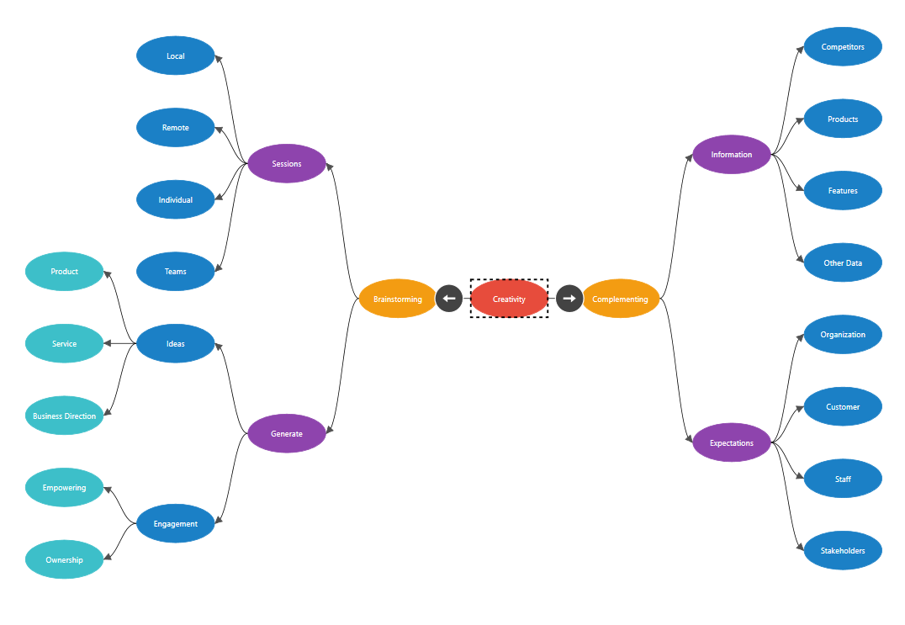
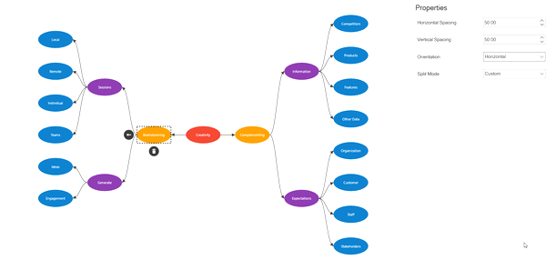
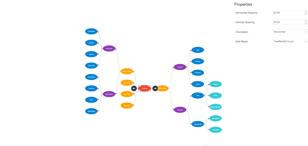
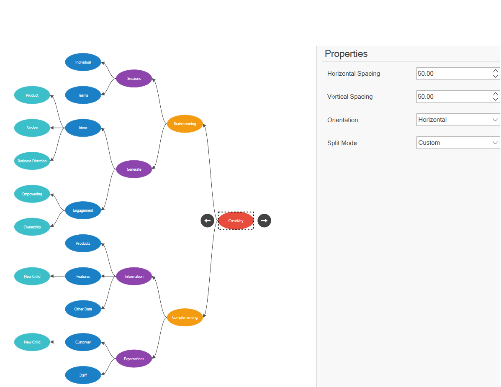

# MindMap Tree Layout in WPF Diagram

A mind map is a diagram that organizes information around a central concept, with branches radiating outward like a spider diagram. Use the `LayoutManager.Layout` property to specify the [`MindMapTreeLayout`](https://help.syncfusion.com/cr/wpf/Syncfusion.UI.Xaml.Diagram.Layout.MindMapTreeLayout.html) algorithm.

The `MindMapTreeLayout` class is defined in the `Syncfusion.UI.Xaml.Diagram.Layout` namespace. The `RootChildDirection` enum (used to control the side each branch is positioned on) is in the same namespace, and its values are:

| Value | Description |
| --- | --- |
| `Left` | Positions the branch on the left of the parent. Supported only for `Horizontal` orientation. |
| `Right` | Positions the branch on the right of the parent. Supported only for `Horizontal` orientation. |
| `Top` | Positions the branch above the parent. Supported only for `Vertical` orientation. |
| `Bottom` | Positions the branch below the parent. Supported only for `Vertical` orientation. |

The `MindMapTreeMode` enum (used by the `SplitMode` property) has the following values:

| Value | Description |
| --- | --- |
| `RootChildrenCount` | Balances branches by the immediate children count of the root node. |
| `TreeNodesCount` | Balances branches by the total children count (including sub-children) of the root node. |
| `Level` | Balances branches by comparing the sub-tree levels of the immediate children of the root node. |
| `Area` | Balances branches by the height and width of the immediate child branches of the root node. |
| `Custom` | Specifies that the branches should be arranged in a defined direction. The direction is supplied by overriding `GetRootChildDirection` in a `MindMapTreeLayout` subclass. |

The default value of `SplitMode` is `RootChildrenCount`.





<syncfusion:SfDiagram x:Name="diagram" x:Class="...">
    <syncfusion:SfDiagram.DataSourceSettings>
        <syncfusion:DataSourceSettings Id="Id"
                                       ParentId="ParentId"
                                       DataSource="{StaticResource DataItems}"/>
    </syncfusion:SfDiagram.DataSourceSettings>
    <syncfusion:SfDiagram.LayoutManager>
        <syncfusion:LayoutManager>
            <syncfusion:LayoutManager.Layout>
                <syncfusion:MindMapTreeLayout HorizontalSpacing="50"
                                              VerticalSpacing="30"
                                              Orientation="Horizontal"
                                              SplitMode="Custom"/>
            </syncfusion:LayoutManager.Layout>
        </syncfusion:LayoutManager>
    </syncfusion:SfDiagram.LayoutManager>
</syncfusion:SfDiagram>





  public MindMapDataItems GetMindMapDataItemCollection()
        {
            var dataItems = new MindMapDataItems();
            var Creativity = GetMindMapDataItem("Creativity", null);
            dataItems.Add(Creativity);
            var Brainstorming = GetMindMapDataItem("Brainstorming", Creativity);
            Brainstorming.Direction = RootChildDirection.Left;
            dataItems.Add(Brainstorming);
            var Complementing = GetMindMapDataItem("Complementing", Creativity);
            Complementing.Direction = RootChildDirection.Right;
            dataItems.Add(Complementing);
            var Sessions = GetMindMapDataItem("Sessions", Brainstorming);
            dataItems.Add(Sessions);
            var Generate = GetMindMapDataItem("Generate", Brainstorming);
            dataItems.Add(Generate);
            var Local = GetMindMapDataItem("Local", Sessions);
            dataItems.Add(Local);
            var Remote = GetMindMapDataItem("Remote", Sessions);
            dataItems.Add(Remote);
            var Individual = GetMindMapDataItem("Individual", Sessions);
            dataItems.Add(Individual);
            var Teams = GetMindMapDataItem("Teams", Sessions);
            dataItems.Add(Teams);
            var Ideas = GetMindMapDataItem("Ideas", Generate);
            dataItems.Add(Ideas);
            var Engagement = GetMindMapDataItem("Engagement", Generate);
            dataItems.Add(Engagement);
            var Product = GetMindMapDataItem("Product", Ideas);
            dataItems.Add(Product);
            var Service = GetMindMapDataItem("Service", Ideas);
            dataItems.Add(Service);
            var BusinessDirection = GetMindMapDataItem("Business Direction", Ideas);
            dataItems.Add(BusinessDirection);
            var Empowering = GetMindMapDataItem("Empowering", Engagement);
            dataItems.Add(Empowering);
            var Ownership = GetMindMapDataItem("Ownership", Engagement);
            dataItems.Add(Ownership);
            var Information = GetMindMapDataItem("Information", Complementing);
            dataItems.Add(Information);
            var Expectations = GetMindMapDataItem("Expectations", Complementing);
            dataItems.Add(Expectations);
            var Competitors = GetMindMapDataItem("Competitors", Information);
            dataItems.Add(Competitors);
            var Products = GetMindMapDataItem("Products", Information);
            dataItems.Add(Products);
            var Features = GetMindMapDataItem("Features", Information);
            dataItems.Add(Features);
            var OtherData = GetMindMapDataItem("Other Data", Information);
            dataItems.Add(OtherData);
            var Organization = GetMindMapDataItem("Organization", Expectations);
            dataItems.Add(Organization);
            var Customer = GetMindMapDataItem("Customer", Expectations);
            dataItems.Add(Customer);
            var Staff = GetMindMapDataItem("Staff", Expectations);
            dataItems.Add(Staff);
            var Stakeholders = GetMindMapDataItem("Stakeholders", Expectations);
            dataItems.Add(Stakeholders);
            return dataItems;
        }
        public MindMapDataItem GetMindMapDataItem(string label, MindMapDataItem parent)
        {
            MindMapDataItem item = new MindMapDataItem()
            {
                Label = label,
                Parent = parent
            };
            return item;
        }

           diagram.DataSourceSettings = new DataSourceSettings()
            {
                DataSource = this.GetMindMapDataItemCollection(),
                ParentId = "ParentId",
                Id = "Id"
            };
            diagram.LayoutManager = new LayoutManager()
            {
                Layout = new SfMindMapTreeLayout()
                {
                    HorizontalSpacing = 50,
                    VerticalSpacing = 30,
                    Orientation = Orientation.Horizontal,
                    SplitMode = MindMapTreeMode.Custom
                },
                RefreshFrequency = RefreshFrequency.ArrangeParsing
            };




## Tree orientation in layout

The [`Orientation`](https://help.syncfusion.com/cr/wpf/Syncfusion.UI.Xaml.Diagram.Layout.MindMapTreeLayout.html#Syncfusion_UI_Xaml_Diagram_Layout_MindMapTreeLayout_Orientation) property of `MindMapTreeLayout` arranges branches by direction. The default value is `Horizontal`. The `Orientation` enum (`Syncfusion.UI.Xaml.Diagram.Layout.Orientation`) supports the following values:

| Orientation Type | Description |
| --- | --- |
| `Horizontal` (default) | Aligns the tree layout from left to right. The root node is placed at the left edge and branches grow to the right. |
| `Vertical` | Aligns the tree layout from top to bottom. The root node is placed at the top and branches grow downward. |



<syncfusion:MindMapTreeLayout Orientation="Horizontal" />


diagram.LayoutManager = new LayoutManager()
{
    Layout = new MindMapTreeLayout()
    {
        Orientation = Syncfusion.UI.Xaml.Diagram.Layout.Orientation.Horizontal,
    },
};



## Arranging the layout in a balanced way

The [`SplitMode`](https://help.syncfusion.com/cr/wpf/Syncfusion.UI.Xaml.Diagram.Layout.MindMapTreeLayout.html#Syncfusion_UI_Xaml_Diagram_Layout_MindMapTreeLayout_SplitMode) property of `MindMapTreeLayout` specifies the criteria for arranging the mind-map tree branches. The default value is `RootChildrenCount`. The supported `MindMapTreeMode` enum values are:

* `RootChildrenCount` (default) — Balances by the immediate children count of the root node.
* `TreeNodesCount` — Balances by the overall children (with sub-children) count of the root node.
* `Level` — Balances by comparing the sub-tree levels of the immediate children of the root node.
* `Area` — Balances by the height and width of the immediate child branches of the root node.
* `Custom` — Specifies that the mind-map branches should be arranged in a defined direction. See [How to create a custom mind map](#how-to-create-a-custom-mind-map) below.

N> The XAML attribute is `SplitMode`, but the corresponding C# type is `MindMapTreeMode`. In XAML the value is a string; in C# the value is an enum member.

### Area
Balances the mind-map based on the height and width of the immediate child branches of the root node.



<syncfusion:MindMapTreeLayout SplitMode="Area" />


diagram.LayoutManager = new LayoutManager()
{
    Layout = new MindMapTreeLayout()
    {
        SplitMode = MindMapTreeMode.Area,
    },
};



### Level
Balances the mind-map by comparing the sub-tree levels of the immediate children of the root node.



<syncfusion:MindMapTreeLayout SplitMode="Level" />


diagram.LayoutManager = new LayoutManager()
{
    Layout = new MindMapTreeLayout()
    {
        SplitMode = MindMapTreeMode.Level,
    },
};



### RootChildrenCount
Balances the mind-map based on the immediate children count of the root node. The right side of the root node is prioritized when adding children.



<syncfusion:MindMapTreeLayout SplitMode="RootChildrenCount" />


diagram.LayoutManager = new LayoutManager()
{
    Layout = new MindMapTreeLayout()
    {
        SplitMode = MindMapTreeMode.RootChildrenCount,
    },
};



### TreeNodesCount
Balances the mind-map based on the overall children (with sub-children) count of the root node.



<syncfusion:MindMapTreeLayout SplitMode="TreeNodesCount" />


diagram.LayoutManager = new LayoutManager()
{
    Layout = new MindMapTreeLayout()
    {
        SplitMode = MindMapTreeMode.TreeNodesCount,
    },
};



### Custom
Specifies that the mind-map branches should be arranged in a defined direction. The direction is supplied by overriding the [`GetRootChildDirection`](https://help.syncfusion.com/cr/wpf/Syncfusion.UI.Xaml.Diagram.Layout.MindMapTreeLayout.html#Syncfusion_UI_Xaml_Diagram_Layout_MindMapTreeLayout_GetRootChildDirection_Syncfusion_UI_Xaml_Diagram_INode_) method of `MindMapTreeLayout`. The method receives the root `INode` and must return a `RootChildDirection` value that tells the layout which side to place the child branch on.

#### How to create a custom mind map

To create a custom layout, set `SplitMode` to `Custom` and override the `GetRootChildDirection` method of `MindMapTreeLayout` to control branch direction.

N> `SplitMode="Custom"` set in XAML alone is not enough: the override must be assigned in code by passing an instance of the subclass to the `LayoutManager`. The XAML shown below is therefore paired with the C# subclass below it.



<!--The SplitMode attribute is set on the layout instance. The actual
    GetRootChildDirection override is supplied in code-behind, because
    it must return a value derived from the data item.-->
<syncfusion:MindMapTreeLayout x:Key="MindmapLayout"
                              SplitMode="Custom" />



//Assign the custom subclass so the override is wired into the layout.
diagram.LayoutManager = new LayoutManager()
{
    Layout = new SfMindMapTreeLayout()
    {
        SplitMode = MindMapTreeMode.Custom,
    },
};

public class SfMindMapTreeLayout : MindMapTreeLayout
{
    protected override RootChildDirection GetRootChildDirection(INode node)
    {
        // The example below returns the Direction property stored on the
        // data item. If the node's content is not a MindMapDataItem,
        // fall back to the base implementation.
        if (node.Content is MindMapDataItem item)
        {
            return item.Direction;
        }

        return base.GetRootChildDirection(node);
    }
}



[View Sample in GitHub](https://github.com/SyncfusionExamples/WPF-Diagram-Examples/tree/master/Samples/Automatic%20Layout/Mindmap%20Layout)

## Spacing and updating layout

The `HorizontalSpacing` and `VerticalSpacing` properties of `MindMapTreeLayout` are used the same way as in the other layout types; see [Customize spacing between nodes in layout](https://help.syncfusion.com/wpf/diagram/automatic-layouts#customize-spacing-between-nodes-in-layout) and [Updating layout](https://help.syncfusion.com/wpf/diagram/automatic-layouts#updating-layout) for the shared reference.

