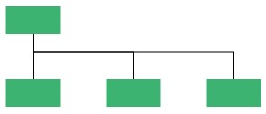
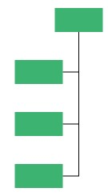

# Organization layout in WPF Diagram (SfDiagram)

An organizational chart is a diagram that displays the structure of an organization and relationships. To create an organizational chart, type should be set to LayoutType.Organization in `DirectedTreeLayout`.

To arrange the nodes in organization structure , specify the [LayoutType](https://help.syncfusion.com/cr/wpf/Syncfusion.UI.Xaml.Diagram.Layout.DirectedTreeLayout.html#Syncfusion_UI_Xaml_Diagram_Layout_DirectedTreeLayout_Type) as Organization.




<!--Initialize employee collection-->
<local:Employees x:Key="employee">
    <local:Employee Name = "Maria Anders" Designation = "Managing Director" 
                    ImageUrl = "./Assets/eric.png" RatingColor = "#71AF17" />
    <local:Employee Name = "Gareth Bale" Designation = "Secretary" 
                    ImageUrl = "./Assets/image54.png" RatingColor = "#13ab11" 
                    ReportingPerson = "Maria Anders" />
    <local:Employee Name = "Pedro Afonso" Designation = "Project Manager" 
                    ImageUrl = "./Assets/Paul.png" RatingColor = "#1859B7" 
                    ReportingPerson = "Maria Anders" />
    <local:Employee Name = "Elizabeth Brown" Designation = "Project Lead" 
                    ImageUrl = "./Assets/Maria.png" RatingColor = "#2E95D8" 
                    ReportingPerson = "Pedro Afonso" />
    <local:Employee Name = "Aria Cruz" Designation = "Project Lead" 
                    ImageUrl = "./Assets/Jenny.png" RatingColor = "#2E95D8" 
                    ReportingPerson = "Pedro Afonso" />
    <local:Employee Name = "Martín Sommer" Designation = "Senior S/w Engg" 
                    ImageUrl = "./Assets/image2.png" RatingColor = "#2E95D8" 
                    ReportingPerson = "Pedro Afonso" />
    <local:Employee Name = "Jaime Yorres" Designation = "S/w Engg" 
                    ImageUrl = "./Assets/image2.png" RatingColor = "#2E95D8" 
                    ReportingPerson = "Pedro Afonso" />
    <local:Employee Name = "John Steel" Designation = "Project Trainee" 
                    ImageUrl = "/Assets/Maria.png" RatingColor = "#2E95D8" 
                    ReportingPerson = "Pedro Afonso" />
    <local:Employee Name = "Lino Rodriguez" Designation = "Project Manager" 
                    ImageUrl = "./Assets/Robin.PNG" RatingColor = "#1859B7" 
                    ReportingPerson = "Maria Anders" />
    <local:Employee Name = "Hanna Moos" Designation = "Project Lead" 
                    ImageUrl = "./Assets/image55.png" RatingColor = "#2E95D8" 
                    ReportingPerson = "Lino Rodriguez" />
    <local:Employee Name = "Howard Snyder" Designation = "Project Lead" 
                    ImageUrl = "./Assets/image12.png" RatingColor = "#2E95D8" 
                    ReportingPerson = "Lino Rodriguez" />
    <local:Employee Name = "Philip Cramer" Designation = "Project Manager" 
                    ImageUrl = "./Assets/image2.PNG" RatingColor = "#1859B7" 
                    ReportingPerson = "Maria Anders" />
    <local:Employee Name = "Daniel Tonini" Designation = "Project Lead" 
                    ImageUrl = "./Assets/image57.png" RatingColor = "#2E95D8" 
                    ReportingPerson = "Philip Cramer" />
    <local:Employee Name = "Annette Roulet" Designation = "Senior S/w Engg" 
                    ImageUrl = "./Assets/image55.png" RatingColor = "#2E95D8" 
                    ReportingPerson = "Philip Cramer" />
    <local:Employee Name = "Yoshi Tannamuri" Designation = "S/w Engg" 
                    ImageUrl = "./Assets/image57.png" RatingColor = "#2E95D8" 
                    ReportingPerson = "Philip Cramer" />
</local:Employees>

<!--Initialize Datasource settings-->
<syncfusion:DataSourceSettings x:Key="DataSourceSettings" 
                               Id="Name" 
                               ParentId="ReportingPerson"
                               DataSource="{StaticResource employee}"/> 

<!--Initialize the Layout-->
<syncfusion:DirectedTreeLayout x:Key="treeLayout" 
                               Type="Organization" 
                               Orientation="TopToBottom" 
                               HorizontalSpacing="50" 
                               VerticalSpacing="40"  />

<!--Initialize the Layout Manager-->
<syncfusion:LayoutManager x:Key="layoutManager" 
                          Layout="{StaticResource treeLayout}" />




//Initialize employee collection
Employees employee = new Employees();
employee.Add(new Employee() 
{
    Name = "Maria Anders", 
    Designation = "Managing Director", 
    ImageUrl = "./Assets/eric.png", 
    RatingColor = "#71AF17" 
});
employee.Add(new Employee() 
{ 
    Name = "Gareth Bale", 
    Designation = "Secretary", 
    ImageUrl = "./Assets/image54.png", 
    RatingColor = "#13ab11", 
    ReportingPerson = "Maria Anders" 
});
employee.Add(new Employee() 
{ 
    Name = "Pedro Afonso", 
    Designation = "Project Manager", 
    ImageUrl = "./Assets/Paul.png", 
    RatingColor = "#1859B7", 
    ReportingPerson = "Maria Anders" 
});
employee.Add(new Employee() 
{ 
    Name = "Elizabeth Brown", 
    Designation = "Project Lead", 
    ImageUrl = "./Assets/Maria.png", 
    RatingColor = "#2E95D8", 
    ReportingPerson = "Pedro Afonso" 
});
employee.Add(new Employee() 
{ 
    Name = "Aria Cruz", 
    Designation = "Project Lead", 
    ImageUrl = "./Assets/Jenny.png", 
    RatingColor = "#2E95D8", 
    ReportingPerson = "Pedro Afonso" 
});
employee.Add(new Employee() 
{
    Name = "Martín Sommer", 
    Designation = "Senior S/w Engg", 
    ImageUrl = "./Assets/image2.png", 
    RatingColor = "#2E95D8", 
    ReportingPerson = "Pedro Afonso" 
});
employee.Add(new Employee() 
{ 
    Name = "Jaime Yorres", 
    Designation = "S/w Engg", 
    ImageUrl = "./Assets/image2.png", 
    RatingColor = "#2E95D8", 
    ReportingPerson = "Pedro Afonso" 
});
employee.Add(new Employee() 
{
    Name = "John Steel", 
    Designation = "Project Trainee", 
    ImageUrl = "/Assets/Maria.png", 
    RatingColor = "#2E95D8", 
    ReportingPerson = "Pedro Afonso" 
});
employee.Add(new Employee() 
{ 
    Name = "Lino Rodriguez", 
    Designation = "Project Manager", 
    ImageUrl = "./Assets/Robin.PNG", 
    RatingColor = "#1859B7", 
    ReportingPerson = "Maria Anders" 
});
employee.Add(new Employee() 
{
    Name = "Hanna Moos", 
    Designation = "Project Lead", 
    ImageUrl = "./Assets/image55.png", 
    RatingColor = "#2E95D8", 
    ReportingPerson = "Lino Rodriguez" 
});
employee.Add(new Employee() 
{
    Name = "Howard Snyder", 
    Designation = "Project Lead", 
    ImageUrl = "./Assets/image12.png", 
    RatingColor = "#2E95D8", 
    ReportingPerson = "Lino Rodriguez" 
});
employee.Add(new Employee() 
{ 
    Name = "Philip Cramer", 
    Designation = "Project Manager", 
    ImageUrl = "./Assets/image2.PNG", 
    RatingColor = "#1859B7", 
    ReportingPerson = "Maria Anders" 
});
employee.Add(new Employee() 
{ 
    Name = "Daniel Tonini", 
    Designation = "Project Lead", 
    ImageUrl = "./Assets/image57.png", 
    RatingColor = "#2E95D8", 
    ReportingPerson = "Philip Cramer" 
});
employee.Add(new Employee() 
{ 
    Name = "Annette Roulet", 
    Designation = "Senior S/w Engg", 
    ImageUrl = "./Assets/image55.png", 
    RatingColor = "#2E95D8", 
    ReportingPerson = "Philip Cramer" 
});
employee.Add(new Employee() 
{ 
    Name = "Yoshi Tannamuri", 
    Designation = "S/w Engg", 
    ImageUrl = "./Assets/image57.png", 
    RatingColor = "#2E95D8", 
    ReportingPerson = "Philip Cramer" 
});

//Initialize DataSourceSettings for SfDiagram
diagram.DataSourceSettings = new DataSourceSettings()
{
    ParentId = "ReportingPerson",
    Id = "Name",
    DataSource = employee,
};

//Initialize LayoutSettings for SfDiagram 
diagram.LayoutManager = new LayoutManager()
{
    Layout = new DirectedTreeLayout()
    {
        Type = LayoutType.Organization,
        HorizontalSpacing = 50,
        VerticalSpacing = 40
    },
};




## How to change the chart type and orientation in organization layout 

You can change the chart type and orientation of organization layout by using the GetLayoutInfo event of the SfDiagram. This event will fire for each time when an organization layout gets updated. Default chart type is Alternate and default orientation is Vertical.

For GetLayoutInfo, refer to, [GetLayoutInfo](https://help.syncfusion.com/cr/wpf/Syncfusion.UI.Xaml.Diagram.IGraphInfo.html).

**Event Arguments:**

| Event args | Property | Description |
|---|---|---|
| LayoutInfoArgs | Item | Added item when layout is getting updated. |
| | Type | Gets or sets the organizational chart type. |
| | Orientation | Gets or sets the organizational chart orientation. |

The following table explains the different chart orientations and chart types: 

| Orientation | Type | Description | Example |
|---|---|---|---|
| Horizontal | Left | Arranges the child nodes Horizontally at the Left the of Parent. |  |
| | Right | Arranges the child nodes Horizontally at the Right of the Parent. |  |
| | Center | Arranges the child nodes horizontally at the Center of the parent. |  |
| Vertical | Left | Vertically arranges the children at the Left of the Parent. |  |
| | Right | Vertically arranges the children at the Right of the Parent. |  |
| | Alternate | Vertically arranges the children at both Left and Right of the Parent. |  |



//Register GetLayoutInfo event 
(diagram.Info as IGraphInfo).GetLayoutInfo += MainWindow_GetLayoutInfo;

//GetLayoutInfo Method to change the orientation and chart type
private void MainWindow_GetLayoutInfo(object sender, LayoutInfoArgs args)
{
    if (!args.HasSubTree)
    {
        args.Type = ChartType.Alternate;
        args.Orientation = Orientation.Horizontal;
    }
}




## How to add assistant in organization layout

You can add assistant for in an organization layout by using the GetLayoutInfo event of the SfDiagram. This event will fire for each time when the layout gets updated. 

Find the code example to add assistant in an organization layout.




//Register GetLayoutInfo event
(diagram.Info as IGraphInfo).GetLayoutInfo += MainWindow_GetLayoutInfo;

//GetLayoutInfo method to add assistant
private void MainWindow_GetLayoutInfo(object sender, LayoutInfoArgs args)
{
    if (diagram.LayoutManager.Layout is DirectedTreeLayout)
    {
        if ((diagram.LayoutManager.Layout as DirectedTreeLayout).Type == LayoutType.Organization)
        {
            if (args.Item is INode)
            {
                if (((args.Item as INode).Content as Employee).Designation.ToString() == "Managing Director")
                {
                    args.Assistants.Add(args.Children[0]);
                    args.Children.Remove(args.Children[0]);
                }
            }
        }
    }
}




[View sample in GitHub](https://github.com/SyncfusionExamples/WPF-Diagram-Examples/tree/master/Samples/Automatic%20Layout/Organization%20Chart)

## How to create a parent - child relation with dropped nodes from stencil

You can create a layout with dropped nodes from stencil using the `ItemDropped` event. In `ItemDropped` event, you have to create a connection between the source and target item. 

Find the code example to create parent - child relation between source and target nodes in item dropped event.



//Initialize Events
(diagram.Info as IGraphInfo).ItemAdded += MainWindow_ItemAdded;
(diagram.Info as IGraphInfo).ItemDropEvent += MainWindow_ItemDropEvent;

//Method used to add the Allowdrop constraints to the dropped node
//Allowdrop constraints is used to allow the itemdropped event to get the element as target element.
private void MainWindow_ItemAdded(object sender, ItemAddedEventArgs args)
{
    if (args.Item is CustomNode)
    {
        (args.Item as CustomNode).Constraints = (args.Item as CustomNode).Constraints.Add(NodeConstraints.AllowDrop);         
    }
}

//Mehtod to create relation between drag and dropped nodes
private void MainWindow_ItemDropEvent(object sender, ItemDropEventArgs args)
{
    if (!(args.Target is SfDiagram))
    {
        foreach (object targetElement in args.Target as IEnumerable<object>)
        {
            if(targetElement is CustomNode)
            {
                if ((args.Source as CustomNode).ParentId == null)
                {
                    (args.Source as CustomNode).Id = "Node" + (diagram.Nodes as ObservableCollection<CustomNode>).Count.ToString();
                    (args.Source as CustomNode).ID = (args.Source as CustomNode).Id;
                    (args.Source as CustomNode).ParentId = (targetElement as CustomNode).Id;

                    CreateConnector((args.Source as CustomNode).ParentId, (args.Source as CustomNode).Id);
                    diagram.LayoutManager.Layout.UpdateLayout();
                }
            }
        }
    }
    else if(args.Target is SfDiagram)
    {
        if ((args.Source as CustomNode).ParentId == null)
        {
            (args.Source as CustomNode).Id = "Node" + (diagram.Nodes as ObservableCollection<CustomNode>).Count.ToString();
            (args.Source as CustomNode).ID = (args.Source as CustomNode).Id;
            (args.Source as CustomNode).ParentId = "";
            diagram.LayoutManager.Layout.UpdateLayout();
        }
    }
}



[View sample in GitHub](https://github.com/SyncfusionExamples/WPF-Diagram-Examples/tree/master/Samples/Automatic%20Layout/OrgChart%20with%20drag%20and%20dropped%20nodes)
