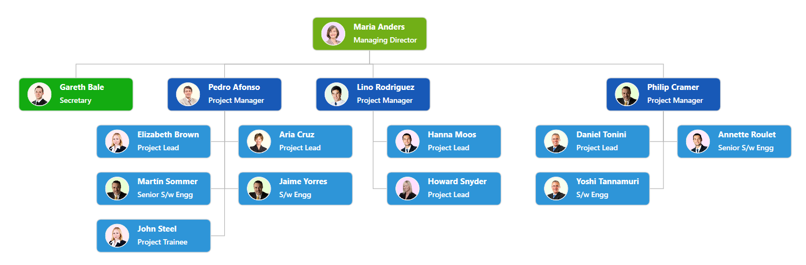
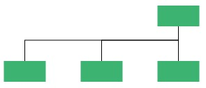
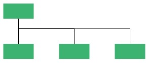
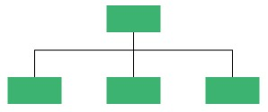
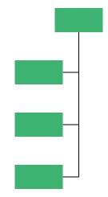
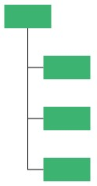
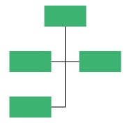
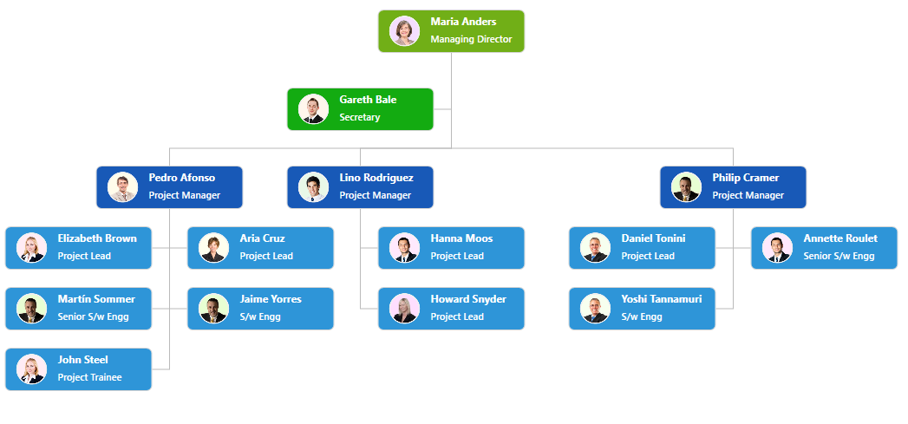
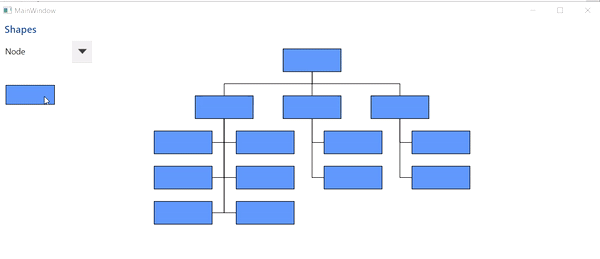

# Organization Layout in WPF SfDiagram

An organizational chart is a diagram that displays the structure of an organization and the relationships between its members. To create an organizational chart, set `Type` to `LayoutType.Organization` in `DirectedTreeLayout`.

To arrange the nodes in the organization structure, specify the [LayoutType](https://help.syncfusion.com/cr/wpf/Syncfusion.UI.Xaml.Diagram.Layout.DirectedTreeLayout.html#Syncfusion_UI_Xaml_Diagram_Layout_DirectedTreeLayout_Type) as `Organization`.




<!--Initialize employee collection-->
<local:Employees x:Key="employee">
    <local:Employee Name = "Maria Anders" Designation = "Managing Director" 
                    ImageUrl = "./Assets/eric.png" RatingColor = "#71AF17" />
    <local:Employee Name = "Gareth Bale" Designation = "Secretary" 
                    ImageUrl = "./Assets/image54.png" RatingColor = "#13ab11" 
                    ReportingPerson = "Maria Anders" />
    <local:Employee Name = "Pedro Afonso" Designation = "Project Manager" 
                    ImageUrl = "./Assets/Paul.png" RatingColor = "#1859B7" 
                    ReportingPerson = "Maria Anders" />
    <local:Employee Name = "Elizabeth Brown" Designation = "Project Lead" 
                    ImageUrl = "./Assets/Maria.png" RatingColor = "#2E95D8" 
                    ReportingPerson = "Pedro Afonso" />
    <local:Employee Name = "Aria Cruz" Designation = "Project Lead" 
                    ImageUrl = "./Assets/Jenny.png" RatingColor = "#2E95D8" 
                    ReportingPerson = "Pedro Afonso" />
    <local:Employee Name = "Martín Sommer" Designation = "Senior S/w Engg" 
                    ImageUrl = "./Assets/image2.png" RatingColor = "#2E95D8" 
                    ReportingPerson = "Pedro Afonso" />
    <local:Employee Name = "Jaime Yorres" Designation = "S/w Engg" 
                    ImageUrl = "./Assets/image2.png" RatingColor = "#2E95D8" 
                    ReportingPerson = "Pedro Afonso" />
    <local:Employee Name = "John Steel" Designation = "Project Trainee" 
                    ImageUrl = "/Assets/Maria.png" RatingColor = "#2E95D8" 
                    ReportingPerson = "Pedro Afonso" />
    <local:Employee Name = "Lino Rodriguez" Designation = "Project Manager" 
                    ImageUrl = "./Assets/Robin.PNG" RatingColor = "#1859B7" 
                    ReportingPerson = "Maria Anders" />
    <local:Employee Name = "Hanna Moos" Designation = "Project Lead" 
                    ImageUrl = "./Assets/image55.png" RatingColor = "#2E95D8" 
                    ReportingPerson = "Lino Rodriguez" />
    <local:Employee Name = "Howard Snyder" Designation = "Project Lead" 
                    ImageUrl = "./Assets/image12.png" RatingColor = "#2E95D8" 
                    ReportingPerson = "Lino Rodriguez" />
    <local:Employee Name = "Philip Cramer" Designation = "Project Manager" 
                    ImageUrl = "./Assets/image2.PNG" RatingColor = "#1859B7" 
                    ReportingPerson = "Maria Anders" />
    <local:Employee Name = "Daniel Tonini" Designation = "Project Lead" 
                    ImageUrl = "./Assets/image57.png" RatingColor = "#2E95D8" 
                    ReportingPerson = "Philip Cramer" />
    <local:Employee Name = "Annette Roulet" Designation = "Senior S/w Engg" 
                    ImageUrl = "./Assets/image55.png" RatingColor = "#2E95D8" 
                    ReportingPerson = "Philip Cramer" />
    <local:Employee Name = "Yoshi Tannamuri" Designation = "S/w Engg" 
                    ImageUrl = "./Assets/image57.png" RatingColor = "#2E95D8" 
                    ReportingPerson = "Philip Cramer" />
</local:Employees>

<!--Initialize Datasource settings-->
<syncfusion:DataSourceSettings x:Key="DataSourceSettings" 
                               Id="Name" 
                               ParentId="ReportingPerson"
                               DataSource="{StaticResource employee}"/> 

<!--Initialize the Layout-->
<syncfusion:DirectedTreeLayout x:Key="treeLayout"
                               Type="Organization"
                               Orientation="TopToBottom"
                               HorizontalSpacing="50"
                               VerticalSpacing="40"  />

<!--Initialize the Layout Manager-->
<syncfusion:LayoutManager x:Key="layoutManager"
                          Layout="{StaticResource treeLayout}" />

<!--Bind the diagram to the DataSourceSettings and LayoutManager defined above-->
<syncfusion:SfDiagram x:Name="diagram"
                      DataSourceSettings="{StaticResource DataSourceSettings}"
                      LayoutManager="{StaticResource layoutManager}">
    <syncfusion:SfDiagram.Nodes>
        <syncfusion:NodeCollection/>
    </syncfusion:SfDiagram.Nodes>
    <syncfusion:SfDiagram.Connectors>
        <syncfusion:ConnectorCollection/>
    </syncfusion:SfDiagram.Connectors>
</syncfusion:SfDiagram>




//Initialize employee collection
Employees employee = new Employees();
employee.Add(new Employee() 
{
    Name = "Maria Anders", 
    Designation = "Managing Director", 
    ImageUrl = "./Assets/eric.png", 
    RatingColor = "#71AF17" 
});
employee.Add(new Employee() 
{ 
    Name = "Gareth Bale", 
    Designation = "Secretary", 
    ImageUrl = "./Assets/image54.png", 
    RatingColor = "#13ab11", 
    ReportingPerson = "Maria Anders" 
});
employee.Add(new Employee() 
{ 
    Name = "Pedro Afonso", 
    Designation = "Project Manager", 
    ImageUrl = "./Assets/Paul.png", 
    RatingColor = "#1859B7", 
    ReportingPerson = "Maria Anders" 
});
employee.Add(new Employee() 
{ 
    Name = "Elizabeth Brown", 
    Designation = "Project Lead", 
    ImageUrl = "./Assets/Maria.png", 
    RatingColor = "#2E95D8", 
    ReportingPerson = "Pedro Afonso" 
});
employee.Add(new Employee() 
{ 
    Name = "Aria Cruz", 
    Designation = "Project Lead", 
    ImageUrl = "./Assets/Jenny.png", 
    RatingColor = "#2E95D8", 
    ReportingPerson = "Pedro Afonso" 
});
employee.Add(new Employee() 
{
    Name = "Martín Sommer", 
    Designation = "Senior S/w Engg", 
    ImageUrl = "./Assets/image2.png", 
    RatingColor = "#2E95D8", 
    ReportingPerson = "Pedro Afonso" 
});
employee.Add(new Employee() 
{ 
    Name = "Jaime Yorres", 
    Designation = "S/w Engg", 
    ImageUrl = "./Assets/image2.png", 
    RatingColor = "#2E95D8", 
    ReportingPerson = "Pedro Afonso" 
});
employee.Add(new Employee() 
{
    Name = "John Steel", 
    Designation = "Project Trainee", 
    ImageUrl = "/Assets/Maria.png", 
    RatingColor = "#2E95D8", 
    ReportingPerson = "Pedro Afonso" 
});
employee.Add(new Employee() 
{ 
    Name = "Lino Rodriguez", 
    Designation = "Project Manager", 
    ImageUrl = "./Assets/Robin.PNG", 
    RatingColor = "#1859B7", 
    ReportingPerson = "Maria Anders" 
});
employee.Add(new Employee() 
{
    Name = "Hanna Moos", 
    Designation = "Project Lead", 
    ImageUrl = "./Assets/image55.png", 
    RatingColor = "#2E95D8", 
    ReportingPerson = "Lino Rodriguez" 
});
employee.Add(new Employee() 
{
    Name = "Howard Snyder", 
    Designation = "Project Lead", 
    ImageUrl = "./Assets/image12.png", 
    RatingColor = "#2E95D8", 
    ReportingPerson = "Lino Rodriguez" 
});
employee.Add(new Employee() 
{ 
    Name = "Philip Cramer", 
    Designation = "Project Manager", 
    ImageUrl = "./Assets/image2.PNG", 
    RatingColor = "#1859B7", 
    ReportingPerson = "Maria Anders" 
});
employee.Add(new Employee() 
{ 
    Name = "Daniel Tonini", 
    Designation = "Project Lead", 
    ImageUrl = "./Assets/image57.png", 
    RatingColor = "#2E95D8", 
    ReportingPerson = "Philip Cramer" 
});
employee.Add(new Employee() 
{ 
    Name = "Annette Roulet", 
    Designation = "Senior S/w Engg", 
    ImageUrl = "./Assets/image55.png", 
    RatingColor = "#2E95D8", 
    ReportingPerson = "Philip Cramer" 
});
employee.Add(new Employee() 
{ 
    Name = "Yoshi Tannamuri", 
    Designation = "S/w Engg", 
    ImageUrl = "./Assets/image57.png", 
    RatingColor = "#2E95D8", 
    ReportingPerson = "Philip Cramer" 
});

//Initialize the SfDiagram instance
SfDiagram diagram = new SfDiagram();

//Initialize DataSourceSettings for SfDiagram
diagram.DataSourceSettings = new DataSourceSettings()
{
    ParentId = "ReportingPerson",
    Id = "Name",
    DataSource = employee,
};

//Initialize LayoutManager for SfDiagram
diagram.LayoutManager = new LayoutManager()
{
    Layout = new DirectedTreeLayout()
    {
        Type = LayoutType.Organization,
        HorizontalSpacing = 50,
        VerticalSpacing = 40
    },
};

//Add the SfDiagram to the visual tree
WindowGrid.Children.Add(diagram);




## How to change the chart type and orientation in organization layout

You can change the chart type and orientation of the organization layout by using the `GetLayoutInfo` event of the SfDiagram. This event fires each time the organization layout is updated. The default chart type is `Alternate` and the default orientation is `Vertical`. The example below overrides these defaults.

For `GetLayoutInfo`, refer to [GetLayoutInfo](https://help.syncfusion.com/cr/wpf/Syncfusion.UI.Xaml.Diagram.IGraphInfo.html).

**Event Arguments (`LayoutInfoArgs`):**

| Property | Description |
|---|---|
| `Item` | The item for which the layout is being updated. |
| `Type` | Gets or sets the organizational chart type. |
| `Orientation` | Gets or sets the organizational chart orientation. |
| `HasSubTree` | Indicates whether the current node has a sub-tree (child branches). |
| `Parent` | The parent node in the layout. |
| `Children` | The collection of child nodes for the current node. |
| `SubTree` | The collection of nodes that belong to the sub-tree of the current node. |
| `Assistants` | The collection of nodes that should be rendered as assistants to the current node. |

The following table explains the different chart orientations and chart types. The supported `ChartType` values are `Left`, `Right`, `Alternate`, and `Center`; the supported `Orientation` values are `Horizontal` and `Vertical`:

| Orientation | Type | Description | Example |
|---|---|---|---|
| Horizontal | Left | Arranges the child nodes horizontally at the left of the parent. |  |
| Horizontal | Right | Arranges the child nodes horizontally at the right of the parent. |  |
| Horizontal | Center | Arranges the child nodes horizontally at the center of the parent. |  |
| Vertical | Left | Vertically arranges the children at the left of the parent. |  |
| Vertical | Right | Vertically arranges the children at the right of the parent. |  |
| Vertical | Alternate | Vertically arranges the children at both the left and right of the parent. |  |



//Subscribe to the GetLayoutInfo event after the diagram is loaded.
//For example, in the MainWindow constructor or the Loaded event handler:
this.Loaded += MainWindow_Loaded;

private void MainWindow_Loaded(object sender, RoutedEventArgs e)
{
    //Register GetLayoutInfo event
    (diagram.Info as IGraphInfo).GetLayoutInfo += MainWindow_GetLayoutInfo;
}

//GetLayoutInfo Method to change the orientation and chart type
private void MainWindow_GetLayoutInfo(object sender, LayoutInfoArgs args)
{
    if (!args.HasSubTree)
    {
        args.Type = ChartType.Alternate;
        args.Orientation = Orientation.Horizontal;
    }
}




N> The `GetLayoutInfo` event is only available in code-behind. To subscribe in XAML, attach to the equivalent event in the code-behind file (for example, in the `MainWindow` constructor or `Loaded` event handler).

## How to add an assistant in the organization layout

You can add an assistant in an organization layout by using the `GetLayoutInfo` event of the SfDiagram. This event fires each time the layout is updated.

Find the code example to add an assistant in an organization layout.




//Register GetLayoutInfo event
(diagram.Info as IGraphInfo).GetLayoutInfo += MainWindow_GetLayoutInfo;

//GetLayoutInfo method to add assistant
private void MainWindow_GetLayoutInfo(object sender, LayoutInfoArgs args)
{
    if (diagram.LayoutManager.Layout is DirectedTreeLayout)
    {
        if ((diagram.LayoutManager.Layout as DirectedTreeLayout).Type == LayoutType.Organization)
        {
            if (args.Item is INode)
            {
                if (((args.Item as INode).Content as Employee).Designation.ToString() == "Managing Director")
                {
                    // Only promote a child if one exists. args.Children[0] may be null
                    // if the Managing Director has no child nodes yet.
                    if (args.Children != null && args.Children.Count > 0)
                    {
                        // Capture the first child before removing it from the collection,
                        // because args.Children is read-only and direct removal would throw.
                        var firstChild = args.Children[0];
                        args.Assistants.Add(firstChild);
                    }
                }
            }
        }
    }
}




[View sample in GitHub](https://github.com/SyncfusionExamples/WPF-Diagram-Examples/tree/master/Samples/Automatic%20Layout/Organization%20Chart)

## How to create a parent–child relation with nodes dropped from the stencil

You can create a layout with nodes dropped from the stencil using the `ItemDropped` event. In the `ItemDropped` event, create a connection between the source and target items.

Find the code example to create a parent–child relation between source and target nodes in the `ItemDropped` event.



//Initialize Events
(diagram.Info as IGraphInfo).ItemAdded += MainWindow_ItemAdded;
(diagram.Info as IGraphInfo).ItemDropped += MainWindow_ItemDropped;

//Method used to add the AllowDrop constraint to the dropped node.
//The AllowDrop constraint is required for the ItemDropped event to get the element as a target.
private void MainWindow_ItemAdded(object sender, ItemAddedEventArgs args)
{
    if (args.Item is CustomNode)
    {
        (args.Item as CustomNode).Constraints = (args.Item as CustomNode).Constraints.Add(NodeConstraints.AllowDrop);
    }
}

//Method to create a parent–child relation between the dragged and dropped nodes.
//Note: When a node has no parent, it is treated as a root node; it has no parent id
//and only contains its own children.
private void MainWindow_ItemDropped(object sender, ItemDropEventArgs args)
{
    if (!(args.Target is SfDiagram))
    {
        foreach (object targetElement in args.Target as IEnumerable<object>)
        {
            if(targetElement is CustomNode)
            {
                if ((args.Source as CustomNode).ParentId == null)
                {
                    (args.Source as CustomNode).Id = "Node" + (diagram.Nodes as ObservableCollection<CustomNode>).Count.ToString();
                    (args.Source as CustomNode).ID = (args.Source as CustomNode).Id;
                    (args.Source as CustomNode).ParentId = (targetElement as CustomNode).Id;

                    CreateConnector((args.Source as CustomNode).ParentId, (args.Source as CustomNode).Id);
                    diagram.LayoutManager.Layout.UpdateLayout();
                }
            }
        }
    }
    else if(args.Target is SfDiagram)
    {
        if ((args.Source as CustomNode).ParentId == null)
        {
            (args.Source as CustomNode).Id = "Node" + (diagram.Nodes as ObservableCollection<CustomNode>).Count.ToString();
            (args.Source as CustomNode).ID = (args.Source as CustomNode).Id;
            (args.Source as CustomNode).ParentId = "";
            diagram.LayoutManager.Layout.UpdateLayout();
        }
    }
}



[View sample in GitHub](https://github.com/SyncfusionExamples/WPF-Diagram-Examples/tree/master/Samples/Automatic%20Layout/OrgChart%20with%20drag%20and%20dropped%20nodes)

## See Also

[How to show assistants to the parent node in the organization layout?](https://support.syncfusion.com/kb/article/9115/how-to-show-assistants-to-the-parent-node-of-the-organization-layout-in-wpf-diagram)

[How to change the level of nodes in DirectedTreeLayout?](https://support.syncfusion.com/kb/article/6309/how-to-change-the-level-of-nodes-in-directedtreelayout-of-wpf-diagram-sfdiagram)