# BPMN Activity

The [`Activity`](https://help.syncfusion.com/cr/wpf/Syncfusion.UI.Xaml.Diagram.Controls.BpmnShapeType.html#fields#Activity) is the task that is performed in a business process. It is represented by a rounded rectangle.

There are two types of activities. They are listed as follows:

* Task: Occurs within a process and it is not broken down to a finer level of detail.
* CollapsedSubProcess: Occurs within a process and it is broken down to a finer level of detail.



<!--Initialize the SfDiagram-->
<syncfusion:SfDiagram x:Name="diagram">
    <!--Initialize the Node-->
    <syncfusion:SfDiagram.Nodes>
        <!--Initialize the Node Collection-->
        <syncfusion:NodeCollection>
            <!--Initialize the BpmnNodeViewModel-->
            <syncfusion:BpmnNodeViewModel UnitHeight="70" UnitWidth="100" OffsetX="100" OffsetY="100" Type="Activity" ActivityType="Task"> 
            </syncfusion:BpmnNodeViewModel>
        </syncfusion:NodeCollection>
    </syncfusion:SfDiagram.Nodes>
</syncfusion:SfDiagram>




//Initialize the diagram
SfDiagram diagram = new SfDiagram();

//Initialize the BpmnNodeViewModel
BpmnNodeViewModel node = new BpmnNodeViewModel()
{
  OffsetX = 100,
  OffsetY = 100,
  UnitHeight = 70,
  UnitWidth = 100,
  Type = BpmnShapeType.Activity,
  ActivityType=ActivityType.Task,
};

// Add the node into Node's collection
(Diagram.Nodes as NodeCollection).Add(node);




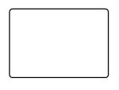

## BPMN activity task

The [`Task`](https://help.syncfusion.com/cr/wpf/Syncfusion.UI.Xaml.Diagram.Controls.ActivityType.html#fields#Task) property of the node allows you to define the type of task such as sending, receiving, user-based task, etc. By default, the [`TaskType`](https://help.syncfusion.com/cr/wpf/Syncfusion.UI.Xaml.Diagram.BpmnNodeViewModel.html#Syncfusion_UI_Xaml_Diagram_BpmnNodeViewModel_TaskType) property of task is set to **None**. The following code explains how to create different types of BPMN tasks.
The events property of tasks allows you to represent these results as an event attached to the task.



<!--Initialize the SfDiagram-->
<syncfusion:SfDiagram x:Name="diagram">
    <!--Initialize the Node-->
    <syncfusion:SfDiagram.Nodes>
        <!--Initialize the Node Collection-->
        <syncfusion:NodeCollection>
            <!--Initialize the BpmnNodeViewModel-->
            <syncfusion:BpmnNodeViewModel UnitHeight="70" UnitWidth="100" OffsetX="100" OffsetY="100" Type="Activity" ActivityType="Task" TaskType="Send"> 
            </syncfusion:BpmnNodeViewModel>
        </syncfusion:NodeCollection>
    </syncfusion:SfDiagram.Nodes>
</syncfusion:SfDiagram>




//Initialize the diagram
SfDiagram diagram = new SfDiagram();

//Initialize the BpmnNodeViewModel
BpmnNodeViewModel node = new BpmnNodeViewModel()
{
  OffsetX = 100,
  OffsetY = 100,
  UnitHeight = 70,
  UnitWidth = 100,
  Type = BpmnShapeType.Activity,
  ActivityType=ActivityType.Task,
  TaskType = TaskType.Send
};

// Add the node into Node's collection
(Diagram.Nodes as NodeCollection).Add(node);




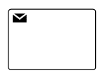

The various types of BPMN tasks are tabulated as follows.

| Shape | Image |
| -------- | -------- |
| Service | 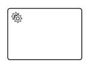 |
| Send |  |
| Receive | 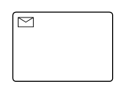 |
| Instantiating Receive | 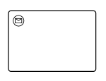 |
| Manual |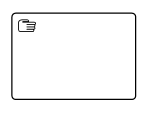 |
| Business Rule | 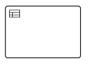 |
| User | 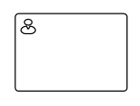 |
| Script | 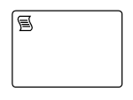 |

## BPMN activity sub process

A [`CollapsedSubProcess`](https://help.syncfusion.com/cr/wpf/Syncfusion.UI.Xaml.Diagram.Controls.ActivityType.html#fields#CollapsedSubProcess) is a group of tasks that is used to hide or reveal details of additional levels using the property of [ActivityType](https://help.syncfusion.com/cr/wpf/Syncfusion.UI.Xaml.Diagram.BpmnNodeViewModel.html#Syncfusion_UI_Xaml_Diagram_BpmnNodeViewModel_ActivityType) is set to **CollapsedSubProcess**.



<!--Initialize the SfDiagram-->
<syncfusion:SfDiagram x:Name="diagram">
    <!--Initialize the Node-->
    <syncfusion:SfDiagram.Nodes>
        <!--Initialize the Node Collection-->
        <syncfusion:NodeCollection>
            <!--Initialize the BpmnNodeViewModel-->
            <syncfusion:BpmnNodeViewModel UnitHeight="70" UnitWidth="100" OffsetX="100" OffsetY="100" Type="Activity" ActivityType="CollapsedSubProcess" > 
            </syncfusion:BpmnNodeViewModel>
        </syncfusion:NodeCollection>
    </syncfusion:SfDiagram.Nodes>
</syncfusion:SfDiagram>




//Initialize the diagram
SfDiagram diagram = new SfDiagram();

//Initialize the BpmnNodeViewModel
BpmnNodeViewModel node = new BpmnNodeViewModel()
{
  OffsetX = 100,
  OffsetY = 100,
  UnitHeight = 70,
  UnitWidth = 100,
  Type = BpmnShapeType.Activity,
  ActivityType=ActivityType.CollapsedSubProcess,
};

// Add the node into Node's collection
(Diagram.Nodes as NodeCollection).Add(node);




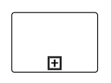

### Loop

[`LoopActivity`](https://help.syncfusion.com/cr/wpf/Syncfusion.UI.Xaml.Diagram.BpmnNodeViewModel.html#Syncfusion_UI_Xaml_Diagram_BpmnNodeViewModel_LoopActivity) is a task that is internally being looped. The loop property of task allows you to define the type of loop. The default value for `LoopActivity` is **None**.
You can define the loop property in subprocess BPMN shape as shown in the following code.



<!--Initialize the SfDiagram-->
<syncfusion:SfDiagram x:Name="diagram">
    <!--Initialize the Node-->
    <syncfusion:SfDiagram.Nodes>
        <!--Initialize the Node Collection-->
        <syncfusion:NodeCollection>
            <!--Initialize the BpmnNodeViewModel-->
            <syncfusion:BpmnNodeViewModel UnitHeight="70" UnitWidth="100" OffsetX="100" OffsetY="100" Type="Activity" ActivityType="Task" LoopActivity="Standard" > 
            </syncfusion:BpmnNodeViewModel>
        </syncfusion:NodeCollection>
    </syncfusion:SfDiagram.Nodes>
</syncfusion:SfDiagram>




//Initialize the diagram
SfDiagram diagram = new SfDiagram();

//Initialize the BpmnNodeViewModel
BpmnNodeViewModel node = new BpmnNodeViewModel()
{
  OffsetX = 100,
  OffsetY = 100,
  UnitHeight = 70,
  UnitWidth = 100,
  Type = BpmnShapeType.Activity,
  ActivityType = ActivityType.Task,
  LoopActivity = LoopCharacteristic.Standard
};

// Add the node into Node's collection
(Diagram.Nodes as NodeCollection).Add(node);




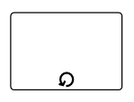

The following table contains various types of BPMN loops.

| Loops | Task | CollapsedSubProcess
| -------- | -------- | -------- |
| None | 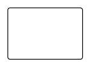  | 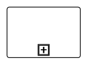 |
| Standard |   | 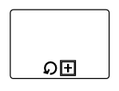 |
| SequenceMultiInstance | 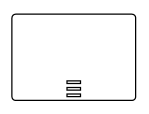 |  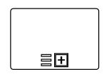 |
| ParallelMultiInstance | 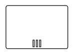 | 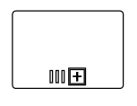 |

### Compensation

Compensation is triggered when the operation is partially failed and enabled it with the compensation property of the task and the collapsedsubprocess. To create a Compensation, you have to enable the [IsCompensationActivity](https://help.syncfusion.com/cr/wpf/Syncfusion.UI.Xaml.Diagram.BpmnNodeViewModel.html#Syncfusion_UI_Xaml_Diagram_BpmnNodeViewModel_IsCompensationActivity) property of the BPMNNodeViewModel.

>Note: By default, IsCompensationActivity property is false.



<!--Initialize the SfDiagram-->
<syncfusion:SfDiagram x:Name="diagram">
    <!--Initialize the Node-->
    <syncfusion:SfDiagram.Nodes>
        <!--Initialize the Node Collection-->
        <syncfusion:NodeCollection>
            <!--Initialize the BpmnNodeViewModel-->
            <syncfusion:BpmnNodeViewModel UnitHeight="70" UnitWidth="100" OffsetX="100" OffsetY="100" Type="Activity" ActivityType="Task" IsCompensationActivity="True" > 
            </syncfusion:BpmnNodeViewModel>
        </syncfusion:NodeCollection>
    </syncfusion:SfDiagram.Nodes>
</syncfusion:SfDiagram>




//Initialize the diagram
SfDiagram diagram = new SfDiagram();

//Initialize the BpmnNodeViewModel
BpmnNodeViewModel node = new BpmnNodeViewModel()
{
  OffsetX = 100,
  OffsetY = 100,
  UnitHeight = 70,
  UnitWidth = 100,
  Type = BpmnShapeType.Activity,
  ActivityType = ActivityType.Task,
  IsCompensationActivity = true
};

// Add the node into Node's collection
(Diagram.Nodes as NodeCollection).Add(node);




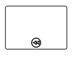

### Call

A Call activity is a global subprocess that is reused at various points of the business flow and set it with the call property of the task.To create a Call activity, you have to enable the [IsCallActivity](https://help.syncfusion.com/cr/wpf/Syncfusion.UI.Xaml.Diagram.BpmnNodeViewModel.html#Syncfusion_UI_Xaml_Diagram_BpmnNodeViewModel_IsCallActivity) property of the BPMNNodeViewModel.

>Note: By default, IsCallActivity property is false.



<!--Initialize the SfDiagram-->
<syncfusion:SfDiagram x:Name="diagram">
    <!--Initialize the Node-->
    <syncfusion:SfDiagram.Nodes>
        <!--Initialize the Node Collection-->
        <syncfusion:NodeCollection>
            <!--Initialize the BpmnNodeViewModel-->
            <syncfusion:BpmnNodeViewModel UnitHeight="70" UnitWidth="100" OffsetX="100" OffsetY="100" Type="Activity" ActivityType="Task" IsCallActivity="True" > 
            </syncfusion:BpmnNodeViewModel>
        </syncfusion:NodeCollection>
    </syncfusion:SfDiagram.Nodes>
</syncfusion:SfDiagram>




//Initialize the diagram
SfDiagram diagram = new SfDiagram();

//Initialize the BpmnNodeViewModel
BpmnNodeViewModel node = new BpmnNodeViewModel()
{
  OffsetX = 100,
  OffsetY = 100,
  UnitHeight = 70,
  UnitWidth = 100,
  Type = BpmnShapeType.Activity,
  ActivityType = ActivityType.Task,
  IsCallActivity = true
};

// Add the node into Node's collection
(Diagram.Nodes as NodeCollection).Add(node);




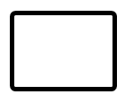

### Ad-Hoc

An ad-hoc subprocess is a group of tasks that are executed in any order or skipped in order to fulfill the end condition and set it with the [`IsAdhocActivity`](https://help.syncfusion.com/cr/wpf/Syncfusion.UI.Xaml.Diagram.BpmnNodeViewModel.html#Syncfusion_UI_Xaml_Diagram_BpmnNodeViewModel_IsAdhocActivity) property of subprocess.

>Note: By default, IsAdhocActivity property is false.



<!--Initialize the SfDiagram-->
<syncfusion:SfDiagram x:Name="diagram">
    <!--Initialize the Node-->
    <syncfusion:SfDiagram.Nodes>
        <!--Initialize the Node Collection-->
        <syncfusion:NodeCollection>
            <!--Initialize the BpmnNodeViewModel-->
            <syncfusion:BpmnNodeViewModel UnitHeight="100" UnitWidth="100" OffsetX="100" OffsetY="100" Type="Activity" ActivityType="CollapsedSubProcess" IsAdhocActivity="True" > 
            </syncfusion:BpmnNodeViewModel>
        </syncfusion:NodeCollection>
    </syncfusion:SfDiagram.Nodes>
</syncfusion:SfDiagram>




//Initialize the diagram
SfDiagram diagram = new SfDiagram();

//Initialize the BpmnNodeViewModel
BpmnNodeViewModel node = new BpmnNodeViewModel()
{
  OffsetX = 100,
  OffsetY = 100,
  UnitHeight = 100,
  UnitWidth = 100,
  Type = BpmnShapeType.Activity,
  ActivityType = ActivityType.CollapsedSubProcess,
  IsAdhocActivity = true
};

// Add the node into Node's collection
(Diagram.Nodes as NodeCollection).Add(node);




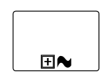

### SubProcessType

SubProcessType represents the type of task that is being processed. The [`SubProcessType`](https://help.syncfusion.com/cr/wpf/Syncfusion.UI.Xaml.Diagram.BpmnNodeViewModel.html#Syncfusion_UI_Xaml_Diagram_BpmnNodeViewModel_SubProcessType) property of subprocess allows you to define the type of boundary. By default, it is set to **Default**.



<!--Initialize the SfDiagram-->
<syncfusion:SfDiagram x:Name="diagram">
    <!--Initialize the Node-->
    <syncfusion:SfDiagram.Nodes>
        <!--Initialize the Node Collection-->
        <syncfusion:NodeCollection>
            <!--Initialize the BpmnNodeViewModel-->
            <syncfusion:BpmnNodeViewModel UnitHeight="100" UnitWidth="100" OffsetX="100" OffsetY="100" Type="Activity" ActivityType="CollapsedSubProcess" SubProcessType="Event" > 
            </syncfusion:BpmnNodeViewModel>
        </syncfusion:NodeCollection>
    </syncfusion:SfDiagram.Nodes>
</syncfusion:SfDiagram>




//Initialize the diagram
SfDiagram diagram = new SfDiagram();

//Initialize the BpmnNodeViewModel
BpmnNodeViewModel node = new BpmnNodeViewModel()
{
  OffsetX = 100,
  OffsetY = 100,
  UnitHeight = 100,
  UnitWidth = 100,
  Type = BpmnShapeType.Activity,
  ActivityType = ActivityType.CollapsedSubProcess,
  SubProcessType = SubProcessType.Event
};

// Add the node into Node's collection
(Diagram.Nodes as NodeCollection).Add(node);




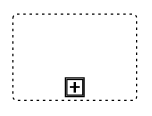

The following table contains various types of BPMN boundaries.

| SubProcessType | Image |
| -------- | -------- |
| Call | 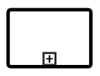 |
| Event |  |
| Default |  |
| Transaction | 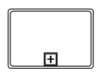 |