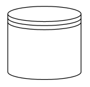

# Data Store in WPF Diagram (SfDiagram)

DataStore is used to store or access the data associated with a business process. To create a [DataStore](https://help.syncfusion.com/cr/wpf/Syncfusion.UI.Xaml.Diagram.Controls.BpmnShapeType.html#fields#DataStore), set the Type property of the `BpmnNodeViewModel` should be set to **DataStore**. The following code example explains how to create a DataStore.



<!--Initialize the SfDiagram-->
<syncfusion:SfDiagram x:Name="diagram">
    <!--Initialize the Node-->
    <syncfusion:SfDiagram.Nodes>
        <!--Initialize the Node Collection-->
        <syncfusion:NodeCollection>
            <!--Initialize the BpmnNodeViewModel-->
            <syncfusion:BpmnNodeViewModel UnitHeight="100" UnitWidth="100" OffsetX="100" OffsetY="100" Type="DataStore" > 
            </syncfusion:BpmnNodeViewModel>
        </syncfusion:NodeCollection>
    </syncfusion:SfDiagram.Nodes>
</syncfusion:SfDiagram>




//Initialize the diagram.
SfDiagram diagram = new SfDiagram();

//Initialize the BpmnNodeViewModel.
BpmnNodeViewModel node = new BpmnNodeViewModel()
{
  OffsetX = 100,
  OffsetY = 100,
  UnitHeight = 70,
  UnitWidth = 100,
  Type = BpmnShapeType.DataStore,
};

// Add the node into the Node's collection.
(Diagram.Nodes as NodeCollection).Add(node);




