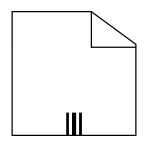
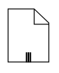
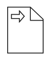
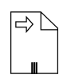
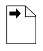
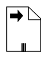

# BPMN DataObject and its customization

A data object represents information flowing through the process, such as data placed into the process, data resulting from the process, data that needs to be collected, or data that must be stored. To define a [`DataObject`](https://help.syncfusion.com/cr/wpf/Syncfusion.UI.Xaml.Diagram.Controls.BpmnShapeType.html#fields#DataObject), set the Type property of the bpmn node should be set to **DataObject** and the [DataObjectType](https://help.syncfusion.com/cr/wpf/Syncfusion.UI.Xaml.Diagram.BpmnNodeViewModel.html#Syncfusion_UI_Xaml_Diagram_BpmnNodeViewModel_DataObjectType) property defines whether data is an input or output. You can create multiple instances of data object with the IsCollectiveData property of data.



<!--Initialize the SfDiagram-->
<syncfusion:SfDiagram x:Name="diagram">
    <!--Initialize the Node-->
    <syncfusion:SfDiagram.Nodes>
        <!--Initialize the Node Collection-->
        <syncfusion:NodeCollection>
            <!--Initialize the BpmnNodeViewModel-->
            <syncfusion:BpmnNodeViewModel UnitHeight="70" UnitWidth="100" OffsetX="100" OffsetY="100" Type="DataObject" DataObjectType="None"  IsCollectiveData="True"> 
            </syncfusion:BpmnNodeViewModel>
        </syncfusion:NodeCollection>
    </syncfusion:SfDiagram.Nodes>
</syncfusion:SfDiagram>




//Initialize the diagram
SfDiagram diagram = new SfDiagram();

//Initialize the BpmnNodeViewModel
BpmnNodeViewModel node = new BpmnNodeViewModel()
{
  OffsetX = 100,
  OffsetY = 100,
  UnitHeight = 70,
  UnitWidth = 100,
  Type = BpmnShapeType.DataObject,
  DataObjectType = DataObjectType.None,
  IsCollectiveData = true,
};

// Add the node into Node's collection
(Diagram.Nodes as NodeCollection).Add(node);




The following table contains various representation of the BPMN data object.

| DataObjectType | Image | IsCollectiveData|
| -------- | -------- |-------- |
| None |  | |
| Data Input |  | |
| Data Output |  | |
