# BPMN event

An [`Event`](https://help.syncfusion.com/cr/wpf/Syncfusion.UI.Xaml.Diagram.Controls.BpmnShapeType.html#fields#Event) is a common BPMN process model element that represents something happens during a business process and its is notated with a circle.
The [EventType](https://help.syncfusion.com/cr/wpf/Syncfusion.UI.Xaml.Diagram.BpmnNodeViewModel.html#Syncfusion_UI_Xaml_Diagram_BpmnNodeViewModel_EventType) property of the node allows you to set the type of event and by default, it is set to None.
 The type of events are as follows:

    * Start - indicates the beginning of the process and every business process start with an event.
    * Intermediate - indicates the middle of the process.
    * End - indicates the beginning of the process and every business process end with an event.

The event property of the node allows you to define the type of the event. The default value of the event is [Start](https://help.syncfusion.com/cr/wpf/Syncfusion.UI.Xaml.Diagram.Controls.EventType.html#fields#Start). The following code example explains how to create a BPMN event.



<!--Initialize the SfDiagram-->
<syncfusion:SfDiagram x:Name="diagram">
    <!--Initialize the Node-->
    <syncfusion:SfDiagram.Nodes>
        <!--Initialize the Node Collection-->
        <syncfusion:NodeCollection>
            <!--Initialize the BpmnNodeViewModel-->
            <syncfusion:BpmnNodeViewModel UnitHeight="70" UnitWidth="100" OffsetX="100" OffsetY="100" Type="Event" EventType="Start">
            </syncfusion:BpmnNodeViewModel>
        </syncfusion:NodeCollection>
    </syncfusion:SfDiagram.Nodes>
</syncfusion:SfDiagram>




//Initialize the diagram
SfDiagram diagram = new SfDiagram();

//Initialize the BpmnNodeViewModel
BpmnNodeViewModel node = new BpmnNodeViewModel()
{
  OffsetX = 100,
  OffsetY = 100,
  UnitHeight = 70,
  UnitWidth = 100,
  Type = BpmnShapeType.Event,
  EventType = EventType.Start,
};

// Add the node into Node's collection
(Diagram.Nodes as NodeCollection).Add(node);




## BPMN event trigger

Event triggers are notated as icons inside the circle and they represent the specific details of the process. The [EventTrigger](https://help.syncfusion.com/cr/wpf/Syncfusion.UI.Xaml.Diagram.BpmnNodeViewModel.html#Syncfusion_UI_Xaml_Diagram_BpmnNodeViewModel_EventTrigger) property of the node allows you to set the type of trigger and by default, it is set to None. The following code example explains how to create a BPMN trigger.



<!--Initialize the SfDiagram-->
<syncfusion:SfDiagram x:Name="diagram">
    <!--Initialize the Node-->
    <syncfusion:SfDiagram.Nodes>
        <!--Initialize the Node Collection-->
        <syncfusion:NodeCollection>
            <!--Initialize the BpmnNodeViewModel-->
            <syncfusion:BpmnNodeViewModel UnitHeight="50" UnitWidth="50" OffsetX="100" OffsetY="100" Type="Event" EventType="Start" EventTrigger="Message">
            </syncfusion:BpmnNodeViewModel>
        </syncfusion:NodeCollection>
    </syncfusion:SfDiagram.Nodes>
</syncfusion:SfDiagram>




//Initialize the diagram
SfDiagram diagram = new SfDiagram();

//Initialize the BpmnNodeViewModel
BpmnNodeViewModel node = new BpmnNodeViewModel()
{
  OffsetX = 100,
  OffsetY = 100,
  UnitHeight = 50,
  UnitWidth = 50,
  Type = BpmnShapeType.Event,
  EventType = EventType.Start,
  EventTrigger = EventTrigger.Message
};

// Add the node into Node's collection
(Diagram.Nodes as NodeCollection).Add(node);




The following table illustrates the type of event triggers.

| Event / Trigger | Start | Non-Interrupting Start | Intermediate | Non-Interrupting Intermediate | Throwing Intermediate | End |
| -------- | -------- | -------- | -------- | -------- | -------- | -------- |
| None |   | 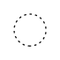 | 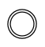 | 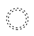 |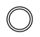 | 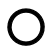 |
| Message |  |  |  |  | |  |
| Timer |  | 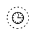 | 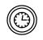|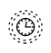 | | |
| Conditional |  |  |  | | | |
| Link |  | 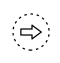 | |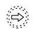 |  | |
| Signal | 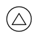 | 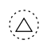 | 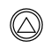 | 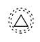 | 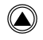 |  |
| Error |  |  |  |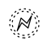 | | |
| Escalation |  | 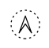 |  | |  |  |
| Termination | 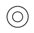 | 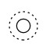 | 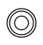 | 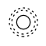 | 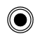 | |
| Compensation |  |  |  | |  | |
| Cancel |  |  |  | |   |  |
| Multiple | 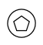 | 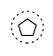  | 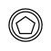 | 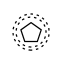 |   |  |
| Parallel |  |  |  |  |   |   |
